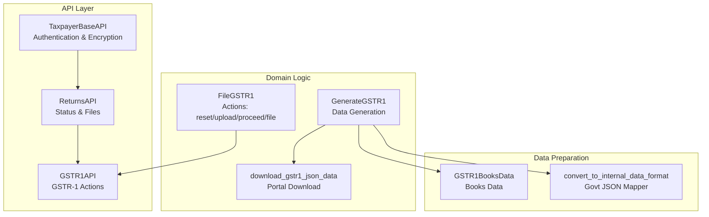
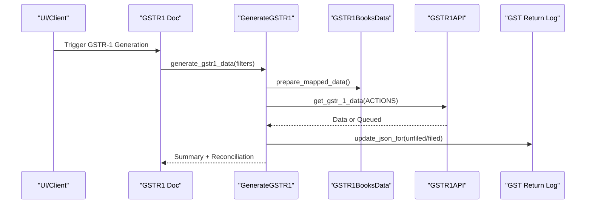
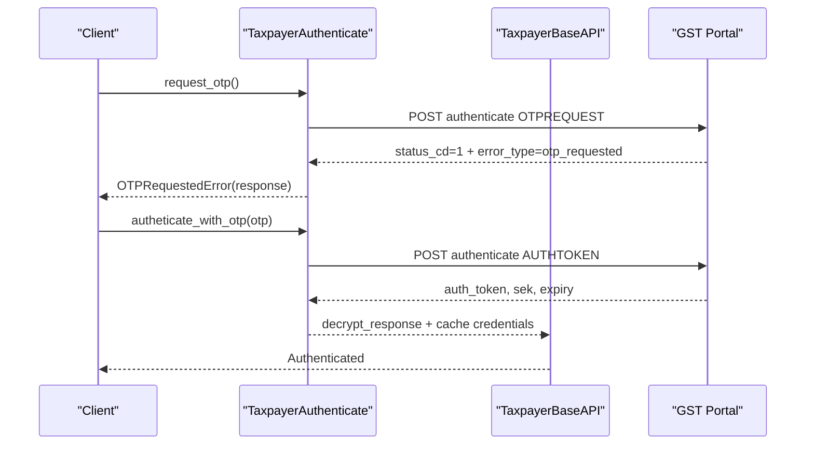
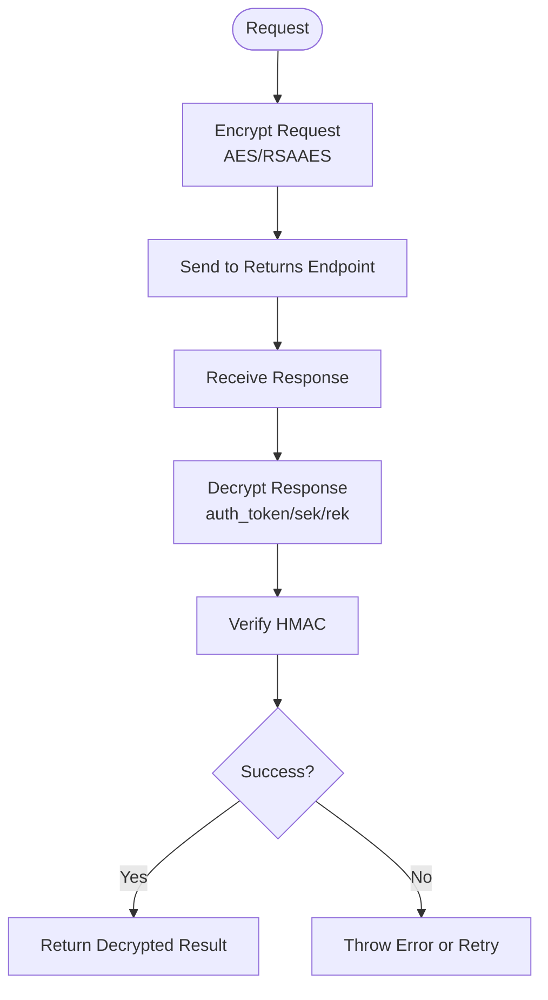
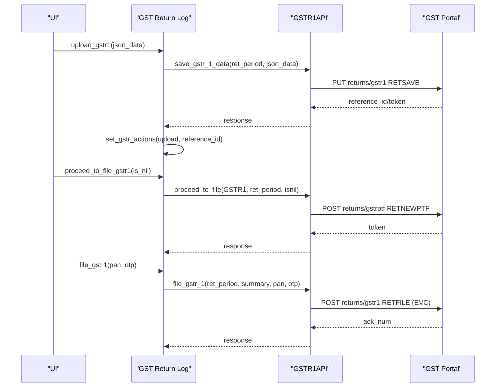
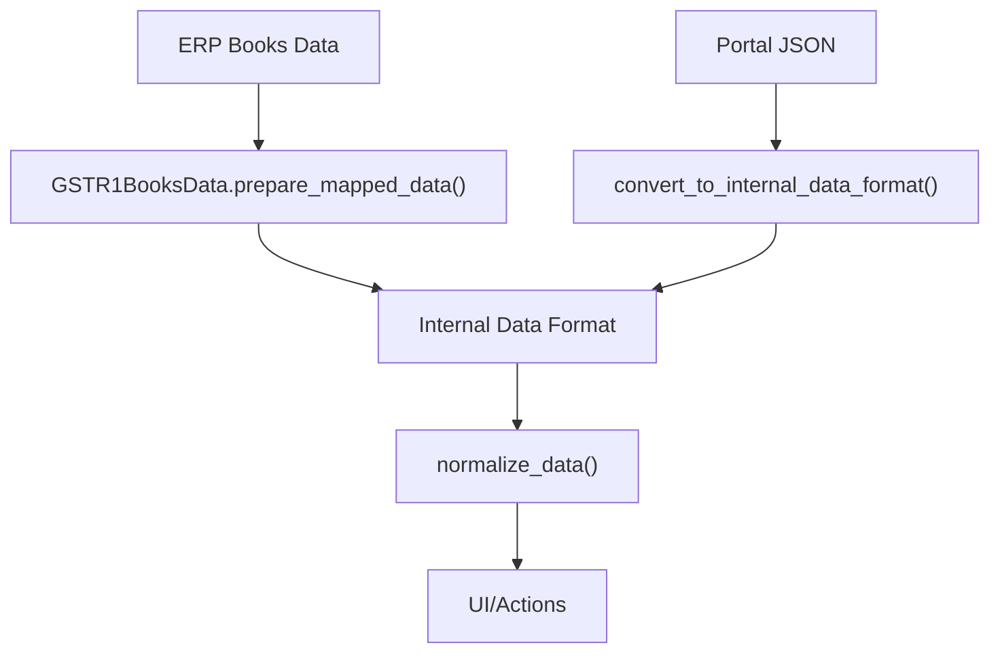
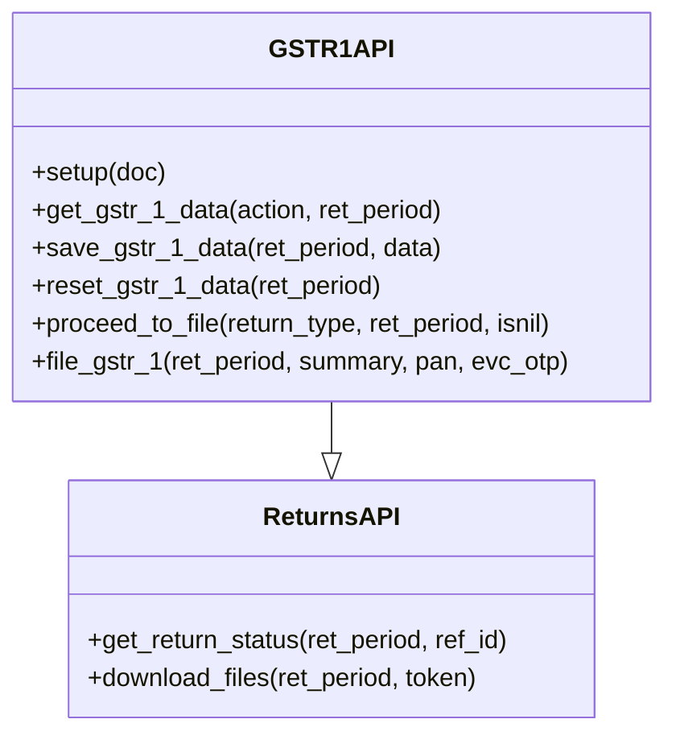
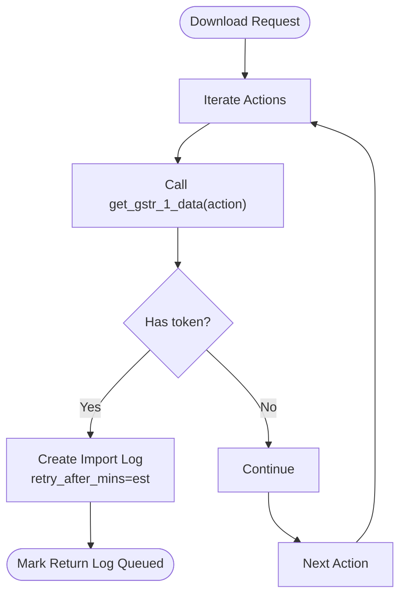
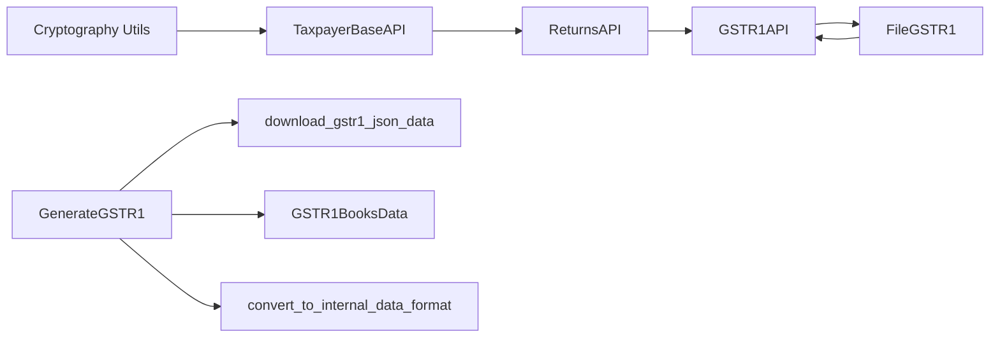

# Government Portal Integration

<cite>
**Referenced Files in This Document**
- [taxpayer_base.py](file://india_compliance/gst_india/api_classes/taxpayer_base.py)
- [taxpayer_returns.py](file://india_compliance/gst_india/api_classes/taxpayer_returns.py)
- [gstr_1.py](file://india_compliance/gst_india/doctype/gstr_1/gstr_1.py)
- [generate_gstr_1.py](file://india_compliance/gst_india/doctype/gst_return_log/generate_gstr_1.py)
- [gstr_1_download.py](file://india_compliance/gst_india/utils/gstr_1/gstr_1_download.py)
- [gstr_1_json_map.py](file://india_compliance/gst_india/utils/gstr_1/gstr_1_json_map.py)
- [gstr_1_data.py](file://india_compliance/gst_india/utils/gstr_1/gstr_1_data.py)
</cite>

## Table of Contents
1. [Introduction](#introduction)
2. [Project Structure](#project-structure)
3. [Core Components](#core-components)
4. [Architecture Overview](#architecture-overview)
5. [Detailed Component Analysis](#detailed-component-analysis)
6. [Dependency Analysis](#dependency-analysis)
7. [Performance Considerations](#performance-considerations)
8. [Troubleshooting Guide](#troubleshooting-guide)
9. [Conclusion](#conclusion)
10. [Appendices](#appendices)

## Introduction
This document explains the GSTR-1 government portal integration within the India Compliance application. It covers the OTP authentication workflow, TaxpayerBaseAPI integration, SEK validation, the upload_gstr1 action, JSON data preparation, portal submission mechanisms, error handling for authentication failures, network issues, and portal connectivity problems. It also includes practical examples of successful submissions, retry mechanisms, and status verification workflows, along with integration details for GST portal APIs and response processing for GSTR-1 filings.

## Project Structure
The GSTR-1 integration spans several modules:
- API layer for authentication and returns: TaxpayerBaseAPI and GSTR1API
- Domain logic for GSTR-1 generation, reconciliation, and actions: GenerateGSTR1, FileGSTR1, and related utilities
- Data mapping and preparation: GSTR1BooksData and mapper utilities
- Download and mapping of portal data: download_gstr1_json_data and convert_to_internal_data_format

**Diagram sources**
- [taxpayer_base.py](file://india_compliance/gst_india/api_classes/taxpayer_base.py#L321-L527)
- [taxpayer_returns.py](file://india_compliance/gst_india/api_classes/taxpayer_returns.py#L115-L183)
- [generate_gstr_1.py](file://india_compliance/gst_india/doctype/gst_return_log/generate_gstr_1.py#L567-L1055)
- [gstr_1_download.py](file://india_compliance/gst_india/utils/gstr_1/gstr_1_download.py#L30-L93)
- [gstr_1_json_map.py](file://india_compliance/gst_india/utils/gstr_1/gstr_1_json_map.py#L116-L135)

**Section sources**
- [taxpayer_base.py](file://india_compliance/gst_india/api_classes/taxpayer_base.py#L321-L527)
- [taxpayer_returns.py](file://india_compliance/gst_india/api_classes/taxpayer_returns.py#L115-L183)
- [generate_gstr_1.py](file://india_compliance/gst_india/doctype/gst_return_log/generate_gstr_1.py#L567-L1055)
- [gstr_1_download.py](file://india_compliance/gst_india/utils/gstr_1/gstr_1_download.py#L30-L93)
- [gstr_1_json_map.py](file://india_compliance/gst_india/utils/gstr_1/gstr_1_json_map.py#L116-L135)

## Core Components
- TaxpayerBaseAPI: Provides authentication, encryption/decryption, HMAC validation, and request/response handling for returns APIs.
- GSTR1API: Specialized ReturnsAPI for GSTR-1 operations including retrieval, saving, resetting, and filing with EVC.
- GenerateGSTR1: Orchestrates data generation from books and portal, reconciliation, summarization, and action triggers.
- FileGSTR1: Implements lifecycle actions (reset, upload, proceed_to_file, file) and status polling.
- download_gstr1_json_data: Downloads GSTR-1 sections from the portal, handles queuing, and maps to internal format.
- GSTR1BooksData and mappers: Build internal data structures from ERP books and map portal JSON to internal format.

**Section sources**
- [taxpayer_base.py](file://india_compliance/gst_india/api_classes/taxpayer_base.py#L321-L527)
- [taxpayer_returns.py](file://india_compliance/gst_india/api_classes/taxpayer_returns.py#L115-L183)
- [generate_gstr_1.py](file://india_compliance/gst_india/doctype/gst_return_log/generate_gstr_1.py#L567-L1055)
- [gstr_1_download.py](file://india_compliance/gst_india/utils/gstr_1/gstr_1_download.py#L30-L93)
- [gstr_1_json_map.py](file://india_compliance/gst_india/utils/gstr_1/gstr_1_json_map.py#L116-L135)

## Architecture Overview
The integration follows a layered architecture:
- Authentication and transport: TaxpayerBaseAPI manages app_key, auth_token, session_key (SEK), encryption, HMAC, and OTP handling.
- API orchestration: GSTR1API encapsulates portal endpoints for GSTR-1.
- Data orchestration: GenerateGSTR1 coordinates books and portal data, reconciliation, and summaries.
- Action lifecycle: FileGSTR1 executes reset/save/proceed/file with status polling and error handling.
- Download pipeline: download_gstr1_json_data fetches portal sections, queues long-running requests, and maps data.

**Diagram sources**
- [gstr_1.py](file://india_compliance/gst_india/doctype/gstr_1/gstr_1.py#L69-L192)
- [generate_gstr_1.py](file://india_compliance/gst_india/doctype/gst_return_log/generate_gstr_1.py#L595-L662)
- [gstr_1_download.py](file://india_compliance/gst_india/utils/gstr_1/gstr_1_download.py#L30-L93)

## Detailed Component Analysis

### OTP Authentication Workflow
- OTP Request: Initiates OTP via TaxpayerAuthenticate.request_otp and raises OTPRequestedError to surface OTP prompt.
- OTP Submission: Autheticate_with_otp sends OTP and retrieves auth_token, session_key (SEK), and expiry.
- Token Refresh: refresh_auth_token extends session validity.
- Public IP Handling: get_public_ip ensures ip-usr header is set for session binding.
- Error Mapping: IGNORED_ERROR_CODES maps portal error codes to handled types (otp_requested, invalid_otp, authorization_failed).

**Diagram sources**
- [taxpayer_base.py](file://india_compliance/gst_india/api_classes/taxpayer_base.py#L127-L187)

**Section sources**
- [taxpayer_base.py](file://india_compliance/gst_india/api_classes/taxpayer_base.py#L110-L187)

### TaxpayerBaseAPI Integration and SEK Validation
- Headers: gstin, state-cd, username, txn, ip-usr, auth-token.
- Request Encryption: encrypt_request applies AES with session_key and RSA with public certificate for app_key and otp.
- Response Decryption: decrypt_response extracts auth_token, session_key (SEK), and expiry; decrypt_response handles rek for data decryption.
- HMAC Validation: process_response verifies HMAC against decrypted data.
- Error Handling: handle_error_response throws on non-ignored errors; is_ignored_error maps error codes; invalid_public_key triggers certificate refresh.

**Diagram sources**
- [taxpayer_base.py](file://india_compliance/gst_india/api_classes/taxpayer_base.py#L397-L424)

**Section sources**
- [taxpayer_base.py](file://india_compliance/gst_india/api_classes/taxpayer_base.py#L321-L424)

### GSTR-1 Actions Lifecycle: reset, upload, proceed_to_file, file
- reset_gstr1: Calls GSTR1API.reset_gstr_1_data and sets action token; resets filing_status and is_nil.
- upload_gstr1: Prepares JSON via get_gstr_1_json, validates presence of keys, clears upload_error, calls GSTR1API.save_gstr_1_data, and logs action.
- proceed_to_file_gstr1: Calls GSTR1API.proceed_to_file; if eligible or nil return, marks action processed and compares summaries; otherwise polls status.
- file_gstr1: Calls GSTR1API.file_gstr_1 with PAN and EVC OTP; updates filing_date, acknowledgment_number, and last_pan_used_for_gstr.

**Diagram sources**
- [generate_gstr_1.py](file://india_compliance/gst_india/doctype/gst_return_log/generate_gstr_1.py#L874-L1055)
- [taxpayer_returns.py](file://india_compliance/gst_india/api_classes/taxpayer_returns.py#L150-L182)

**Section sources**
- [generate_gstr_1.py](file://india_compliance/gst_india/doctype/gst_return_log/generate_gstr_1.py#L832-L1055)
- [taxpayer_returns.py](file://india_compliance/gst_india/api_classes/taxpayer_returns.py#L150-L182)

### JSON Data Preparation and Mapping
- GSTR1BooksData: Builds internal data from ERP books, categorizing invoices into GSTR-1 subcategories and computing totals.
- convert_to_internal_data_format: Maps portal JSON to internal structure; includes mappers for B2B, B2CL, Exports, B2CS, Nil-rated, CDN*, and others.
- normalize_data: Flattens internal structure for UI consumption.

**Diagram sources**
- [gstr_1_data.py](file://india_compliance/gst_india/utils/gstr_1/gstr_1_data.py#L437-L628)
- [gstr_1_json_map.py](file://india_compliance/gst_india/utils/gstr_1/gstr_1_json_map.py#L116-L135)
- [generate_gstr_1.py](file://india_compliance/gst_india/doctype/gst_return_log/generate_gstr_1.py#L784-L808)

**Section sources**
- [gstr_1_data.py](file://india_compliance/gst_india/utils/gstr_1/gstr_1_data.py#L437-L628)
- [gstr_1_json_map.py](file://india_compliance/gst_india/utils/gstr_1/gstr_1_json_map.py#L116-L135)
- [generate_gstr_1.py](file://india_compliance/gst_india/doctype/gst_return_log/generate_gstr_1.py#L784-L808)

### Portal Submission Mechanisms
- GSTR1API.save_gstr_1_data: PUT returns/gstr1 with action RETSAVE and JSON payload.
- GSTR1API.reset_gstr_1_data: POST returns/gstr1 with action RESET to clear data.
- GSTR1API.proceed_to_file: POST returns/gstrptf with action RETNEWPTF to move to filing stage.
- GSTR1API.file_gstr_1: POST returns/gstr1 with action RETFILE and st=EVC for EVC filing.

**Diagram sources**
- [taxpayer_returns.py](file://india_compliance/gst_india/api_classes/taxpayer_returns.py#L115-L182)

**Section sources**
- [taxpayer_returns.py](file://india_compliance/gst_india/api_classes/taxpayer_returns.py#L115-L182)

### Status Verification and Retry Workflows
- download_gstr1_json_data: Iterates through actions; if response.token present, creates import log with est (retry minutes) and marks return log as Queued.
- FileGSTR1.process_upload_gstr1/process_proceed_to_file_gstr1: Polls status via get_return_status; transitions to P (Processed) or PE (Processing Error) and updates logs accordingly.
- verify_request_in_progress: Prevents concurrent actions unless forced.

**Diagram sources**
- [gstr_1_download.py](file://india_compliance/gst_india/utils/gstr_1/gstr_1_download.py#L30-L93)
- [generate_gstr_1.py](file://india_compliance/gst_india/doctype/gst_return_log/generate_gstr_1.py#L897-L938)

**Section sources**
- [gstr_1_download.py](file://india_compliance/gst_india/utils/gstr_1/gstr_1_download.py#L30-L93)
- [generate_gstr_1.py](file://india_compliance/gst_india/doctype/gst_return_log/generate_gstr_1.py#L897-L938)

## Dependency Analysis
- TaxpayerBaseAPI depends on cryptography utilities for AES/RSA/HMAC and certificate management.
- GSTR1API inherits from ReturnsAPI and adds GSTR-1 specific endpoints and actions.
- GenerateGSTR1 orchestrates GSTR1BooksData and download_gstr1_json_data, and integrates FileGSTR1 actions.
- FileGSTR1 depends on GSTR1API and GST Return Log actions to manage lifecycle and status.

**Diagram sources**
- [taxpayer_base.py](file://india_compliance/gst_india/api_classes/taxpayer_base.py#L1-L50)
- [taxpayer_returns.py](file://india_compliance/gst_india/api_classes/taxpayer_returns.py#L115-L182)
- [generate_gstr_1.py](file://india_compliance/gst_india/doctype/gst_return_log/generate_gstr_1.py#L567-L1055)
- [gstr_1_download.py](file://india_compliance/gst_india/utils/gstr_1/gstr_1_download.py#L30-L93)
- [gstr_1_json_map.py](file://india_compliance/gst_india/utils/gstr_1/gstr_1_json_map.py#L116-L135)

**Section sources**
- [taxpayer_base.py](file://india_compliance/gst_india/api_classes/taxpayer_base.py#L1-L50)
- [taxpayer_returns.py](file://india_compliance/gst_india/api_classes/taxpayer_returns.py#L115-L182)
- [generate_gstr_1.py](file://india_compliance/gst_india/doctype/gst_return_log/generate_gstr_1.py#L567-L1055)
- [gstr_1_download.py](file://india_compliance/gst_india/utils/gstr_1/gstr_1_download.py#L30-L93)
- [gstr_1_json_map.py](file://india_compliance/gst_india/utils/gstr_1/gstr_1_json_map.py#L116-L135)

## Performance Considerations
- Asynchronous Processing: GSTR-1 generation enqueues long-running tasks and publishes progress via realtime events.
- Caching: validate_auth_token caches authentication state for short durations to avoid repeated refreshes.
- Data Aggregation: GSTR1BooksData aggregates invoices to reduce row counts and improve reconciliation performance.
- Queuing: Portal downloads may be queued; retry intervals are derived from est (estimated time) to avoid overloading the portal.

[No sources needed since this section provides general guidance]

## Troubleshooting Guide
Common issues and resolutions:
- Authentication Failures
  - Symptom: authorization_failed or invalid_otp.
  - Resolution: Trigger OTP request, resubmit with valid OTP, and refresh auth token if needed.
- Network Issues
  - Symptom: Queued responses with token and est.
  - Resolution: Wait for retry interval, then poll status; ensure connectivity and retry after est minutes.
- Portal Connectivity Problems
  - Symptom: RET13506 (OTP expired or incorrect), RET09001 (Latest Summary not available).
  - Resolution: Regenerate OTP, re-run proceed_to_file after regenerating summary, and retry filing.
- Data Mismatch
  - Symptom: differing_categories detected during proceed_to_file.
  - Resolution: Adjust books data to match portal summary; re-run reconciliation and proceed_to_file.

**Section sources**
- [taxpayer_base.py](file://india_compliance/gst_india/api_classes/taxpayer_base.py#L113-L125)
- [generate_gstr_1.py](file://india_compliance/gst_india/doctype/gst_return_log/generate_gstr_1.py#L912-L938)
- [gstr_1_download.py](file://india_compliance/gst_india/utils/gstr_1/gstr_1_download.py#L55-L72)

## Conclusion
The GSTR-1 integration leverages a robust authentication and encryption layer, a clear action lifecycle, and comprehensive data preparation/mapping. It supports queuing, retries, and status verification to handle portal variability. By following the documented workflows and error-handling strategies, organizations can reliably prepare, submit, and track GSTR-1 filings.

[No sources needed since this section summarizes without analyzing specific files]

## Appendices

### Practical Examples
- Successful Submission Flow
  - Generate GSTR-1 data from books and portal.
  - Upload JSON via upload_gstr1.
  - Proceed to file; if eligible, mark Ready to File.
  - File with EVC using PAN and OTP; capture acknowledgment number.
- Retry Mechanism
  - On queued download, wait for est minutes and poll status until P (Processed).
  - On PE (Processing Error), review upload_error and correct discrepancies before re-uploading.
- Status Verification
  - Use check_action_status to poll and display current status for reset/upload/proceed/file actions.

**Section sources**
- [gstr_1.py](file://india_compliance/gst_india/doctype/gstr_1/gstr_1.py#L194-L252)
- [generate_gstr_1.py](file://india_compliance/gst_india/doctype/gst_return_log/generate_gstr_1.py#L897-L1023)
- [gstr_1_download.py](file://india_compliance/gst_india/utils/gstr_1/gstr_1_download.py#L55-L93)