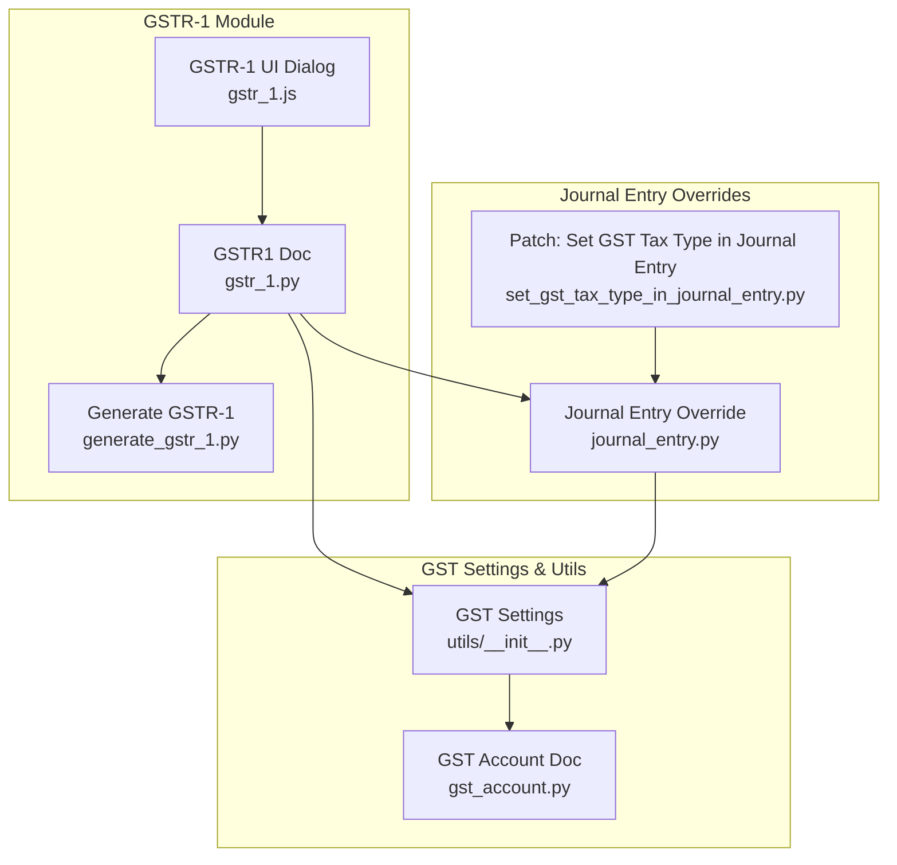
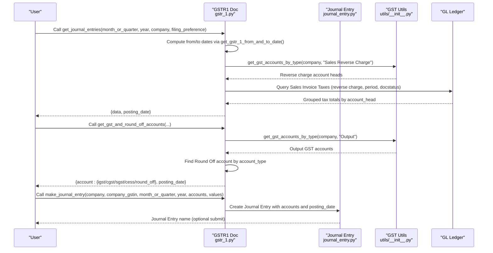
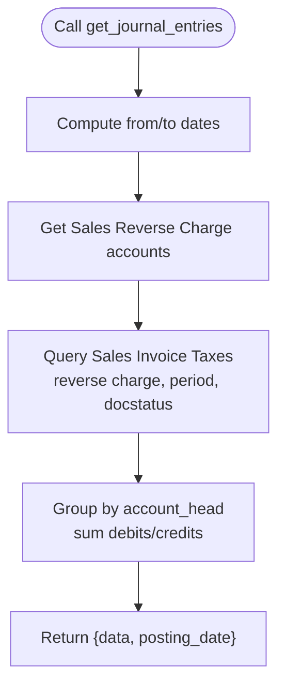
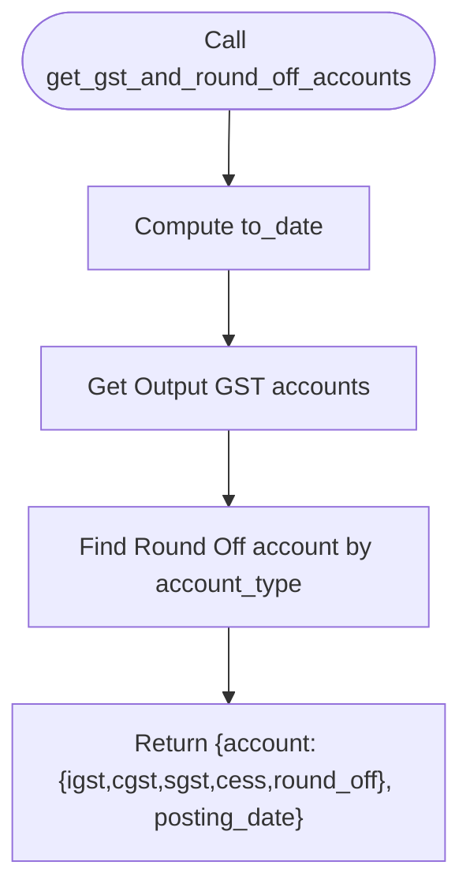
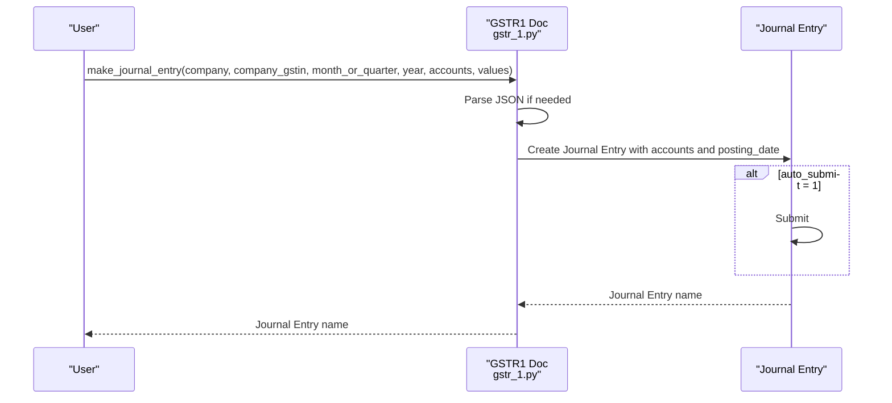
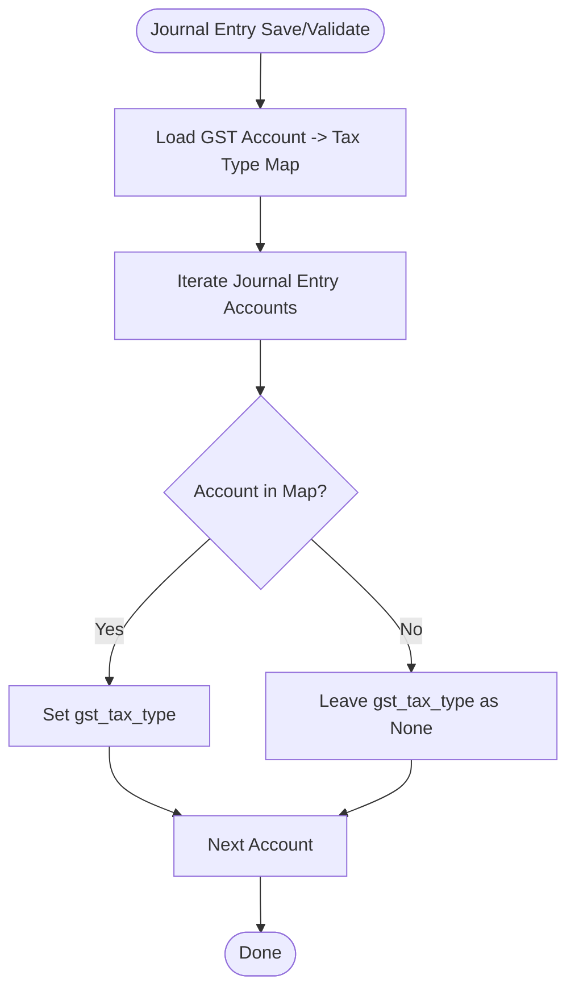
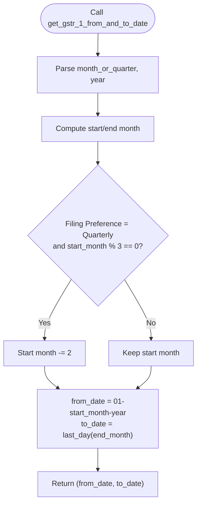
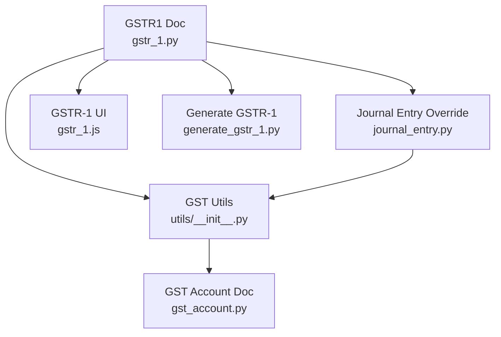

# Journal Entry Integration

<cite>
**Referenced Files in This Document**
- [gstr_1.py](file://india_compliance/gst_india/doctype/gstr_1/gstr_1.py)
- [journal_entry.py](file://india_compliance/gst_india/overrides/journal_entry.py)
- [gst_account.py](file://india_compliance/gst_india/doctype/gst_account/gst_account.py)
- [utils/__init__.py](file://india_compliance/gst_india/utils/__init__.py)
- [generate_gstr_1.py](file://india_compliance/gst_india/doctype/gst_return_log/generate_gstr_1.py)
- [gstr_1.js](file://india_compliance/gst_india/doctype/gstr_1/gstr_1.js)
- [gstr_1_data.py](file://india_compliance/gst_india/utils/gstr_1/gstr_1_data.py)
- [set_gst_tax_type_in_journal_entry.py](file://india_compliance/patches/post_install/set_gst_tax_type_in_journal_entry.py)
</cite>

## Table of Contents
1. [Introduction](#introduction)
2. [Project Structure](#project-structure)
3. [Core Components](#core-components)
4. [Architecture Overview](#architecture-overview)
5. [Detailed Component Analysis](#detailed-component-analysis)
6. [Dependency Analysis](#dependency-analysis)
7. [Performance Considerations](#performance-considerations)
8. [Troubleshooting Guide](#troubleshooting-guide)
9. [Conclusion](#conclusion)

## Introduction
This document explains the GSTR-1 journal entry integration capabilities in the India Compliance module. It focuses on three key functions:
- get_journal_entries for reverse charge transactions
- get_gst_and_round_off_accounts for mapping output GST and round-off accounts
- make_journal_entry for automated journal creation

It also covers how these functions integrate with GST output accounts, round-off accounts, Sales Invoice reverse charge transactions, and the automatic reduction of output GST liability for GSTR-1 compliance. Practical examples illustrate journal entry generation, account head mapping, and posting date calculations.

## Project Structure
The journal entry integration spans several modules:
- GSTR-1 orchestration and utilities
- Journal Entry overrides for GST tax type mapping
- GST account settings and utilities
- Return log generation and reconciliation
- Frontend dialog for suggested journal entries

**Diagram sources**
- [gstr_1.py](file://india_compliance/gst_india/doctype/gstr_1/gstr_1.py#L270-L416)
- [journal_entry.py](file://india_compliance/gst_india/overrides/journal_entry.py#L10-L38)
- [utils/__init__.py](file://india_compliance/gst_india/utils/__init__.py#L509-L624)
- [generate_gstr_1.py](file://india_compliance/gst_india/doctype/gst_return_log/generate_gstr_1.py#L595-L741)
- [gstr_1.js](file://india_compliance/gst_india/doctype/gstr_1/gstr_1.js#L847-L951)
- [gst_account.py](file://india_compliance/gst_india/doctype/gst_account/gst_account.py#L1-L10)
- [set_gst_tax_type_in_journal_entry.py](file://india_compliance/patches/post_install/set_gst_tax_type_in_journal_entry.py#L1-L26)

**Section sources**
- [gstr_1.py](file://india_compliance/gst_india/doctype/gstr_1/gstr_1.py#L270-L416)
- [journal_entry.py](file://india_compliance/gst_india/overrides/journal_entry.py#L10-L38)
- [utils/__init__.py](file://india_compliance/gst_india/utils/__init__.py#L509-L624)
- [generate_gstr_1.py](file://india_compliance/gst_india/doctype/gst_return_log/generate_gstr_1.py#L595-L741)
- [gstr_1.js](file://india_compliance/gst_india/doctype/gstr_1/gstr_1.js#L847-L951)
- [gst_account.py](file://india_compliance/gst_india/doctype/gst_account/gst_account.py#L1-L10)
- [set_gst_tax_type_in_journal_entry.py](file://india_compliance/patches/post_install/set_gst_tax_type_in_journal_entry.py#L1-L26)

## Core Components
- get_journal_entries: Aggregates reverse charge tax data from Sales Invoices for a period and returns grouped debit/credit amounts by GST account heads along with the posting date.
- get_gst_and_round_off_accounts: Retrieves output GST accounts and a round-off account for the period’s end date.
- make_journal_entry: Creates a Journal Entry with mapped accounts and optional auto-submit, setting user remarks aligned with GSTR-1 compliance.
- Journal Entry override: Automatically sets gst_tax_type on Journal Entries based on GST account mappings.
- Utilities: Provides get_gst_accounts_by_type and get_gst_account_gst_tax_type_map to resolve account heads and tax types.

Practical outcomes:
- Automated journal entries reduce output GST liability by the amount of reverse charge taxes recorded during the period.
- Posting dates align with the GSTR-1 period end date for accurate reporting.

**Section sources**
- [gstr_1.py](file://india_compliance/gst_india/doctype/gstr_1/gstr_1.py#L270-L416)
- [journal_entry.py](file://india_compliance/gst_india/overrides/journal_entry.py#L10-L38)
- [utils/__init__.py](file://india_compliance/gst_india/utils/__init__.py#L509-L624)

## Architecture Overview
The integration orchestrates data from Sales Invoices and GL ledgers, maps to GST accounts, and creates Journal Entries to reflect reduced output GST liability.

**Diagram sources**
- [gstr_1.py](file://india_compliance/gst_india/doctype/gstr_1/gstr_1.py#L270-L416)
- [journal_entry.py](file://india_compliance/gst_india/overrides/journal_entry.py#L10-L38)
- [utils/__init__.py](file://india_compliance/gst_india/utils/__init__.py#L509-L624)

## Detailed Component Analysis

### get_journal_entries: Reverse Charge Journal Data
Purpose:
- Aggregate reverse charge tax amounts from Sales Invoices for a GSTR-1 period.
- Group by account_head and compute debits/credits.
- Return data and the period’s end date for posting.

Key steps:
- Compute from/to dates using get_gstr_1_from_and_to_date.
- Fetch Sales Reverse Charge accounts via get_gst_accounts_by_type.
- Query Sales Invoice Taxes for reverse charge invoices within the period and docstatus.
- Group by account_head and sum positive/negative tax amounts into debit/credit fields.
- Return grouped data and posting_date.

**Diagram sources**
- [gstr_1.py](file://india_compliance/gst_india/doctype/gstr_1/gstr_1.py#L270-L324)

**Section sources**
- [gstr_1.py](file://india_compliance/gst_india/doctype/gstr_1/gstr_1.py#L270-L324)

### get_gst_and_round_off_accounts: Account Mapping
Purpose:
- Retrieve output GST accounts (IGST, CGST, SGST, CESS, CESS Non-advol) and a Round Off account for the period’s end date.

Key steps:
- Compute to_date via get_gstr_1_from_and_to_date.
- Fetch Output GST accounts via get_gst_accounts_by_type.
- Locate a Round Off account by account_type.
- Return account mapping and posting_date.

**Diagram sources**
- [gstr_1.py](file://india_compliance/gst_india/doctype/gstr_1/gstr_1.py#L327-L379)

**Section sources**
- [gstr_1.py](file://india_compliance/gst_india/doctype/gstr_1/gstr_1.py#L327-L379)

### make_journal_entry: Automated Journal Creation
Purpose:
- Create a Journal Entry to reduce output GST liability by the amount of reverse charge taxes recorded during the period.

Key steps:
- Parse JSON inputs for accounts and values.
- Build Journal Entry with company, company_gstin, posting_date, and accounts.
- Optionally submit based on auto_submit flag.
- Return the created Journal Entry name.

**Diagram sources**
- [gstr_1.py](file://india_compliance/gst_india/doctype/gstr_1/gstr_1.py#L382-L416)

**Section sources**
- [gstr_1.py](file://india_compliance/gst_india/doctype/gstr_1/gstr_1.py#L382-L416)

### Journal Entry Override: gst_tax_type Mapping
Purpose:
- Automatically set gst_tax_type on Journal Entry accounts based on GST account mappings.

Key steps:
- On validate or custom handler, load gst_account_gst_tax_type_map from settings.
- Iterate Journal Entry accounts and set gst_tax_type for GST accounts.

**Diagram sources**
- [journal_entry.py](file://india_compliance/gst_india/overrides/journal_entry.py#L10-L38)
- [utils/__init__.py](file://india_compliance/gst_india/utils/__init__.py#L597-L624)
- [set_gst_tax_type_in_journal_entry.py](file://india_compliance/patches/post_install/set_gst_tax_type_in_journal_entry.py#L1-L26)

**Section sources**
- [journal_entry.py](file://india_compliance/gst_india/overrides/journal_entry.py#L10-L38)
- [utils/__init__.py](file://india_compliance/gst_india/utils/__init__.py#L597-L624)
- [set_gst_tax_type_in_journal_entry.py](file://india_compliance/patches/post_install/set_gst_tax_type_in_journal_entry.py#L1-L26)

### GSTR-1 Period Calculation and Integration
Purpose:
- Determine from/to dates for a given month/quarter/year and filing preference to align journal entries with GSTR-1 periods.

Key steps:
- Compute start/end month based on month_or_quarter and year.
- Adjust for quarterly preference to align with quarter-ending month.
- Derive from_date and to_date using getdate and get_last_day.

**Diagram sources**
- [gstr_1.py](file://india_compliance/gst_india/doctype/gstr_1/gstr_1.py#L475-L491)

**Section sources**
- [gstr_1.py](file://india_compliance/gst_india/doctype/gstr_1/gstr_1.py#L475-L491)

### Practical Examples

#### Example 1: Journal Entry Generation for GSTR-1 Compliance
- Input: month_or_quarter, year, company, filing_preference
- Steps:
  - get_journal_entries groups reverse charge taxes by account_head and returns data and posting_date.
  - get_gst_and_round_off_accounts returns output GST accounts and round-off account for posting_date.
  - make_journal_entry creates the Journal Entry with mapped accounts and optional auto-submit.
- Outcome: Output GST liability is reduced by the reverse charge tax amounts for the period.

#### Example 2: Account Head Mapping
- Output GST accounts retrieved via get_gst_accounts_by_type("Output") for company.
- Round Off account located by filtering accounts with account_type "Round Off".
- gst_tax_type set on Journal Entry accounts via get_gst_account_gst_tax_type_map.

#### Example 3: Posting Date Calculations
- For monthly: from_date = 01-month-year; to_date = last_day(month).
- For quarterly: adjust start month to quarter start; to_date remains last day of quarter end month.

**Section sources**
- [gstr_1.py](file://india_compliance/gst_india/doctype/gstr_1/gstr_1.py#L270-L416)
- [utils/__init__.py](file://india_compliance/gst_india/utils/__init__.py#L509-L624)

## Dependency Analysis
- GSTR1 Doc depends on:
  - get_gst_accounts_by_type for retrieving GST account heads
  - get_gstr_1_from_and_to_date for period boundary calculation
  - Journal Entry override for gst_tax_type resolution
- Journal Entry override depends on:
  - get_gst_account_gst_tax_type_map from GST Settings
  - Post-install patch to populate gst_tax_type for historical entries
- Frontend dialog integrates suggestions from GSTR1 Doc to create Journal Entries.

**Diagram sources**
- [gstr_1.py](file://india_compliance/gst_india/doctype/gstr_1/gstr_1.py#L270-L416)
- [journal_entry.py](file://india_compliance/gst_india/overrides/journal_entry.py#L10-L38)
- [utils/__init__.py](file://india_compliance/gst_india/utils/__init__.py#L509-L624)
- [generate_gstr_1.py](file://india_compliance/gst_india/doctype/gst_return_log/generate_gstr_1.py#L595-L741)
- [gstr_1.js](file://india_compliance/gst_india/doctype/gstr_1/gstr_1.js#L847-L951)
- [gst_account.py](file://india_compliance/gst_india/doctype/gst_account/gst_account.py#L1-L10)

**Section sources**
- [gstr_1.py](file://india_compliance/gst_india/doctype/gstr_1/gstr_1.py#L270-L416)
- [journal_entry.py](file://india_compliance/gst_india/overrides/journal_entry.py#L10-L38)
- [utils/__init__.py](file://india_compliance/gst_india/utils/__init__.py#L509-L624)
- [generate_gstr_1.py](file://india_compliance/gst_india/doctype/gst_return_log/generate_gstr_1.py#L595-L741)
- [gstr_1.js](file://india_compliance/gst_india/doctype/gstr_1/gstr_1.js#L847-L951)
- [gst_account.py](file://india_compliance/gst_india/doctype/gst_account/gst_account.py#L1-L10)

## Performance Considerations
- Queries use efficient grouping and aggregation to minimize overhead.
- get_gst_accounts_by_type caches results via request caching to avoid repeated reads.
- Journal Entry gst_tax_type population leverages batch updates to historical entries.

Recommendations:
- Ensure GST Settings are configured with correct account mappings to avoid exceptions.
- Use appropriate indexing on posting_date and docstatus for Sales Invoice and GL Entry queries.

[No sources needed since this section provides general guidance]

## Troubleshooting Guide
Common issues and resolutions:
- Missing GST Accounts:
  - get_gst_accounts_by_type throws if accounts are not configured; verify GST Settings for the company.
- No Reverse Charge Data:
  - get_journal_entries returns None if no Sales Invoices meet criteria; confirm reverse charge invoices exist in the period.
- Journal Entry Validation:
  - Journal Entry override enforces Company GSTIN requirement when GST accounts are present; ensure company GSTIN is set.
- Historical Journal Entries:
  - Post-install patch populates gst_tax_type for existing Journal Entries; re-run patch if missing.

**Section sources**
- [gstr_1.py](file://india_compliance/gst_india/doctype/gstr_1/gstr_1.py#L327-L379)
- [journal_entry.py](file://india_compliance/gst_india/overrides/journal_entry.py#L23-L38)
- [utils/__init__.py](file://india_compliance/gst_india/utils/__init__.py#L509-L544)
- [set_gst_tax_type_in_journal_entry.py](file://india_compliance/patches/post_install/set_gst_tax_type_in_journal_entry.py#L1-L26)

## Conclusion
The GSTR-1 journal entry integration automates the reduction of output GST liability by leveraging reverse charge tax data from Sales Invoices. By mapping output GST and round-off accounts, computing period boundaries, and creating Journal Entries with proper posting dates, the system ensures accurate GSTR-1 compliance. The Journal Entry override and post-install patch maintain consistent gst_tax_type resolution across documents.