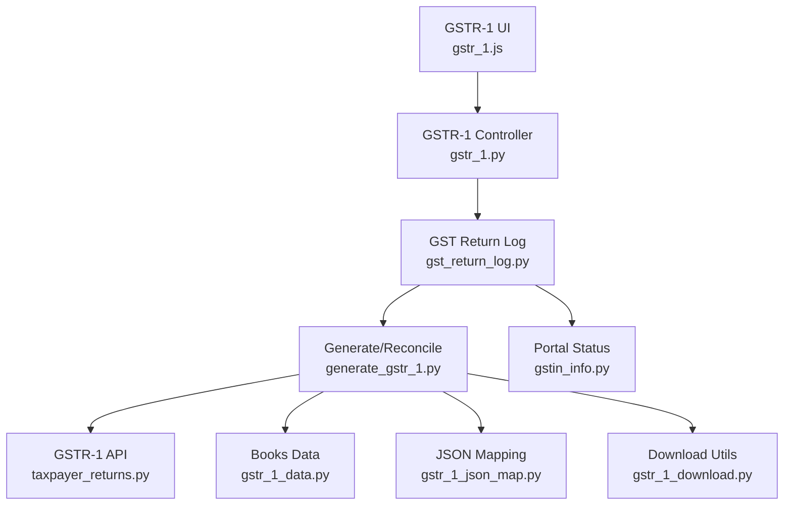
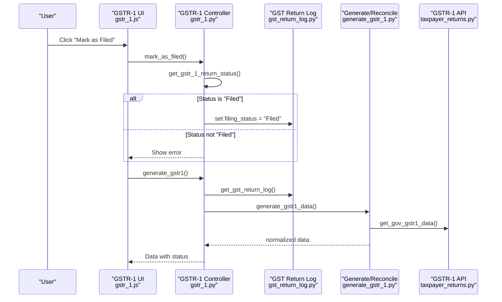
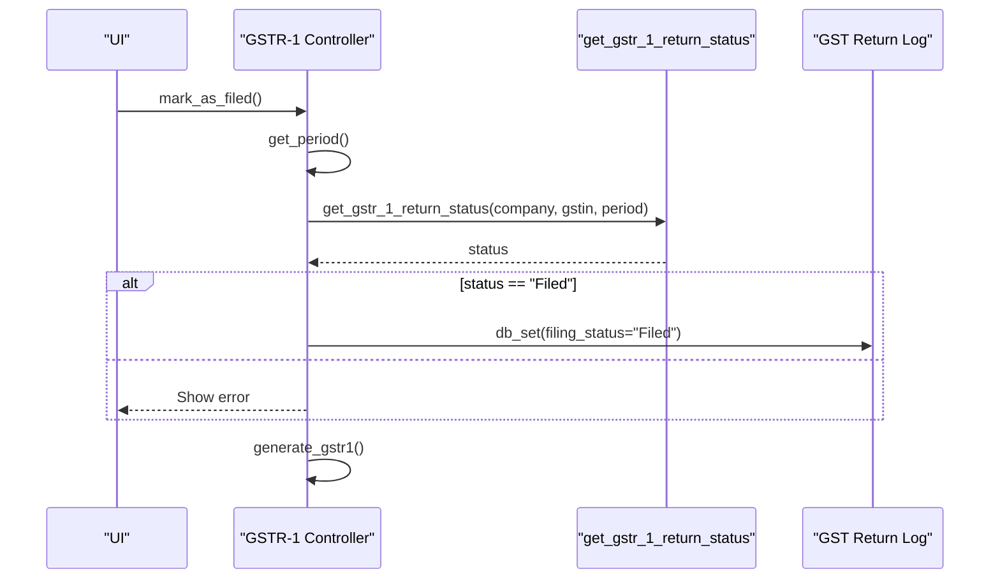
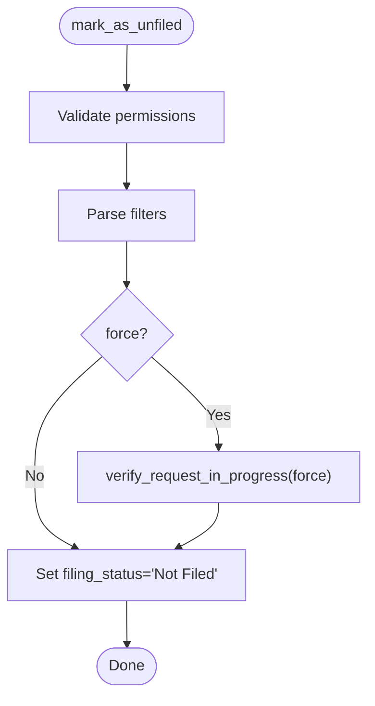
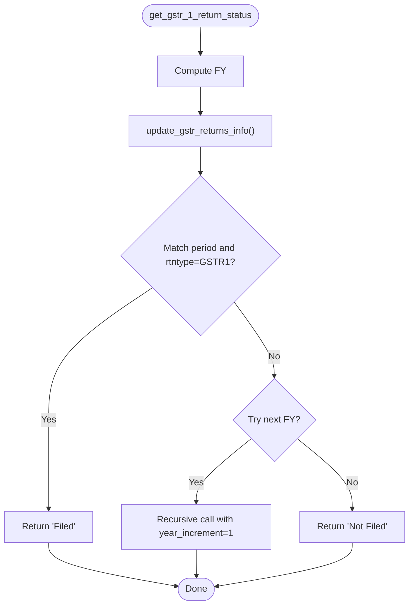
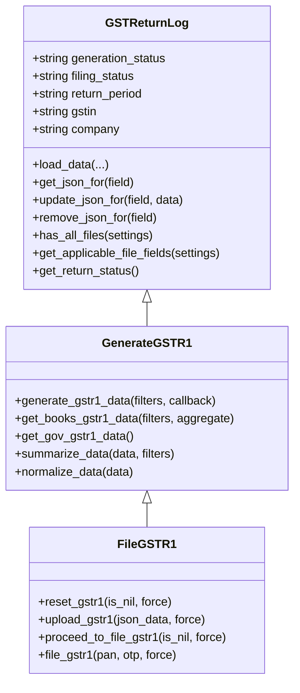
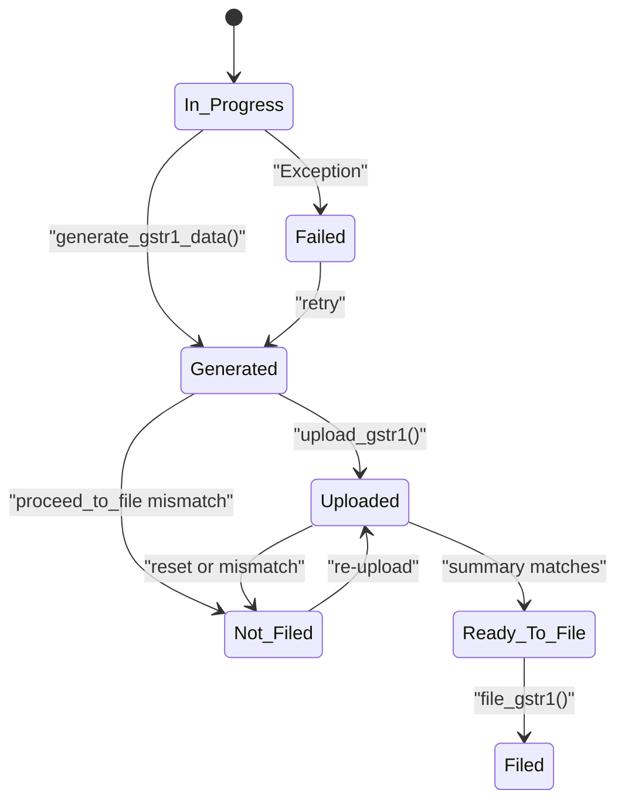
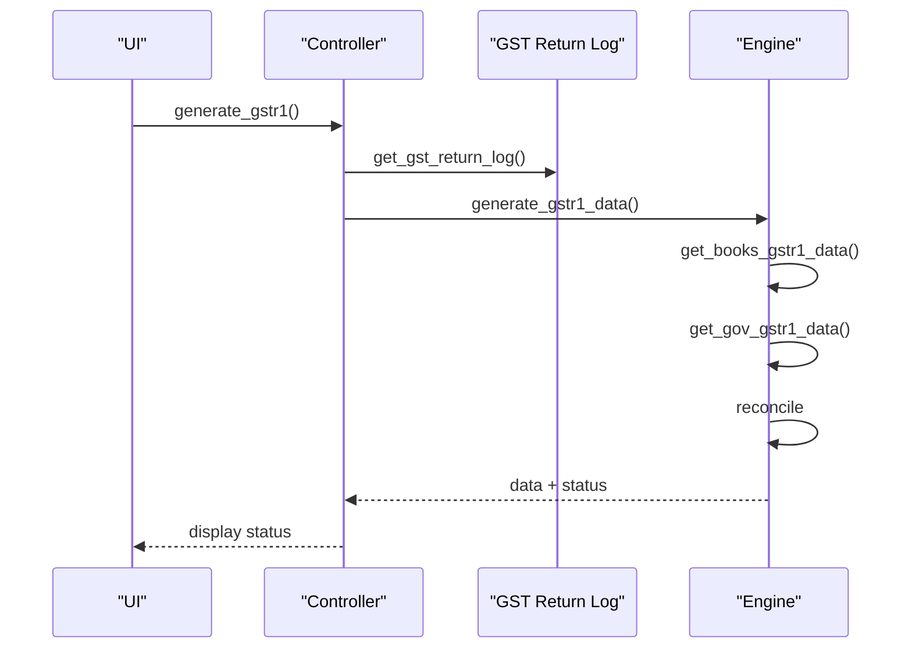
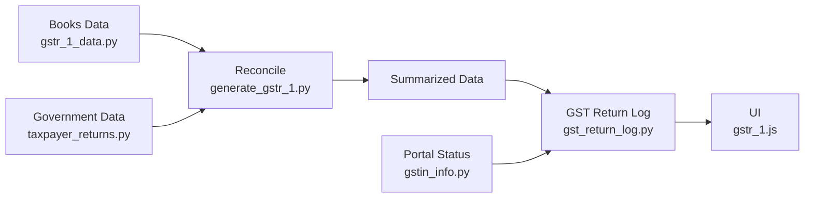
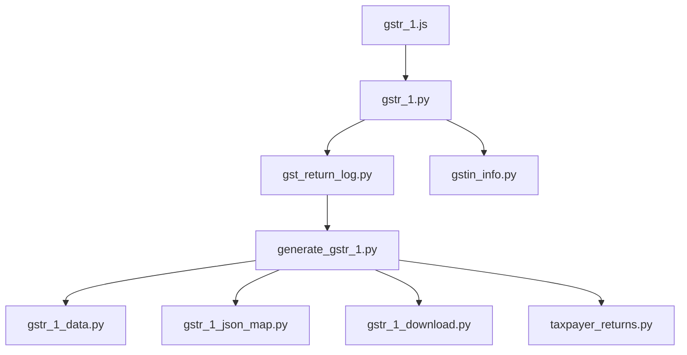

# Status Tracking & Management

<cite>
**Referenced Files in This Document**
- [gstr_1.py](file://india_compliance/gst_india/doctype/gstr_1/gstr_1.py)
- [gst_return_log.py](file://india_compliance/gst_india/doctype/gst_return_log/gst_return_log.py)
- [generate_gstr_1.py](file://india_compliance/gst_india/doctype/gst_return_log/generate_gstr_1.py)
- [gstin_info.py](file://india_compliance/gst_india/utils/gstin_info.py)
- [gstr_1.js](file://india_compliance/gst_india/doctype/gstr_1/gstr_1.js)
- [gstr_action.py](file://india_compliance/gst_india/doctype/gstr_action/gstr_action.py)
- [gstr_1_data.py](file://india_compliance/gst_india/utils/gstr_1/gstr_1_data.py)
- [gstr_1_json_map.py](file://india_compliance/gst_india/utils/gstr_1/gstr_1_json_map.py)
- [gstr_1_download.py](file://india_compliance/gst_india/utils/gstr_1/gstr_1_download.py)
- [taxpayer_returns.py](file://india_compliance/gst_india/api_classes/taxpayer_returns.py)
</cite>

## Table of Contents
1. [Introduction](#introduction)
2. [Project Structure](#project-structure)
3. [Core Components](#core-components)
4. [Architecture Overview](#architecture-overview)
5. [Detailed Component Analysis](#detailed-component-analysis)
6. [Dependency Analysis](#dependency-analysis)
7. [Performance Considerations](#performance-considerations)
8. [Troubleshooting Guide](#troubleshooting-guide)
9. [Conclusion](#conclusion)
10. [Appendices](#appendices)

## Introduction
This document explains the GSTR-1 status tracking and management system, focusing on:
- Marking returns as filed and unfilled
- Verifying filing status via the government portal
- Integrating with the GST Return Log
- Status lifecycle from In Progress to Filed, error states, and recovery mechanisms
- Practical workflows for status checking, manual updates, and bulk management
- Relationship between local GSTR-1 records and government portal status synchronization

## Project Structure
The GSTR-1 status system spans Python backend modules and JavaScript frontend handlers:
- GSTR-1 document controller exposes actions like marking as filed/unfiled and initiating generation
- GST Return Log centralizes filing status, reconciliation, and action tracking
- Utilities provide government portal status verification and data mapping
- Frontend orchestrates user actions and displays status

**Diagram sources**
- [gstr_1.js](file://india_compliance/gst_india/doctype/gstr_1/gstr_1.js#L2700-L2899)
- [gstr_1.py](file://india_compliance/gst_india/doctype/gstr_1/gstr_1.py#L44-L269)
- [gst_return_log.py](file://india_compliance/gst_india/doctype/gst_return_log/gst_return_log.py#L26-L173)
- [generate_gstr_1.py](file://india_compliance/gst_india/doctype/gst_return_log/generate_gstr_1.py#L567-L808)
- [gstin_info.py](file://india_compliance/gst_india/utils/gstin_info.py#L323-L366)
- [gstr_1_data.py](file://india_compliance/gst_india/utils/gstr_1/gstr_1_data.py#L64-L214)
- [gstr_1_json_map.py](file://india_compliance/gst_india/utils/gstr_1/gstr_1_json_map.py)
- [gstr_1_download.py](file://india_compliance/gst_india/utils/gstr_1/gstr_1_download.py)
- [taxpayer_returns.py](file://india_compliance/gst_india/api_classes/taxpayer_returns.py#L1-L31)

**Section sources**
- [gstr_1.py](file://india_compliance/gst_india/doctype/gstr_1/gstr_1.py#L29-L192)
- [gst_return_log.py](file://india_compliance/gst_india/doctype/gst_return_log/gst_return_log.py#L26-L173)
- [generate_gstr_1.py](file://india_compliance/gst_india/doctype/gst_return_log/generate_gstr_1.py#L567-L808)
- [gstin_info.py](file://india_compliance/gst_india/utils/gstin_info.py#L323-L366)
- [gstr_1.js](file://india_compliance/gst_india/doctype/gstr_1/gstr_1.js#L2700-L2899)

## Core Components
- GSTR-1 Controller
  - Provides actions to mark as filed/unfiled and to generate GSTR-1 data
  - Integrates with GST Return Log and government portal status verification
- GST Return Log
  - Stores filing status, reconciliation, and action history
  - Loads and normalizes books and government data
  - Manages file fields for books, reconcile, unfiled/filing, and summaries
- Generate/Reconcile Engine
  - Builds books data, reconciles with government data, and summarizes
  - Coordinates upload, proceed-to-file, and filing actions
- Status Verification
  - Queries government returns info and updates filing status
- Frontend Actions
  - Orchestrates user-triggered actions and retries until completion

**Section sources**
- [gstr_1.py](file://india_compliance/gst_india/doctype/gstr_1/gstr_1.py#L44-L269)
- [gst_return_log.py](file://india_compliance/gst_india/doctype/gst_return_log/gst_return_log.py#L26-L173)
- [generate_gstr_1.py](file://india_compliance/gst_india/doctype/gst_return_log/generate_gstr_1.py#L567-L808)
- [gstin_info.py](file://india_compliance/gst_india/utils/gstin_info.py#L323-L366)
- [gstr_1.js](file://india_compliance/gst_india/doctype/gstr_1/gstr_1.js#L2700-L2899)

## Architecture Overview
The system follows a layered architecture:
- UI triggers actions
- Controller validates and enqueues generation
- GST Return Log manages status and data persistence
- Government API provides portal status and actions
- Reconciliation compares books vs government data

**Diagram sources**
- [gstr_1.py](file://india_compliance/gst_india/doctype/gstr_1/gstr_1.py#L44-L147)
- [gst_return_log.py](file://india_compliance/gst_india/doctype/gst_return_log/gst_return_log.py#L352-L367)
- [generate_gstr_1.py](file://india_compliance/gst_india/doctype/gst_return_log/generate_gstr_1.py#L595-L663)
- [gstin_info.py](file://india_compliance/gst_india/utils/gstin_info.py#L323-L366)

## Detailed Component Analysis

### mark_as_filed
Purpose:
- Verify government portal filing status for the selected period
- Update local GST Return Log filing_status to "Filed" only if verified

Behavior:
- Computes period from month_or_quarter and year
- Calls get_gstr_1_return_status to check portal status
- If status is "Filed", sets GST Return Log filing_status accordingly
- Refreshes GSTR-1 data

**Diagram sources**
- [gstr_1.py](file://india_compliance/gst_india/doctype/gstr_1/gstr_1.py#L44-L67)
- [gstin_info.py](file://india_compliance/gst_india/utils/gstin_info.py#L323-L366)

**Section sources**
- [gstr_1.py](file://india_compliance/gst_india/doctype/gstr_1/gstr_1.py#L44-L67)

### mark_as_unfiled
Purpose:
- Manually override filing_status to "Not Filed"
- Useful when a prior "Filed" status needs correction

Behavior:
- Validates permissions
- Accepts filters (month_or_quarter, year, company_gstin)
- Optionally verifies in-progress requests before forcing update
- Sets GST Return Log filing_status to "Not Filed"

**Diagram sources**
- [gstr_1.py](file://india_compliance/gst_india/doctype/gstr_1/gstr_1.py#L255-L269)
- [generate_gstr_1.py](file://india_compliance/gst_india/doctype/gst_return_log/generate_gstr_1.py#L1089-L1104)

**Section sources**
- [gstr_1.py](file://india_compliance/gst_india/doctype/gstr_1/gstr_1.py#L255-L269)
- [generate_gstr_1.py](file://india_compliance/gst_india/doctype/gstr_return_log/generate_gstr_1.py#L1089-L1104)

### get_gstr_1_return_status
Purpose:
- Query government portal for GSTR-1 filing status for a given period
- Update local logs if needed

Behavior:
- Retrieves returns info for the financial year
- Matches by return type "GSTR1" and return period
- Returns "Filed" if found, otherwise "Not Filed"
- Enqueues processing of returns info to keep logs synchronized

**Diagram sources**
- [gstin_info.py](file://india_compliance/gst_india/utils/gstin_info.py#L323-L366)

**Section sources**
- [gstin_info.py](file://india_compliance/gst_india/utils/gstin_info.py#L323-L366)

### GST Return Log Integration
Responsibilities:
- Central storage for filing_status, generation_status, and action history
- Load and normalize books/government data
- Manage file fields for books, reconcile, unfiled/filing, and summaries
- Determine applicable file fields based on settings and filing_status

Key methods:
- load_data, get_json_for, update_json_for, remove_json_for
- has_all_files, get_applicable_file_fields
- get_return_status (wraps portal status)
- get_gst_return_log factory

**Diagram sources**
- [gst_return_log.py](file://india_compliance/gst_india/doctype/gst_return_log/gst_return_log.py#L26-L173)
- [generate_gstr_1.py](file://india_compliance/gst_india/doctype/gstr_return_log/generate_gstr_1.py#L567-L808)

**Section sources**
- [gst_return_log.py](file://india_compliance/gst_india/doctype/gst_return_log/gst_return_log.py#L26-L173)
- [generate_gstr_1.py](file://india_compliance/gst_india/doctype/gstr_return_log/generate_gstr_1.py#L567-L808)

### Status Lifecycle and Recovery
Lifecycle stages:
- In Progress: Generation started; user notified and prevented from overlapping actions
- Queued: Download queued; user notified
- Generated: Data ready locally
- Uploaded: Data uploaded to portal
- Ready to File: Portal summary matches books; ready for filing
- Filed: Successfully filed; acknowledgment recorded
- Not Filed: Mismatch or reset; requires reconciliation

Recovery mechanisms:
- verify_request_in_progress prevents concurrent actions; force option allows overriding
- process_proceed_to_file_gstr1 polls and updates status
- process_upload_gstr1 handles errors and persists error reports
- process_reset_gstr1 clears unfiled data when reset completes

**Diagram sources**
- [generate_gstr_1.py](file://india_compliance/gst_india/doctype/gstr_return_log/generate_gstr_1.py#L897-L1055)
- [generate_gstr_1.py](file://india_compliance/gst_india/doctype/gstr_return_log/generate_gstr_1.py#L1089-L1104)

**Section sources**
- [generate_gstr_1.py](file://india_compliance/gst_india/doctype/gstr_return_log/generate_gstr_1.py#L897-L1055)
- [generate_gstr_1.py](file://india_compliance/gst_india/doctype/gstr_return_log/generate_gstr_1.py#L1089-L1104)

### Practical Workflows

#### Status Checking Workflow
- Use the UI to trigger generation
- The controller checks GST Return Log status and enqueues generation if needed
- The engine downloads government data (if enabled) and reconciles with books
- Final status is reflected in the UI

**Diagram sources**
- [gstr_1.py](file://india_compliance/gst_india/doctype/gstr_1/gstr_1.py#L71-L147)
- [generate_gstr_1.py](file://india_compliance/gst_india/doctype/gstr_return_log/generate_gstr_1.py#L595-L663)

**Section sources**
- [gstr_1.py](file://india_compliance/gst_india/doctype/gstr_1/gstr_1.py#L71-L147)
- [generate_gstr_1.py](file://india_compliance/gst_india/doctype/gstr_return_log/generate_gstr_1.py#L595-L663)

#### Manual Status Update
- Use "Mark as Unfiled" to override filing_status to "Not Filed"
- Useful when a prior "Filed" status was incorrect or needs correction

**Section sources**
- [gstr_1.py](file://india_compliance/gst_india/doctype/gstr_1/gstr_1.py#L255-L269)
- [gstr_1.js](file://india_compliance/gst_india/doctype/gstr_1/gstr_1.js#L2870-L2890)

#### Bulk Status Management
- Use "Mark as Unfiled" with filters to update multiple periods
- Frontend passes company, company_gstin, month_or_quarter, year to backend

**Section sources**
- [gstr_1.py](file://india_compliance/gst_india/doctype/gstr_1/gstr_1.py#L255-L269)
- [gstr_1.js](file://india_compliance/gst_india/doctype/gstr_1/gstr_1.js#L2870-L2890)

### Relationship Between Local Records and Portal Status
- Local filing_status is authoritative for UI and downstream logic
- Portal status is periodically verified and used to update local logs
- When portal shows "Filed", local status is updated accordingly
- Discrepancies trigger "Not Filed" and require reconciliation

**Diagram sources**
- [gstr_1_data.py](file://india_compliance/gst_india/utils/gstr_1/gstr_1_data.py#L64-L214)
- [generate_gstr_1.py](file://india_compliance/gst_india/doctype/gstr_return_log/generate_gstr_1.py#L259-L455)
- [gst_return_log.py](file://india_compliance/gst_india/doctype/gst_return_log/gst_return_log.py#L26-L173)
- [gstin_info.py](file://india_compliance/gst_india/utils/gstin_info.py#L323-L366)
- [gstr_1.js](file://india_compliance/gst_india/doctype/gstr_1/gstr_1.js#L2700-L2899)

**Section sources**
- [gstr_1_data.py](file://india_compliance/gst_india/utils/gstr_1/gstr_1_data.py#L64-L214)
- [generate_gstr_1.py](file://india_compliance/gst_india/doctype/gstr_return_log/generate_gstr_1.py#L259-L455)
- [gst_return_log.py](file://india_compliance/gst_india/doctype/gst_return_log/gst_return_log.py#L26-L173)
- [gstin_info.py](file://india_compliance/gst_india/utils/gstin_info.py#L323-L366)
- [gstr_1.js](file://india_compliance/gst_india/doctype/gstr_1/gstr_1.js#L2700-L2899)

## Dependency Analysis
Key dependencies:
- GSTR-1 Controller depends on GST Return Log and status utilities
- GST Return Log composes Generate/Reconcile engine and action tracking
- Generate/Reconcile depends on books data, mapping, and government API
- Frontend depends on controller actions and polling for status

**Diagram sources**
- [gstr_1.py](file://india_compliance/gst_india/doctype/gstr_1/gstr_1.py#L29-L192)
- [gst_return_log.py](file://india_compliance/gst_india/doctype/gst_return_log/gst_return_log.py#L26-L173)
- [generate_gstr_1.py](file://india_compliance/gst_india/doctype/gstr_return_log/generate_gstr_1.py#L567-L808)
- [gstr_1_data.py](file://india_compliance/gst_india/utils/gstr_1/gstr_1_data.py#L64-L214)
- [gstr_1_json_map.py](file://india_compliance/gst_india/utils/gstr_1/gstr_1_json_map.py)
- [gstr_1_download.py](file://india_compliance/gst_india/utils/gstr_1/gstr_1_download.py)
- [taxpayer_returns.py](file://india_compliance/gst_india/api_classes/taxpayer_returns.py#L1-L31)
- [gstr_1.js](file://india_compliance/gst_india/doctype/gstr_1/gstr_1.js#L2700-L2899)

**Section sources**
- [gstr_1.py](file://india_compliance/gst_india/doctype/gstr_1/gstr_1.py#L29-L192)
- [gst_return_log.py](file://india_compliance/gst_india/doctype/gst_return_log/gst_return_log.py#L26-L173)
- [generate_gstr_1.py](file://india_compliance/gst_india/doctype/gstr_return_log/generate_gstr_1.py#L567-L808)
- [gstr_1.js](file://india_compliance/gst_india/doctype/gstr_1/gstr_1.js#L2700-L2899)

## Performance Considerations
- Asynchronous generation: Long-running tasks are enqueued to avoid blocking the UI
- Data normalization: Complex nested structures are flattened for efficient rendering
- Conditional file loading: Only applicable file fields are loaded based on settings and filing_status
- Retry logic: Frontend retries with exponential backoff for action status polling

[No sources needed since this section provides general guidance]

## Troubleshooting Guide
Common issues and remedies:
- Concurrent action errors: verify_request_in_progress prevents overlapping actions; use force to override if necessary
- Upload errors: process_upload_gstr1 persists error reports; review and fix discrepancies
- Proceed-to-file mismatches: fetch_and_compare_summary computes differing categories; reconcile books data
- Portal status mismatch: get_gstr_1_return_status updates filing_status; ensure credentials and connectivity

**Section sources**
- [generate_gstr_1.py](file://india_compliance/gst_india/doctype/gstr_return_log/generate_gstr_1.py#L897-L1055)
- [generate_gstr_1.py](file://india_compliance/gst_india/doctype/gstr_return_log/generate_gstr_1.py#L1089-L1104)
- [gstr_action.py](file://india_compliance/gst_india/doctype/gstr_action/gstr_action.py#L12-L29)

## Conclusion
The GSTR-1 status tracking system integrates local records with government portal verification and action orchestration. It provides robust lifecycle management, error handling, and recovery mechanisms, enabling accurate synchronization between books and filings.

[No sources needed since this section summarizes without analyzing specific files]

## Appendices

### Action Reference
- reset_gstr1: Resets saved data and clears unfiled records
- upload_gstr1: Saves books data to portal; transitions to Uploaded on success
- proceed_to_file_gstr1: Compares summary; moves to Ready to File if matched
- file_gstr1: Files the return and updates acknowledgment number

**Section sources**
- [generate_gstr_1.py](file://india_compliance/gst_india/doctype/gstr_return_log/generate_gstr_1.py#L832-L1055)