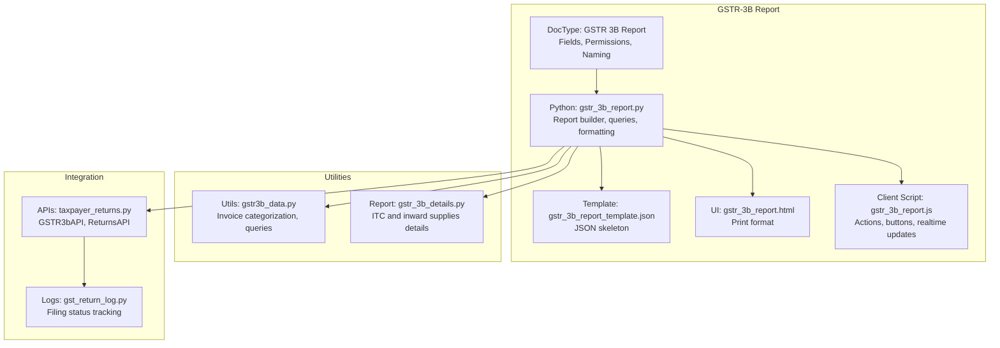
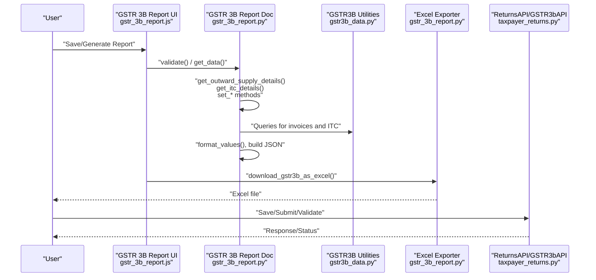
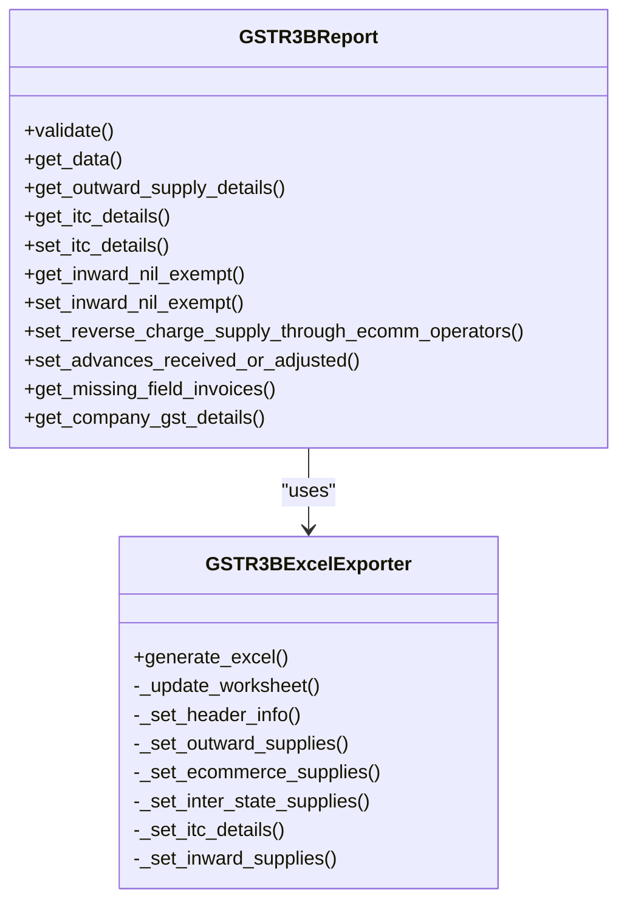
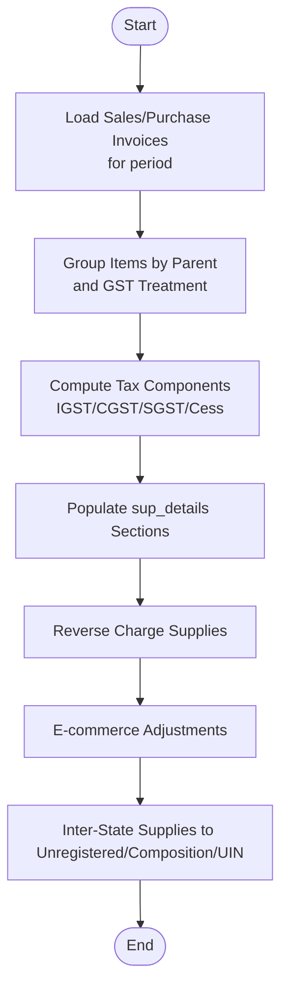
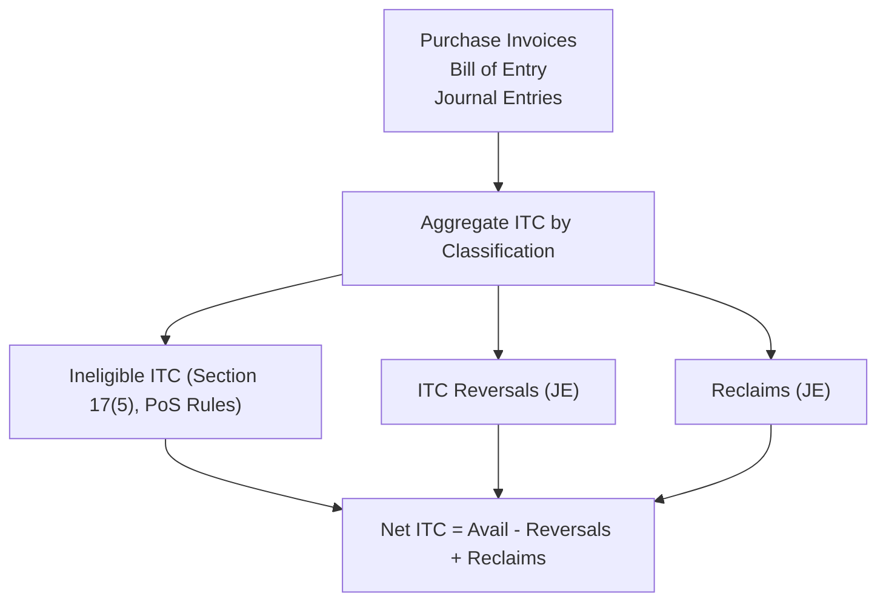
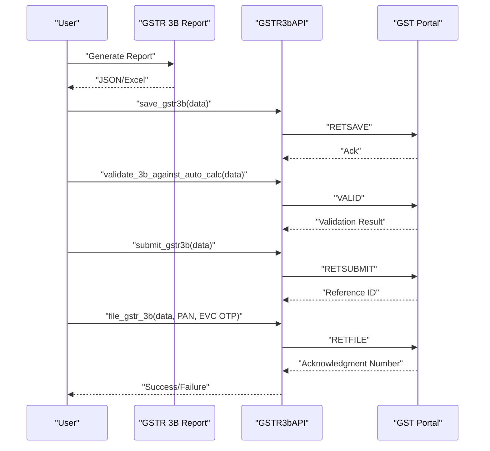
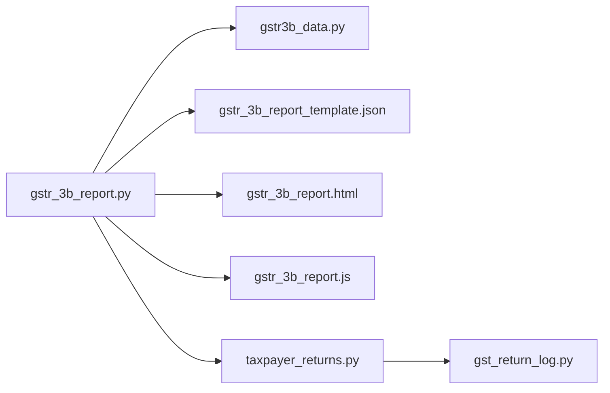
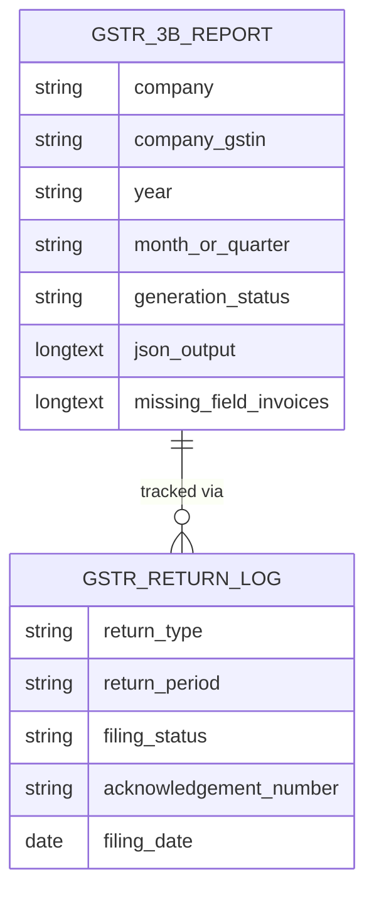

# GSTR-3B Generation

<cite>
**Referenced Files in This Document**
- [gstr_3b_report.py](file://india_compliance/gst_india/doctype/gstr_3b_report/gstr_3b_report.py)
- [gstr_3b_report.json](file://india_compliance/gst_india/doctype/gstr_3b_report/gstr_3b_report.json)
- [gstr_3b_report.html](file://india_compliance/gst_india/doctype/gstr_3b_report/gstr_3b_report.html)
- [gstr_3b_report.js](file://india_compliance/gst_india/doctype/gstr_3b_report/gstr_3b_report.js)
- [gstr_3b_report_template.json](file://india_compliance/gst_india/doctype/gstr_3b_report/gstr_3b_report_template.json)
- [gstr3b_data.py](file://india_compliance/gst_india/utils/gstr3b/gstr3b_data.py)
- [gstr_3b_details.py](file://india_compliance/gst_india/report/gstr_3b_details/gstr_3b_details.py)
- [taxpayer_returns.py](file://india_compliance/gst_india/api_classes/taxpayer_returns.py)
- [gst_return_log.py](file://india_compliance/gst_india/doctype/gst_return_log/gst_return_log.py)
- [test_gstr_3b_report.py](file://india_compliance/gst_india/doctype/gstr_3b_report/test_gstr_3b_report.py)
</cite>

## Table of Contents
1. [Introduction](#introduction)
2. [Project Structure](#project-structure)
3. [Core Components](#core-components)
4. [Architecture Overview](#architecture-overview)
5. [Detailed Component Analysis](#detailed-component-analysis)
6. [Dependency Analysis](#dependency-analysis)
7. [Performance Considerations](#performance-considerations)
8. [Troubleshooting Guide](#troubleshooting-guide)
9. [Conclusion](#conclusion)
10. [Appendices](#appendices)

## Introduction
This document explains the GSTR-3B generation system used to prepare and submit quarterly GST returns in India Compliance. It covers:
- The GSTR 3B Report doctype and its lifecycle
- Extraction of data from Sales Invoices and Purchase Invoices
- Template-based JSON and Excel formatting
- ITC computation and inward supplies classification
- Quarterly filing workflow, validation, and submission
- Integration with the GST portal APIs
- Filing status tracking and audit trail
- Practical scenarios, common data issues, and corrections

## Project Structure
The GSTR-3B generation spans a DocType, client-side UI, report utilities, data exporters, and GST portal integration.

**Diagram sources**
- [gstr_3b_report.py](file://india_compliance/gst_india/doctype/gstr_3b_report/gstr_3b_report.py#L41-L115)
- [gstr_3b_report.json](file://india_compliance/gst_india/doctype/gstr_3b_report/gstr_3b_report.json#L1-L134)
- [gstr_3b_report_template.json](file://india_compliance/gst_india/doctype/gstr_3b_report/gstr_3b_report_template.json#L1-L139)
- [gstr_3b_report.html](file://india_compliance/gst_india/doctype/gstr_3b_report/gstr_3b_report.html#L1-L333)
- [gstr_3b_report.js](file://india_compliance/gst_india/doctype/gstr_3b_report/gstr_3b_report.js#L1-L143)
- [gstr3b_data.py](file://india_compliance/gst_india/utils/gstr3b/gstr3b_data.py#L1-L423)
- [gstr_3b_details.py](file://india_compliance/gst_india/report/gstr_3b_details/gstr_3b_details.py#L1-L507)
- [taxpayer_returns.py](file://india_compliance/gst_india/api_classes/taxpayer_returns.py#L185-L333)
- [gst_return_log.py](file://india_compliance/gst_india/doctype/gst_return_log/gst_return_log.py#L26-L367)

**Section sources**
- [gstr_3b_report.py](file://india_compliance/gst_india/doctype/gstr_3b_report/gstr_3b_report.py#L41-L115)
- [gstr_3b_report.json](file://india_compliance/gst_india/doctype/gstr_3b_report/gstr_3b_report.json#L1-L134)

## Core Components
- GSTR 3B Report DocType: Captures company, GSTIN, period, and generates JSON/Excel output.
- Report Builder: Aggregates data from Sales/Purchase Invoices, computes ITC, inward supplies, and inter-state supplies.
- Template Engine: Loads a JSON template and fills sections for printing and export.
- Exporter: Converts JSON to Excel using the official GSTR-3B template.
- Reports: Detailed views for ITC and inward nil/exempt supplies.
- Portal Integration: GSTR-3B APIs for saving, submitting, validating, and fetching filing status.
- Audit Trail: Logs filing status and acknowledgments.

**Section sources**
- [gstr_3b_report.py](file://india_compliance/gst_india/doctype/gstr_3b_report/gstr_3b_report.py#L41-L115)
- [gstr_3b_report_template.json](file://india_compliance/gst_india/doctype/gstr_3b_report/gstr_3b_report_template.json#L1-L139)
- [gstr_3b_report.html](file://india_compliance/gst_india/doctype/gstr_3b_report/gstr_3b_report.html#L1-L333)
- [gstr_3b_details.py](file://india_compliance/gst_india/report/gstr_3b_details/gstr_3b_details.py#L80-L316)
- [taxpayer_returns.py](file://india_compliance/gst_india/api_classes/taxpayer_returns.py#L185-L333)
- [gst_return_log.py](file://india_compliance/gst_india/doctype/gst_return_log/gst_return_log.py#L26-L367)

## Architecture Overview
The system follows a structured pipeline:
- User triggers report generation via the DocType UI.
- Queries extract invoice items and compute tax components.
- Template-based JSON is populated and formatted.
- Optional Excel export uses the official template.
- Portal APIs support saving, validation, and filing.
- Filing status is tracked and logged.

**Diagram sources**
- [gstr_3b_report.js](file://india_compliance/gst_india/doctype/gstr_3b_report/gstr_3b_report.js#L22-L108)
- [gstr_3b_report.py](file://india_compliance/gst_india/doctype/gstr_3b_report/gstr_3b_report.py#L54-L115)
- [gstr3b_data.py](file://india_compliance/gst_india/utils/gstr3b/gstr3b_data.py#L132-L323)
- [taxpayer_returns.py](file://india_compliance/gst_india/api_classes/taxpayer_returns.py#L185-L333)

## Detailed Component Analysis

### GSTR 3B Report DocType and Lifecycle
- Fields capture company, GSTIN, year/month or quarter, and generate status.
- Validation triggers background or synchronous report generation.
- Generates JSON output and optionally exports Excel.

**Diagram sources**
- [gstr_3b_report.py](file://india_compliance/gst_india/doctype/gstr_3b_report/gstr_3b_report.py#L41-L115)
- [gstr_3b_report.py](file://india_compliance/gst_india/doctype/gstr_3b_report/gstr_3b_report.py#L776-L1053)

**Section sources**
- [gstr_3b_report.json](file://india_compliance/gst_india/doctype/gstr_3b_report/gstr_3b_report.json#L1-L134)
- [gstr_3b_report.py](file://india_compliance/gst_india/doctype/gstr_3b_report/gstr_3b_report.py#L41-L115)
- [gstr_3b_report.js](file://india_compliance/gst_india/doctype/gstr_3b_report/gstr_3b_report.js#L1-L143)

### Data Extraction from Sales and Purchase Invoices
- Outward supplies grouped by GST treatment (Taxable, Nil-Rated, Exempted, Zero-Rated, Non-GST).
- Reverse charge purchases included separately.
- Inter-state supplies to unregistered/composition/UIN categorized by place of supply.
- E-commerce operator reverse charge adjustments subtracted from outward taxable supplies.

**Diagram sources**
- [gstr_3b_report.py](file://india_compliance/gst_india/doctype/gstr_3b_report/gstr_3b_report.py#L428-L650)
- [gstr3b_data.py](file://india_compliance/gst_india/utils/gstr3b/gstr3b_data.py#L307-L423)

**Section sources**
- [gstr_3b_report.py](file://india_compliance/gst_india/doctype/gstr_3b_report/gstr_3b_report.py#L428-L650)
- [gstr3b_data.py](file://india_compliance/gst_india/utils/gstr3b/gstr3b_data.py#L132-L323)

### ITC Computation Methods
- Available ITC by classification (Imports, Reverse Charge, ISD, Others).
- Ineligible ITC from purchase invoices and Bill of Entry based on rules.
- ITC reversals from Journal Entries and reclaim entries.
- Net ITC computed as Available minus Reversals plus Reclaims.

**Diagram sources**
- [gstr_3b_report.py](file://india_compliance/gst_india/doctype/gstr_3b_report/gstr_3b_report.py#L250-L352)
- [gstr_3b_details.py](file://india_compliance/gst_india/report/gstr_3b_details/gstr_3b_details.py#L80-L316)
- [gstr3b_data.py](file://india_compliance/gst_india/utils/gstr3b/gstr3b_data.py#L307-L423)

**Section sources**
- [gstr_3b_report.py](file://india_compliance/gst_india/doctype/gstr_3b_report/gstr_3b_report.py#L130-L352)
- [gstr_3b_details.py](file://india_compliance/gst_india/report/gstr_3b_details/gstr_3b_details.py#L80-L316)

### Inward Supplies and Nil/Exempt Supplies
- Classifies inward nil-rated, exempted, and non-GST supplies by intra/inter-state.
- Uses supplier address/state mapping and place-of-supply logic.

**Section sources**
- [gstr_3b_report.py](file://india_compliance/gst_india/doctype/gstr_3b_report/gstr_3b_report.py#L353-L404)
- [gstr_3b_details.py](file://india_compliance/gst_india/report/gstr_3b_details/gstr_3b_details.py#L318-L441)

### Template-Based Formatting and Excel Export
- JSON template defines sections for inward supplies, outward supplies, ITC, and inward supplies.
- Exporter maps JSON keys to Excel rows/columns and writes a downloadable file.

**Section sources**
- [gstr_3b_report_template.json](file://india_compliance/gst_india/doctype/gstr_3b_report/gstr_3b_report_template.json#L1-L139)
- [gstr_3b_report.py](file://india_compliance/gst_india/doctype/gstr_3b_report/gstr_3b_report.py#L776-L1053)
- [gstr_3b_report.html](file://india_compliance/gst_india/doctype/gstr_3b_report/gstr_3b_report.html#L1-L333)

### Quarterly Filing Workflow
- Save and generate report; review missing field invoices.
- Download JSON/Excel for verification.
- Use portal APIs to save, validate, and file the return.
- Track filing status and acknowledgments.

**Diagram sources**
- [taxpayer_returns.py](file://india_compliance/gst_india/api_classes/taxpayer_returns.py#L185-L333)
- [gst_return_log.py](file://india_compliance/gst_india/doctype/gst_return_log/gst_return_log.py#L262-L284)

**Section sources**
- [gstr_3b_report.js](file://india_compliance/gst_india/doctype/gstr_3b_report/gstr_3b_report.js#L28-L108)
- [taxpayer_returns.py](file://india_compliance/gst_india/api_classes/taxpayer_returns.py#L185-L333)
- [gst_return_log.py](file://india_compliance/gst_india/doctype/gst_return_log/gst_return_log.py#L262-L284)

### Practical Examples
- Example scenarios validated by tests include:
  - Intra-state and inter-state supplies to unregistered/composition/UIN.
  - Nil-rated, exempted, zero-rated, and non-GST supplies.
  - E-commerce reverse charge adjustments.
  - ITC availability and classifications.

**Section sources**
- [test_gstr_3b_report.py](file://india_compliance/gst_india/doctype/gstr_3b_report/test_gstr_3b_report.py#L32-L198)

## Dependency Analysis
Key dependencies and relationships:
- GSTR 3B Report depends on invoice queries and ITC utilities.
- Exporter depends on the official Excel template.
- Portal APIs encapsulate GST portal interactions.
- Return logging tracks filing status and acknowledgments.

**Diagram sources**
- [gstr_3b_report.py](file://india_compliance/gst_india/doctype/gstr_3b_report/gstr_3b_report.py#L41-L115)
- [gstr3b_data.py](file://india_compliance/gst_india/utils/gstr3b/gstr3b_data.py#L1-L423)
- [taxpayer_returns.py](file://india_compliance/gst_india/api_classes/taxpayer_returns.py#L185-L333)
- [gst_return_log.py](file://india_compliance/gst_india/doctype/gst_return_log/gst_return_log.py#L26-L367)

**Section sources**
- [gstr_3b_report.py](file://india_compliance/gst_india/doctype/gstr_3b_report/gstr_3b_report.py#L41-L115)
- [gstr3b_data.py](file://india_compliance/gst_india/utils/gstr3b/gstr3b_data.py#L1-L423)
- [taxpayer_returns.py](file://india_compliance/gst_india/api_classes/taxpayer_returns.py#L185-L333)
- [gst_return_log.py](file://india_compliance/gst_india/doctype/gst_return_log/gst_return_log.py#L26-L367)

## Performance Considerations
- Use background generation for large periods to avoid long-running requests.
- Batch invoice queries and group by parent to minimize repeated joins.
- Round off GST values consistently as per settings to avoid discrepancies.
- Prefer selective filtering on posting date, company, and GSTIN to reduce dataset size.

[No sources needed since this section provides general guidance]

## Troubleshooting Guide
Common issues and resolutions:
- Missing Place of Supply on invoices: The report identifies invoices with missing place_of_supply and lists them in the “Invoices with no Place Of Supply” field. Correct invoice records to include place_of_supply.
- Missing supplier details: Ensure supplier GSTIN and billing address are present for Sales Invoices and supplier GSTIN for Purchase Invoices.
- ITC eligibility mismatches: Verify ineligibility reasons and classifications; reconcile with Journal Entries for reversals/reclaims.
- Excel export errors: Confirm the presence of the official template file and correct mapping of JSON keys to worksheet rows.

**Section sources**
- [gstr_3b_report.py](file://india_compliance/gst_india/doctype/gstr_3b_report/gstr_3b_report.py#L680-L709)
- [gstr_3b_report.py](file://india_compliance/gst_india/doctype/gstr_3b_report/gstr_3b_report.py#L776-L889)

## Conclusion
The GSTR-3B generation system integrates invoice data extraction, template-based formatting, ITC computations, and portal filing to streamline quarterly GST return preparation. Robust reporting, export capabilities, and filing status tracking ensure compliance and auditability.

[No sources needed since this section summarizes without analyzing specific files]

## Appendices

### Appendix A: Data Model Overview

**Diagram sources**
- [gstr_3b_report.json](file://india_compliance/gst_india/doctype/gstr_3b_report/gstr_3b_report.json#L1-L134)
- [gst_return_log.py](file://india_compliance/gst_india/doctype/gst_return_log/gst_return_log.py#L26-L367)