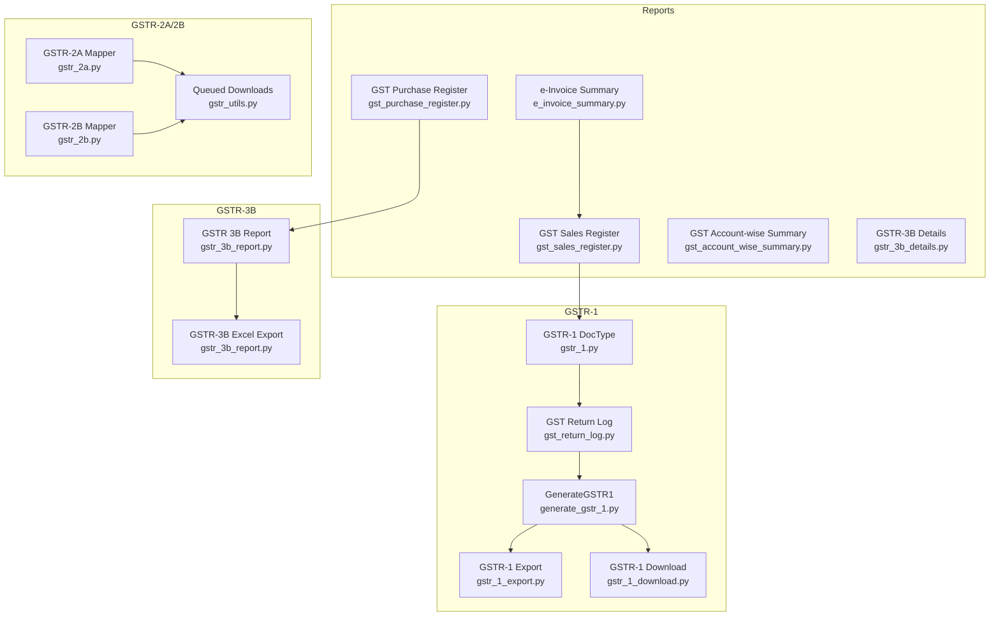
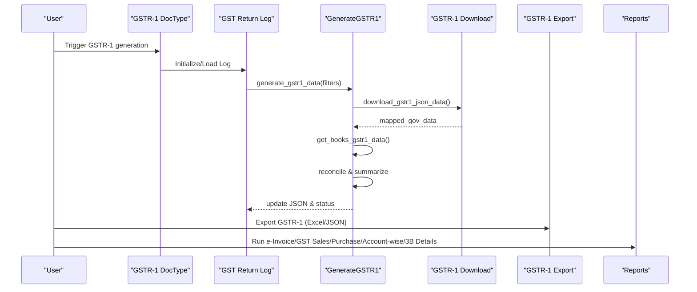
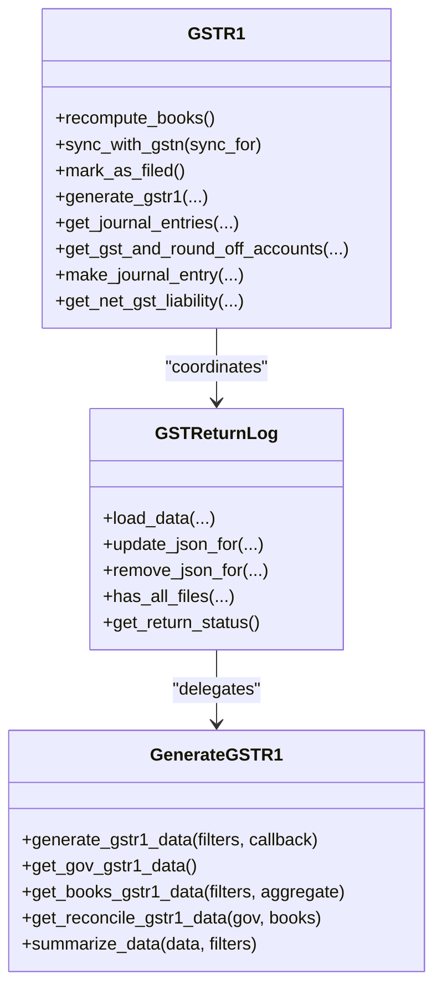
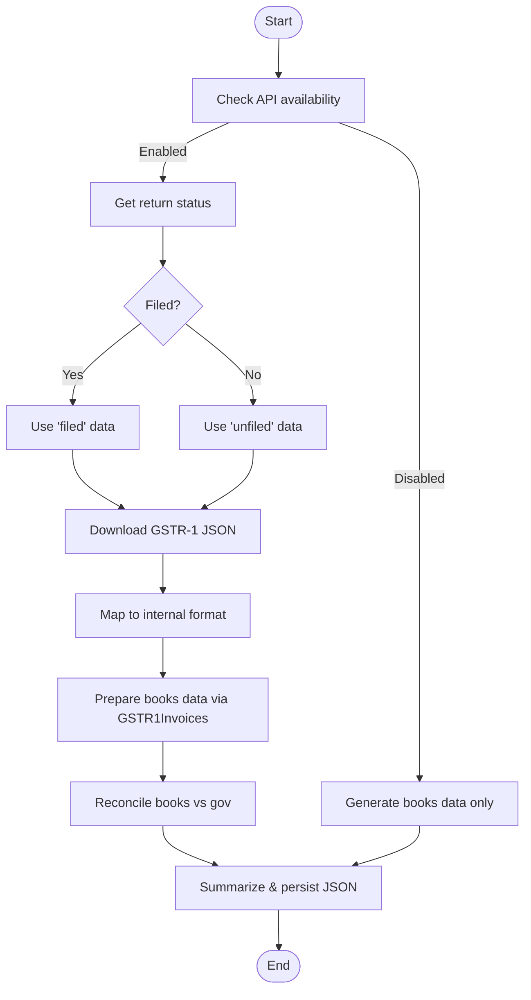
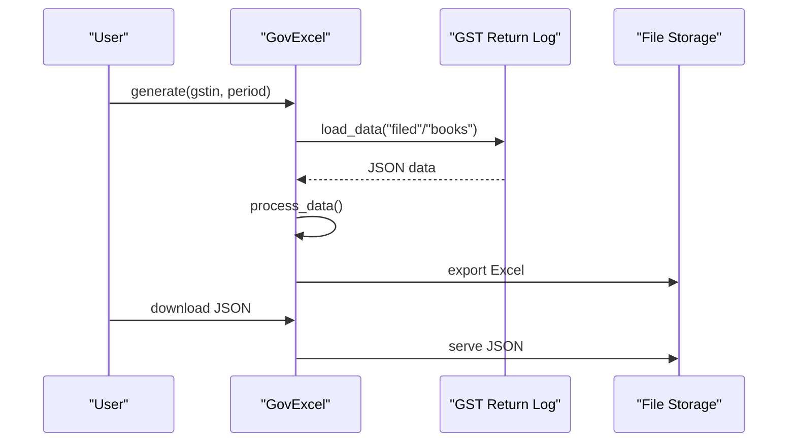
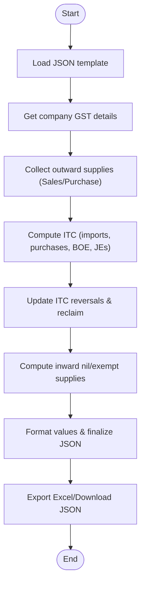
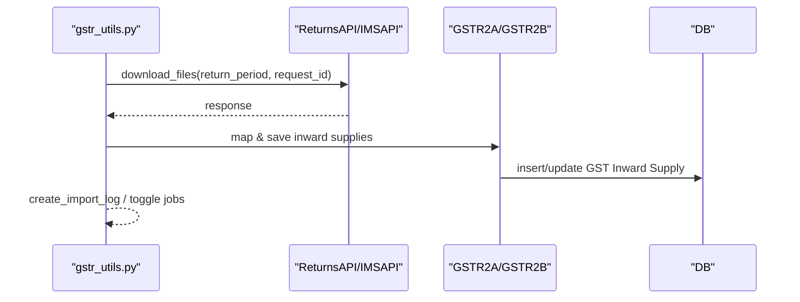
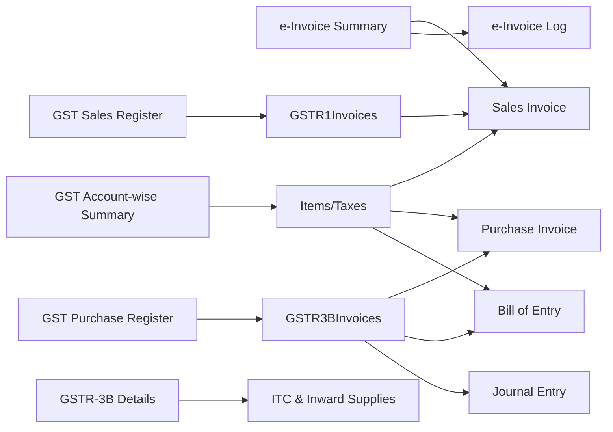
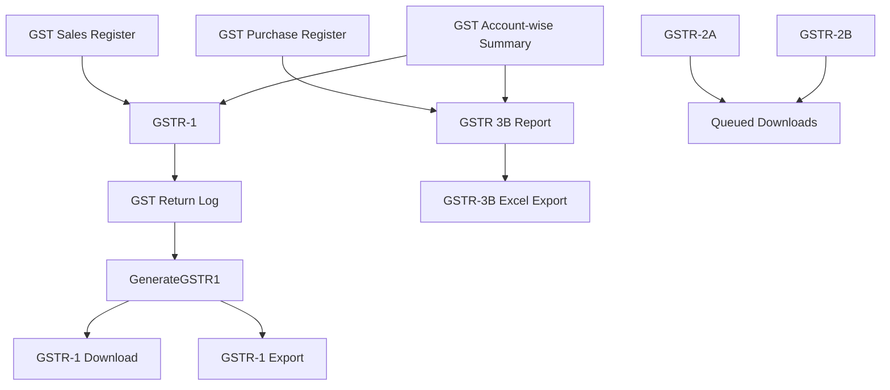

# Report Generation

<cite>
**Referenced Files in This Document**
- [gstr_1.py](file://india_compliance/gst_india/doctype/gstr_1/gstr_1.py)
- [gstr_3b_report.py](file://india_compliance/gst_india/doctype/gstr_3b_report/gstr_3b_report.py)
- [gstr_1_export.py](file://india_compliance/gst_india/doctype/gstr_1/gstr_1_export.py)
- [gstr_1_download.py](file://india_compliance/gst_india/utils/gstr_1/gstr_1_download.py)
- [generate_gstr_1.py](file://india_compliance/gst_india/doctype/gst_return_log/generate_gstr_1.py)
- [gst_return_log.py](file://india_compliance/gst_india/doctype/gst_return_log/gst_return_log.py)
- [gstr_1_data.py](file://india_compliance/gst_india/utils/gstr_1/gstr_1_data.py)
- [gstr_2a.py](file://india_compliance/gst_india/utils/gstr_2/gstr_2a.py)
- [gstr_2b.py](file://india_compliance/gst_india/utils/gstr_2/gstr_2b.py)
- [gstr_utils.py](file://india_compliance/gst_india/utils/gstr_utils.py)
- [e_invoice_summary.py](file://india_compliance/gst_india/report/e_invoice_summary/e_invoice_summary.py)
- [gst_sales_register.py](file://india_compliance/gst_india/report/gst_sales_register/gst_sales_register.py)
- [gst_purchase_register.py](file://india_compliance/gst_india/report/gst_purchase_register/gst_purchase_register.py)
- [gst_account_wise_summary.py](file://india_compliance/gst_india/report/gst_account_wise_summary/gst_account_wise_summary.py)
- [gstr_3b_details.py](file://india_compliance/gst_india/report/gstr_3b_details/gstr_3b_details.py)
</cite>

## Table of Contents
1. [Introduction](#introduction)
2. [Project Structure](#project-structure)
3. [Core Components](#core-components)
4. [Architecture Overview](#architecture-overview)
5. [Detailed Component Analysis](#detailed-component-analysis)
6. [Dependency Analysis](#dependency-analysis)
7. [Performance Considerations](#performance-considerations)
8. [Troubleshooting Guide](#troubleshooting-guide)
9. [Conclusion](#conclusion)
10. [Appendices](#appendices)

## Introduction
This document explains the Report Generation system for GSTR-1 preparation, GSTR-3B generation, and tax liability reporting. It covers the doctypes and reports involved, data extraction and reconciliation processes, format preparation for government submissions, and practical workflows for downloads and exports. It also includes validation steps, export procedures, and resolutions for common reporting issues.

## Project Structure
The Report Generation system spans several modules:
- GSTR-1 preparation and filing orchestration via the GSTR-1 doctype and GST Return Log
- Data extraction and reconciliation utilities for GSTR-1 and GSTR-2A/2B
- Export utilities for GSTR-1 Excel/JSON and GSTR-3B Excel
- Reports for e-invoice summaries, GST sales/purchase registers, and GSTR-3B details
- Utilities for queued downloads and notifications

**Diagram sources**
- [gstr_1.py](file://india_compliance/gst_india/doctype/gstr_1/gstr_1.py#L29-L192)
- [gst_return_log.py](file://india_compliance/gst_india/doctype/gst_return_log/gst_return_log.py#L26-L172)
- [generate_gstr_1.py](file://india_compliance/gst_india/doctype/gst_return_log/generate_gstr_1.py#L567-L740)
- [gstr_1_export.py](file://india_compliance/gst_india/doctype/gstr_1/gstr_1_export.py#L118-L226)
- [gstr_1_download.py](file://india_compliance/gst_india/utils/gstr_1/gstr_1_download.py#L30-L93)
- [gstr_3b_report.py](file://india_compliance/gst_india/doctype/gstr_3b_report/gstr_3b_report.py#L41-L114)
- [gstr_2a.py](file://india_compliance/gst_india/utils/gstr_2/gstr_2a.py#L15-L128)
- [gstr_2b.py](file://india_compliance/gst_india/utils/gstr_2/gstr_2b.py#L7-L86)
- [gstr_utils.py](file://india_compliance/gst_india/utils/gstr_utils.py#L55-L128)

**Section sources**
- [gstr_1.py](file://india_compliance/gst_india/doctype/gstr_1/gstr_1.py#L29-L192)
- [gst_return_log.py](file://india_compliance/gst_india/doctype/gst_return_log/gst_return_log.py#L26-L172)
- [generate_gstr_1.py](file://india_compliance/gst_india/doctype/gst_return_log/generate_gstr_1.py#L567-L740)
- [gstr_1_export.py](file://india_compliance/gst_india/doctype/gstr_1/gstr_1_export.py#L118-L226)
- [gstr_1_download.py](file://india_compliance/gst_india/utils/gstr_1/gstr_1_download.py#L30-L93)
- [gstr_3b_report.py](file://india_compliance/gst_india/doctype/gstr_3b_report/gstr_3b_report.py#L41-L114)
- [gstr_2a.py](file://india_compliance/gst_india/utils/gstr_2/gstr_2a.py#L15-L128)
- [gstr_2b.py](file://india_compliance/gst_india/utils/gstr_2/gstr_2b.py#L7-L86)
- [gstr_utils.py](file://india_compliance/gst_india/utils/gstr_utils.py#L55-L128)

## Core Components
- GSTR-1 doctype orchestrates preparation, reconciliation, and filing actions; exposes utilities to sync with GST portal and generate downloadable formats.
- GST Return Log stores generated JSON datasets (books, filed, reconcile, summaries) and tracks filing status and actions.
- GSTR-1 Export converts internal data into Excel/JSON aligned with Government templates.
- GSTR-1 Download retrieves GSTR-1 data from GST portal, supports queued requests, and maps to internal format.
- GSTR-3B Report builds monthly/quarterly ITC and outward supplies data, supports Excel export and JSON download.
- Reports: e-Invoice Summary, GST Sales Register, GST Purchase Register, GST Account-wise Summary, and GSTR-3B Details provide insights and compliance dashboards.
- GSTR-2A/2B mappers transform portal JSON into standardized inward supply records and integrate with reconciliation.

**Section sources**
- [gstr_1.py](file://india_compliance/gst_india/doctype/gstr_1/gstr_1.py#L29-L192)
- [gst_return_log.py](file://india_compliance/gst_india/doctype/gst_return_log/gst_return_log.py#L26-L172)
- [gstr_1_export.py](file://india_compliance/gst_india/doctype/gstr_1/gstr_1_export.py#L118-L226)
- [gstr_1_download.py](file://india_compliance/gst_india/utils/gstr_1/gstr_1_download.py#L30-L93)
- [gstr_3b_report.py](file://india_compliance/gst_india/doctype/gstr_3b_report/gstr_3b_report.py#L41-L114)
- [e_invoice_summary.py](file://india_compliance/gst_india/report/e_invoice_summary/e_invoice_summary.py#L10-L88)
- [gst_sales_register.py](file://india_compliance/gst_india/report/gst_sales_register/gst_sales_register.py#L12-L55)
- [gst_purchase_register.py](file://india_compliance/gst_india/report/gst_purchase_register/gst_purchase_register.py#L49-L55)
- [gst_account_wise_summary.py](file://india_compliance/gst_india/report/gst_account_wise_summary/gst_account_wise_summary.py#L17-L27)
- [gstr_3b_details.py](file://india_compliance/gst_india/report/gstr_3b_details/gstr_3b_details.py#L14-L26)

## Architecture Overview
The system integrates data extraction, reconciliation, and export in a pipeline:
- Data extraction: GSTR-1 download from GST portal; GSTR-2A/2B imports via mapper classes; internal books data via GSTR-1 query builder.
- Reconciliation: Compare books vs government data; aggregate and summarize for frontend display.
- Export: Produce Excel/JSON for GSTR-1 and GSTR-3B; provide downloadable JSON for GSTR-3B.
- Reporting: Dashboards and register views for e-invoices, sales/purchases, and ITC details.

**Diagram sources**
- [gstr_1.py](file://india_compliance/gst_india/doctype/gstr_1/gstr_1.py#L71-L146)
- [gst_return_log.py](file://india_compliance/gst_india/doctype/gst_return_log/gst_return_log.py#L26-L172)
- [generate_gstr_1.py](file://india_compliance/gst_india/doctype/gst_return_log/generate_gstr_1.py#L595-L662)
- [gstr_1_download.py](file://india_compliance/gst_india/utils/gstr_1/gstr_1_download.py#L30-L93)
- [gstr_1_export.py](file://india_compliance/gst_india/doctype/gstr_1/gstr_1_export.py#L142-L160)

## Detailed Component Analysis

### GSTR-1 Preparation and Filing
- GSTR-1 doctype exposes actions to recompute books, sync with GSTN, mark as filed, and trigger generation. It coordinates with GST Return Log to manage status and persisted JSON datasets.
- GenerateGSTR1 orchestrates:
  - API availability checks and fallback to books-only mode
  - Retrieval of government data (filed/unfiled) and mapping to internal format
  - Books data extraction via GSTR1Invoices and GSTR1Query
  - Reconciliation and aggregation
  - Summarization and persistence of JSON and summaries
- GSTR-1 Export transforms internal data into Excel sheets aligned with Government templates and produces JSON for upload.

**Diagram sources**
- [gstr_1.py](file://india_compliance/gst_india/doctype/gstr_1/gstr_1.py#L29-L192)
- [gst_return_log.py](file://india_compliance/gst_india/doctype/gst_return_log/gst_return_log.py#L26-L172)
- [generate_gstr_1.py](file://india_compliance/gst_india/doctype/gst_return_log/generate_gstr_1.py#L567-L740)

**Section sources**
- [gstr_1.py](file://india_compliance/gst_india/doctype/gstr_1/gstr_1.py#L29-L192)
- [generate_gstr_1.py](file://india_compliance/gst_india/doctype/gst_return_log/generate_gstr_1.py#L595-L662)
- [gstr_1_export.py](file://india_compliance/gst_india/doctype/gstr_1/gstr_1_export.py#L142-L160)

### GSTR-1 Data Extraction and Reconciliation
- GSTR-1 Download:
  - Determines whether to fetch filed or unfiled data based on return status
  - Iterates over sections, handles queued responses, and persists mapped data
- GSTR-1 Query and Conditions:
  - Builds comprehensive Sales Invoice queries with taxes and totals
  - Applies conditions to classify invoices into B2B/B2CL/EXP/B2CS/NIL/CDNR/CDNUR/SUPECOM
  - Supports HSN bifurcation and e-commerce supply type mapping
- Reconciliation:
  - Compares books vs government data, aggregates where needed, and marks upload status
  - Produces reconcile summary and normalizes complex objects for frontend

**Diagram sources**
- [gstr_1_download.py](file://india_compliance/gst_india/utils/gstr_1/gstr_1_download.py#L30-L93)
- [gstr_1_data.py](file://india_compliance/gst_india/utils/gstr_1/gstr_1_data.py#L64-L213)
- [generate_gstr_1.py](file://india_compliance/gst_india/doctype/gst_return_log/generate_gstr_1.py#L688-L740)

**Section sources**
- [gstr_1_download.py](file://india_compliance/gst_india/utils/gstr_1/gstr_1_download.py#L30-L93)
- [gstr_1_data.py](file://india_compliance/gst_india/utils/gstr_1/gstr_1_data.py#L64-L213)
- [generate_gstr_1.py](file://india_compliance/gst_india/doctype/gst_return_log/generate_gstr_1.py#L688-L740)

### GSTR-1 Export Utilities
- Excel Export:
  - Loads appropriate template based on filing date and HSN bifurcation
  - Processes data to remove missing entries, convert negative values for credit adjustments, and split invoice items into rows
  - Writes categorized sheets and exports file
- JSON Export:
  - Provides JSON payload for upload to GST portal

**Diagram sources**
- [gstr_1_export.py](file://india_compliance/gst_india/doctype/gstr_1/gstr_1_export.py#L142-L160)
- [gst_return_log.py](file://india_compliance/gst_india/doctype/gst_return_log/gst_return_log.py#L35-L50)

**Section sources**
- [gstr_1_export.py](file://india_compliance/gst_india/doctype/gstr_1/gstr_1_export.py#L142-L160)
- [gst_return_log.py](file://india_compliance/gst_india/doctype/gst_return_log/gst_return_log.py#L35-L50)

### GSTR-3B Report Generation
- GSTR 3B Report:
  - Builds monthly/quarterly ITC and outward supplies from Sales/Purchase/Bill of Entry/Journal Entries
  - Computes ITC reversals, reclaim, and ineligible ITC
  - Generates JSON and Excel using official template
- GSTR-3B Details Report:
  - Provides ITC details and inward nil/exempt supplies breakdown
- GSTR-3B Excel Export:
  - Uses template mapping to export structured Excel

**Diagram sources**
- [gstr_3b_report.py](file://india_compliance/gst_india/doctype/gstr_3b_report/gstr_3b_report.py#L54-L114)
- [gstr_3b_details.py](file://india_compliance/gst_india/report/gstr_3b_details/gstr_3b_details.py#L14-L26)

**Section sources**
- [gstr_3b_report.py](file://india_compliance/gst_india/doctype/gstr_3b_report/gstr_3b_report.py#L54-L114)
- [gstr_3b_details.py](file://india_compliance/gst_india/report/gstr_3b_details/gstr_3b_details.py#L14-L26)

### GSTR-2A/2B Import Processing
- GSTR-2A/2B Mappers:
  - Parse portal JSON and map to standardized invoice and item structures
  - Handle special categories (B2B, CDNR, ISD, IMPG/IMPGSEZ)
  - Update GSTIN statuses and track return periods
- Queued Downloads:
  - Orchestrates retries and notifications for queued returns
  - Supports GSTR-1, GSTR-2A, GSTR-2B, and IMS

**Diagram sources**
- [gstr_utils.py](file://india_compliance/gst_india/utils/gstr_utils.py#L77-L127)
- [gstr_2a.py](file://india_compliance/gst_india/utils/gstr_2/gstr_2a.py#L15-L128)
- [gstr_2b.py](file://india_compliance/gst_india/utils/gstr_2/gstr_2b.py#L7-L86)

**Section sources**
- [gstr_utils.py](file://india_compliance/gst_india/utils/gstr_utils.py#L77-L127)
- [gstr_2a.py](file://india_compliance/gst_india/utils/gstr_2/gstr_2a.py#L15-L128)
- [gstr_2b.py](file://india_compliance/gst_india/utils/gstr_2/gstr_2b.py#L7-L86)

### Reports and Dashboards
- e-Invoice Summary:
  - Validates filters, joins Sales Invoice and e-Invoice Log, and presents status and IRN details
- GST Sales Register:
  - Provides item-wise, HSN-wise, and overview summaries; supports filtering by category/subcategory
- GST Purchase Register:
  - Aggregates ITC and inward supplies across Purchase Invoices, Bill of Entry, and Journal Entries
- GST Account-wise Summary:
  - Allocates taxes to expense accounts, computes total ITC and eligible ITC, including TDS and charges
- GSTR-3B Details:
  - ITC details and inward nil/exempt supplies with grouped columns

**Diagram sources**
- [e_invoice_summary.py](file://india_compliance/gst_india/report/e_invoice_summary/e_invoice_summary.py#L10-L88)
- [gst_sales_register.py](file://india_compliance/gst_india/report/gst_sales_register/gst_sales_register.py#L35-L55)
- [gstr_1_data.py](file://india_compliance/gst_india/utils/gstr_1/gstr_1_data.py#L437-L551)
- [gst_purchase_register.py](file://india_compliance/gst_india/report/gst_purchase_register/gst_purchase_register.py#L283-L308)
- [gst_account_wise_summary.py](file://india_compliance/gst_india/report/gst_account_wise_summary/gst_account_wise_summary.py#L64-L113)
- [gstr_3b_details.py](file://india_compliance/gst_india/report/gstr_3b_details/gstr_3b_details.py#L14-L26)

**Section sources**
- [e_invoice_summary.py](file://india_compliance/gst_india/report/e_invoice_summary/e_invoice_summary.py#L10-L88)
- [gst_sales_register.py](file://india_compliance/gst_india/report/gst_sales_register/gst_sales_register.py#L35-L55)
- [gst_purchase_register.py](file://india_compliance/gst_india/report/gst_purchase_register/gst_purchase_register.py#L283-L308)
- [gst_account_wise_summary.py](file://india_compliance/gst_india/report/gst_account_wise_summary/gst_account_wise_summary.py#L64-L113)
- [gstr_3b_details.py](file://india_compliance/gst_india/report/gstr_3b_details/gstr_3b_details.py#L14-L26)

## Dependency Analysis
- GSTR-1 depends on:
  - GST Return Log for persisted datasets and status
  - GSTR-1 Download for government data retrieval
  - GSTR-1 Export for formatting and export
- GSTR-3B depends on:
  - GSTR-3B Excel exporter and JSON template
  - GSTR-3B Details report for ITC/inward supplies breakdown
- Reports depend on:
  - GSTR-1 data for sales register
  - GSTR-3B data for purchase register
  - Account-wise allocation logic for tax distribution

**Diagram sources**
- [gstr_1.py](file://india_compliance/gst_india/doctype/gstr_1/gstr_1.py#L29-L192)
- [gst_return_log.py](file://india_compliance/gst_india/doctype/gst_return_log/gst_return_log.py#L26-L172)
- [generate_gstr_1.py](file://india_compliance/gst_india/doctype/gst_return_log/generate_gstr_1.py#L595-L662)
- [gstr_1_download.py](file://india_compliance/gst_india/utils/gstr_1/gstr_1_download.py#L30-L93)
- [gstr_1_export.py](file://india_compliance/gst_india/doctype/gstr_1/gstr_1_export.py#L142-L160)
- [gstr_3b_report.py](file://india_compliance/gst_india/doctype/gstr_3b_report/gstr_3b_report.py#L762-L774)
- [gstr_utils.py](file://india_compliance/gst_india/utils/gstr_utils.py#L77-L127)

**Section sources**
- [gstr_1.py](file://india_compliance/gst_india/doctype/gstr_1/gstr_1.py#L29-L192)
- [gst_return_log.py](file://india_compliance/gst_india/doctype/gst_return_log/gst_return_log.py#L26-L172)
- [generate_gstr_1.py](file://india_compliance/gst_india/doctype/gst_return_log/generate_gstr_1.py#L595-L662)
- [gstr_1_download.py](file://india_compliance/gst_india/utils/gstr_1/gstr_1_download.py#L30-L93)
- [gstr_1_export.py](file://india_compliance/gst_india/doctype/gstr_1/gstr_1_export.py#L142-L160)
- [gstr_3b_report.py](file://india_compliance/gst_india/doctype/gstr_3b_report/gstr_3b_report.py#L762-L774)
- [gstr_utils.py](file://india_compliance/gst_india/utils/gstr_utils.py#L77-L127)

## Performance Considerations
- Use aggregated queries and grouped summaries to minimize dataset sizes for reconciliation and reporting.
- Leverage selective filters (company, company_gstin, date range) to reduce query scope.
- Batch export operations and avoid repeated JSON recomputation by checking is_latest_data and cached summaries.
- Queue long-running tasks (downloads, exports) to prevent UI timeouts.

## Troubleshooting Guide
Common issues and resolutions:
- Data inconsistencies between books and government data:
  - Re-run reconciliation; review mismatched fields and differences; update upload status accordingly.
  - Verify invoice categorization and HSN bifurcation dates.
- Format errors in exports:
  - Confirm template version alignment with filing date and HSN bifurcation.
  - Ensure missing-in-books rows are excluded from Excel output.
- Submission failures:
  - Validate API credentials and OTP/EVC authentication.
  - Retry queued requests; monitor import logs and EST timings.
- Missing fields in inward supplies:
  - Update supplier GSTIN/address/place_of_supply; reconcile missing transactions for GSTR-2A.
- GSTR-3B ITC mismatches:
  - Review ITC reversals from Journal Entries and Purchase Invoices; confirm BoE imports and eligibility reasons.

Resolution procedures:
- Re-run generation with recompute_books flag.
- Manually reconcile and update upload status for unmatched rows.
- Use download utilities to refresh queued data and retry processing.
- Validate filters and company settings for reports.

**Section sources**
- [generate_gstr_1.py](file://india_compliance/gst_india/doctype/gst_return_log/generate_gstr_1.py#L270-L359)
- [gstr_1_download.py](file://india_compliance/gst_india/utils/gstr_1/gstr_1_download.py#L30-L93)
- [gstr_2a.py](file://india_compliance/gst_india/utils/gstr_2/gstr_2a.py#L38-L51)
- [gstr_utils.py](file://india_compliance/gst_india/utils/gstr_utils.py#L130-L155)

## Conclusion
The Report Generation system integrates robust data extraction, reconciliation, and export capabilities for GSTR-1 and GSTR-3B, complemented by comprehensive reports for e-invoices, sales/purchases, and ITC details. By leveraging queued downloads, structured reconciliation, and standardized exports, organizations can maintain compliance and produce accurate filings with minimal manual intervention.

## Appendices
- Practical workflows:
  - GSTR-1 preparation: Trigger generation → download government data → reconcile → export Excel/JSON → mark as filed
  - GSTR-3B generation: Run report → review ITC/inward supplies → export Excel/JSON
  - GSTR-2A/2B import: Queue downloads → map and save inward supplies → reconcile with books
  - Reports: Apply filters → run report → export as needed

- Validation and export checklist:
  - Confirm company and GSTIN settings
  - Validate date ranges and filing preference
  - Review reconciliation differences and upload status
  - Export Excel/JSON and verify against templates