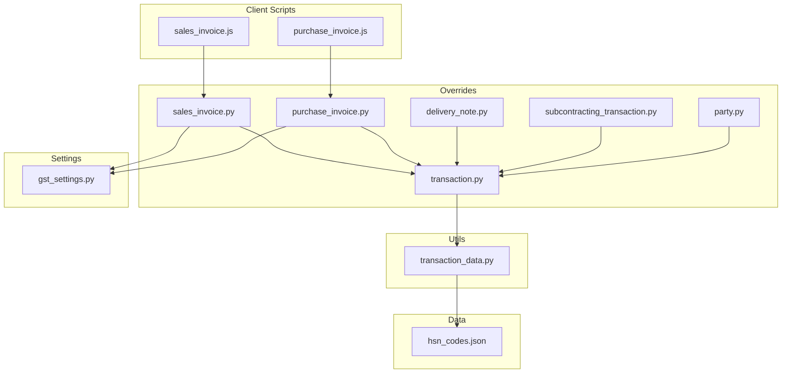
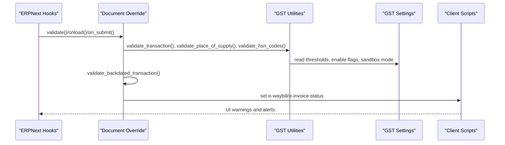
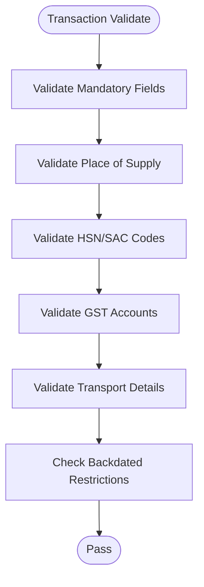
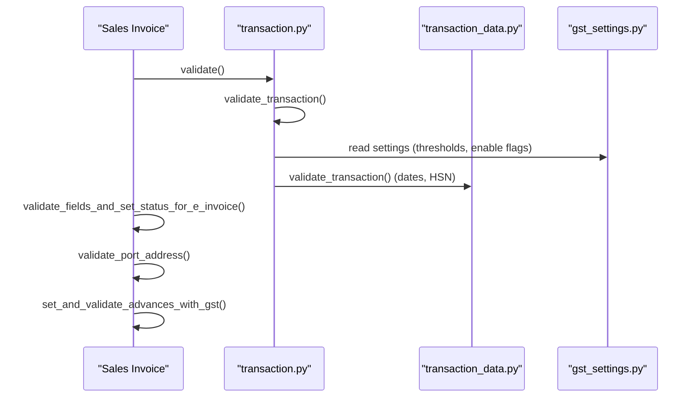
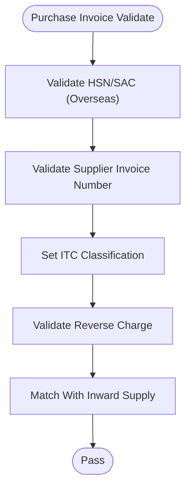
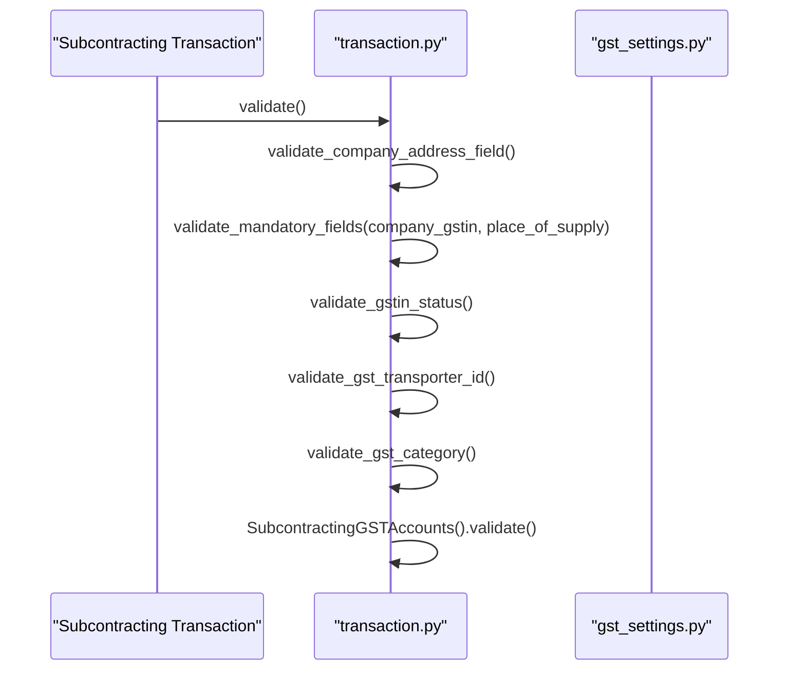
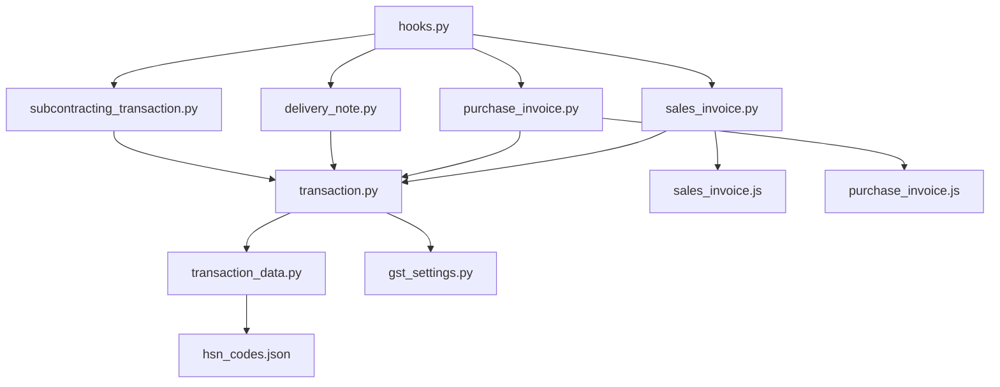

# Document Validation

<cite>
**Referenced Files in This Document**
- [transaction.py](file://india_compliance/gst_india/overrides/transaction.py)
- [sales_invoice.py](file://india_compliance/gst_india/overrides/sales_invoice.py)
- [purchase_invoice.py](file://india_compliance/gst_india/overrides/purchase_invoice.py)
- [delivery_note.py](file://india_compliance/gst_india/overrides/delivery_note.py)
- [subcontracting_transaction.py](file://india_compliance/gst_india/overrides/subcontracting_transaction.py)
- [party.py](file://india_compliance/gst_india/overrides/party.py)
- [transaction_data.py](file://india_compliance/gst_india/utils/transaction_data.py)
- [gst_settings.py](file://india_compliance/gst_india/doctype/gst_settings/gst_settings.py)
- [hsn_codes.json](file://india_compliance/gst_india/data/hsn_codes.json)
- [sales_invoice.js](file://india_compliance/gst_india/client_scripts/sales_invoice.js)
- [purchase_invoice.js](file://india_compliance/gst_india/client_scripts/purchase_invoice.js)
- [test_transaction.py](file://india_compliance/gst_india/overrides/test_transaction.py)
- [test_subcontracting_transaction.py](file://india_compliance/gst_india/overrides/test_subcontracting_transaction.py)
- [test_transaction_data.py](file://india_compliance/gst_india/overrides/test_transaction_data.py)
- [hooks.py](file://india_compliance/hooks.py)
</cite>

## Table of Contents
1. [Introduction](#introduction)
2. [Project Structure](#project-structure)
3. [Core Components](#core-components)
4. [Architecture Overview](#architecture-overview)
5. [Detailed Component Analysis](#detailed-component-analysis)
6. [Dependency Analysis](#dependency-analysis)
7. [Performance Considerations](#performance-considerations)
8. [Troubleshooting Guide](#troubleshooting-guide)
9. [Conclusion](#conclusion)
10. [Appendices](#appendices)

## Introduction
This document explains the Document Validation system for India Compliance with a focus on GST compliance enforcement and transaction validation rules. It covers:
- Party details validation
- Item classification validation
- Tax category assignments
- HSN/SAC code validation
- Validation workflow for mandatory fields, place of supply, GSTIN status verification, and transaction restrictions
- Validation rules for Sales Invoices, Purchase Invoices, Delivery Notes, and Subcontracting transactions
- Practical validation scenarios, common failures, resolutions, and integration with ERPNext’s standard validation system

## Project Structure
The validation system spans Python overrides, utilities, client-side scripts, and test suites:
- Overrides define per-document-type validation hooks and shared transaction utilities
- Utilities encapsulate GST-specific logic for HSN validation, transaction sanitization, and transport validations
- Client scripts enforce UI-level validations and warnings
- Tests validate end-to-end behavior and edge cases

**Diagram sources**
- [transaction.py](file://india_compliance/gst_india/overrides/transaction.py#L1-L800)
- [sales_invoice.py](file://india_compliance/gst_india/overrides/sales_invoice.py#L1-L383)
- [purchase_invoice.py](file://india_compliance/gst_india/overrides/purchase_invoice.py#L1-L268)
- [delivery_note.py](file://india_compliance/gst_india/overrides/delivery_note.py#L1-L49)
- [subcontracting_transaction.py](file://india_compliance/gst_india/overrides/subcontracting_transaction.py#L298-L343)
- [party.py](file://india_compliance/gst_india/overrides/party.py#L1-L172)
- [transaction_data.py](file://india_compliance/gst_india/utils/transaction_data.py#L1-L704)
- [gst_settings.py](file://india_compliance/gst_india/doctype/gst_settings/gst_settings.py#L192-L229)
- [hsn_codes.json](file://india_compliance/gst_india/data/hsn_codes.json#L1-L800)
- [sales_invoice.js](file://india_compliance/gst_india/client_scripts/sales_invoice.js#L1-L97)
- [purchase_invoice.js](file://india_compliance/gst_india/client_scripts/purchase_invoice.js#L1-L131)

**Section sources**
- [transaction.py](file://india_compliance/gst_india/overrides/transaction.py#L1-L800)
- [transaction_data.py](file://india_compliance/gst_india/utils/transaction_data.py#L1-L704)

## Core Components
- Transaction-level validators: mandatory fields, place of supply, HSN/SAC validation, GST account validation, and backdated transaction restrictions
- Document-type-specific validators: Sales Invoice, Purchase Invoice, Delivery Note, Subcontracting transactions
- Party and GSTIN utilities: category assignment, PAN validation, GSTIN status checks
- Client-side helpers: e-waybill/e-invoice status, transport validations, and warnings
- Settings-driven enforcement: e-invoice applicability dates, thresholds, and sandbox mode

Key responsibilities:
- Enforce GST compliance during save/submit/cancel lifecycle
- Validate item classification and tax templates
- Ensure HSN/SAC presence and correctness
- Restrict transactions based on GST settings and filing status

**Section sources**
- [transaction.py](file://india_compliance/gst_india/overrides/transaction.py#L188-L747)
- [sales_invoice.py](file://india_compliance/gst_india/overrides/sales_invoice.py#L70-L131)
- [purchase_invoice.py](file://india_compliance/gst_india/overrides/purchase_invoice.py#L43-L129)
- [party.py](file://india_compliance/gst_india/overrides/party.py#L17-L80)
- [transaction_data.py](file://india_compliance/gst_india/utils/transaction_data.py#L280-L316)

## Architecture Overview
The validation pipeline integrates ERPNext hooks with India Compliance logic:

**Diagram sources**
- [hooks.py](file://india_compliance/hooks.py#L264-L277)
- [transaction.py](file://india_compliance/gst_india/overrides/transaction.py#L662-L670)
- [sales_invoice.py](file://india_compliance/gst_india/overrides/sales_invoice.py#L70-L83)
- [purchase_invoice.py](file://india_compliance/gst_india/overrides/purchase_invoice.py#L43-L58)
- [transaction_data.py](file://india_compliance/gst_india/utils/transaction_data.py#L280-L316)

## Detailed Component Analysis

### Transaction-Level Validation (Shared)
- Mandatory fields: centralized validator ensures required fields are present before proceeding
- Place of supply: validates against allowed options and special rules for overseas
- HSN/SAC validation: enforces presence and length rules; supports both draft and submitted states
- GST account validation: validates account types, charge types, and consistency with item tax templates
- Backdated transaction restriction: prevents changes after GSTR-1 filing cutoff
- Transport validations: validates mode of transport and vehicle details for e-waybill

**Diagram sources**
- [transaction.py](file://india_compliance/gst_india/overrides/transaction.py#L188-L747)
- [transaction_data.py](file://india_compliance/gst_india/utils/transaction_data.py#L192-L231)

**Section sources**
- [transaction.py](file://india_compliance/gst_india/overrides/transaction.py#L188-L747)
- [transaction_data.py](file://india_compliance/gst_india/utils/transaction_data.py#L280-L316)

### Sales Invoice Validation
- Validates invoice number and credit/debit note constraints
- Enforces e-invoice applicability and HSN/SAC requirements for e-invoice generation
- Validates port address for exports and manages e-waybill/e-invoice statuses
- Manages reverse adjustments and advance allocations with GST

**Diagram sources**
- [sales_invoice.py](file://india_compliance/gst_india/overrides/sales_invoice.py#L70-L83)
- [transaction_data.py](file://india_compliance/gst_india/utils/transaction_data.py#L280-L316)
- [gst_settings.py](file://india_compliance/gst_india/doctype/gst_settings/gst_settings.py#L192-L229)

**Section sources**
- [sales_invoice.py](file://india_compliance/gst_india/overrides/sales_invoice.py#L70-L131)
- [sales_invoice.js](file://india_compliance/gst_india/client_scripts/sales_invoice.js#L1-L97)

### Purchase Invoice Validation
- Validates HSN/SAC for overseas purchases
- Enforces supplier invoice number requirement based on settings
- Computes ITC classification and eligibility reasons
- Validates reverse charge applicability and reconciles with inward supplies

**Diagram sources**
- [purchase_invoice.py](file://india_compliance/gst_india/overrides/purchase_invoice.py#L43-L129)
- [purchase_invoice.js](file://india_compliance/gst_india/client_scripts/purchase_invoice.js#L120-L130)

**Section sources**
- [purchase_invoice.py](file://india_compliance/gst_india/overrides/purchase_invoice.py#L43-L129)
- [purchase_invoice.js](file://india_compliance/gst_india/client_scripts/purchase_invoice.js#L105-L130)

### Delivery Note Validation
- Inherits Sales Invoice transport and port validations
- Validates port address for overseas deliveries and sets e-waybill status

**Section sources**
- [delivery_note.py](file://india_compliance/gst_india/overrides/delivery_note.py#L38-L43)

### Subcontracting Transactions Validation
- Enforces mandatory company address and place of supply
- Ensures GST category is set (defaults to Unregistered if missing)
- Validates GSTIN status, transporter ID, and GST category
- Applies subcontracting-specific GST account validation

**Diagram sources**
- [subcontracting_transaction.py](file://india_compliance/gst_india/overrides/subcontracting_transaction.py#L298-L343)
- [transaction.py](file://india_compliance/gst_india/overrides/transaction.py#L325-L329)

**Section sources**
- [subcontracting_transaction.py](file://india_compliance/gst_india/overrides/subcontracting_transaction.py#L298-L343)
- [test_subcontracting_transaction.py](file://india_compliance/gst_india/overrides/test_subcontracting_transaction.py#L276-L389)

### Party and GSTIN Utilities
- Validates and normalizes GSTIN and PAN
- Assigns GST category based on GSTIN, country, and settings
- Updates related documents when GSTIN changes

**Section sources**
- [party.py](file://india_compliance/gst_india/overrides/party.py#L17-L80)

### HSN/SAC Validation and Data
- Centralized HSN validation supports multiple lengths and enforces presence/length rules
- Uses HSN master data for reference and validation
- Enforces uniqueness of HSN/UOM when grouping items

**Section sources**
- [transaction.py](file://india_compliance/gst_india/overrides/transaction.py#L672-L747)
- [transaction_data.py](file://india_compliance/gst_india/utils/transaction_data.py#L656-L687)
- [hsn_codes.json](file://india_compliance/gst_india/data/hsn_codes.json#L1-L800)

## Dependency Analysis
- Document-type overrides depend on shared transaction utilities
- Utilities depend on GST settings and HSN master data
- Client scripts depend on document overrides for status updates
- Hooks register override methods for Sales Invoice, Purchase Invoice, Delivery Note, and Subcontracting transactions

**Diagram sources**
- [hooks.py](file://india_compliance/hooks.py#L264-L277)
- [sales_invoice.py](file://india_compliance/gst_india/overrides/sales_invoice.py#L1-L383)
- [purchase_invoice.py](file://india_compliance/gst_india/overrides/purchase_invoice.py#L1-L268)
- [delivery_note.py](file://india_compliance/gst_india/overrides/delivery_note.py#L1-L49)
- [subcontracting_transaction.py](file://india_compliance/gst_india/overrides/subcontracting_transaction.py#L298-L343)
- [transaction.py](file://india_compliance/gst_india/overrides/transaction.py#L1-L800)
- [transaction_data.py](file://india_compliance/gst_india/utils/transaction_data.py#L1-L704)
- [gst_settings.py](file://india_compliance/gst_india/doctype/gst_settings/gst_settings.py#L192-L229)
- [hsn_codes.json](file://india_compliance/gst_india/data/hsn_codes.json#L1-L800)
- [sales_invoice.js](file://india_compliance/gst_india/client_scripts/sales_invoice.js#L1-L97)
- [purchase_invoice.js](file://india_compliance/gst_india/client_scripts/purchase_invoice.js#L1-L131)

**Section sources**
- [hooks.py](file://india_compliance/hooks.py#L264-L277)

## Performance Considerations
- Centralized HSN validation avoids repeated database queries by leveraging cached settings and preloaded HSN lists
- Transport validations short-circuit early when required fields are missing
- GST account validation batches checks to minimize redundant computations
- Client-side validations reduce server load by catching issues early

## Troubleshooting Guide
Common validation failures and resolutions:
- Missing mandatory fields: ensure company GSTIN, place of supply, and party GSTIN are set; validation throws clear messages
- Invalid HSN/SAC: provide valid HSN/SAC with correct length; errors specify required lengths and affected rows
- Place of supply mismatch: verify against allowed options; special handling for overseas exports
- GSTIN status issues: ensure GSTIN is active and registration date precedes transaction date
- Backdated transaction restriction: avoid changes after GSTR-1 filing cutoff; submit/restrictions are enforced by settings
- Transport details: set mode of transport and vehicle/LR details as required for e-waybill generation
- Overseas purchase invoice: HSN/SAC is mandatory; ensure all items have valid codes
- Subcontracting transactions: company address and GST category must be set; defaults to Unregistered if missing

Resolution steps:
- Review error messages and correct affected rows
- Verify GST settings (thresholds, enable flags, sandbox mode)
- Confirm HSN master data and item classification
- Check party details and GSTIN status
- Ensure transport details meet e-waybill requirements

**Section sources**
- [transaction.py](file://india_compliance/gst_india/overrides/transaction.py#L188-L747)
- [purchase_invoice.py](file://india_compliance/gst_india/overrides/purchase_invoice.py#L257-L267)
- [subcontracting_transaction.py](file://india_compliance/gst_india/overrides/subcontracting_transaction.py#L298-L343)
- [test_transaction.py](file://india_compliance/gst_india/overrides/test_transaction.py#L108-L200)
- [test_transaction_data.py](file://india_compliance/gst_india/overrides/test_transaction_data.py#L85-L124)

## Conclusion
The Document Validation system enforces comprehensive GST compliance across Sales Invoices, Purchase Invoices, Delivery Notes, and Subcontracting transactions. It leverages shared utilities, strict HSN/SAC enforcement, robust party and GSTIN validations, and settings-driven restrictions to ensure regulatory adherence while integrating seamlessly with ERPNext’s standard validation lifecycle.

## Appendices

### Validation Scenarios and Examples
- Sales Invoice with e-invoice threshold met: HSN/SAC mandatory; transport details validated; e-waybill/e-invoice status set
- Purchase Invoice for overseas: HSN/SAC mandatory; ITC classification computed; reverse charge validation
- Delivery Note for export: port address validation; e-waybill status managed
- Subcontracting transaction: company address and place of supply mandatory; GST category defaulted; GSTIN status verified

**Section sources**
- [sales_invoice.py](file://india_compliance/gst_india/overrides/sales_invoice.py#L70-L131)
- [purchase_invoice.py](file://india_compliance/gst_india/overrides/purchase_invoice.py#L43-L129)
- [delivery_note.py](file://india_compliance/gst_india/overrides/delivery_note.py#L38-L43)
- [subcontracting_transaction.py](file://india_compliance/gst_india/overrides/subcontracting_transaction.py#L298-L343)