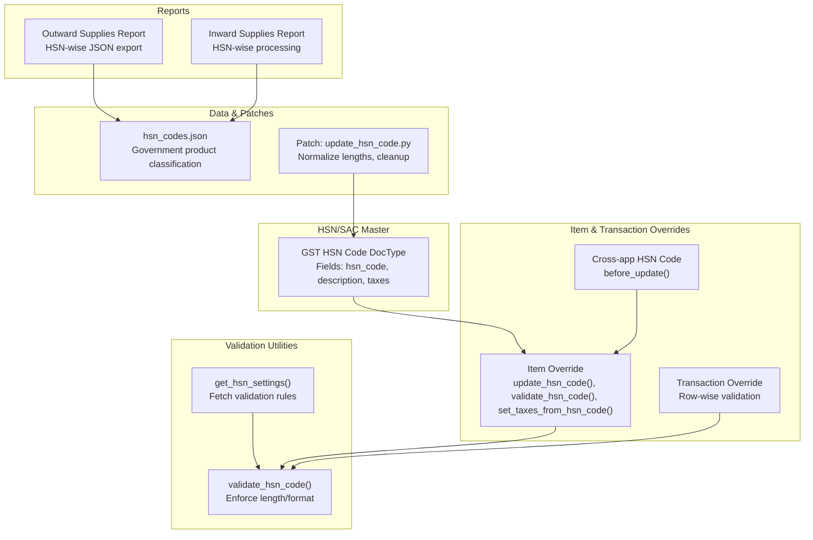
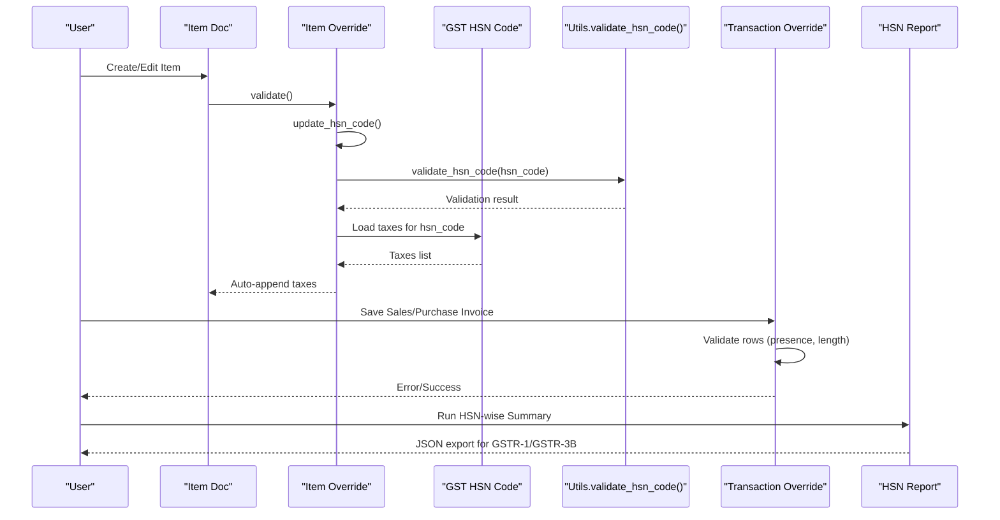
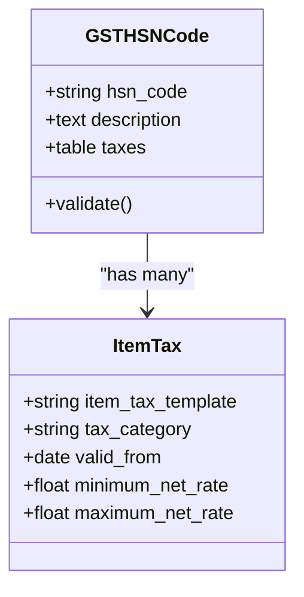
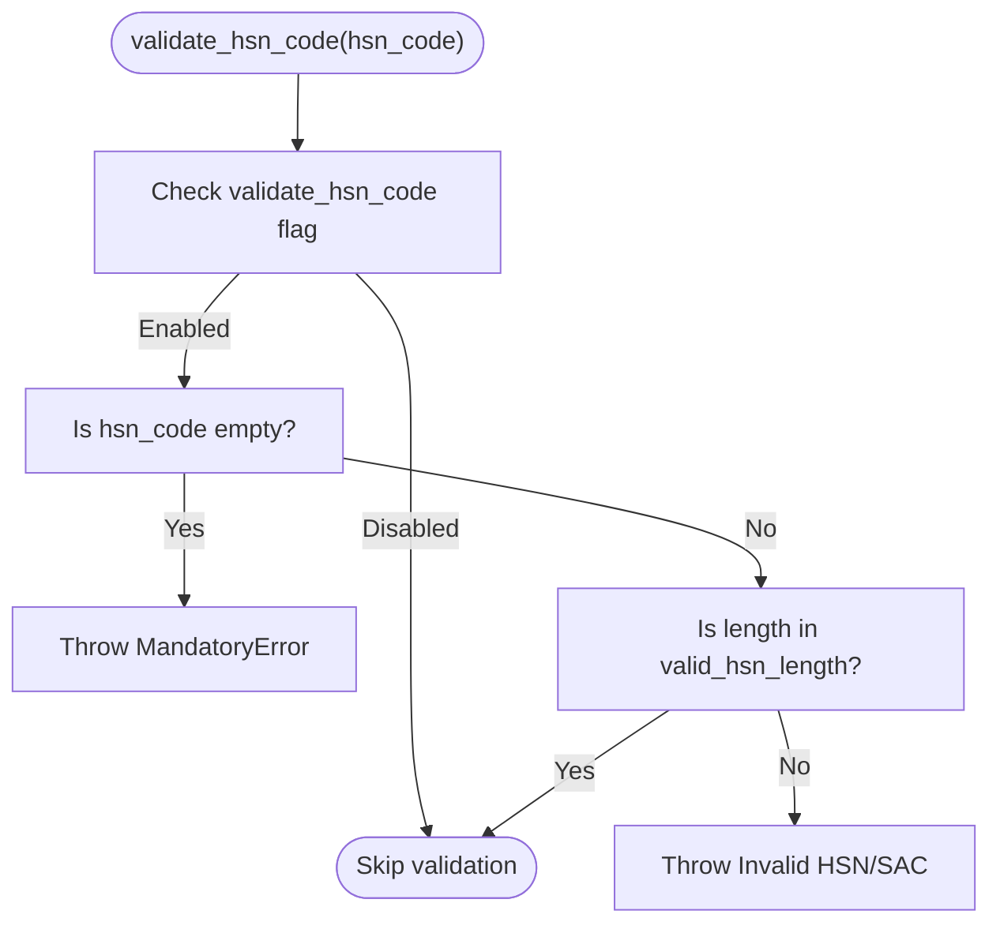
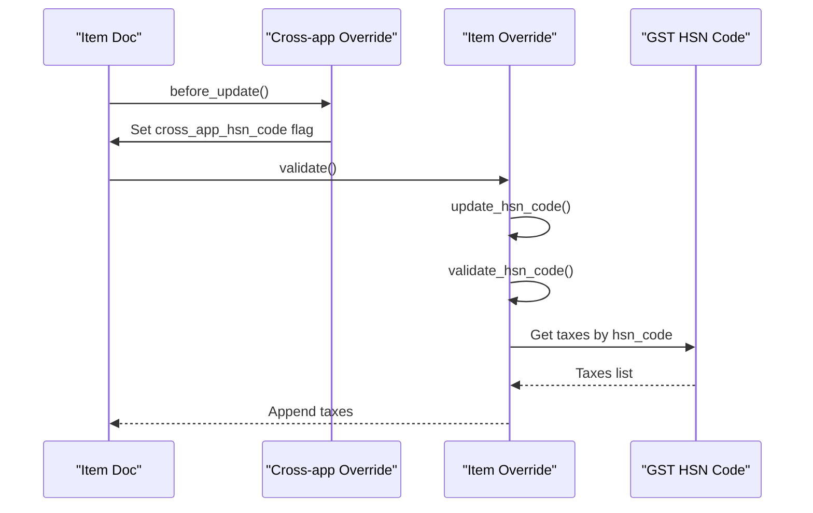
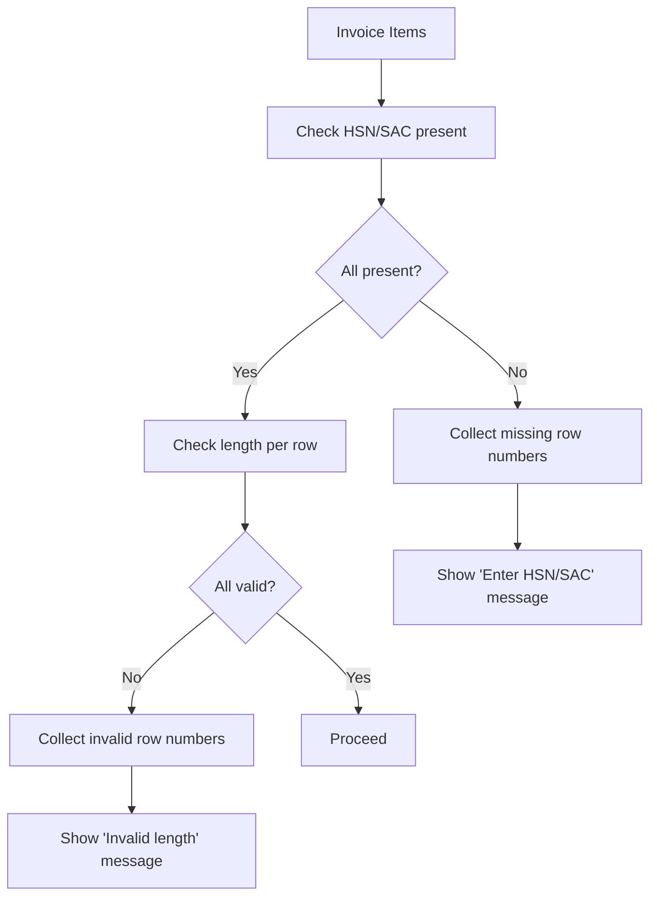
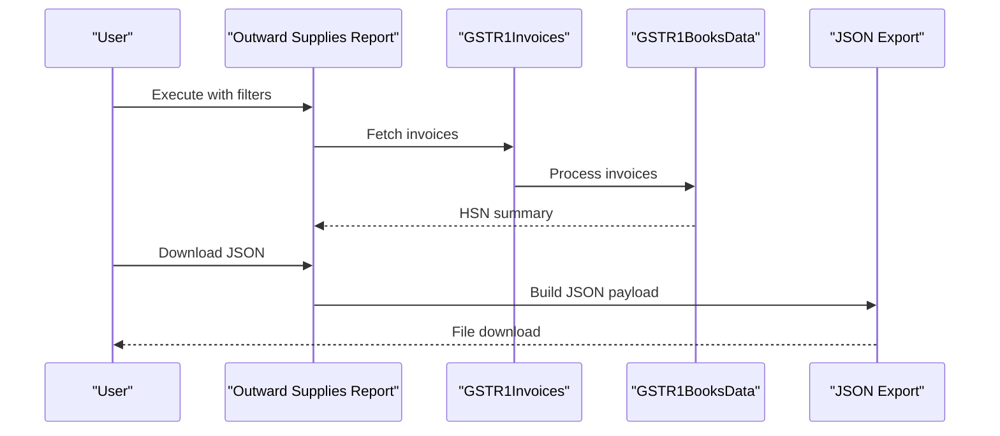
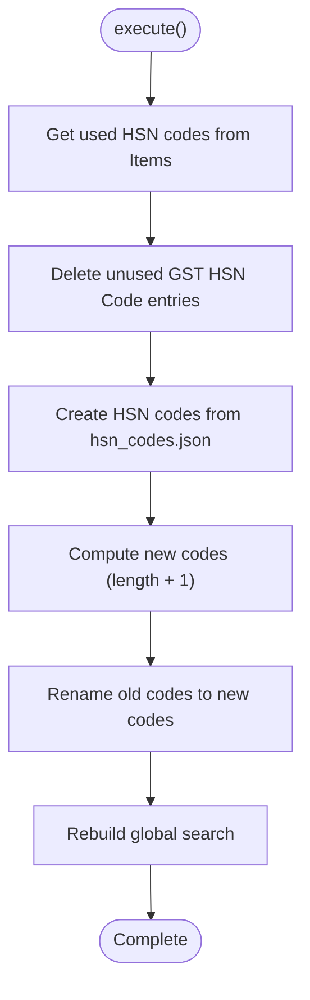
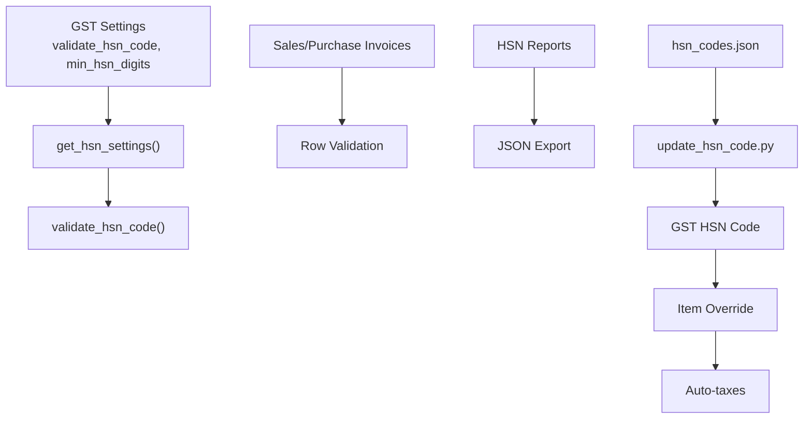

# HSN/SAC Code Validation

<cite>
**Referenced Files in This Document**
- [gst_hsn_code.py](file://india_compliance/gst_india/doctype/gst_hsn_code/gst_hsn_code.py)
- [gst_hsn_code.js](file://india_compliance/gst_india/doctype/gst_hsn_code/gst_hsn_code.js)
- [gst_hsn_code.json](file://india_compliance/gst_india/doctype/gst_hsn_code/gst_hsn_code.json)
- [__init__.py](file://india_compliance/gst_india/utils/__init__.py)
- [constants/__init__.py](file://india_compliance/gst_india/constants/__init__.py)
- [item.py](file://india_compliance/gst_india/overrides/item.py)
- [cross_app_hsn_code.py](file://india_compliance/gst_india/overrides/cross_app_hsn_code.py)
- [update_hsn_code.py](file://india_compliance/patches/post_install/update_hsn_code.py)
- [hsn_wise_summary_of_outward_supplies.py](file://india_compliance/gst_india/report/hsn_wise_summary_of_outward_supplies/hsn_wise_summary_of_outward_supplies.py)
- [hsn_wise_summary_of_inward_supplies.py](file://india_compliance/gst_india/report/hsn_wise_summary_of_inward_supplies/hsn_wise_summary_of_inward_supplies.py)
- [hsn_codes.json](file://india_compliance/gst_india/data/hsn_codes.json)
- [transaction.py](file://india_compliance/gst_india/overrides/transaction.py)
</cite>

## Table of Contents
1. [Introduction](#introduction)
2. [Project Structure](#project-structure)
3. [Core Components](#core-components)
4. [Architecture Overview](#architecture-overview)
5. [Detailed Component Analysis](#detailed-component-analysis)
6. [Dependency Analysis](#dependency-analysis)
7. [Performance Considerations](#performance-considerations)
8. [Troubleshooting Guide](#troubleshooting-guide)
9. [Conclusion](#conclusion)
10. [Appendices](#appendices)

## Introduction
This document explains the HSN/SAC Code Validation system implemented in the India Compliance module. It covers product classification validation, code length requirements, and industry-specific categorization aligned with Indian GST standards. The system validates HSN codes (6–8 digits) and SAC codes (6 digits), integrates with government product classification datasets, and enforces validation during item creation, transactions, and reporting workflows. It also documents the validation workflow across product categories, code lookup mechanisms, and compliance reporting requirements.

## Project Structure
The HSN/SAC validation spans several modules:
- Data model for HSN/SAC master entries
- Utility functions for validation and settings
- Item and transaction overrides for enforcement
- Reports for compliance and JSON export
- Patch scripts for data migration and normalization
- Government product classification dataset

**Diagram sources**
- [gst_hsn_code.json](file://india_compliance/gst_india/doctype/gst_hsn_code/gst_hsn_code.json#L1-L85)
- [__init__.py](file://india_compliance/gst_india/utils/__init__.py#L386-L400)
- [item.py](file://india_compliance/gst_india/overrides/item.py#L1-L50)
- [cross_app_hsn_code.py](file://india_compliance/gst_india/overrides/cross_app_hsn_code.py#L1-L7)
- [transaction.py](file://india_compliance/gst_india/overrides/transaction.py#L708-L751)
- [hsn_wise_summary_of_outward_supplies.py](file://india_compliance/gst_india/report/hsn_wise_summary_of_outward_supplies/hsn_wise_summary_of_outward_supplies.py#L1-L272)
- [hsn_wise_summary_of_inward_supplies.py](file://india_compliance/gst_india/report/hsn_wise_summary_of_inward_supplies/hsn_wise_summary_of_inward_supplies.py#L1-L29)
- [update_hsn_code.py](file://india_compliance/patches/post_install/update_hsn_code.py#L1-L84)
- [hsn_codes.json](file://india_compliance/gst_india/data/hsn_codes.json#L1-L800)

**Section sources**
- [gst_hsn_code.json](file://india_compliance/gst_india/doctype/gst_hsn_code/gst_hsn_code.json#L1-L85)
- [__init__.py](file://india_compliance/gst_india/utils/__init__.py#L386-L400)
- [item.py](file://india_compliance/gst_india/overrides/item.py#L1-L50)
- [cross_app_hsn_code.py](file://india_compliance/gst_india/overrides/cross_app_hsn_code.py#L1-L7)
- [transaction.py](file://india_compliance/gst_india/overrides/transaction.py#L708-L751)
- [hsn_wise_summary_of_outward_supplies.py](file://india_compliance/gst_india/report/hsn_wise_summary_of_outward_supplies/hsn_wise_summary_of_outward_supplies.py#L1-L272)
- [hsn_wise_summary_of_inward_supplies.py](file://india_compliance/gst_india/report/hsn_wise_summary_of_inward_supplies/hsn_wise_summary_of_inward_supplies.py#L1-L29)
- [update_hsn_code.py](file://india_compliance/patches/post_install/update_hsn_code.py#L1-L84)
- [hsn_codes.json](file://india_compliance/gst_india/data/hsn_codes.json#L1-L800)

## Core Components
- HSN/SAC Master DocType: Stores HSN/SAC codes, descriptions, and applicable taxes.
- Validation Utilities: Fetches validation rules from GST Settings and enforces code length/format.
- Item Override: Updates HSN code from cross-application context, validates, and auto-applies taxes.
- Transaction Override: Validates HSN/SAC presence and length per row during invoice creation/editing.
- Reports: Generate HSN-wise summaries and export JSON for compliance filings.
- Patches: Normalize HSN code lengths and clean up obsolete entries.
- Government Classification Dataset: JSON-backed product classification aligned with AATO/Government standards.

**Section sources**
- [gst_hsn_code.py](file://india_compliance/gst_india/doctype/gst_hsn_code/gst_hsn_code.py#L1-L135)
- [gst_hsn_code.js](file://india_compliance/gst_india/doctype/gst_hsn_code/gst_hsn_code.js#L1-L29)
- [__init__.py](file://india_compliance/gst_india/utils/__init__.py#L386-L400)
- [item.py](file://india_compliance/gst_india/overrides/item.py#L1-L50)
- [transaction.py](file://india_compliance/gst_india/overrides/transaction.py#L708-L751)
- [hsn_wise_summary_of_outward_supplies.py](file://india_compliance/gst_india/report/hsn_wise_summary_of_outward_supplies/hsn_wise_summary_of_outward_supplies.py#L1-L272)
- [update_hsn_code.py](file://india_compliance/patches/post_install/update_hsn_code.py#L1-L84)
- [hsn_codes.json](file://india_compliance/gst_india/data/hsn_codes.json#L1-L800)

## Architecture Overview
The HSN/SAC validation architecture ensures:
- Centralized validation rules via GST Settings
- Enforcement at item creation and transaction level
- Automatic tax application from HSN master
- Reporting and JSON export for compliance
- Data normalization and cleanup via patch scripts

**Diagram sources**
- [item.py](file://india_compliance/gst_india/overrides/item.py#L1-L50)
- [gst_hsn_code.py](file://india_compliance/gst_india/doctype/gst_hsn_code/gst_hsn_code.py#L115-L135)
- [transaction.py](file://india_compliance/gst_india/overrides/transaction.py#L708-L751)
- [hsn_wise_summary_of_outward_supplies.py](file://india_compliance/gst_india/report/hsn_wise_summary_of_outward_supplies/hsn_wise_summary_of_outward_supplies.py#L165-L255)

## Detailed Component Analysis

### HSN/SAC Master DocType
- Fields:
  - hsn_code: Unique, required, serves as DocType autoname
  - description: Product description
  - taxes: Table of applicable taxes linked to the HSN/SAC
- Purpose: Central registry for HSN/SAC codes and associated tax templates.

**Diagram sources**
- [gst_hsn_code.json](file://india_compliance/gst_india/doctype/gst_hsn_code/gst_hsn_code.json#L13-L33)
- [gst_hsn_code.py](file://india_compliance/gst_india/doctype/gst_hsn_code/gst_hsn_code.py#L15-L44)

**Section sources**
- [gst_hsn_code.json](file://india_compliance/gst_india/doctype/gst_hsn_code/gst_hsn_code.json#L13-L33)
- [gst_hsn_code.py](file://india_compliance/gst_india/doctype/gst_hsn_code/gst_hsn_code.py#L15-L44)

### Validation Utilities and Settings
- get_hsn_settings(): Reads validation toggle and minimum length from GST Settings and computes valid lengths based on VALID_HSN_LENGTHS.
- validate_hsn_code(): Enforces presence and length checks; throws errors for invalid lengths.

**Diagram sources**
- [__init__.py](file://india_compliance/gst_india/utils/__init__.py#L386-L400)
- [gst_hsn_code.py](file://india_compliance/gst_india/doctype/gst_hsn_code/gst_hsn_code.py#L115-L135)

**Section sources**
- [__init__.py](file://india_compliance/gst_india/utils/__init__.py#L386-L400)
- [gst_hsn_code.py](file://india_compliance/gst_india/doctype/gst_hsn_code/gst_hsn_code.py#L115-L135)

### Item Override Workflow
- update_hsn_code(): Allows cross-application HSN code propagation via flags.
- validate_hsn_code(): Validates HSN/SAC for sales items only.
- set_taxes_from_hsn_code(): Auto-populates taxes from the HSN master.

**Diagram sources**
- [cross_app_hsn_code.py](file://india_compliance/gst_india/overrides/cross_app_hsn_code.py#L1-L7)
- [item.py](file://india_compliance/gst_india/overrides/item.py#L1-L50)
- [gst_hsn_code.py](file://india_compliance/gst_india/doctype/gst_hsn_code/gst_hsn_code.py#L37-L49)

**Section sources**
- [cross_app_hsn_code.py](file://india_compliance/gst_india/overrides/cross_app_hsn_code.py#L1-L7)
- [item.py](file://india_compliance/gst_india/overrides/item.py#L1-L50)

### Transaction Override Workflow
- Row-level validation ensures:
  - HSN/SAC is present for each row
  - HSN/SAC length matches valid_hsn_length
- Throws user-friendly messages with row numbers for correction.

**Diagram sources**
- [transaction.py](file://india_compliance/gst_india/overrides/transaction.py#L708-L751)

**Section sources**
- [transaction.py](file://india_compliance/gst_india/overrides/transaction.py#L708-L751)

### Reports and Compliance Export
- Outward Supplies Report:
  - Generates HSN-wise summary with tax breakdown
  - Exports JSON for GSTR-1 with mandatory HSN/SAC presence validation
- Inward Supplies Report:
  - Processes purchase invoices and bills of entry

**Diagram sources**
- [hsn_wise_summary_of_outward_supplies.py](file://india_compliance/gst_india/report/hsn_wise_summary_of_outward_supplies/hsn_wise_summary_of_outward_supplies.py#L125-L187)

**Section sources**
- [hsn_wise_summary_of_outward_supplies.py](file://india_compliance/gst_india/report/hsn_wise_summary_of_outward_supplies/hsn_wise_summary_of_outward_supplies.py#L125-L187)
- [hsn_wise_summary_of_inward_supplies.py](file://india_compliance/gst_india/report/hsn_wise_summary_of_inward_supplies/hsn_wise_summary_of_inward_supplies.py#L1-L29)

### Data Migration and Normalization
- Patch script:
  - Removes unused HSN/SAC entries
  - Creates standardized HSN/SAC records from government dataset
  - Renames codes to correct lengths and merges duplicates

**Diagram sources**
- [update_hsn_code.py](file://india_compliance/patches/post_install/update_hsn_code.py#L9-L52)

**Section sources**
- [update_hsn_code.py](file://india_compliance/patches/post_install/update_hsn_code.py#L1-L84)
- [hsn_codes.json](file://india_compliance/gst_india/data/hsn_codes.json#L1-L800)

## Dependency Analysis
- Validation depends on:
  - GST Settings for validation toggle and minimum length
  - VALID_HSN_LENGTHS constant for allowed lengths
  - HSN master DocType for tax template mapping
- Overrides depend on:
  - Item and transaction DocTypes
  - Cross-application HSN code propagation
- Reports depend on:
  - GSTR-1/GSTR-3B data processors
  - Government product classification dataset

**Diagram sources**
- [__init__.py](file://india_compliance/gst_india/utils/__init__.py#L386-L400)
- [constants/__init__.py](file://india_compliance/gst_india/constants/__init__.py#L1-L800)
- [item.py](file://india_compliance/gst_india/overrides/item.py#L1-L50)
- [transaction.py](file://india_compliance/gst_india/overrides/transaction.py#L708-L751)
- [hsn_wise_summary_of_outward_supplies.py](file://india_compliance/gst_india/report/hsn_wise_summary_of_outward_supplies/hsn_wise_summary_of_outward_supplies.py#L165-L255)
- [update_hsn_code.py](file://india_compliance/patches/post_install/update_hsn_code.py#L1-L84)
- [hsn_codes.json](file://india_compliance/gst_india/data/hsn_codes.json#L1-L800)

**Section sources**
- [__init__.py](file://india_compliance/gst_india/utils/__init__.py#L386-L400)
- [constants/__init__.py](file://india_compliance/gst_india/constants/__init__.py#L1-L800)
- [item.py](file://india_compliance/gst_india/overrides/item.py#L1-L50)
- [transaction.py](file://india_compliance/gst_india/overrides/transaction.py#L708-L751)
- [hsn_wise_summary_of_outward_supplies.py](file://india_compliance/gst_india/report/hsn_wise_summary_of_outward_supplies/hsn_wise_summary_of_outward_supplies.py#L165-L255)
- [update_hsn_code.py](file://india_compliance/patches/post_install/update_hsn_code.py#L1-L84)
- [hsn_codes.json](file://india_compliance/gst_india/data/hsn_codes.json#L1-L800)

## Performance Considerations
- Bulk insertions for taxes reduce database round trips.
- Caching of HSN settings avoids repeated DB reads.
- Global search rebuild is deferred to minimize downtime after normalization.
- Report generation aggregates data efficiently using GSTR-1/GSTR-3B processors.

[No sources needed since this section provides general guidance]

## Troubleshooting Guide
Common validation failures and resolutions:
- Missing HSN/SAC:
  - Symptom: Error indicating HSN/SAC is required for rows.
  - Resolution: Enter a valid HSN/SAC for all rows.
- Incorrect length:
  - Symptom: Error stating HSN/SAC must be X digits long.
  - Resolution: Ensure HSN/SAC matches allowed lengths (e.g., 6–8 digits for HSN; 6 digits for SAC).
- Non-existent HSN/SAC:
  - Symptom: Taxes not applied or mismatched tax templates.
  - Resolution: Create or update the HSN/SAC record and re-run tax application.
- Cross-application propagation:
  - Symptom: HSN/SAC not carried forward.
  - Resolution: Ensure cross-app override sets the flag prior to save.

Operational tips:
- Use the “Update Taxes for Items” action on the HSN/SAC master to apply updated tax templates to all items.
- Validate transactions before filing GSTR-1 to avoid JSON export errors due to invalid HSN/SAC.

**Section sources**
- [gst_hsn_code.js](file://india_compliance/gst_india/doctype/gst_hsn_code/gst_hsn_code.js#L7-L26)
- [transaction.py](file://india_compliance/gst_india/overrides/transaction.py#L708-L751)
- [hsn_wise_summary_of_outward_supplies.py](file://india_compliance/gst_india/report/hsn_wise_summary_of_outward_supplies/hsn_wise_summary_of_outward_supplies.py#L211-L216)

## Conclusion
The HSN/SAC Code Validation system enforces accurate product classification across items and transactions, aligns with government product classification standards, and supports compliance reporting. By centralizing validation rules, automating tax application, and providing robust reporting and export capabilities, the system ensures adherence to GST regulations and minimizes filing errors.

[No sources needed since this section summarizes without analyzing specific files]

## Appendices

### Validation Rules Summary
- HSN codes: 6–8 digits
- SAC codes: 6 digits
- Validation toggle and minimum length controlled via GST Settings
- Allowed lengths derived from VALID_HSN_LENGTHS constant

**Section sources**
- [__init__.py](file://india_compliance/gst_india/utils/__init__.py#L386-L400)
- [constants/__init__.py](file://india_compliance/gst_india/constants/__init__.py#L1-L800)

### Practical Validation Scenarios
- Sales Invoice row with missing HSN/SAC:
  - Trigger: Row validation during save
  - Outcome: Prompt to enter HSN/SAC
- Sales Invoice row with invalid length:
  - Trigger: Length mismatch against valid_hsn_length
  - Outcome: Prompt to correct HSN/SAC length
- Item creation with cross-application HSN/SAC:
  - Trigger: before_update sets cross_app_hsn_code
  - Outcome: HSN/SAC propagated and validated; taxes auto-applied

**Section sources**
- [transaction.py](file://india_compliance/gst_india/overrides/transaction.py#L708-L751)
- [cross_app_hsn_code.py](file://india_compliance/gst_india/overrides/cross_app_hsn_code.py#L1-L7)
- [item.py](file://india_compliance/gst_india/overrides/item.py#L1-L50)

### Compliance Reporting Requirements
- HSN-wise outward supplies report:
  - Mandatory HSN/SAC presence for JSON export
  - Supports bifurcation by B2B/B2C
- HSN-wise inward supplies report:
  - Processes purchase invoices and bills of entry

**Section sources**
- [hsn_wise_summary_of_outward_supplies.py](file://india_compliance/gst_india/report/hsn_wise_summary_of_outward_supplies/hsn_wise_summary_of_outward_supplies.py#L202-L255)
- [hsn_wise_summary_of_inward_supplies.py](file://india_compliance/gst_india/report/hsn_wise_summary_of_inward_supplies/hsn_wise_summary_of_inward_supplies.py#L1-L29)