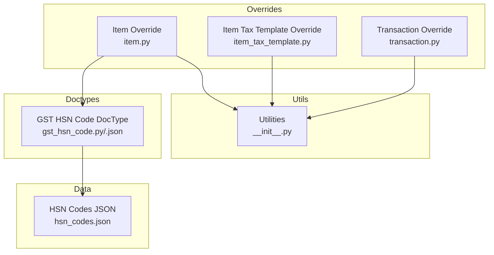
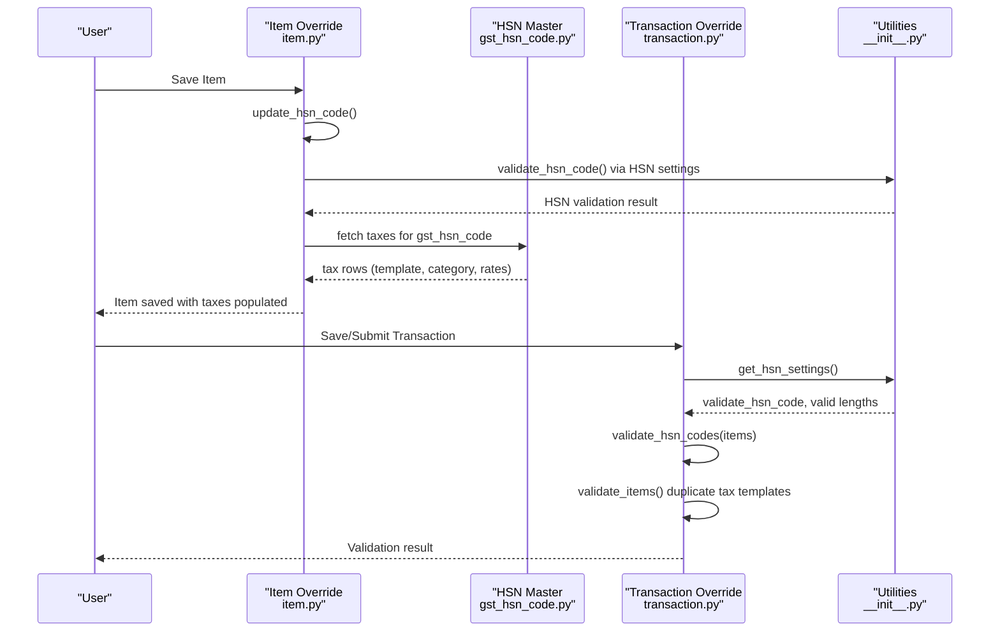
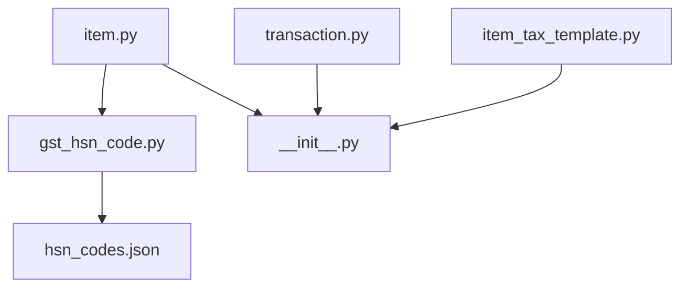

# Item Validation

<cite>
**Referenced Files in This Document**
- [item.py](file://india_compliance/gst_india/overrides/item.py)
- [item_tax_template.py](file://india_compliance/gst_india/overrides/item_tax_template.py)
- [transaction.py](file://india_compliance/gst_india/overrides/transaction.py)
- [gst_hsn_code.py](file://india_compliance/gst_india/doctype/gst_hsn_code/gst_hsn_code.py)
- [gst_hsn_code.json](file://india_compliance/gst_india/doctype/gst_hsn_code/gst_hsn_code.json)
- [hsn_codes.json](file://india_compliance/gst_india/data/hsn_codes.json)
- [__init__.py](file://india_compliance/gst_india/utils/__init__.py)
- [test_item_tax_template.py](file://india_compliance/gst_india/overrides/test_item_tax_template.py)
- [test_transaction.py](file://india_compliance/gst_india/overrides/test_transaction.py)
- [bill_of_entry.py](file://india_compliance/gst_india/doctype/bill_of_entry/bill_of_entry.py)
</cite>

## Table of Contents
1. [Introduction](#introduction)
2. [Project Structure](#project-structure)
3. [Core Components](#core-components)
4. [Architecture Overview](#architecture-overview)
5. [Detailed Component Analysis](#detailed-component-analysis)
6. [Dependency Analysis](#dependency-analysis)
7. [Performance Considerations](#performance-considerations)
8. [Troubleshooting Guide](#troubleshooting-guide)
9. [Conclusion](#conclusion)

## Introduction
This document explains the Item Validation system for India Compliance, focusing on:
- Item classification validation via HSN/SAC codes
- Tax template assignment and validation
- Item-wise tax detail validation and duplicate tax template detection
- Cross-application HSN code updates and integration with item master data
- Practical scenarios, common failures, and resolutions

The system ensures that items are correctly classified, taxed, and reported in compliance with Indian GST regulations.

## Project Structure
The Item Validation system spans several modules:
- Item override: orchestrates HSN code validation and tax template population from HSN
- Transaction override: validates HSN/SAC presence and lengths, enforces item-wise tax detail rules, and detects duplicate tax templates
- HSN master: defines HSN/SAC taxonomy and tax assignments
- Utilities: provide HSN settings, place-of-supply logic, and shared helpers
- Tests: validate behavior for tax templates and transaction-level validations

**Diagram sources**
- [item.py](file://india_compliance/gst_india/overrides/item.py#L1-L50)
- [item_tax_template.py](file://india_compliance/gst_india/overrides/item_tax_template.py#L1-L114)
- [transaction.py](file://india_compliance/gst_india/overrides/transaction.py#L672-L747)
- [gst_hsn_code.py](file://india_compliance/gst_india/doctype/gst_hsn_code/gst_hsn_code.py#L1-L135)
- [gst_hsn_code.json](file://india_compliance/gst_india/doctype/gst_hsn_code/gst_hsn_code.json#L1-L85)
- [hsn_codes.json](file://india_compliance/gst_india/data/hsn_codes.json#L1-L800)
- [__init__.py](file://india_compliance/gst_india/utils/__init__.py#L386-L399)

**Section sources**
- [item.py](file://india_compliance/gst_india/overrides/item.py#L1-L50)
- [item_tax_template.py](file://india_compliance/gst_india/overrides/item_tax_template.py#L1-L114)
- [transaction.py](file://india_compliance/gst_india/overrides/transaction.py#L672-L747)
- [gst_hsn_code.py](file://india_compliance/gst_india/doctype/gst_hsn_code/gst_hsn_code.py#L1-L135)
- [gst_hsn_code.json](file://india_compliance/gst_india/doctype/gst_hsn_code/gst_hsn_code.json#L1-L85)
- [hsn_codes.json](file://india_compliance/gst_india/data/hsn_codes.json#L1-L800)
- [__init__.py](file://india_compliance/gst_india/utils/__init__.py#L386-L399)

## Core Components
- Item Override
  - Validates HSN/SAC for sales items and auto-populates taxes from HSN master when missing
  - Supports cross-application HSN code updates for item creation workflows
- Transaction Override
  - Enforces HSN/SAC presence and length rules across items
  - Validates item-wise tax details and detects duplicate tax templates per item
- HSN Master
  - Stores HSN/SAC entries with tax assignments mapped to item tax templates
- Utilities
  - Provides HSN settings, place-of-supply computation, and shared helpers

Key responsibilities:
- Ensure HSN/SAC is present and matches configured lengths
- Populate item taxes from HSN when not provided
- Validate tax template consistency per item across rows
- Integrate with item master data and cross-application HSN updates

**Section sources**
- [item.py](file://india_compliance/gst_india/overrides/item.py#L8-L50)
- [transaction.py](file://india_compliance/gst_india/overrides/transaction.py#L672-L747)
- [gst_hsn_code.py](file://india_compliance/gst_india/doctype/gst_hsn_code/gst_hsn_code.py#L115-L135)
- [__init__.py](file://india_compliance/gst_india/utils/__init__.py#L386-L399)

## Architecture Overview
The Item Validation system integrates at two levels:
- Item-level: HSN/SAC validation and tax template population
- Transaction-level: item-wise tax detail validation and duplicate tax template detection

**Diagram sources**
- [item.py](file://india_compliance/gst_india/overrides/item.py#L8-L50)
- [gst_hsn_code.py](file://india_compliance/gst_india/doctype/gst_hsn_code/gst_hsn_code.py#L33-L49)
- [transaction.py](file://india_compliance/gst_india/overrides/transaction.py#L672-L747)
- [__init__.py](file://india_compliance/gst_india/utils/__init__.py#L386-L399)

## Detailed Component Analysis

### Item Classification Validation (HSN/SAC)
- Purpose: Ensure items have a valid HSN/SAC code when required and match configured lengths
- Behavior:
  - For sales items, HSN/SAC is validated against GST Settings
  - If validation is disabled, HSN length rules are bypassed
  - On submission, missing or invalid HSN/SAC triggers errors; otherwise warnings with row numbers
- Integration:
  - Uses HSN settings from GST Settings (validation toggle and minimum digits)
  - Applies to item rows during transaction save/submit

Common failure modes:
- Missing HSN/SAC for sales items
- HSN/SAC length not matching configured lengths
Resolution:
- Enter a valid HSN/SAC per settings
- Ensure the code length meets minimum and allowed lengths

**Section sources**
- [transaction.py](file://india_compliance/gst_india/overrides/transaction.py#L672-L747)
- [__init__.py](file://india_compliance/gst_india/utils/__init__.py#L386-L399)

### Tax Template Assignment from HSN
- Purpose: Auto-populate item taxes when not provided by fetching from HSN master
- Behavior:
  - If item already has taxes or no HSN is set, skip
  - Otherwise, load HSN doc and append tax rows (template, category, validity dates, net rate bands)
- Cross-application support:
  - Allows setting HSN via a cross-app flag and updates item gst_hsn_code accordingly

Practical example:
- An item without explicit taxes gets tax rows populated from its HSN master entry

**Section sources**
- [item.py](file://india_compliance/gst_india/overrides/item.py#L33-L49)
- [gst_hsn_code.py](file://india_compliance/gst_india/doctype/gst_hsn_code/gst_hsn_code.py#L46-L69)

### Item-wise Tax Details Validation
- Purpose: Ensure computed tax amounts align with declared rates and item values
- Behavior:
  - Compares item tax amounts against calculated values derived from tax rates and taxable values
  - Flags mismatches per item row with allowable rounding tolerance
- Error handling:
  - Throws descriptive messages listing affected rows

**Section sources**
- [transaction.py](file://india_compliance/gst_india/overrides/transaction.py#L1338-L1370)

### Duplicate Tax Template Detection
- Purpose: Prevent inconsistent tax templates for the same item across rows
- Behavior:
  - Tracks item keys (item_code or item_name) and their associated item_tax_template
  - Flags duplicates across rows for the same item key
- Resolution:
  - Use a single item tax template per item across rows

**Section sources**
- [transaction.py](file://india_compliance/gst_india/overrides/transaction.py#L549-L579)

### Item Tax Template Validation (Rate and Accounts)
- Purpose: Validate GST rate range and alignment with selected GST accounts
- Behavior:
  - GST rate must be between 0 and 100
  - For taxable treatment, GST rate cannot be zero
  - Validates account tax rates vs. declared GST rate for intra-state and inter-state accounts
- Integration:
  - Uses valid GST accounts derived from company settings

Common failure modes:
- GST rate out of range
- Zero GST rate for taxable treatment
- Inconsistent account tax rates vs. declared GST rate
Resolutions:
- Adjust GST rate within bounds
- Set GST rate > 0 for taxable treatment
- Align account tax rates with declared GST rate

**Section sources**
- [item_tax_template.py](file://india_compliance/gst_india/overrides/item_tax_template.py#L9-L68)
- [test_item_tax_template.py](file://india_compliance/gst_india/overrides/test_item_tax_template.py#L26-L52)

### Cross-Reference Validation with Purchase Orders
- Purpose: Ensure item tax template consistency when linking to purchase orders
- Behavior:
  - Validates item tax template against item and item group taxes
  - Supports hierarchical item group tax inheritance
- Resolution:
  - Align item tax template with item and item group tax definitions

**Section sources**
- [bill_of_entry.py](file://india_compliance/gst_india/doctype/bill_of_entry/bill_of_entry.py#L268-L298)

### Integration with Item Master Data
- Purpose: Keep item master synchronized with HSN-based tax assignments
- Behavior:
  - Bulk updates item taxes from HSN master
  - Comments on items when tax changes are applied
- Permissions:
  - Requires write permission on Item

**Section sources**
- [gst_hsn_code.py](file://india_compliance/gst_india/doctype/gst_hsn_code/gst_hsn_code.py#L21-L44)
- [gst_hsn_code.json](file://india_compliance/gst_india/doctype/gst_hsn_code/gst_hsn_code.json#L1-L85)

## Dependency Analysis

**Diagram sources**
- [item.py](file://india_compliance/gst_india/overrides/item.py#L1-L50)
- [item_tax_template.py](file://india_compliance/gst_india/overrides/item_tax_template.py#L1-L114)
- [transaction.py](file://india_compliance/gst_india/overrides/transaction.py#L672-L747)
- [gst_hsn_code.py](file://india_compliance/gst_india/doctype/gst_hsn_code/gst_hsn_code.py#L1-L135)
- [hsn_codes.json](file://india_compliance/gst_india/data/hsn_codes.json#L1-L800)
- [__init__.py](file://india_compliance/gst_india/utils/__init__.py#L386-L399)

## Performance Considerations
- Bulk operations:
  - HSN-to-item tax bulk insert uses batched database writes to minimize overhead
- Validation scope:
  - HSN validation and tax template validation are scoped to relevant doctypes and items
- Rounding tolerance:
  - Item-wise tax detail validation allows small differences due to rounding

[No sources needed since this section provides general guidance]

## Troubleshooting Guide
Common validation failures and resolutions:
- Missing HSN/SAC for sales items
  - Symptom: Error on submit or warning with row numbers
  - Resolution: Add a valid HSN/SAC matching configured lengths
- Invalid HSN/SAC length
  - Symptom: Error indicating required length(s)
  - Resolution: Correct HSN/SAC to match allowed lengths
- Duplicate tax templates per item across rows
  - Symptom: Error listing items with inconsistent templates
  - Resolution: Use a single item tax template per item across rows
- Item-wise tax detail mismatch
  - Symptom: Error listing rows with tax amount mismatch
  - Resolution: Recalculate or adjust tax rates and taxable values
- Item tax template validation failures
  - Symptom: Errors for zero GST rate on taxable items or invalid account tax rates
  - Resolution: Set GST rate > 0 for taxable, align account tax rates with declared GST rate

**Section sources**
- [transaction.py](file://india_compliance/gst_india/overrides/transaction.py#L672-L747)
- [transaction.py](file://india_compliance/gst_india/overrides/transaction.py#L549-L579)
- [transaction.py](file://india_compliance/gst_india/overrides/transaction.py#L1338-L1370)
- [item_tax_template.py](file://india_compliance/gst_india/overrides/item_tax_template.py#L9-L68)
- [test_transaction.py](file://india_compliance/gst_india/overrides/test_transaction.py#L155-L200)
- [test_item_tax_template.py](file://india_compliance/gst_india/overrides/test_item_tax_template.py#L26-L52)

## Conclusion
The Item Validation system ensures accurate item classification and taxation by:
- Enforcing HSN/SAC presence and length rules
- Auto-populating taxes from HSN master when missing
- Validating item-wise tax details and detecting duplicate tax templates
- Integrating with item master data and supporting cross-application HSN updates

These controls collectively reduce reporting discrepancies and maintain compliance with Indian GST requirements.