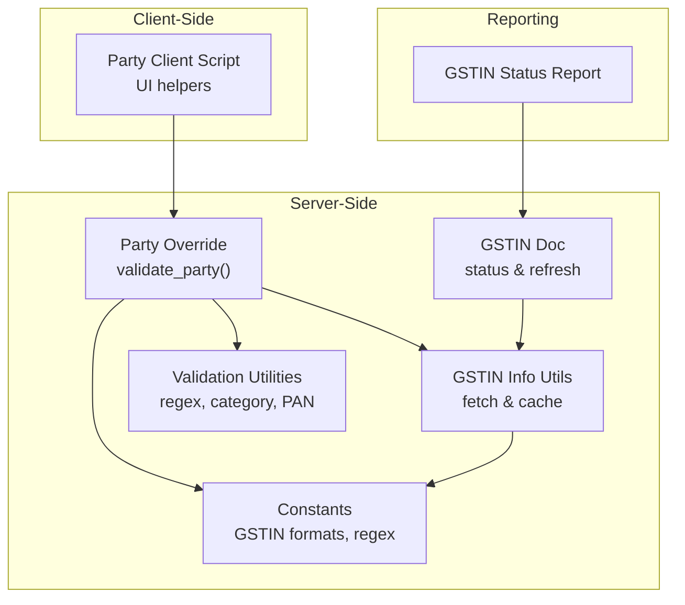
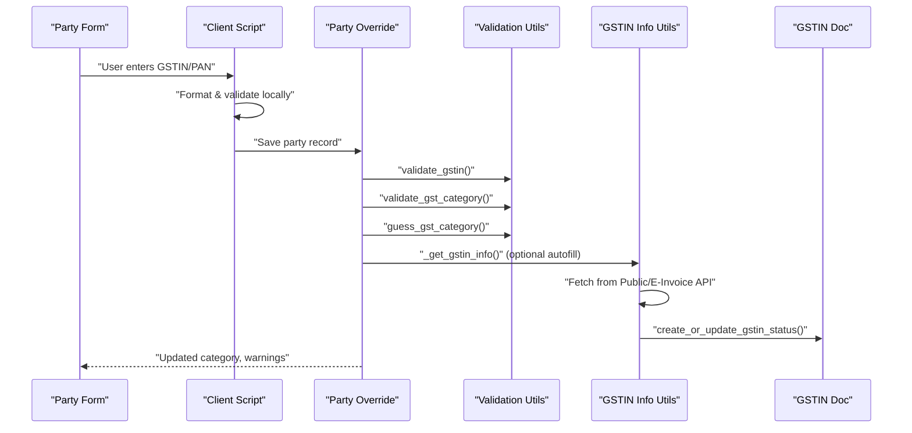
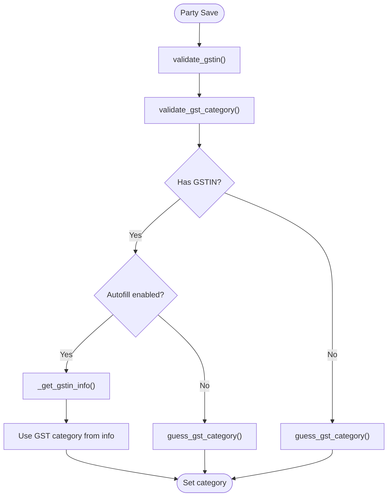
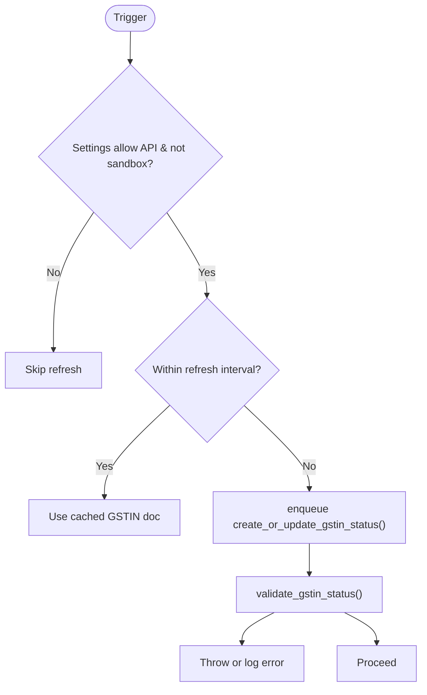
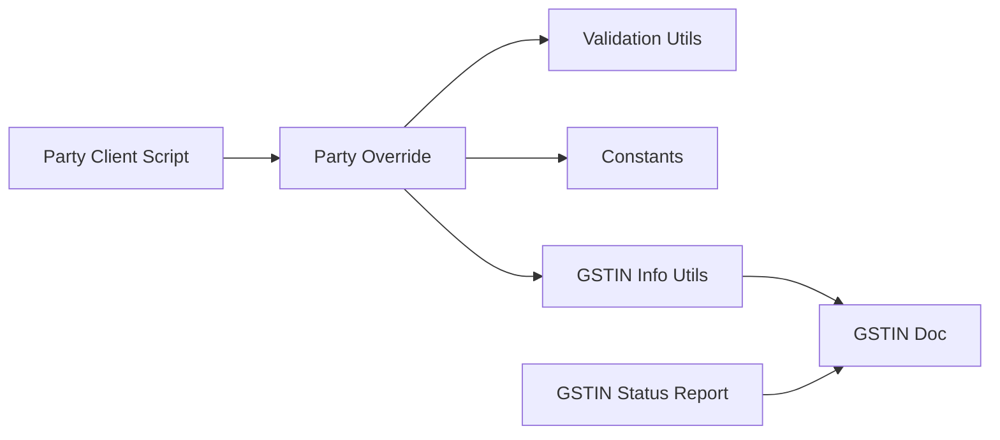

# Party Validation

<cite>
**Referenced Files in This Document**
- [party.py](file://india_compliance/gst_india/overrides/party.py)
- [gstin.py](file://india_compliance/gst_india/doctype/gstin/gstin.py)
- [gstin_status.py](file://india_compliance/gst_india/report/gstin_status/gstin_status.py)
- [gstin_info.py](file://india_compliance/gst_india/utils/gstin_info.py)
- [utils/__init__.py](file://india_compliance/gst_india/utils/__init__.py)
- [constants/__init__.py](file://india_compliance/gst_india/constants/__init__.py)
- [party.js](file://india_compliance/gst_india/client_scripts/party.js)
- [test_party.py](file://india_compliance/gst_india/overrides/test_party.py)
- [test_gstin.py](file://india_compliance/gst_india/doctype/gstin/test_gstin.py)
- [subcontracting_transaction.py](file://india_compliance/gst_india/overrides/subcontracting_transaction.py)
</cite>

## Table of Contents
1. [Introduction](#introduction)
2. [Project Structure](#project-structure)
3. [Core Components](#core-components)
4. [Architecture Overview](#architecture-overview)
5. [Detailed Component Analysis](#detailed-component-analysis)
6. [Dependency Analysis](#dependency-analysis)
7. [Performance Considerations](#performance-considerations)
8. [Troubleshooting Guide](#troubleshooting-guide)
9. [Conclusion](#conclusion)

## Introduction
This document explains the Party Validation system for ensuring GSTIN validity, party details verification, and compliance checks across suppliers, customers, subcontractors, and other party types. It covers:
- GSTIN formatting and check-digit validation
- Active/inactive/cancelled status verification against transaction dates
- GST category enforcement aligned with party type and GSTIN patterns
- Overseas and SEZ validations
- Integration with GST portal verification systems
- Practical scenarios, common failures, and resolutions

## Project Structure
The Party Validation system spans server-side validation logic, client-side UX helpers, and reporting for GSTIN status visibility.

**Diagram sources**
- [party.py](file://india_compliance/gst_india/overrides/party.py#L17-L23)
- [gstin.py](file://india_compliance/gst_india/doctype/gstin/gstin.py#L57-L96)
- [gstin_info.py](file://india_compliance/gst_india/utils/gstin_info.py#L44-L103)
- [utils/__init__.py](file://india_compliance/gst_india/utils/__init__.py#L163-L242)
- [constants/__init__.py](file://india_compliance/gst_india/constants/__init__.py#L1410-L1442)
- [party.js](file://india_compliance/gst_india/client_scripts/party.js#L48-L82)
- [gstin_status.py](file://india_compliance/gst_india/report/gstin_status/gstin_status.py#L24-L210)

**Section sources**
- [party.py](file://india_compliance/gst_india/overrides/party.py#L17-L23)
- [gstin.py](file://india_compliance/gst_india/doctype/gstin/gstin.py#L57-L96)
- [gstin_info.py](file://india_compliance/gst_india/utils/gstin_info.py#L44-L103)
- [utils/__init__.py](file://india_compliance/gst_india/utils/__init__.py#L163-L242)
- [constants/__init__.py](file://india_compliance/gst_india/constants/__init__.py#L1410-L1442)
- [party.js](file://india_compliance/gst_india/client_scripts/party.js#L48-L82)
- [gstin_status.py](file://india_compliance/gst_india/report/gstin_status/gstin_status.py#L24-L210)

## Core Components
- Party override validates and enriches party records on save, enforcing GSTIN format, PAN, and GST category.
- GSTIN document manages cached status and triggers asynchronous updates via APIs.
- GSTIN info utilities fetch and normalize party info from GST portals, caching responses and handling server errors.
- Validation utilities enforce regex-based GSTIN formats, PAN validation, and GST category rules.
- Constants define regex patterns for GSTIN categories and validation rules.
- Client script enhances UX by validating inputs, auto-setting PAN from GSTIN, and guiding category inference.
- GSTIN Status report surfaces consolidated status for parties.

**Section sources**
- [party.py](file://india_compliance/gst_india/overrides/party.py#L17-L23)
- [gstin.py](file://india_compliance/gst_india/doctype/gstin/gstin.py#L57-L96)
- [gstin_info.py](file://india_compliance/gst_india/utils/gstin_info.py#L44-L103)
- [utils/__init__.py](file://india_compliance/gst_india/utils/__init__.py#L163-L242)
- [constants/__init__.py](file://india_compliance/gst_india/constants/__init__.py#L1410-L1442)
- [party.js](file://india_compliance/gst_india/client_scripts/party.js#L48-L82)
- [gstin_status.py](file://india_compliance/gst_india/report/gstin_status/gstin_status.py#L24-L210)

## Architecture Overview
End-to-end validation flow for party creation/edit:

**Diagram sources**
- [party.py](file://india_compliance/gst_india/overrides/party.py#L17-L58)
- [utils/__init__.py](file://india_compliance/gst_india/utils/__init__.py#L163-L242)
- [gstin_info.py](file://india_compliance/gst_india/utils/gstin_info.py#L44-L103)
- [gstin.py](file://india_compliance/gst_india/doctype/gstin/gstin.py#L57-L96)
- [party.js](file://india_compliance/gst_india/client_scripts/party.js#L48-L82)

## Detailed Component Analysis

### Party Override: validate_party and related helpers
Responsibilities:
- Validate and normalize GSTIN
- Infer and set GST category based on GSTIN, country, and configured rules
- Validate PAN and auto-fill from GSTIN when applicable
- Detect and propose updates to documents previously linked to an old GSTIN

Key behaviors:
- Enforces 15-character GSTIN length and check-digit (with special handling for transporters)
- Enforces GST category vs. GSTIN format alignment
- Auto-fills GST category from GSTIN info when enabled and available
- Warns and updates related docs when GSTIN changes

**Diagram sources**
- [party.py](file://india_compliance/gst_india/overrides/party.py#L17-L58)
- [gstin_info.py](file://india_compliance/gst_india/utils/gstin_info.py#L56-L103)
- [utils/__init__.py](file://india_compliance/gst_india/utils/__init__.py#L298-L336)

**Section sources**
- [party.py](file://india_compliance/gst_india/overrides/party.py#L17-L172)
- [test_party.py](file://india_compliance/gst_india/overrides/test_party.py#L5-L34)

### GSTIN Document: Status caching and refresh
Responsibilities:
- Persist GSTIN status, registration/cancellation dates, and block status
- Refresh status via queued jobs when required
- Validate status against transaction date and settings

Key behaviors:
- Queues background refresh if status is stale or out-of-date relative to transaction date
- Validates registration date vs. document date and cancellation status
- Supports transport ID validation via separate API

**Diagram sources**
- [gstin.py](file://india_compliance/gst_india/doctype/gstin/gstin.py#L101-L166)
- [gstin.py](file://india_compliance/gst_india/doctype/gstin/gstin.py#L168-L243)
- [gstin.py](file://india_compliance/gst_india/doctype/gstin/gstin.py#L248-L312)

**Section sources**
- [gstin.py](file://india_compliance/gst_india/doctype/gstin/gstin.py#L25-L96)
- [gstin.py](file://india_compliance/gst_india/doctype/gstin/gstin.py#L101-L243)
- [gstin.py](file://india_compliance/gst_india/doctype/gstin/gstin.py#L248-L322)
- [test_gstin.py](file://india_compliance/gst_india/doctype/gstin/test_gstin.py#L27-L49)

### GSTIN Info Utilities: Portal integration and caching
Responsibilities:
- Fetch GSTIN info from Public API or E-Invoice API depending on credentials
- Cache responses and handle transient server errors
- Normalize address and categorization for downstream use

Key behaviors:
- Attempts cached archived response first
- Falls back to live API calls and enqueues status sync
- Handles server errors gracefully and logs them

**Section sources**
- [gstin_info.py](file://india_compliance/gst_india/utils/gstin_info.py#L44-L103)
- [gstin_info.py](file://india_compliance/gst_india/utils/gstin_info.py#L195-L242)
- [gstin_info.py](file://india_compliance/gst_india/utils/gstin_info.py#L262-L299)

### Validation Utilities: Regex, PAN, and category enforcement
Responsibilities:
- Validate GSTIN length, check-digit, and category-matching patterns
- Validate PAN format
- Guess GST category from GSTIN and country

Key behaviors:
- Enforces category vs. GSTIN format using compiled regex patterns
- Auto-extracts PAN from GSTIN when present
- Provides category inference rules for unregistered/overseas scenarios

**Section sources**
- [utils/__init__.py](file://india_compliance/gst_india/utils/__init__.py#L163-L242)
- [utils/__init__.py](file://india_compliance/gst_india/utils/__init__.py#L298-L336)
- [utils/__init__.py](file://india_compliance/gst_india/utils/__init__.py#L416-L473)
- [constants/__init__.py](file://india_compliance/gst_india/constants/__init__.py#L1410-L1442)

### Client Script: UX enhancements for party forms
Responsibilities:
- Local validation of GSTIN/PAN length and format
- Auto-fill PAN from GSTIN
- Set GST category based on GSTIN and country
- Prompt to update other documents using previous GSTIN

**Section sources**
- [party.js](file://india_compliance/gst_india/client_scripts/party.js#L48-L82)
- [party.js](file://india_compliance/gst_india/client_scripts/party.js#L153-L162)
- [party.js](file://india_compliance/gst_india/client_scripts/party.js#L3-L46)

### GSTIN Status Report: Visibility and bulk actions
Responsibilities:
- Aggregate GSTIN status across Customers and Suppliers
- Show registration date, cancellation date, and block status
- Provide action buttons to refresh status

**Section sources**
- [gstin_status.py](file://india_compliance/gst_india/report/gstin_status/gstin_status.py#L24-L210)

## Dependency Analysis
- Party override depends on validation utilities and GSTIN info utilities for enrichment.
- GSTIN document orchestrates API calls and caches responses.
- Client script interacts with server-side helpers to provide immediate feedback.
- Report queries both party tables and GSTIN doc for consolidated status.

**Diagram sources**
- [party.py](file://india_compliance/gst_india/overrides/party.py#L7-L14)
- [gstin_info.py](file://india_compliance/gst_india/utils/gstin_info.py#L44-L103)
- [gstin.py](file://india_compliance/gst_india/doctype/gstin/gstin.py#L57-L96)
- [party.js](file://india_compliance/gst_india/client_scripts/party.js#L48-L82)
- [gstin_status.py](file://india_compliance/gst_india/report/gstin_status/gstin_status.py#L116-L146)

**Section sources**
- [party.py](file://india_compliance/gst_india/overrides/party.py#L7-L14)
- [gstin_info.py](file://india_compliance/gst_india/utils/gstin_info.py#L44-L103)
- [gstin.py](file://india_compliance/gst_india/doctype/gstin/gstin.py#L57-L96)
- [party.js](file://india_compliance/gst_india/client_scripts/party.js#L48-L82)
- [gstin_status.py](file://india_compliance/gst_india/report/gstin_status/gstin_status.py#L116-L146)

## Performance Considerations
- Background refresh: GSTIN status updates are enqueued to avoid blocking user actions.
- Caching: Archived responses and request cache reduce repeated API calls.
- Conditional validation: Status refresh is skipped when settings disable API or when outside the refresh window.
- Client-side validation reduces unnecessary server calls for basic formatting.

[No sources needed since this section provides general guidance]

## Troubleshooting Guide
Common validation failures and resolutions:
- Invalid GSTIN format
  - Cause: Wrong length or invalid check-digit.
  - Resolution: Correct to 15 characters and valid check-digit; ensure uppercase and no spaces.
  - References: [validate_gstin](file://india_compliance/gst_india/utils/__init__.py#L163-L199), [validate_gstin_check_digit](file://india_compliance/gst_india/utils/__init__.py#L342-L362)

- Mismatched GST category and GSTIN
  - Cause: Category does not match expected pattern for the GSTIN.
  - Resolution: Align category with GSTIN format (e.g., Registered Regular, Overseas, UIN Holders).
  - References: [validate_gst_category](file://india_compliance/gst_india/utils/__init__.py#L201-L239), [GSTIN_FORMATS](file://india_compliance/gst_india/constants/__init__.py#L1429-L1439)

- Party with GSTIN cannot be Unregistered
  - Cause: Attempting Unregistered for a GSTIN holder.
  - Resolution: Set appropriate category (e.g., Registered Regular).
  - References: [validate_gst_category](file://india_compliance/gst_india/utils/__init__.py#L223-L229)

- Registration date after transaction date
  - Cause: Transaction dated before GSTIN registration.
  - Resolution: Adjust transaction date or ensure GSTIN is registered prior.
  - References: [validate_gstin_status](file://india_compliance/gst_india/doctype/gstin/gstin.py#L168-L215)

- Cancelled GSTIN used on or after cancellation date
  - Cause: Using a cancelled GSTIN beyond allowed period.
  - Resolution: Use a valid, active GSTIN or adjust transaction date.
  - References: [validate_gstin_status](file://india_compliance/gst_india/doctype/gstin/gstin.py#L199-L207)

- Overseas/SEZ transactions disabled
  - Cause: GST Settings restrict SEZ/Overseas.
  - Resolution: Enable the setting or adjust party category.
  - References: [party.js warning](file://india_compliance/gst_india/client_scripts/party.js#L101-L118)

- Transporter ID validation
  - Cause: Transporter ID not Active.
  - Resolution: Use an Active GSTIN or valid Transport ID; check status via API.
  - References: [validate_gst_transporter_id](file://india_compliance/gst_india/doctype/gstin/gstin.py#L248-L312)

- PAN format invalid
  - Cause: Incorrect PAN pattern.
  - Resolution: Enter a valid 10-character alphanumeric PAN.
  - References: [is_valid_pan](file://india_compliance/gst_india/utils/__init__.py#L241-L242), [validate_pan](file://india_compliance/gst_india/overrides/party.py#L61-L79)

- Party-specific restrictions in subcontracting
  - Cause: Missing mandatory fields or invalid GSTIN status.
  - Resolution: Ensure company address, place_of_supply, and GST category are set; validate GSTIN status.
  - References: [subcontracting validation](file://india_compliance/gst_india/overrides/subcontracting_transaction.py#L298-L343)

## Conclusion
The Party Validation system ensures accurate, compliant party data by combining client-side UX improvements, robust server-side validation, and integration with GST portal APIs. It supports suppliers, customers, subcontractors, and overseas/SEZ scenarios with clear enforcement of GSTIN formatting, category alignment, and status checks tied to transaction dates. Use the troubleshooting guide to resolve common issues and rely on the GSTIN Status Report for visibility and remediation.