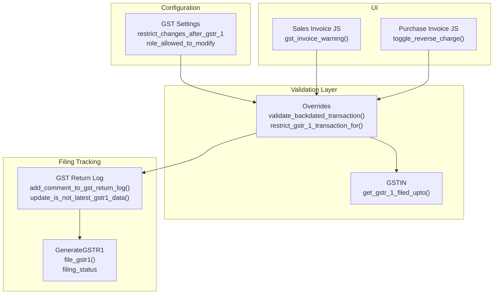
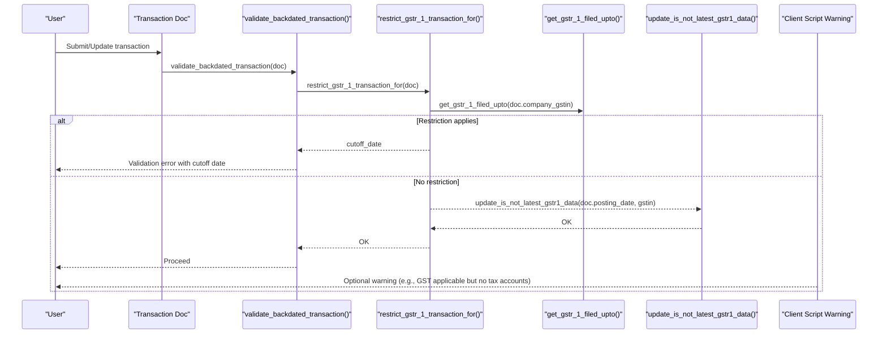
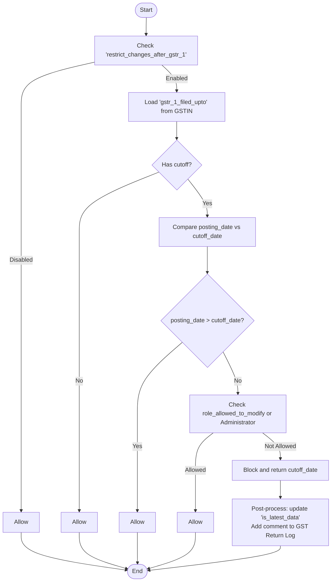
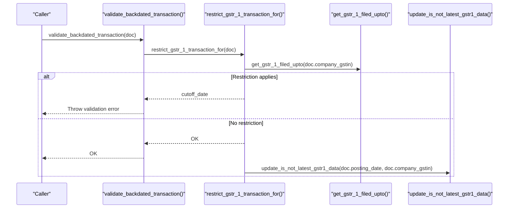
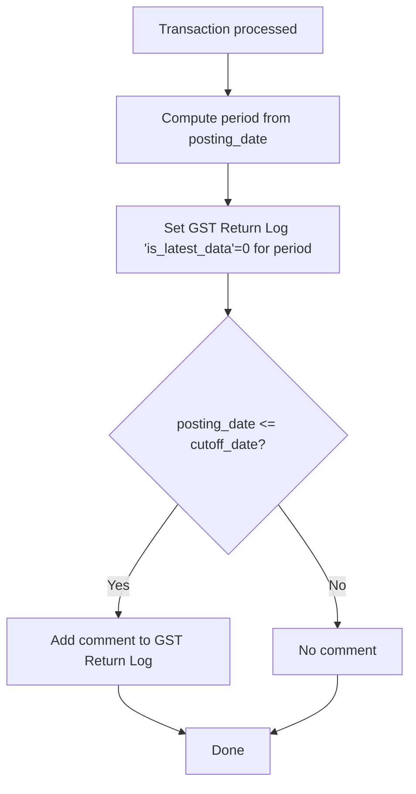
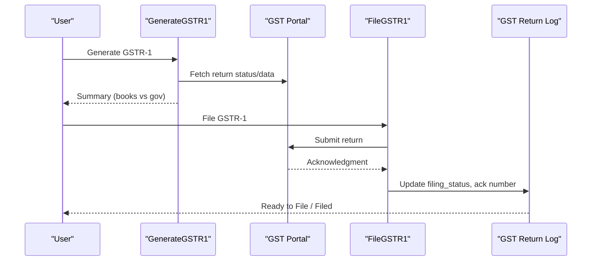
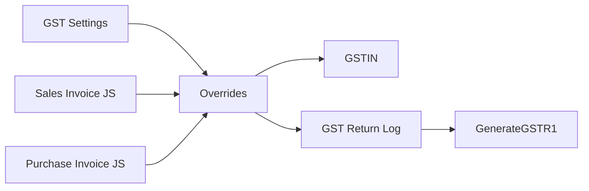

# Transaction Restrictions

<cite>
**Referenced Files in This Document**
- [gst_settings.py](file://india_compliance/gst_india/doctype/gst_settings/gst_settings.py)
- [transaction.py](file://india_compliance/gst_india/overrides/transaction.py)
- [gst_return_log.py](file://india_compliance/gst_india/doctype/gst_return_log/gst_return_log.py)
- [generate_gstr_1.py](file://india_compliance/gst_india/doctype/gst_return_log/generate_gstr_1.py)
- [gstin.py](file://india_compliance/gst_india/doctype/gstin/gstin.py)
- [gstr_1_data.py](file://india_compliance/gst_india/utils/gstr_1/gstr_1_data.py)
- [gst_settings.json](file://india_compliance/gst_india/doctype/gst_settings/gst_settings.json)
- [sales_invoice.js](file://india_compliance/gst_india/client_scripts/sales_invoice.js)
- [purchase_invoice.js](file://india_compliance/gst_india/client_scripts/purchase_invoice.js)
</cite>

## Table of Contents
1. [Introduction](#introduction)
2. [Project Structure](#project-structure)
3. [Core Components](#core-components)
4. [Architecture Overview](#architecture-overview)
5. [Detailed Component Analysis](#detailed-component-analysis)
6. [Dependency Analysis](#dependency-analysis)
7. [Performance Considerations](#performance-considerations)
8. [Troubleshooting Guide](#troubleshooting-guide)
9. [Conclusion](#conclusion)

## Introduction
This document explains the Transaction Restrictions system that enforces compliance limitations, filing restrictions, and transaction validation rules for GST in India. It focuses on:
- Preventing unauthorized transactions after GSTR-1 filing cutoff dates
- Backdated transaction validation
- Compliance period enforcement via GST return logs
- Validation workflow for transaction timing, filing status checks, and compliance requirements
- Practical scenarios, common violations, and resolution procedures
- Restriction bypass mechanisms and integration with GST return filing systems

## Project Structure
The Transaction Restrictions system spans several modules:
- GST Settings: configuration toggles and roles allowed to override restrictions
- Overrides: transaction-level validators and restriction enforcement
- GST Return Log: filing status tracking and comments
- GSTR-1 Utilities: data mapping and reconciliation
- GSTIN: filing cutoff date storage and retrieval
- Client Scripts: UI warnings and contextual hints

**Diagram sources**
- [gst_settings.py](file://india_compliance/gst_india/doctype/gst_settings/gst_settings.py#L558-L595)
- [transaction.py](file://india_compliance/gst_india/overrides/transaction.py#L662-L670)
- [gstin.py](file://india_compliance/gst_india/doctype/gstin/gstin.py#L50-L55)
- [gst_return_log.py](file://india_compliance/gst_india/doctype/gst_return_log/gst_return_log.py#L287-L312)
- [generate_gstr_1.py](file://india_compliance/gst_india/doctype/gst_return_log/generate_gstr_1.py#L1025-L1045)
- [sales_invoice.js](file://india_compliance/gst_india/client_scripts/sales_invoice.js#L59-L72)
- [purchase_invoice.js](file://india_compliance/gst_india/client_scripts/purchase_invoice.js#L105-L118)

**Section sources**
- [gst_settings.py](file://india_compliance/gst_india/doctype/gst_settings/gst_settings.py#L558-L595)
- [transaction.py](file://india_compliance/gst_india/overrides/transaction.py#L662-L670)
- [gstin.py](file://india_compliance/gst_india/doctype/gstin/gstin.py#L50-L55)
- [gst_return_log.py](file://india_compliance/gst_india/doctype/gst_return_log/gst_return_log.py#L287-L312)
- [generate_gstr_1.py](file://india_compliance/gst_india/doctype/gst_return_log/generate_gstr_1.py#L1025-L1045)
- [sales_invoice.js](file://india_compliance/gst_india/client_scripts/sales_invoice.js#L59-L72)
- [purchase_invoice.js](file://india_compliance/gst_india/client_scripts/purchase_invoice.js#L105-L118)

## Core Components
- GSTR-1 Filing Restriction Enforcement
  - Central function restricts changes to transactions posted on or after the last GSTR-1 filing cutoff date unless overridden by role or configuration.
  - Throws a validation error with a formatted cutoff date when restrictions apply.

- Backdated Transaction Validation
  - validate_backdated_transaction delegates to restrict_gstr_1_transaction_for and raises a user-friendly error if the posting date exceeds the cutoff.

- GST Return Log Integration
  - When restrictions are not triggered, the system updates “is_latest_data” flag and optionally adds a comment to the relevant GST Return Log entry.

- GSTIN Filing Cutoff Storage
  - get_gstr_1_filed_upto retrieves the latest filing cutoff date per GSTIN, used to decide whether a transaction is backdated.

- Configuration Controls
  - restrict_changes_after_gstr_1 enables/disables the restriction globally.
  - role_allowed_to_modify allows specific roles to bypass restrictions.

**Section sources**
- [gst_settings.py](file://india_compliance/gst_india/doctype/gst_settings/gst_settings.py#L558-L595)
- [transaction.py](file://india_compliance/gst_india/overrides/transaction.py#L662-L670)
- [gst_return_log.py](file://india_compliance/gst_india/doctype/gst_return_log/gst_return_log.py#L287-L312)
- [gstin.py](file://india_compliance/gst_india/doctype/gstin/gstin.py#L50-L55)
- [gst_settings.json](file://india_compliance/gst_india/doctype/gst_settings/gst_settings.json#L603-L616)

## Architecture Overview
The restriction enforcement pipeline integrates configuration, validation, and filing tracking:

**Diagram sources**
- [transaction.py](file://india_compliance/gst_india/overrides/transaction.py#L662-L670)
- [gst_settings.py](file://india_compliance/gst_india/doctype/gst_settings/gst_settings.py#L558-L595)
- [gstin.py](file://india_compliance/gst_india/doctype/gstin/gstin.py#L50-L55)
- [gst_return_log.py](file://india_compliance/gst_india/doctype/gst_return_log/gst_return_log.py#L299-L312)
- [sales_invoice.js](file://india_compliance/gst_india/client_scripts/sales_invoice.js#L59-L72)

## Detailed Component Analysis

### GSTR-1 Filing Restriction Function
- Purpose: Prevent modifications to transactions that fall within or after the last GSTR-1 filing cutoff date.
- Decision logic:
  - If restrict_changes_after_gstr_1 is disabled in GST Settings, allow.
  - Retrieve gstr_1_filed_upto from GSTIN; if none, allow.
  - If posting_date > cutoff_date, allow.
  - If user has role_allowed_to_modify or Administrator, allow.
  - Otherwise, block and return the cutoff date.
- Post-process:
  - Update “is_latest_data” to 0 for the relevant monthly period.
  - Add a comment to the GST Return Log if the posting date is within the cutoff period.

**Diagram sources**
- [gst_settings.py](file://india_compliance/gst_india/doctype/gst_settings/gst_settings.py#L558-L595)
- [gstin.py](file://india_compliance/gst_india/doctype/gstin/gstin.py#L50-L55)
- [gst_return_log.py](file://india_compliance/gst_india/doctype/gst_return_log/gst_return_log.py#L287-L312)

**Section sources**
- [gst_settings.py](file://india_compliance/gst_india/doctype/gst_settings/gst_settings.py#L558-L595)
- [gst_return_log.py](file://india_compliance/gst_india/doctype/gst_return_log/gst_return_log.py#L287-L312)

### Backdated Transaction Validation Workflow
- Delegation: validate_backdated_transaction calls restrict_gstr_1_transaction_for.
- Behavior:
  - If cutoff_date is returned, validation throws an error indicating the restriction and the cutoff date.
  - If no cutoff_date is returned, the transaction proceeds.

**Diagram sources**
- [transaction.py](file://india_compliance/gst_india/overrides/transaction.py#L662-L670)
- [gst_settings.py](file://india_compliance/gst_india/doctype/gst_settings/gst_settings.py#L558-L595)
- [gstin.py](file://india_compliance/gst_india/doctype/gstin/gstin.py#L50-L55)
- [gst_return_log.py](file://india_compliance/gst_india/doctype/gst_return_log/gst_return_log.py#L299-L312)

**Section sources**
- [transaction.py](file://india_compliance/gst_india/overrides/transaction.py#L662-L670)

### Compliance Period Enforcement and Filing Status Checks
- Filing status and cutoff:
  - GST Return Log tracks filing_status and cutoff dates per return period.
  - get_gstr_1_filed_upto stores the last day of the filing period for a GSTIN.
- Post-process updates:
  - When a transaction is processed without restriction, is_latest_data is set to 0 for the relevant period.
  - Comments are added to the GST Return Log to track user actions affecting GSTR-1 data.

**Diagram sources**
- [gst_return_log.py](file://india_compliance/gst_india/doctype/gst_return_log/gst_return_log.py#L299-L312)

**Section sources**
- [gst_return_log.py](file://india_compliance/gst_india/doctype/gst_return_log/gst_return_log.py#L287-L312)

### Validation Rules for Different Transaction Types
- Sales and Purchase Invoices:
  - Backdated validation applies during submit/update.
  - Additional validations (e.g., HSN/SAC, reverse charge) complement transaction restrictions.
- Journal Entries and Stock Transactions:
  - Restriction logic applies similarly based on posting_date and GSTIN.

Note: Specific validations for HSN/SAC and reverse charge are handled elsewhere in the overrides module and are orthogonal to GSTR-1 restrictions.

**Section sources**
- [transaction.py](file://india_compliance/gst_india/overrides/transaction.py#L662-L670)

### GSTR-1 Filing Integration and GSTR-1 Data Handling
- Filing lifecycle:
  - Generate GSTR-1 data compares books vs government data.
  - File GSTR-1 updates filing_status and acknowledgment number.
- Impact on restrictions:
  - After filing, get_gstr_1_filed_upto increases, lifting restrictions for future transactions in that period.

**Diagram sources**
- [generate_gstr_1.py](file://india_compliance/gst_india/doctype/gst_return_log/generate_gstr_1.py#L1025-L1045)
- [gst_return_log.py](file://india_compliance/gst_india/doctype/gst_return_log/gst_return_log.py#L141-L153)

**Section sources**
- [generate_gstr_1.py](file://india_compliance/gst_india/doctype/gst_return_log/generate_gstr_1.py#L1025-L1045)
- [gst_return_log.py](file://india_compliance/gst_india/doctype/gst_return_log/gst_return_log.py#L141-L153)

### Practical Examples and Resolution Procedures
- Example 1: Submitting a Sales Invoice after GSTR-1 cutoff
  - Symptom: Validation error stating changes are restricted after a specific date.
  - Resolution: Adjust posting_date to be on or before the cutoff_date, or request role override if permitted.

- Example 2: Backdated Purchase Invoice
  - Symptom: Same restriction error when trying to submit a Purchase Invoice dated earlier than allowed.
  - Resolution: Change the posting_date or obtain approval from a user with role_allowed_to_modify.

- Example 3: GSTR-1 filing completed
  - Symptom: Earlier transactions now allowed because filing_status is “Filed” and cutoff_date has moved forward.
  - Resolution: Continue normal operations; ensure is_latest_data is updated for any future transactions.

- Example 4: UI warnings
  - Symptom: Yellow warning about missing tax accounts for GST-applicable invoices.
  - Resolution: Add appropriate GST accounts to the invoice as indicated by the warning.

**Section sources**
- [transaction.py](file://india_compliance/gst_india/overrides/transaction.py#L662-L670)
- [sales_invoice.js](file://india_compliance/gst_india/client_scripts/sales_invoice.js#L59-L72)

## Dependency Analysis
- Configuration dependency:
  - restrict_changes_after_gstr_1 and role_allowed_to_modify in GST Settings govern restriction behavior.
- Runtime dependency:
  - restrict_gstr_1_transaction_for depends on get_gstr_1_filed_upto to determine cutoff dates.
- Persistence dependency:
  - update_is_not_latest_gstr1_data persists the “latest data” state per period.
- UI dependency:
  - Client scripts provide contextual warnings to guide users.

**Diagram sources**
- [gst_settings.py](file://india_compliance/gst_india/doctype/gst_settings/gst_settings.py#L558-L595)
- [transaction.py](file://india_compliance/gst_india/overrides/transaction.py#L662-L670)
- [gstin.py](file://india_compliance/gst_india/doctype/gstin/gstin.py#L50-L55)
- [gst_return_log.py](file://india_compliance/gst_india/doctype/gst_return_log/gst_return_log.py#L299-L312)
- [generate_gstr_1.py](file://india_compliance/gst_india/doctype/gst_return_log/generate_gstr_1.py#L1025-L1045)
- [sales_invoice.js](file://india_compliance/gst_india/client_scripts/sales_invoice.js#L59-L72)
- [purchase_invoice.js](file://india_compliance/gst_india/client_scripts/purchase_invoice.js#L105-L118)

**Section sources**
- [gst_settings.json](file://india_compliance/gst_india/doctype/gst_settings/gst_settings.json#L603-L616)
- [gst_settings.py](file://india_compliance/gst_india/doctype/gst_settings/gst_settings.py#L558-L595)
- [transaction.py](file://india_compliance/gst_india/overrides/transaction.py#L662-L670)
- [gstin.py](file://india_compliance/gst_india/doctype/gstin/gstin.py#L50-L55)
- [gst_return_log.py](file://india_compliance/gst_india/doctype/gst_return_log/gst_return_log.py#L299-L312)
- [generate_gstr_1.py](file://india_compliance/gst_india/doctype/gst_return_log/generate_gstr_1.py#L1025-L1045)
- [sales_invoice.js](file://india_compliance/gst_india/client_scripts/sales_invoice.js#L59-L72)
- [purchase_invoice.js](file://india_compliance/gst_india/client_scripts/purchase_invoice.js#L105-L118)

## Performance Considerations
- Restriction checks are lightweight database reads for GSTIN cutoff and minimal updates to GST Return Log.
- Avoid unnecessary API calls by ensuring GSTIN status refresh intervals are configured appropriately.
- Batch operations on transactions should still trigger per-document validation to maintain compliance boundaries.

## Troubleshooting Guide
- Error: “You are not allowed to submit Sales Invoice as GSTR-1 has been filed upto …”
  - Cause: Posting date is on or after the cutoff_date.
  - Resolution: Change posting_date to be on or before the cutoff_date, or request role override if permitted.

- Role override not working
  - Cause: Current user lacks role_allowed_to_modify or is not Administrator.
  - Resolution: Assign the role in GST Settings or escalate to an Administrator.

- “is_latest_data” not updating
  - Cause: Restriction blocked the transaction or post-process was not reached.
  - Resolution: Ensure transaction is allowed and verify GST Return Log updates.

- UI warning about missing tax accounts
  - Cause: GST applicable invoice without proper tax accounts.
  - Resolution: Add required GST accounts as prompted by the warning.

**Section sources**
- [transaction.py](file://india_compliance/gst_india/overrides/transaction.py#L662-L670)
- [gst_settings.json](file://india_compliance/gst_india/doctype/gst_settings/gst_settings.json#L603-L616)
- [gst_return_log.py](file://india_compliance/gst_india/doctype/gst_return_log/gst_return_log.py#L299-L312)
- [sales_invoice.js](file://india_compliance/gst_india/client_scripts/sales_invoice.js#L59-L72)

## Conclusion
The Transaction Restrictions system ensures compliance with GSTR-1 filing deadlines by preventing unauthorized modifications to transactions that fall within or after the cutoff period. It leverages configuration controls, runtime checks, and persistent tracking to maintain data integrity and align with GST filing workflows. Administrators can configure bypass roles, while users receive clear feedback through validation errors and UI warnings.