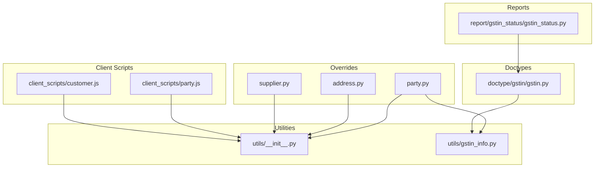
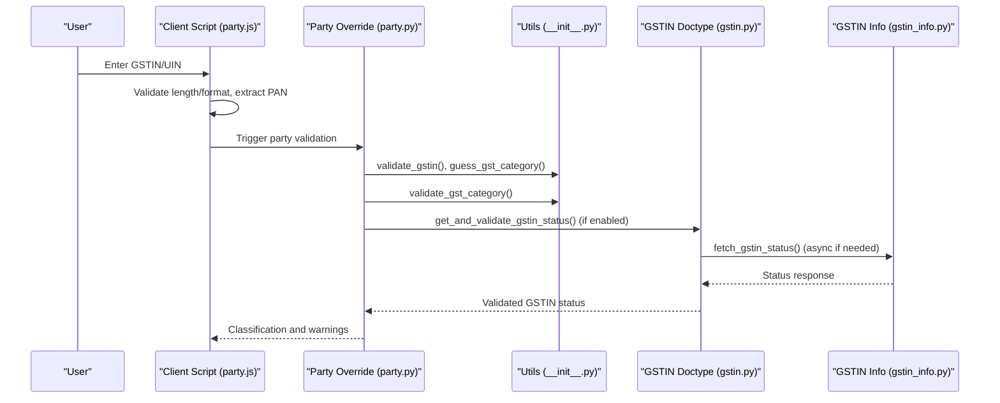
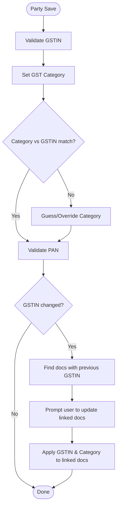
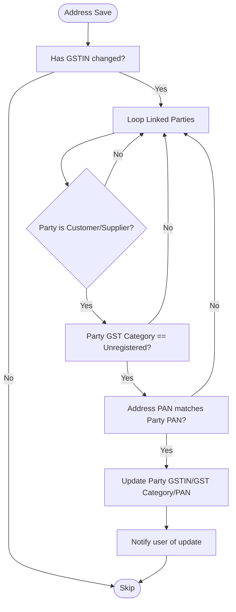
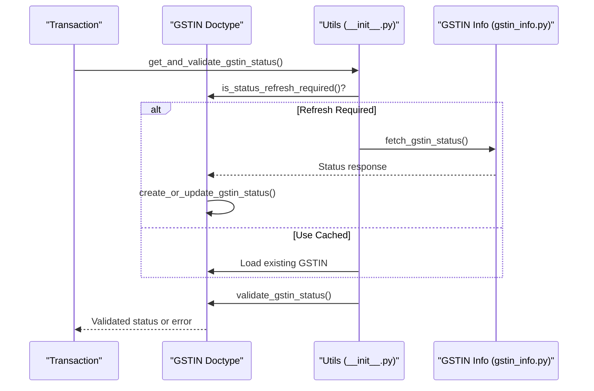
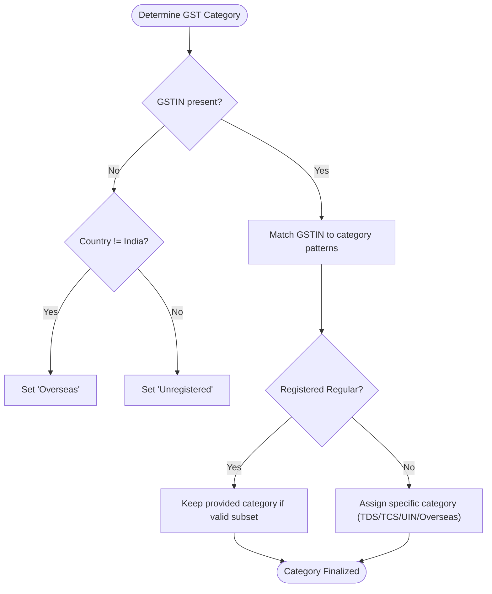
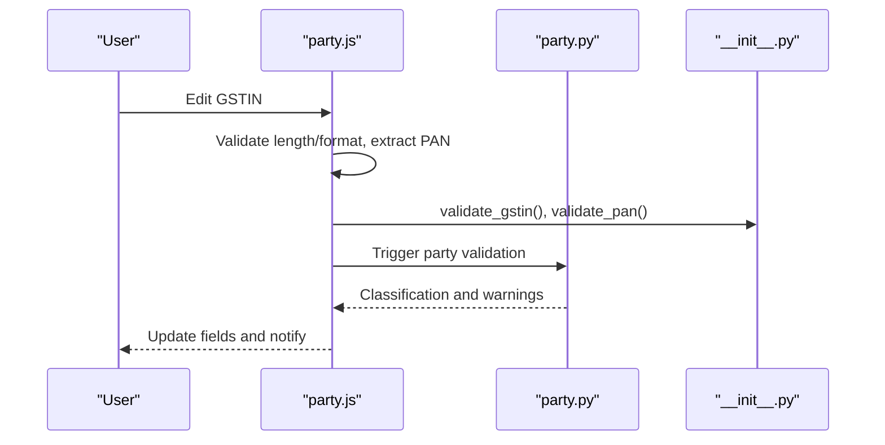
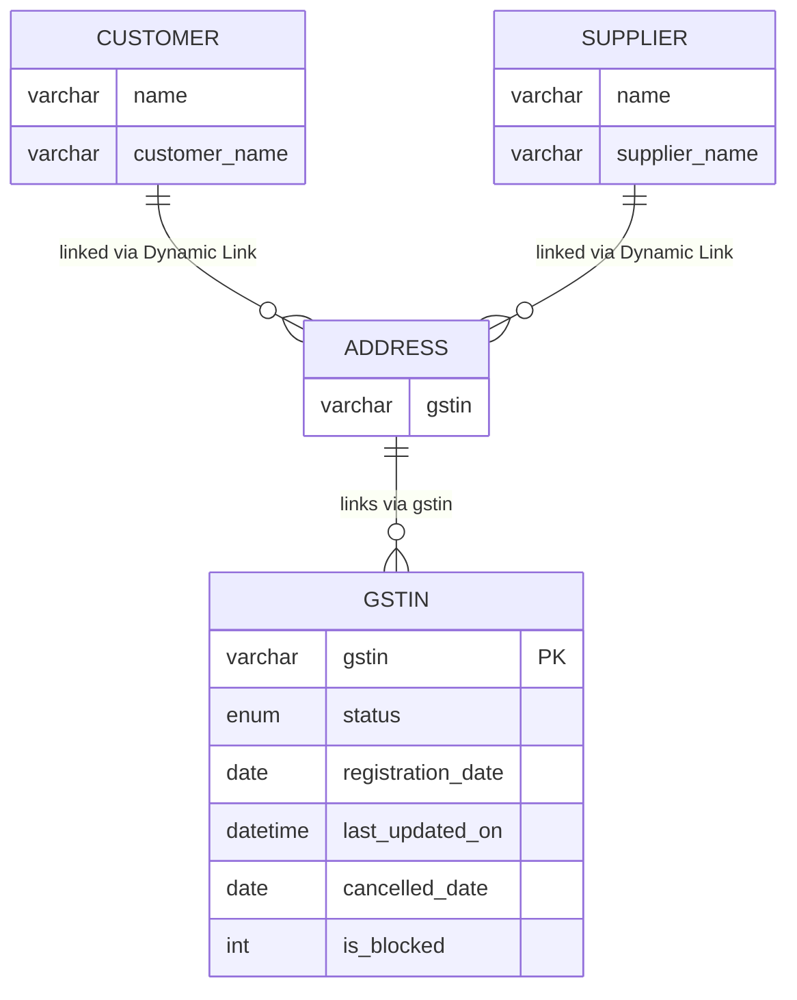
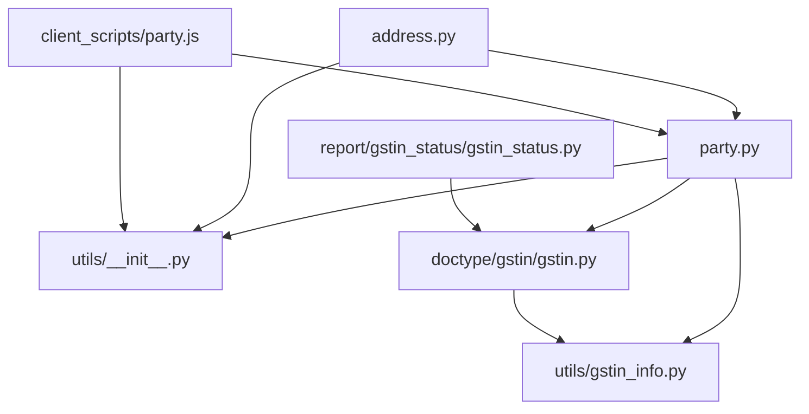

# Party Management

<cite>
**Referenced Files in This Document**
- [party.py](file://india_compliance/gst_india/overrides/party.py)
- [address.py](file://india_compliance/gst_india/overrides/address.py)
- [gstin.py](file://india_compliance/gst_india/doctype/gstin/gstin.py)
- [gstin_info.py](file://india_compliance/gst_india/utils/gstin_info.py)
- [custom_fields.py](file://india_compliance/gst_india/constants/custom_fields.py)
- [__init__.py](file://india_compliance/gst_india/utils/__init__.py)
- [party.js](file://india_compliance/gst_india/client_scripts/party.js)
- [customer.js](file://india_compliance/gst_india/client_scripts/customer.js)
- [supplier.py](file://india_compliance/gst_india/overrides/supplier.py)
- [gstin_status.py](file://india_compliance/gst_india/report/gstin_status/gstin_status.py)
- [test_party.py](file://india_compliance/gst_india/overrides/test_party.py)
</cite>

## Table of Contents
1. [Introduction](#introduction)
2. [Project Structure](#project-structure)
3. [Core Components](#core-components)
4. [Architecture Overview](#architecture-overview)
5. [Detailed Component Analysis](#detailed-component-analysis)
6. [Dependency Analysis](#dependency-analysis)
7. [Performance Considerations](#performance-considerations)
8. [Troubleshooting Guide](#troubleshooting-guide)
9. [Conclusion](#conclusion)
10. [Appendices](#appendices)

## Introduction
This document explains the Party Management system with a focus on GSTIN validation, party classification, and supplier/customer compliance tracking. It covers:
- Party override functions that validate GSTIN, assign GST category, and enforce party-specific tax treatments
- The GSTIN status checking system that validates GSTIN numbers against government portals and maintains GSTIN status records
- Party classification logic determining GST categories (registered, unregistered, composition, SEZ, overseas) and applying appropriate tax treatments
- Practical examples of party setup, GSTIN validation workflows, and classification updates
- Resolution procedures for common issues such as invalid GSTIN numbers, mismatched party details, and classification errors

## Project Structure
The Party Management system spans overrides, utilities, client scripts, reports, and doctypes:
- Overrides: Party and Address validation, supplier-specific transport validations
- Utilities: GSTIN validation, classification, PAN validation, and API integrations
- Client Scripts: Real-time GSTIN and PAN validation, classification suggestions, and warnings
- Doctypes: GSTIN record management and status persistence
- Reports: GSTIN status dashboard for parties

**Diagram sources**
- [party.py](file://india_compliance/gst_india/overrides/party.py#L1-L172)
- [address.py](file://india_compliance/gst_india/overrides/address.py#L1-L97)
- [supplier.py](file://india_compliance/gst_india/overrides/supplier.py#L1-L76)
- [gstin.py](file://india_compliance/gst_india/doctype/gstin/gstin.py#L1-L322)
- [gstin_info.py](file://india_compliance/gst_india/utils/gstin_info.py#L1-L524)
- [party.js](file://india_compliance/gst_india/client_scripts/party.js#L1-L173)
- [customer.js](file://india_compliance/gst_india/client_scripts/customer.js#L1-L9)
- [gstin_status.py](file://india_compliance/gst_india/report/gstin_status/gstin_status.py#L1-L210)

**Section sources**
- [party.py](file://india_compliance/gst_india/overrides/party.py#L1-L172)
- [address.py](file://india_compliance/gst_india/overrides/address.py#L1-L97)
- [gstin.py](file://india_compliance/gst_india/doctype/gstin/gstin.py#L1-L322)
- [gstin_info.py](file://india_compliance/gst_india/utils/gstin_info.py#L1-L524)
- [party.js](file://india_compliance/gst_india/client_scripts/party.js#L1-L173)
- [customer.js](file://india_compliance/gst_india/client_scripts/customer.js#L1-L9)
- [gstin_status.py](file://india_compliance/gst_india/report/gstin_status/gstin_status.py#L1-L210)

## Core Components
- Party Override: Validates GSTIN, sets GST category, validates PAN, and handles cross-document updates when GSTIN changes
- Address Override: Synchronizes GSTIN and GST category from Address to linked Customer/Supplier when conditions match
- GSTIN Doctype: Stores and updates GSTIN status, registration/cancellation dates, and last updated timestamps
- GSTIN Info Utility: Fetches GSTIN info from Public/E-Invoice APIs, formats responses, and archives historical data
- Client Scripts: Real-time validation, classification suggestions, and warnings for overseas transactions
- GSTIN Status Report: Aggregates GSTIN status across parties for monitoring and reconciliation

**Section sources**
- [party.py](file://india_compliance/gst_india/overrides/party.py#L17-L108)
- [address.py](file://india_compliance/gst_india/overrides/address.py#L13-L50)
- [gstin.py](file://india_compliance/gst_india/doctype/gstin/gstin.py#L25-L95)
- [gstin_info.py](file://india_compliance/gst_india/utils/gstin_info.py#L44-L102)
- [party.js](file://india_compliance/gst_india/client_scripts/party.js#L48-L81)
- [gstin_status.py](file://india_compliance/gst_india/report/gstin_status/gstin_status.py#L10-L21)

## Architecture Overview
The Party Management system integrates front-end validation, backend overrides, and asynchronous status updates:
- Front-end: Client scripts validate GSTIN/PAN and suggest classifications
- Backend: Overrides validate and normalize party data; utilities classify and validate GSTIN
- Status Management: GSTIN doctype persists status; async jobs refresh status via APIs
- Reporting: GSTIN Status report surfaces consolidated party GSTIN health

**Diagram sources**
- [party.js](file://india_compliance/gst_india/client_scripts/party.js#L48-L81)
- [party.py](file://india_compliance/gst_india/overrides/party.py#L17-L41)
- [__init__.py](file://india_compliance/gst_india/utils/__init__.py#L163-L239)
- [gstin.py](file://india_compliance/gst_india/doctype/gstin/gstin.py#L101-L166)
- [gstin_info.py](file://india_compliance/gst_india/utils/gstin_info.py#L195-L242)

## Detailed Component Analysis

### Party Override Functions
Key responsibilities:
- Validate GSTIN and normalize format
- Determine and set GST category based on GSTIN and country
- Validate PAN and derive from GSTIN when applicable
- Enforce GST category vs. GSTIN compatibility
- Handle cross-document updates when GSTIN changes

**Diagram sources**
- [party.py](file://india_compliance/gst_india/overrides/party.py#L17-L134)

**Section sources**
- [party.py](file://india_compliance/gst_india/overrides/party.py#L17-L134)
- [test_party.py](file://india_compliance/gst_india/overrides/test_party.py#L6-L33)

### Address Override Functions
Ensures Address GSTIN and GST category propagate to linked Customer/Supplier under specific conditions:
- Only if GSTIN is present and has changed
- Only if party GST category is Unregistered
- PAN derived from GSTIN must match party PAN
- Updates party fields and alerts user

**Diagram sources**
- [address.py](file://india_compliance/gst_india/overrides/address.py#L13-L50)

**Section sources**
- [address.py](file://india_compliance/gst_india/overrides/address.py#L13-L50)

### GSTIN Status Checking System
The system validates GSTIN status against government portals and maintains records:
- Determines if a refresh is required based on settings and last update
- Fetches status via Public API or E-Invoice API depending on credentials
- Creates or updates GSTIN document with normalized fields
- Validates transaction date against registration/cancellation dates
- Provides immediate or queued responses for frontend/backend usage

**Diagram sources**
- [gstin.py](file://india_compliance/gst_india/doctype/gstin/gstin.py#L101-L166)
- [gstin_info.py](file://india_compliance/gst_india/utils/gstin_info.py#L195-L242)
- [__init__.py](file://india_compliance/gst_india/utils/__init__.py#L217-L242)

**Section sources**
- [gstin.py](file://india_compliance/gst_india/doctype/gstin/gstin.py#L57-L166)
- [gstin_info.py](file://india_compliance/gst_india/utils/gstin_info.py#L195-L242)
- [__init__.py](file://india_compliance/gst_india/utils/__init__.py#L217-L242)

### Party Classification Logic
Classification is determined by:
- Presence of GSTIN and country
- Regex patterns for specific categories (Registered Regular, Tax Deductor, Tax Collector, UIN Holders, Overseas)
- Explicit category overrides for Registered Composition, SEZ, Deemed Export, Input Service Distributor
- Defaults to Unregistered or Overseas when no GSTIN is present

**Diagram sources**
- [__init__.py](file://india_compliance/gst_india/utils/__init__.py#L298-L335)
- [gstin_info.py](file://india_compliance/gst_india/utils/gstin_info.py#L23-L34)

**Section sources**
- [__init__.py](file://india_compliance/gst_india/utils/__init__.py#L298-L335)
- [gstin_info.py](file://india_compliance/gst_india/utils/gstin_info.py#L23-L34)

### Client Scripts and User Experience
Client scripts provide real-time validation and guidance:
- Validate GSTIN length/format and extract PAN
- Suggest GST category based on GSTIN and country
- Warn if overseas transactions are disabled
- Offer GSTIN options and status indicators
- Prompt to update other documents when GSTIN changes

**Diagram sources**
- [party.js](file://india_compliance/gst_india/client_scripts/party.js#L48-L81)
- [party.py](file://india_compliance/gst_india/overrides/party.py#L17-L22)
- [__init__.py](file://india_compliance/gst_india/utils/__init__.py#L163-L242)

**Section sources**
- [party.js](file://india_compliance/gst_india/client_scripts/party.js#L1-L173)
- [customer.js](file://india_compliance/gst_india/client_scripts/customer.js#L1-L9)

### GSTIN Status Report
The GSTIN Status report aggregates party GSTINs and their statuses:
- Joins Address and party doctypes to list GSTINs
- Shows status, registration date, last updated, cancellation date, and block status
- Supports filtering by status and optional naming series columns

**Diagram sources**
- [gstin_status.py](file://india_compliance/gst_india/report/gstin_status/gstin_status.py#L116-L146)

**Section sources**
- [gstin_status.py](file://india_compliance/gst_india/report/gstin_status/gstin_status.py#L10-L210)

## Dependency Analysis
- Party override depends on:
  - GSTIN validation and classification utilities
  - GSTIN status retrieval and validation
  - Client script feedback loop for user prompts
- Address override depends on:
  - Party GST category and PAN alignment
  - Cross-document lookup for linked parties
- GSTIN doctype depends on:
  - GSTIN info utility for API responses
  - Settings for refresh intervals and validation toggles
- Client scripts depend on:
  - Front-end helpers for validation and warnings
  - Party override for backend enforcement

**Diagram sources**
- [party.py](file://india_compliance/gst_india/overrides/party.py#L1-L172)
- [address.py](file://india_compliance/gst_india/overrides/address.py#L1-L97)
- [gstin.py](file://india_compliance/gst_india/doctype/gstin/gstin.py#L1-L322)
- [gstin_info.py](file://india_compliance/gst_india/utils/gstin_info.py#L1-L524)
- [party.js](file://india_compliance/gst_india/client_scripts/party.js#L1-L173)
- [gstin_status.py](file://india_compliance/gst_india/report/gstin_status/gstin_status.py#L1-L210)

**Section sources**
- [party.py](file://india_compliance/gst_india/overrides/party.py#L1-L172)
- [address.py](file://india_compliance/gst_india/overrides/address.py#L1-L97)
- [gstin.py](file://india_compliance/gst_india/doctype/gstin/gstin.py#L1-L322)
- [gstin_info.py](file://india_compliance/gst_india/utils/gstin_info.py#L1-L524)
- [party.js](file://india_compliance/gst_india/client_scripts/party.js#L1-L173)
- [gstin_status.py](file://india_compliance/gst_india/report/gstin_status/gstin_status.py#L1-L210)

## Performance Considerations
- Asynchronous status refresh: Queued jobs prevent blocking user actions while ensuring timely updates
- Cached API responses: Integration requests archive recent responses to reduce repeated API calls
- Conditional validation: Status refresh is skipped for submitted documents and when settings disable validation
- Front-end caching: Client-side suggestions reduce server load during typing

[No sources needed since this section provides general guidance]

## Troubleshooting Guide
Common issues and resolutions:
- Invalid GSTIN number
  - Cause: Wrong length, invalid check digit, or invalid TCS format
  - Resolution: Re-enter GSTIN; ensure 15-character format and valid check digit; for TCS, confirm format
  - Related code: [validate_gstin](file://india_compliance/gst_india/utils/__init__.py#L163-L198), [validate_gstin_check_digit](file://india_compliance/gst_india/utils/__init__.py#L342-L361)
- Mismatched party details
  - Cause: PAN extracted from GSTIN differs from party PAN
  - Resolution: Align PAN or correct GSTIN; for transporters, ensure GST Transporter ID matches GSTIN PAN
  - Related code: [validate_pan](file://india_compliance/gst_india/overrides/party.py#L61-L78), [validate_gst_transporter_id](file://india_compliance/gst_india/overrides/supplier.py#L14-L64)
- Classification errors
  - Cause: GSTIN format does not match selected category; missing GSTIN for Unregistered
  - Resolution: Reclassify using GSTIN patterns; ensure Unregistered only for parties without GSTIN
  - Related code: [validate_gst_category](file://india_compliance/gst_india/utils/__init__.py#L201-L239), [guess_gst_category](file://india_compliance/gst_india/utils/__init__.py#L298-L335)
- GSTIN status validation failures
  - Cause: Registration date after transaction date, cancellation after transaction date, or inactive status
  - Resolution: Adjust transaction date or update GSTIN; ensure Active status
  - Related code: [validate_gstin_status](file://india_compliance/gst_india/doctype/gstin/gstin.py#L168-L214)
- Overseas transactions disabled
  - Cause: GST Settings disallow SEZ/Overseas transactions
  - Resolution: Enable setting in GST Settings or adjust party category
  - Related code: [show_overseas_disabled_warning](file://india_compliance/gst_india/client_scripts/party.js#L101-L117)

**Section sources**
- [__init__.py](file://india_compliance/gst_india/utils/__init__.py#L163-L239)
- [party.py](file://india_compliance/gst_india/overrides/party.py#L61-L78)
- [supplier.py](file://india_compliance/gst_india/overrides/supplier.py#L14-L64)
- [gstin.py](file://india_compliance/gst_india/doctype/gstin/gstin.py#L168-L214)
- [party.js](file://india_compliance/gst_india/client_scripts/party.js#L101-L117)

## Conclusion
The Party Management system enforces robust GSTIN validation, accurate classification, and compliance tracking through integrated overrides, utilities, and reporting. It leverages asynchronous status updates and user-friendly client-side validations to streamline party setup and ongoing compliance.

[No sources needed since this section summarizes without analyzing specific files]

## Appendices

### Practical Examples

- Example 1: Party Setup with Valid GSTIN
  - Steps:
    - Enter GSTIN in Customer/Supplier form
    - Client script validates length/format and extracts PAN
    - Party override sets GST category based on GSTIN and country
    - GSTIN status is validated against portal if enabled
  - Expected outcome: GSTIN accepted, category set, and status recorded

- Example 2: GSTIN Change Across Documents
  - Steps:
    - Change GSTIN on a party
    - System detects previous GSTIN and lists linked documents
    - Prompts user to update linked docs with new GSTIN and category
  - Expected outcome: Consistent GSTIN and category across all related records

- Example 3: Overseas Transaction Warning
  - Steps:
    - Set party category to Overseas or SEZ
    - Save party
    - Client script checks GST Settings for overseas transactions
  - Expected outcome: Warning shown if disabled; otherwise proceed normally

**Section sources**
- [party.js](file://india_compliance/gst_india/client_scripts/party.js#L3-L44)
- [party.py](file://india_compliance/gst_india/overrides/party.py#L81-L134)
- [gstin_status.py](file://india_compliance/gst_india/report/gstin_status/gstin_status.py#L116-L146)