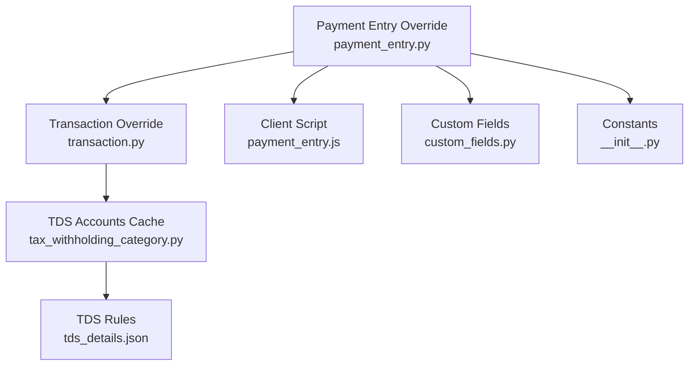
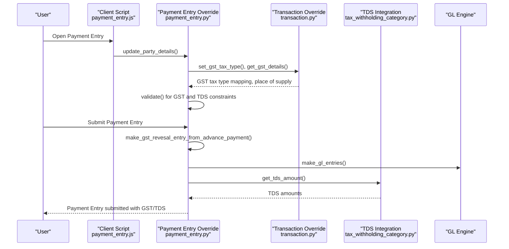
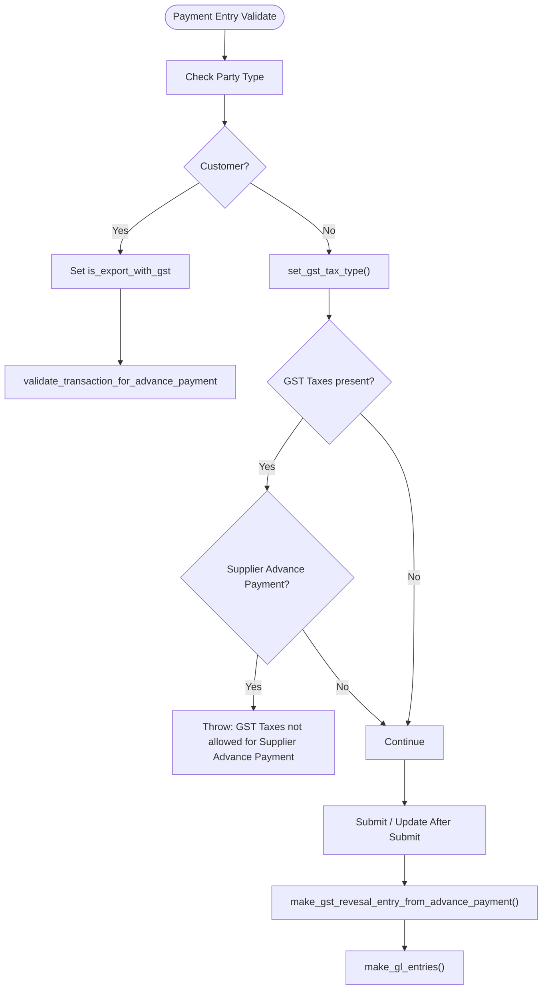
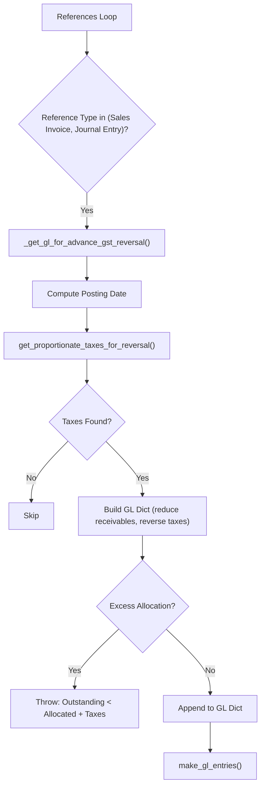
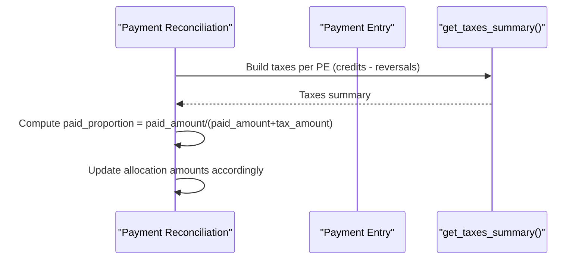
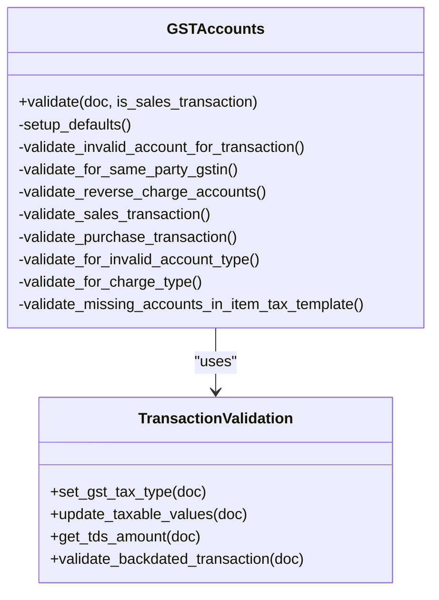
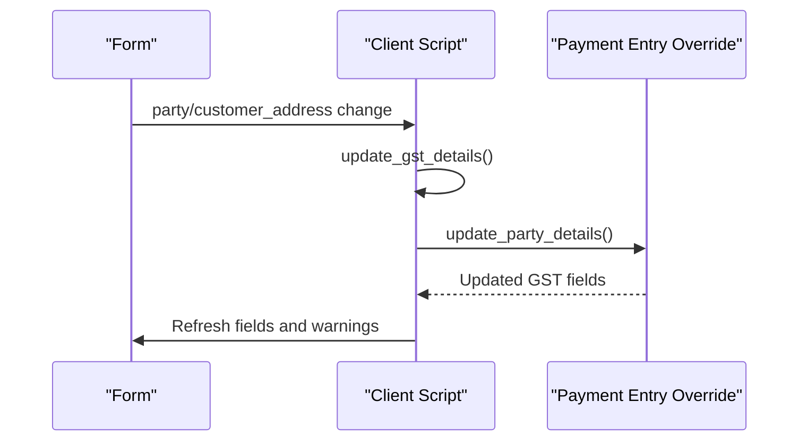
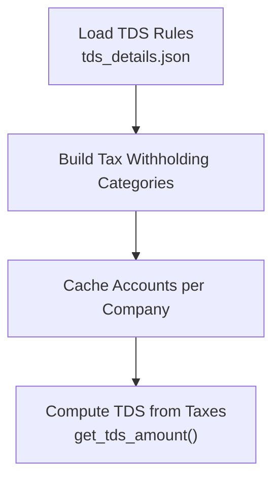
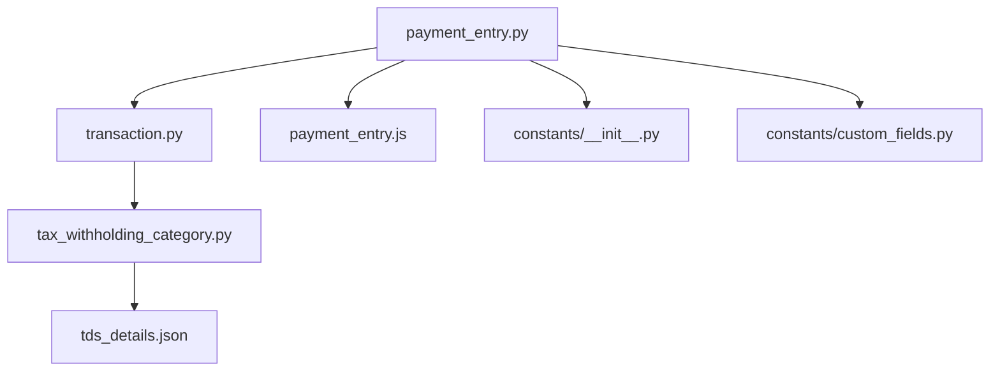

# Payment Processing

<cite>
**Referenced Files in This Document**
- [payment_entry.py](file://india_compliance/gst_india/overrides/payment_entry.py)
- [transaction.py](file://india_compliance/gst_india/overrides/transaction.py)
- [payment_entry.js](file://india_compliance/gst_india/client_scripts/payment_entry.js)
- [test_advance_payment_entry.py](file://india_compliance/gst_india/overrides/test_advance_payment_entry.py)
- [tax_withholding_category.py](file://india_compliance/income_tax_india/overrides/tax_withholding_category.py)
- [tds_details.json](file://india_compliance/income_tax_india/data/tds_details.json)
- [custom_fields.py](file://india_compliance/gst_india/constants/custom_fields.py)
- [__init__.py](file://india_compliance/gst_india/constants/__init__.py)
- [tests.py](file://india_compliance/gst_india/utils/tests.py)
</cite>

## Table of Contents
1. [Introduction](#introduction)
2. [Project Structure](#project-structure)
3. [Core Components](#core-components)
4. [Architecture Overview](#architecture-overview)
5. [Detailed Component Analysis](#detailed-component-analysis)
6. [Dependency Analysis](#dependency-analysis)
7. [Performance Considerations](#performance-considerations)
8. [Troubleshooting Guide](#troubleshooting-guide)
9. [Conclusion](#conclusion)
10. [Appendices](#appendices)

## Introduction
This document explains the Payment Processing system with a focus on:
- GST compliance in payment transactions
- Tax Deducted at Source (TDS) integration
- Payment entry validation rules
- Overrides for GST tax calculations, reverse charge applications, and payment-to-invoice matching
- TDS integration with income tax systems and how payment entries reflect tax withholding amounts
- Payment processing workflow for advance payments, partial payments, and final settlements
- Practical scenarios, validation rules, and resolution procedures for common issues

## Project Structure
The Payment Processing system spans regional overrides for Payment Entry, transaction-level GST validation, client-side helpers, and TDS integration with income tax data.

**Diagram sources**
- [payment_entry.py](file://india_compliance/gst_india/overrides/payment_entry.py#L1-L464)
- [transaction.py](file://india_compliance/gst_india/overrides/transaction.py#L1-L800)
- [payment_entry.js](file://india_compliance/gst_india/client_scripts/payment_entry.js#L1-L169)
- [tax_withholding_category.py](file://india_compliance/income_tax_india/overrides/tax_withholding_category.py#L1-L19)
- [tds_details.json](file://india_compliance/income_tax_india/data/tds_details.json#L1-L800)
- [custom_fields.py](file://india_compliance/gst_india/constants/custom_fields.py#L1-L800)
- [__init__.py](file://india_compliance/gst_india/constants/__init__.py#L1-L800)

**Section sources**
- [payment_entry.py](file://india_compliance/gst_india/overrides/payment_entry.py#L1-L464)
- [transaction.py](file://india_compliance/gst_india/overrides/transaction.py#L1-L800)
- [payment_entry.js](file://india_compliance/gst_india/client_scripts/payment_entry.js#L1-L169)
- [tax_withholding_category.py](file://india_compliance/income_tax_india/overrides/tax_withholding_category.py#L1-L19)
- [tds_details.json](file://india_compliance/income_tax_india/data/tds_details.json#L1-L800)
- [custom_fields.py](file://india_compliance/gst_india/constants/custom_fields.py#L1-L800)
- [__init__.py](file://india_compliance/gst_india/constants/__init__.py#L1-L800)

## Core Components
- Payment Entry GST Overrides: Handles GST tax type detection, validation, GST reversal on advance payments, and reconciliation adjustments.
- Transaction GST Validation: Validates GST accounts, reverse charge, HSN/SAC, and taxable value computation including charges.
- Client Script Enhancements: Fetches GST details, updates party details, and displays reconciliation status indicators.
- TDS Integration: Loads TDS categories and rates, caches tax-withholding accounts, and computes TDS amounts.
- Custom Fields and Constants: Define GST-related fields, categories, tax types, and validation rules.

**Section sources**
- [payment_entry.py](file://india_compliance/gst_india/overrides/payment_entry.py#L86-L127)
- [transaction.py](file://india_compliance/gst_india/overrides/transaction.py#L69-L174)
- [payment_entry.js](file://india_compliance/gst_india/client_scripts/payment_entry.js#L11-L57)
- [tax_withholding_category.py](file://india_compliance/income_tax_india/overrides/tax_withholding_category.py#L8-L19)
- [tds_details.json](file://india_compliance/income_tax_india/data/tds_details.json#L1-L800)
- [custom_fields.py](file://india_compliance/gst_india/constants/custom_fields.py#L1-L800)
- [__init__.py](file://india_compliance/gst_india/constants/__init__.py#L17-L24)

## Architecture Overview
The Payment Processing system integrates with ERPNext’s Payment Entry lifecycle to enforce GST and TDS compliance during creation, submission, and reconciliation.

**Diagram sources**
- [payment_entry.js](file://india_compliance/gst_india/client_scripts/payment_entry.js#L144-L169)
- [payment_entry.py](file://india_compliance/gst_india/overrides/payment_entry.py#L86-L127)
- [transaction.py](file://india_compliance/gst_india/overrides/transaction.py#L277-L289)
- [tax_withholding_category.py](file://india_compliance/income_tax_india/overrides/tax_withholding_category.py#L8-L19)

## Detailed Component Analysis

### Payment Entry GST Overrides
Key responsibilities:
- GST tax type detection and validation
- Prevent GST taxes in supplier advance payments
- Backdated transaction restrictions for GST
- Automatic GST reversal entries for advance payments matched to invoices
- Adjust allocations for taxes in payment reconciliation

**Diagram sources**
- [payment_entry.py](file://india_compliance/gst_india/overrides/payment_entry.py#L86-L127)
- [payment_entry.py](file://india_compliance/gst_india/overrides/payment_entry.py#L158-L173)

**Section sources**
- [payment_entry.py](file://india_compliance/gst_india/overrides/payment_entry.py#L86-L127)
- [payment_entry.py](file://india_compliance/gst_india/overrides/payment_entry.py#L158-L274)

### GST Reversal on Advance Payments
Behavior:
- On submit/update after submit, creates GL entries to reverse GST paid in advance against matched invoices
- Computes proportionate taxes per reference
- Validates outstanding vs allocated amounts including taxes
- Handles PLE updates and prevents duplicate entries

**Diagram sources**
- [payment_entry.py](file://india_compliance/gst_india/overrides/payment_entry.py#L175-L274)
- [payment_entry.py](file://india_compliance/gst_india/overrides/payment_entry.py#L276-L334)

**Section sources**
- [payment_entry.py](file://india_compliance/gst_india/overrides/payment_entry.py#L175-L274)
- [payment_entry.py](file://india_compliance/gst_india/overrides/payment_entry.py#L276-L334)

### Payment Reconciliation with Taxes
Behavior:
- Adjust allocations to exclude tax amounts proportionally
- Summarize taxes per payment entry and compute proportional allocations
- Ensures unreconciled amounts align with adjusted allocations

**Diagram sources**
- [payment_entry.py](file://india_compliance/gst_india/overrides/payment_entry.py#L386-L420)
- [payment_entry.py](file://india_compliance/gst_india/overrides/payment_entry.py#L421-L464)

**Section sources**
- [payment_entry.py](file://india_compliance/gst_india/overrides/payment_entry.py#L386-L420)
- [payment_entry.py](file://india_compliance/gst_india/overrides/payment_entry.py#L421-L464)

### Transaction-Level GST Validation and TDS
Responsibilities:
- Set GST tax type for taxes
- Validate GST accounts, reverse charge, HSN/SAC, and taxable value computation
- Compute TDS amounts from tax-withholding accounts
- Enforce backdated transaction restrictions for GST

**Diagram sources**
- [transaction.py](file://india_compliance/gst_india/overrides/transaction.py#L290-L547)
- [transaction.py](file://india_compliance/gst_india/overrides/transaction.py#L277-L289)
- [transaction.py](file://india_compliance/gst_india/overrides/transaction.py#L69-L174)

**Section sources**
- [transaction.py](file://india_compliance/gst_india/overrides/transaction.py#L277-L547)
- [transaction.py](file://india_compliance/gst_india/overrides/transaction.py#L69-L174)

### Client Script Enhancements
Features:
- Auto-fetch party and GST details on party/address change
- Display reconciliation status indicators for Purchase Invoice references
- Company address auto-fill via default address query

**Diagram sources**
- [payment_entry.js](file://india_compliance/gst_india/client_scripts/payment_entry.js#L11-L57)
- [payment_entry.js](file://india_compliance/gst_india/client_scripts/payment_entry.js#L144-L169)
- [payment_entry.py](file://india_compliance/gst_india/overrides/payment_entry.py#L129-L155)

**Section sources**
- [payment_entry.js](file://india_compliance/gst_india/client_scripts/payment_entry.js#L11-L57)
- [payment_entry.js](file://india_compliance/gst_india/client_scripts/payment_entry.js#L116-L142)
- [payment_entry.py](file://india_compliance/gst_india/overrides/payment_entry.py#L129-L155)

### TDS Integration with Income Tax
Capabilities:
- Load TDS categories and rates from JSON data
- Cache tax-withholding accounts per company
- Compute TDS amounts from taxes marked as “Deduct”

**Diagram sources**
- [tax_withholding_category.py](file://india_compliance/income_tax_india/overrides/tax_withholding_category.py#L8-L19)
- [tds_details.json](file://india_compliance/income_tax_india/data/tds_details.json#L1-L800)
- [transaction.py](file://india_compliance/gst_india/overrides/transaction.py#L160-L173)

**Section sources**
- [tax_withholding_category.py](file://india_compliance/income_tax_india/overrides/tax_withholding_category.py#L1-L19)
- [tds_details.json](file://india_compliance/income_tax_india/data/tds_details.json#L1-L800)
- [transaction.py](file://india_compliance/gst_india/overrides/transaction.py#L160-L173)

## Dependency Analysis
Key dependencies and relationships:
- Payment Entry overrides depend on transaction utilities for GST tax type mapping and validation
- TDS integration depends on cached tax-withholding accounts and TDS rules
- Client script depends on Payment Entry override for updating GST details
- Constants define GST tax types and categories used across validations

**Diagram sources**
- [payment_entry.py](file://india_compliance/gst_india/overrides/payment_entry.py#L1-L464)
- [transaction.py](file://india_compliance/gst_india/overrides/transaction.py#L1-L800)
- [payment_entry.js](file://india_compliance/gst_india/client_scripts/payment_entry.js#L1-L169)
- [tax_withholding_category.py](file://india_compliance/income_tax_india/overrides/tax_withholding_category.py#L1-L19)
- [tds_details.json](file://india_compliance/income_tax_india/data/tds_details.json#L1-L800)
- [__init__.py](file://india_compliance/gst_india/constants/__init__.py#L17-L24)
- [custom_fields.py](file://india_compliance/gst_india/constants/custom_fields.py#L1-L800)

**Section sources**
- [payment_entry.py](file://india_compliance/gst_india/overrides/payment_entry.py#L1-L464)
- [transaction.py](file://india_compliance/gst_india/overrides/transaction.py#L1-L800)
- [payment_entry.js](file://india_compliance/gst_india/client_scripts/payment_entry.js#L1-L169)
- [tax_withholding_category.py](file://india_compliance/income_tax_india/overrides/tax_withholding_category.py#L1-L19)
- [tds_details.json](file://india_compliance/income_tax_india/data/tds_details.json#L1-L800)
- [__init__.py](file://india_compliance/gst_india/constants/__init__.py#L17-L24)
- [custom_fields.py](file://india_compliance/gst_india/constants/custom_fields.py#L1-L800)

## Performance Considerations
- Caching: Tax-withholding accounts are cached per company to avoid repeated database queries.
- Proportional calculations: GST reversal and reconciliation adjustments compute proportionate taxes per reference to minimize rounding discrepancies.
- Batch queries: Taxes summary aggregates GL entries for multiple payment entries efficiently.

[No sources needed since this section provides general guidance]

## Troubleshooting Guide
Common issues and resolutions:
- Incorrect GST tax amounts or missing tax accounts
  - Ensure GST tax type mapping is set and valid accounts are used for the transaction type.
  - Validate reverse charge usage only when applicable.
  - Reference: [transaction.py](file://india_compliance/gst_india/overrides/transaction.py#L290-L547)

- Supplier Advance Payment with GST taxes
  - GST taxes are not allowed for supplier advance payments; remove GST taxes or change party type.
  - Reference: [payment_entry.py](file://india_compliance/gst_india/overrides/payment_entry.py#L95-L102)

- Excess allocation including taxes
  - Payment entry validation throws an error if outstanding amount is less than allocated amount plus taxes; adjust allocations or reduce tax amounts.
  - Reference: [payment_entry.py](file://india_compliance/gst_india/overrides/payment_entry.py#L242-L254)

- Missing payment references or unreconciled invoices
  - Use reconciliation status indicators and ensure references are linked to valid invoices.
  - Reference: [payment_entry.js](file://india_compliance/gst_india/client_scripts/payment_entry.js#L116-L142)

- TDS not reflected in payment entry
  - Confirm TDS categories and rates are loaded and tax-withholding accounts are configured; verify TDS taxes are marked as “Deduct”.
  - Reference: [tax_withholding_category.py](file://india_compliance/income_tax_india/overrides/tax_withholding_category.py#L8-L19), [transaction.py](file://india_compliance/gst_india/overrides/transaction.py#L160-L173)

**Section sources**
- [transaction.py](file://india_compliance/gst_india/overrides/transaction.py#L290-L547)
- [payment_entry.py](file://india_compliance/gst_india/overrides/payment_entry.py#L95-L102)
- [payment_entry.py](file://india_compliance/gst_india/overrides/payment_entry.py#L242-L254)
- [payment_entry.js](file://india_compliance/gst_india/client_scripts/payment_entry.js#L116-L142)
- [tax_withholding_category.py](file://india_compliance/income_tax_india/overrides/tax_withholding_category.py#L8-L19)
- [transaction.py](file://india_compliance/gst_india/overrides/transaction.py#L160-L173)

## Conclusion
The Payment Processing system enforces robust GST and TDS compliance by integrating validation, automatic tax type mapping, GST reversal for advance payments, and reconciliation adjustments. Client scripts streamline user experience with real-time GST details and reconciliation indicators. The system balances accuracy with performance through caching and proportional calculations.

[No sources needed since this section summarizes without analyzing specific files]

## Appendices

### Practical Scenarios and Workflows

- Advance Payment Entry Matching to Invoice
  - Create Payment Entry with GST taxes; submit to trigger GST reversal entries against matched invoices.
  - Reference: [test_advance_payment_entry.py](file://india_compliance/gst_india/overrides/test_advance_payment_entry.py#L63-L104)

- Partial Payments and Final Settlement
  - Use Payment Reconciliation to allocate amounts excluding taxes proportionally; verify outstanding balances.
  - Reference: [test_advance_payment_entry.py](file://india_compliance/gst_india/overrides/test_advance_payment_entry.py#L300-L364)

- Payment Entry Allocation Validation
  - Attempting to allocate more than outstanding (including taxes) triggers validation failure; adjust allocations.
  - Reference: [test_advance_payment_entry.py](file://india_compliance/gst_india/overrides/test_advance_payment_entry.py#L222-L261)

- Client Script Updates
  - Updating party/address triggers GST details fetch and reconciliation status display.
  - Reference: [payment_entry.js](file://india_compliance/gst_india/client_scripts/payment_entry.js#L144-L169)

**Section sources**
- [test_advance_payment_entry.py](file://india_compliance/gst_india/overrides/test_advance_payment_entry.py#L63-L104)
- [test_advance_payment_entry.py](file://india_compliance/gst_india/overrides/test_advance_payment_entry.py#L300-L364)
- [test_advance_payment_entry.py](file://india_compliance/gst_india/overrides/test_advance_payment_entry.py#L222-L261)
- [payment_entry.js](file://india_compliance/gst_india/client_scripts/payment_entry.js#L144-L169)