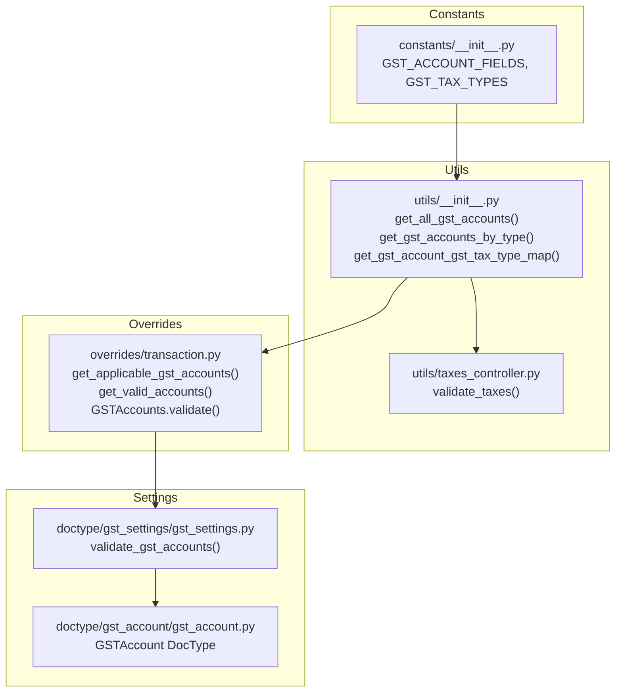
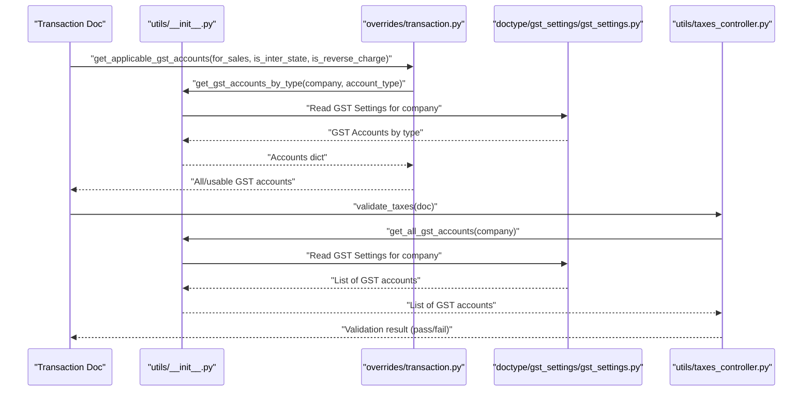
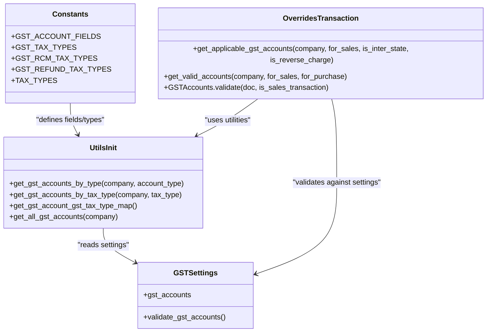
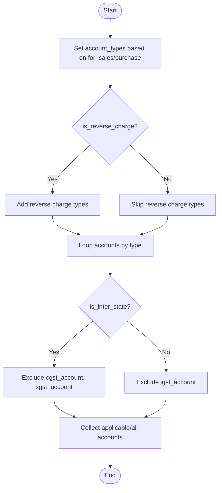
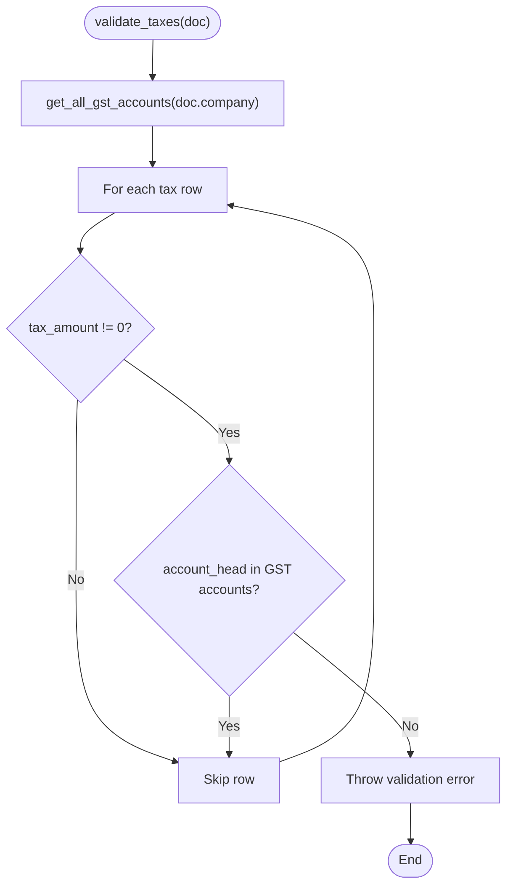
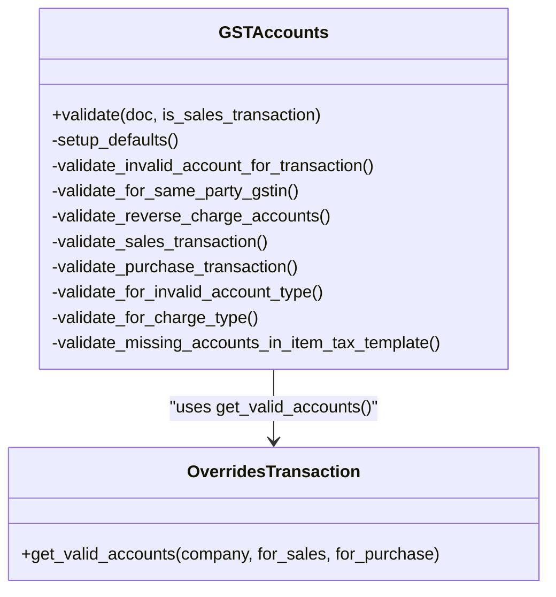
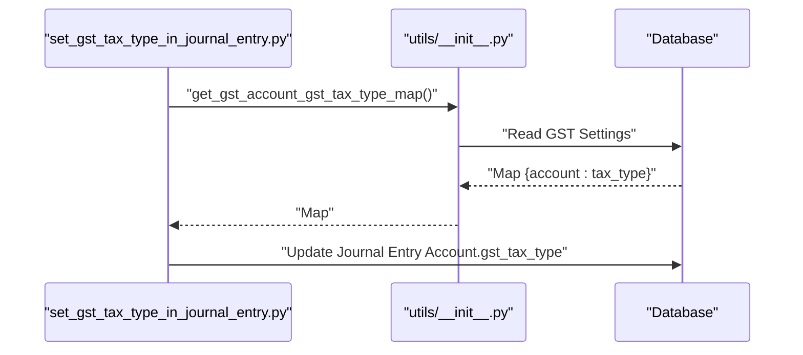
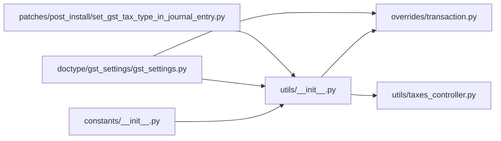

# GST Account Mapping

<cite>
**Referenced Files in This Document**
- [transaction.py](file://india_compliance/gst_india/overrides/transaction.py)
- [taxes_controller.py](file://india_compliance/gst_india/utils/taxes_controller.py)
- [__init__.py](file://india_compliance/gst_india/utils/__init__.py)
- [__init__.py](file://india_compliance/gst_india/constants/__init__.py)
- [gst_settings.py](file://india_compliance/gst_india/doctype/gst_settings/gst_settings.py)
- [gst_account.py](file://india_compliance/gst_india/doctype/gst_account/gst_account.py)
- [set_gst_tax_type_in_journal_entry.py](file://india_compliance/patches/post_install/set_gst_tax_type_in_journal_entry.py)
</cite>

## Table of Contents
1. [Introduction](#introduction)
2. [Project Structure](#project-structure)
3. [Core Components](#core-components)
4. [Architecture Overview](#architecture-overview)
5. [Detailed Component Analysis](#detailed-component-analysis)
6. [Dependency Analysis](#dependency-analysis)
7. [Performance Considerations](#performance-considerations)
8. [Troubleshooting Guide](#troubleshooting-guide)
9. [Conclusion](#conclusion)

## Introduction
This document explains the GST account mapping system used to determine tax accounts (CGST, SGST, IGST, Cess) and validate them during transactions. It covers:
- How tax types are mapped to GST accounts based on transaction type, place of supply, and reverse charge conditions
- The get_all_gst_accounts function and validation logic in validate_taxes
- Practical mapping scenarios, correct account head selection, and ledger posting rules
- Common issues and resolutions (wrong account heads, missing GST accounts, validation failures)

## Project Structure
The GST account mapping spans several modules:
- Constants define GST tax types and account fields
- Utilities provide lookup functions for GST accounts and tax type mapping
- Overrides enforce validation and mapping during transactions
- Settings define configured GST accounts per company and type
- Patches ensure legacy data alignment

**Diagram sources**
- [__init__.py](file://india_compliance/gst_india/constants/__init__.py#L9-L23)
- [__init__.py](file://india_compliance/gst_india/utils/__init__.py#L627-L646)
- [__init__.py](file://india_compliance/gst_india/utils/__init__.py#L509-L543)
- [__init__.py](file://india_compliance/gst_india/utils/__init__.py#L597-L623)
- [taxes_controller.py](file://india_compliance/gst_india/utils/taxes_controller.py#L263-L274)
- [transaction.py](file://india_compliance/gst_india/overrides/transaction.py#L212-L249)
- [transaction.py](file://india_compliance/gst_india/overrides/transaction.py#L252-L274)
- [gst_settings.py](file://india_compliance/gst_india/doctype/gst_settings/gst_settings.py#L144-L179)
- [gst_account.py](file://india_compliance/gst_india/doctype/gst_account/gst_account.py#L8-L9)

**Section sources**
- [__init__.py](file://india_compliance/gst_india/constants/__init__.py#L9-L23)
- [__init__.py](file://india_compliance/gst_india/utils/__init__.py#L509-L646)
- [transaction.py](file://india_compliance/gst_india/overrides/transaction.py#L212-L274)
- [gst_settings.py](file://india_compliance/gst_india/doctype/gst_settings/gst_settings.py#L144-L179)

## Core Components
- GST tax types and account fields: Defines CGST, SGST, IGST, Cess, and Cess Non-Advol fields used across the system.
- GST account retrieval utilities: Functions to fetch all GST accounts for a company, by account type, or by tax type.
- Tax type mapping: Utility to map account heads to tax types for validation and display.
- Transaction-level validation: Validates account usage against transaction type, intra/inter-state rules, and reverse charge conditions.
- Ledger posting validation: Ensures only GST accounts are used in tax rows and throws meaningful errors otherwise.

Key responsibilities:
- Determine applicable GST accounts based on sales/purchase, intra/inter-state, and reverse charge
- Validate tax rows conform to GST rules
- Enforce that only configured GST accounts appear in tax rows

**Section sources**
- [__init__.py](file://india_compliance/gst_india/constants/__init__.py#L9-L23)
- [__init__.py](file://india_compliance/gst_india/utils/__init__.py#L509-L646)
- [__init__.py](file://india_compliance/gst_india/utils/__init__.py#L597-L623)
- [transaction.py](file://india_compliance/gst_india/overrides/transaction.py#L212-L274)
- [taxes_controller.py](file://india_compliance/gst_india/utils/taxes_controller.py#L263-L274)

## Architecture Overview
The system orchestrates mapping and validation across modules:

**Diagram sources**
- [transaction.py](file://india_compliance/gst_india/overrides/transaction.py#L212-L249)
- [__init__.py](file://india_compliance/gst_india/utils/__init__.py#L509-L543)
- [__init__.py](file://india_compliance/gst_india/utils/__init__.py#L627-L646)
- [gst_settings.py](file://india_compliance/gst_india/doctype/gst_settings/gst_settings.py#L144-L179)
- [taxes_controller.py](file://india_compliance/gst_india/utils/taxes_controller.py#L263-L274)

## Detailed Component Analysis

### Tax Type Determination and Account Mapping
- Tax types: CGST, SGST, IGST, Cess, Cess Non-Advol are defined and used to map account heads to tax categories.
- Account fields: cgst_account, sgst_account, igst_account, cess_account, cess_non_advol_account are the canonical fields for GST accounts.
- Mapping utility: get_gst_account_gst_tax_type_map builds a map from account head to tax type for validation and UI.

**Diagram sources**
- [__init__.py](file://india_compliance/gst_india/constants/__init__.py#L9-L23)
- [__init__.py](file://india_compliance/gst_india/utils/__init__.py#L509-L646)
- [__init__.py](file://india_compliance/gst_india/utils/__init__.py#L597-L623)
- [gst_settings.py](file://india_compliance/gst_india/doctype/gst_settings/gst_settings.py#L144-L179)
- [transaction.py](file://india_compliance/gst_india/overrides/transaction.py#L212-L274)

**Section sources**
- [__init__.py](file://india_compliance/gst_india/constants/__init__.py#L9-L23)
- [__init__.py](file://india_compliance/gst_india/utils/__init__.py#L509-L646)
- [__init__.py](file://india_compliance/gst_india/utils/__init__.py#L597-L623)
- [gst_settings.py](file://india_compliance/gst_india/doctype/gst_settings/gst_settings.py#L144-L179)
- [transaction.py](file://india_compliance/gst_india/overrides/transaction.py#L212-L274)

### Applicable Account Determination
- get_applicable_gst_accounts determines:
  - All GST accounts for a company based on transaction type (sales/purchase)
  - Applicable accounts considering intra/inter-state and reverse charge flags
  - Ignores invalid combinations (e.g., intra-state CGST/SGST in inter-state, IGST in intra-state)

**Diagram sources**
- [transaction.py](file://india_compliance/gst_india/overrides/transaction.py#L212-L249)

**Section sources**
- [transaction.py](file://india_compliance/gst_india/overrides/transaction.py#L212-L249)

### Validation Logic in validate_taxes
- Purpose: Ensure only GST accounts appear in tax rows with non-zero tax amounts.
- Behavior:
  - Retrieves all GST accounts for the company via get_all_gst_accounts
  - Iterates tax rows; skips rows with zero tax amount
  - Throws an error if a tax row’s account_head is not in the retrieved GST account list

**Diagram sources**
- [taxes_controller.py](file://india_compliance/gst_india/utils/taxes_controller.py#L263-L274)
- [__init__.py](file://india_compliance/gst_india/utils/__init__.py#L627-L646)

**Section sources**
- [taxes_controller.py](file://india_compliance/gst_india/utils/taxes_controller.py#L263-L274)
- [__init__.py](file://india_compliance/gst_india/utils/__init__.py#L627-L646)

### Transaction-Level Validation (GSTAccounts.validate)
- Enforces:
  - Valid account usage per transaction type (sales vs purchase)
  - Same-party GSTIN constraint
  - Reverse charge account usage rules
  - Intra/inter-state account restrictions
  - Charge type constraints for GST accounts
  - Missing accounts in item tax templates
- Uses get_valid_accounts to derive allowed accounts and intra/inter-state lists

**Diagram sources**
- [transaction.py](file://india_compliance/gst_india/overrides/transaction.py#L290-L539)
- [transaction.py](file://india_compliance/gst_india/overrides/transaction.py#L252-L274)

**Section sources**
- [transaction.py](file://india_compliance/gst_india/overrides/transaction.py#L290-L539)
- [transaction.py](file://india_compliance/gst_india/overrides/transaction.py#L252-L274)

### Journal Entry Tax Type Population
- Patch sets gst_tax_type on Journal Entry Accounts based on the account-to-tax-type mapping derived from GST Settings.

**Diagram sources**
- [set_gst_tax_type_in_journal_entry.py](file://india_compliance/patches/post_install/set_gst_tax_type_in_journal_entry.py#L1-L26)
- [__init__.py](file://india_compliance/gst_india/utils/__init__.py#L597-L623)

**Section sources**
- [set_gst_tax_type_in_journal_entry.py](file://india_compliance/patches/post_install/set_gst_tax_type_in_journal_entry.py#L1-L26)
- [__init__.py](file://india_compliance/gst_india/utils/__init__.py#L597-L623)

## Dependency Analysis
- Constants feed into utilities to define valid fields and tax types
- Utilities depend on GST Settings to resolve configured accounts
- Overrides depend on utilities for account retrieval and on settings for validation
- Taxes controller depends on utilities for account validation
- Patches depend on utilities to populate legacy data

**Diagram sources**
- [__init__.py](file://india_compliance/gst_india/constants/__init__.py#L9-L23)
- [__init__.py](file://india_compliance/gst_india/utils/__init__.py#L509-L646)
- [transaction.py](file://india_compliance/gst_india/overrides/transaction.py#L212-L274)
- [taxes_controller.py](file://india_compliance/gst_india/utils/taxes_controller.py#L263-L274)
- [gst_settings.py](file://india_compliance/gst_india/doctype/gst_settings/gst_settings.py#L144-L179)
- [set_gst_tax_type_in_journal_entry.py](file://india_compliance/patches/post_install/set_gst_tax_type_in_journal_entry.py#L1-L26)

**Section sources**
- [__init__.py](file://india_compliance/gst_india/constants/__init__.py#L9-L23)
- [__init__.py](file://india_compliance/gst_india/utils/__init__.py#L509-L646)
- [transaction.py](file://india_compliance/gst_india/overrides/transaction.py#L212-L274)
- [taxes_controller.py](file://india_compliance/gst_india/utils/taxes_controller.py#L263-L274)
- [gst_settings.py](file://india_compliance/gst_india/doctype/gst_settings/gst_settings.py#L144-L179)
- [set_gst_tax_type_in_journal_entry.py](file://india_compliance/patches/post_install/set_gst_tax_type_in_journal_entry.py#L1-L26)

## Performance Considerations
- Caching: get_all_gst_accounts and get_gst_account_gst_tax_type_map are cached to avoid repeated database reads.
- Minimal queries: Utilities fetch only required fields from GST Settings.
- Batch updates: Journal entry tax type population uses bulk update logic.

[No sources needed since this section provides general guidance]

## Troubleshooting Guide
Common issues and resolutions:
- Wrong account heads in tax rows
  - Symptom: Validation error stating only GST accounts are allowed
  - Cause: Non-GST account used in a tax row with non-zero tax amount
  - Resolution: Replace with a GST account configured in GST Settings for the company
  - Reference: [validate_taxes](file://india_compliance/gst_india/utils/taxes_controller.py#L263-L274), [get_all_gst_accounts](file://india_compliance/gst_india/utils/__init__.py#L627-L646)

- Missing GST accounts in GST Settings
  - Symptom: get_gst_accounts_by_type raises DoesNotExistError
  - Cause: Missing or incomplete GST account configuration per company and type
  - Resolution: Configure CGST/SGST/IGST/Cess accounts in GST Settings for the company
  - Reference: [get_gst_accounts_by_type](file://india_compliance/gst_india/utils/__init__.py#L509-L543), [validate_gst_accounts](file://india_compliance/gst_india/doctype/gst_settings/gst_settings.py#L144-L179)

- Intra/Inter-state account misuse
  - Symptom: Validation error for CGST/SGST in inter-state or IGST in intra-state
  - Cause: Incorrect account selection based on place of supply
  - Resolution: Select IGST for inter-state, CGST/SGST for intra-state; ensure place of supply is correct
  - Reference: [get_applicable_gst_accounts](file://india_compliance/gst_india/overrides/transaction.py#L212-L249), [GSTAccounts.validate](file://india_compliance/gst_india/overrides/transaction.py#L412-L464)

- Reverse charge account usage
  - Symptom: Error when using RCM accounts without reverse charge flag
  - Cause: Using RCM accounts in regular transactions
  - Resolution: Enable reverse charge on the document or use appropriate standard accounts
  - Reference: [validate_reverse_charge_accounts](file://india_compliance/gst_india/overrides/transaction.py#L366-L380)

- Charge type violations for GST accounts
  - Symptom: Error for On Previous Row Amount or invalid charge type combinations
  - Cause: Incorrect charge type for GST accounts
  - Resolution: Use Actual or On Item Quantity/On Item Value as applicable
  - Reference: [validate_for_charge_type](file://india_compliance/gst_india/overrides/transaction.py#L465-L491)

- Item tax template mismatch
  - Symptom: Warning that a GST account is missing in the item tax template
  - Cause: Used account not present in template mapping
  - Resolution: Add the account to the item tax template or use a template that includes it
  - Reference: [validate_missing_accounts_in_item_tax_template](file://india_compliance/gst_india/overrides/transaction.py#L521-L539)

## Conclusion
The GST account mapping system ensures accurate tax account selection and validation across transactions. By leveraging configured GST accounts, tax type mappings, and strict validation rules, it prevents common mistakes and maintains compliance. Use the provided utilities and validations to:
- Determine applicable accounts per transaction context
- Validate tax rows against configured GST accounts
- Enforce intra/inter-state and reverse charge rules
- Resolve mismatches quickly using the troubleshooting steps