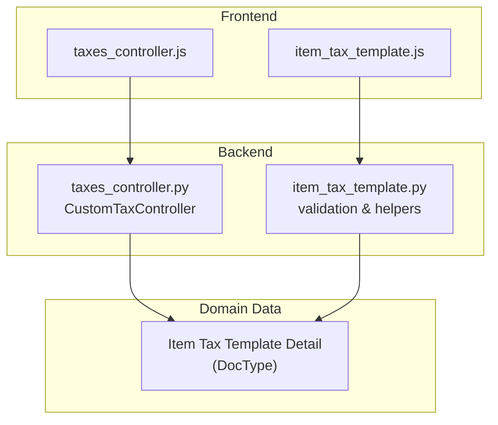
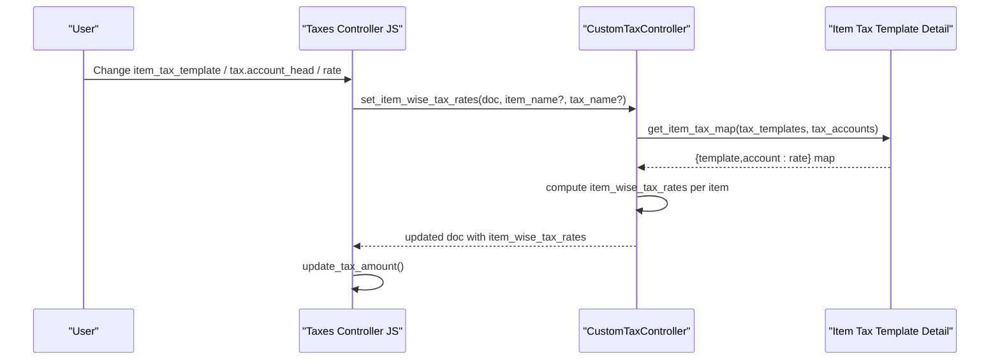
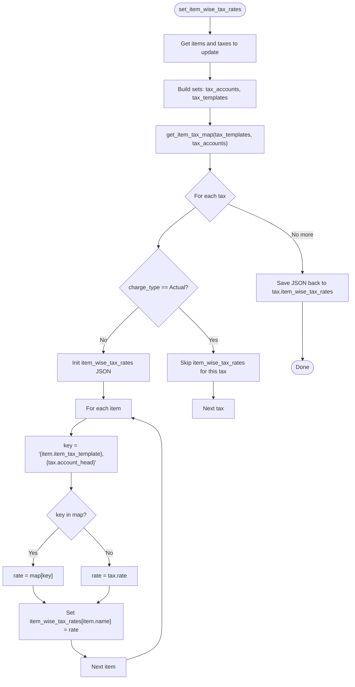
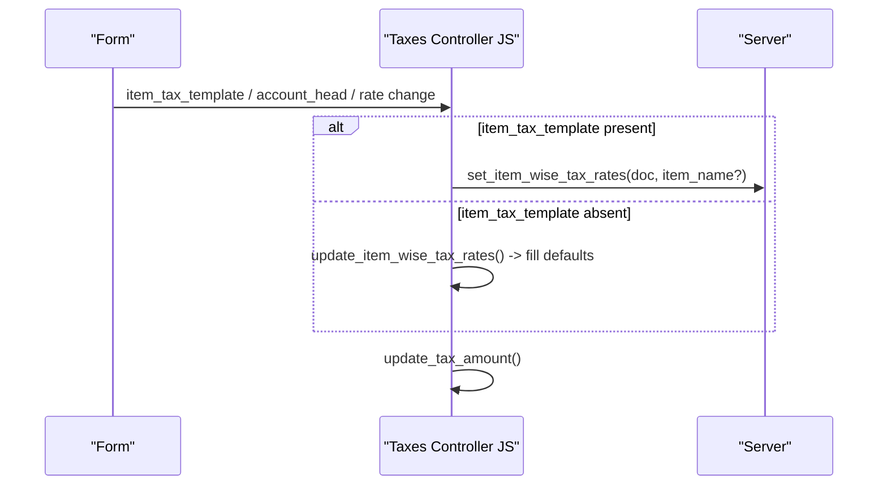
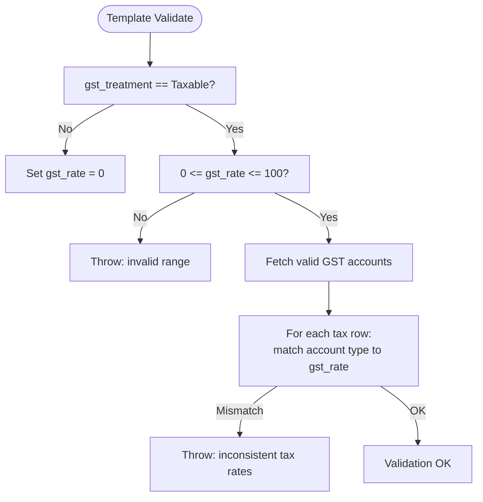
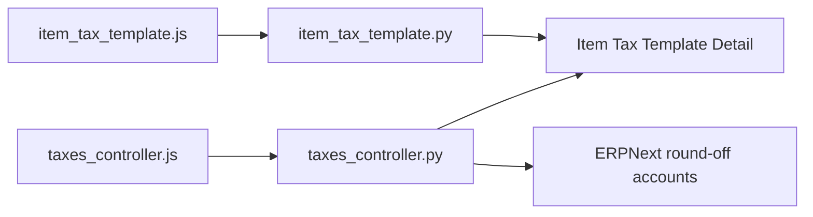

# GST Rate Application

<cite>
**Referenced Files in This Document**
- [taxes_controller.py](file://india_compliance/gst_india/utils/taxes_controller.py)
- [taxes_controller.js](file://india_compliance/public/js/taxes_controller.js)
- [item_tax_template.js](file://india_compliance/gst_india/client_scripts/item_tax_template.js)
- [item_tax_template.py](file://india_compliance/gst_india/overrides/item_tax_template.py)
- [custom_fields.py](file://india_compliance/gst_india/constants/custom_fields.py)
- [test_item_tax_template.py](file://india_compliance/gst_india/overrides/test_item_tax_template.py)
- [test_transaction.py](file://india_compliance/gst_india/overrides/test_transaction.py)
- [bill_of_entry.py](file://india_compliance/gst_india/doctype/bill_of_entry/bill_of_entry.py)
</cite>

## Table of Contents
1. [Introduction](#introduction)
2. [Project Structure](#project-structure)
3. [Core Components](#core-components)
4. [Architecture Overview](#architecture-overview)
5. [Detailed Component Analysis](#detailed-component-analysis)
6. [Dependency Analysis](#dependency-analysis)
7. [Performance Considerations](#performance-considerations)
8. [Troubleshooting Guide](#troubleshooting-guide)
9. [Conclusion](#conclusion)

## Introduction
This document explains the GST rate application logic in the India Compliance module, focusing on:
- Item-wise tax rate mapping
- Tax template integration via Item Tax Template and Item Tax Template Detail
- Dynamic rate calculation per item based on item_tax_template and account_head combinations
- Frontend and backend orchestration through CustomTaxController and client-side events
- Practical scenarios: single item, multi-item with different tax templates, and fallback behavior when item-wise rates are not defined
- Common issues and resolutions for missing templates, incorrect mappings, and validation failures

## Project Structure
The GST rate application spans Python backend utilities, JavaScript frontend controllers, and client scripts for Item Tax Template. The key areas are:
- Backend: CustomTaxController and helpers for item-wise tax mapping and tax computation
- Frontend: Taxes Controller JS for UI-driven updates and server synchronization
- Client Scripts: Item Tax Template JS for template maintenance and rate propagation
- Overrides and Tests: Validation and integration tests ensuring correctness

**Diagram sources**
- [taxes_controller.js](file://india_compliance/public/js/taxes_controller.js#L52-L287)
- [taxes_controller.py](file://india_compliance/gst_india/utils/taxes_controller.py#L104-L275)
- [item_tax_template.js](file://india_compliance/gst_india/client_scripts/item_tax_template.js#L1-L99)
- [item_tax_template.py](file://india_compliance/gst_india/overrides/item_tax_template.py#L1-L114)

**Section sources**
- [taxes_controller.py](file://india_compliance/gst_india/utils/taxes_controller.py#L104-L275)
- [taxes_controller.js](file://india_compliance/public/js/taxes_controller.js#L52-L287)
- [item_tax_template.js](file://india_compliance/gst_india/client_scripts/item_tax_template.js#L1-L99)
- [item_tax_template.py](file://india_compliance/gst_india/overrides/item_tax_template.py#L1-L114)

## Core Components
- CustomTaxController: Central backend logic for computing item-wise tax rates, building tax maps, and updating totals.
- CustomItemGSTDetails: Extends base item tax details to support item_wise_tax_rates and temporary item-wise tax detail objects.
- Taxes Controller JS: Frontend orchestration for item and tax updates, invoking server-side rate computation.
- Item Tax Template JS: Maintains template accounts and rates, detects missing accounts, and auto-populates rates.
- Item Tax Template Python: Validates template rates against company GST accounts and supports fetching valid GST accounts.

Key backend methods:
- set_item_wise_tax_rates(item_name, tax_name)
- get_item_tax_map(tax_templates, tax_accounts)
- update_tax_amount()
- update_base_grand_total()

Key frontend methods:
- set_item_wise_tax_rates(item_name, tax_name)
- update_item_wise_tax_rates(tax_row)
- process_tax_rate_update(cdt, cdn)

**Section sources**
- [taxes_controller.py](file://india_compliance/gst_india/utils/taxes_controller.py#L104-L275)
- [taxes_controller.js](file://india_compliance/public/js/taxes_controller.js#L52-L287)
- [item_tax_template.js](file://india_compliance/gst_india/client_scripts/item_tax_template.js#L1-L99)
- [item_tax_template.py](file://india_compliance/gst_india/overrides/item_tax_template.py#L1-L114)

## Architecture Overview
The system computes item-wise tax rates by combining:
- Item-level: item_tax_template and taxable value
- Tax-level: account_head and charge_type
- Master-level: Item Tax Template Detail records linking parent template and tax_type to tax_rate

**Diagram sources**
- [taxes_controller.js](file://india_compliance/public/js/taxes_controller.js#L109-L151)
- [taxes_controller.py](file://india_compliance/gst_india/utils/taxes_controller.py#L124-L153)
- [taxes_controller.py](file://india_compliance/gst_india/utils/taxes_controller.py#L184-L215)

## Detailed Component Analysis

### CustomTaxController: Item-wise Tax Rate Mapping and Dynamic Calculation
- Responsibilities:
  - Build item-wise tax rates per tax row using template-account mapping
  - Compute tax amounts per item based on charge_type and item_wise_tax_rates
  - Update totals and base grand total
- Key behaviors:
  - For each tax row, if not Actual, compute item_wise_tax_rates using get_item_tax_map keyed by "{item_tax_template},{account_head}"
  - Fallback to tax.rate when no mapping exists
  - Tax amount computed by summing item_wise_tax_rates × multiplier (quantity or taxable_value/100 depending on charge_type)
  - Round off applied for round-off accounts

**Diagram sources**
- [taxes_controller.py](file://india_compliance/gst_india/utils/taxes_controller.py#L124-L153)
- [taxes_controller.py](file://india_compliance/gst_india/utils/taxes_controller.py#L184-L215)

**Section sources**
- [taxes_controller.py](file://india_compliance/gst_india/utils/taxes_controller.py#L124-L153)
- [taxes_controller.py](file://india_compliance/gst_india/utils/taxes_controller.py#L159-L183)
- [taxes_controller.py](file://india_compliance/gst_india/utils/taxes_controller.py#L184-L215)

### CustomItemGSTDetails: Item-wise Tax Details Support
- Provides item-wise tax details for downstream consumers
- Builds temporary item-wise tax detail objects and structured item_wise_tax_details for patch/get operations
- Retrieves item tax rate from item_wise_tax_rates for a given item and tax row

**Section sources**
- [taxes_controller.py](file://india_compliance/gst_india/utils/taxes_controller.py#L17-L83)

### Frontend Taxes Controller: UI-driven Updates and Server Sync
- On item_tax_template change or tax.account_head change, triggers server-side recalculation
- On rate change, updates item_wise_tax_rates locally and then calls server to synchronize
- Supports removing Actual taxes and clearing item_wise_tax_rates for those rows

**Diagram sources**
- [taxes_controller.js](file://india_compliance/public/js/taxes_controller.js#L235-L287)
- [taxes_controller.js](file://india_compliance/public/js/taxes_controller.js#L109-L151)

**Section sources**
- [taxes_controller.js](file://india_compliance/public/js/taxes_controller.js#L52-L118)
- [taxes_controller.js](file://india_compliance/public/js/taxes_controller.js#L235-L287)

### Item Tax Template Integration and Validation
- Template validation ensures:
  - GST rate is non-zero for Taxable treatment
  - Tax rates align with template gst_rate for intra-state (half) and inter-state (full) accounts
  - Negative rates supported for specific reverse charge and refund accounts
- Client script auto-detects missing GST accounts and populates rates based on gst_rate and account type

**Diagram sources**
- [item_tax_template.py](file://india_compliance/gst_india/overrides/item_tax_template.py#L9-L68)
- [item_tax_template.js](file://india_compliance/gst_india/client_scripts/item_tax_template.js#L52-L67)

**Section sources**
- [item_tax_template.py](file://india_compliance/gst_india/overrides/item_tax_template.py#L9-L68)
- [item_tax_template.js](file://india_compliance/gst_india/client_scripts/item_tax_template.js#L1-L99)

### Practical Scenarios and Examples

#### Scenario 1: Single Item with Template
- An item has item_tax_template "GST 18% - TC" and account_head "IGST - TC".
- get_item_tax_map returns a mapping for key "GST 18% - TC,IGST - TC" with rate 18.
- item_wise_tax_rates for the item becomes 18.
- Tax amount computed as taxable_value × (18/100) or quantity × rate depending on charge_type.

**Section sources**
- [taxes_controller.py](file://india_compliance/gst_india/utils/taxes_controller.py#L124-L153)
- [taxes_controller.py](file://india_compliance/gst_india/utils/taxes_controller.py#L233-L246)

#### Scenario 2: Multi-item Transaction with Different Tax Templates
- Item A: template "GST 28% - TC" → IGST 28% → item_wise_tax_rates = 28
- Item B: template "GST 12% - TC" → CGST/SGST 6% each → item_wise_tax_rates = 6 for each
- Computation sums per-item tax amounts derived from item_wise_tax_rates × multiplier.

**Section sources**
- [test_transaction.py](file://india_compliance/gst_india/overrides/test_transaction.py#L217-L234)

#### Scenario 3: Fallback When Item-wise Rates Are Not Defined
- If item.item_tax_template is empty or mapping not found, the system falls back to tax.rate for that item.
- This ensures transactions remain calculable even when template-account mappings are incomplete.

**Section sources**
- [taxes_controller.py](file://india_compliance/gst_india/utils/taxes_controller.py#L147-L151)

#### Scenario 4: Bill of Entry Item Tax Template Validation
- During validation, the system checks item and item group taxes against the resolved template and validates presence of required template entries.

**Section sources**
- [bill_of_entry.py](file://india_compliance/gst_india/doctype/bill_of_entry/bill_of_entry.py#L268-L298)

## Dependency Analysis
- CustomTaxController depends on:
  - Item Tax Template Detail for mapping template + account to rate
  - ERPNext round-off accounts for rounding tax amounts
  - Company-level GST accounts for validation and negative-rate handling
- Frontend Taxes Controller depends on:
  - Server endpoint to compute item_wise_tax_rates
  - Local item_wise_tax_rates for immediate UI updates when template is removed

**Diagram sources**
- [taxes_controller.js](file://india_compliance/public/js/taxes_controller.js#L109-L151)
- [taxes_controller.py](file://india_compliance/gst_india/utils/taxes_controller.py#L184-L215)
- [item_tax_template.js](file://india_compliance/gst_india/client_scripts/item_tax_template.js#L82-L98)
- [item_tax_template.py](file://india_compliance/gst_india/overrides/item_tax_template.py#L70-L77)

**Section sources**
- [taxes_controller.py](file://india_compliance/gst_india/utils/taxes_controller.py#L184-L215)
- [taxes_controller.js](file://india_compliance/public/js/taxes_controller.js#L109-L151)
- [item_tax_template.py](file://india_compliance/gst_india/overrides/item_tax_template.py#L70-L77)
- [item_tax_template.js](file://india_compliance/gst_india/client_scripts/item_tax_template.js#L82-L98)

## Performance Considerations
- Minimize repeated server calls by batching updates in the frontend (e.g., update_taxes followed by set_item_wise_tax_rates).
- Template-account mapping is queried once per update cycle and cached in memory; avoid unnecessary recalculations.
- For large documents, prefer targeted updates by passing item_name or tax_name to limit scope.

## Troubleshooting Guide

Common Issues and Resolutions:
- Missing Item Tax Template
  - Symptom: Items lack item_wise_tax_rates; tax computation fails or defaults incorrectly.
  - Resolution: Assign a valid item_tax_template to items. If template is missing, create one aligned with company GST accounts and rates.

- Incorrect Rate Mappings
  - Symptom: Validation error indicating inconsistent tax rates for intra-state or inter-state accounts.
  - Resolution: Ensure template gst_rate matches tax_rate for intra-state accounts (half) and inter-state accounts (full). Negative rates allowed for specific reverse charge/refund accounts.

- Validation Failures
  - Symptom: ValidationError for zero GST rate on Taxable treatment or out-of-range rates.
  - Resolution: Set gst_rate > 0 for Taxable; keep within 0–100. Use template validation to auto-correct rates.

- Fallback to Default Rate
  - Symptom: Items show tax.rate instead of template-derived rate.
  - Resolution: Confirm item_tax_template and account_head combination exists in Item Tax Template Detail. If not, either define the mapping or rely on fallback to tax.rate.

- BOE Template Validation Failure
  - Symptom: Bill of Entry validation errors due to missing template entries for item or item group.
  - Resolution: Ensure item and item group taxes include required template entries; re-run validation after corrections.

**Section sources**
- [item_tax_template.py](file://india_compliance/gst_india/overrides/item_tax_template.py#L27-L68)
- [test_item_tax_template.py](file://india_compliance/gst_india/overrides/test_item_tax_template.py#L26-L51)
- [bill_of_entry.py](file://india_compliance/gst_india/doctype/bill_of_entry/bill_of_entry.py#L268-L298)

## Conclusion
The GST rate application logic integrates template-driven mappings with dynamic per-item calculations. CustomTaxController orchestrates item-wise tax rate computation using Item Tax Template Detail, while the frontend ensures real-time updates and seamless server synchronization. Robust validation and fallback mechanisms protect against missing templates and incorrect mappings, enabling reliable tax computations across diverse transaction scenarios.