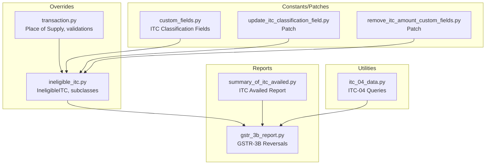
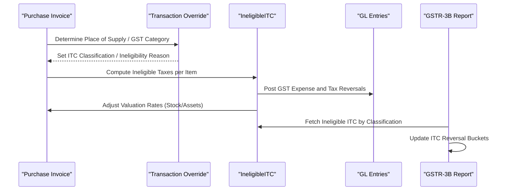
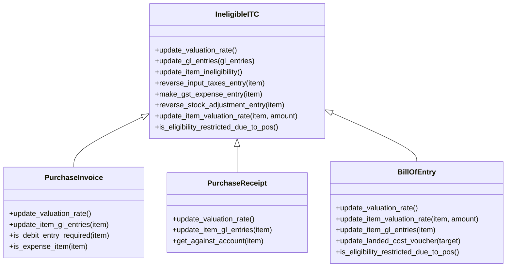
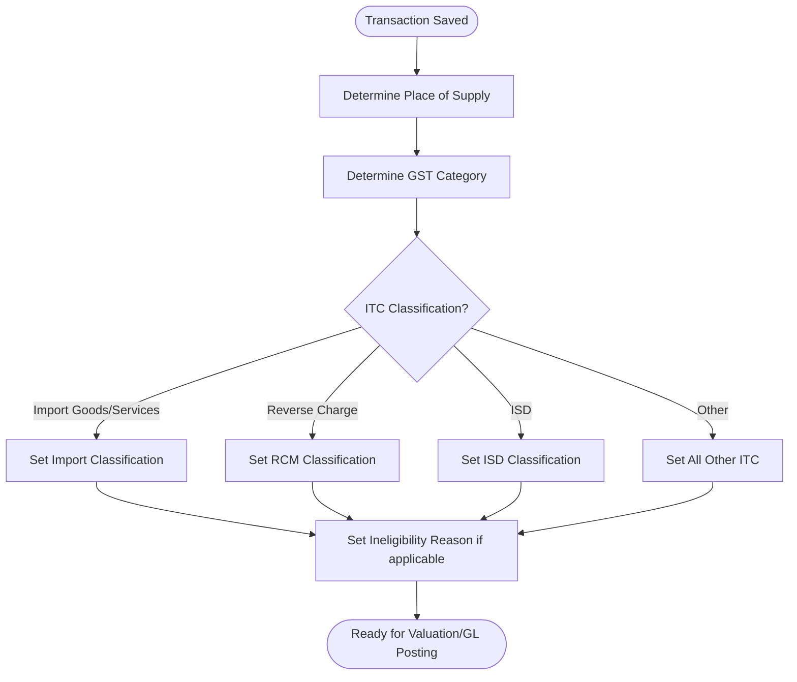
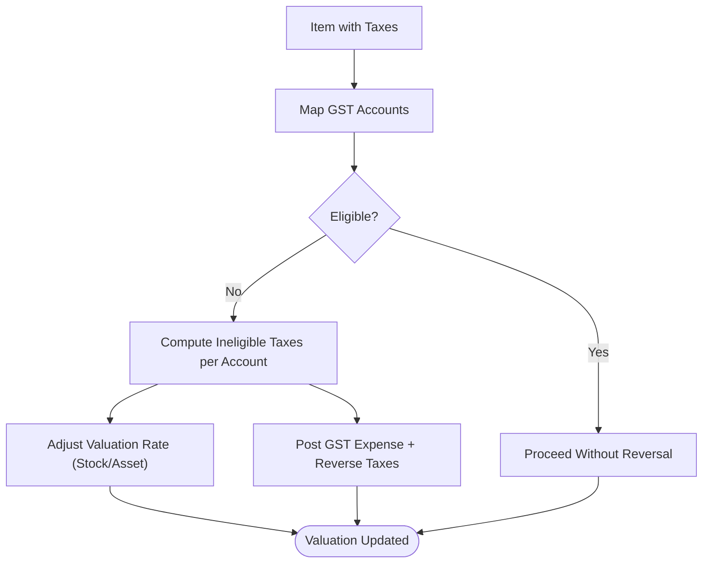
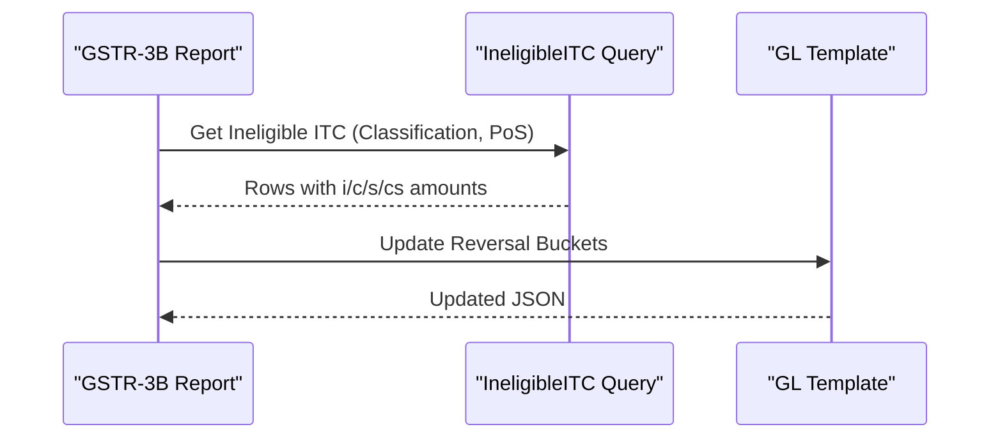
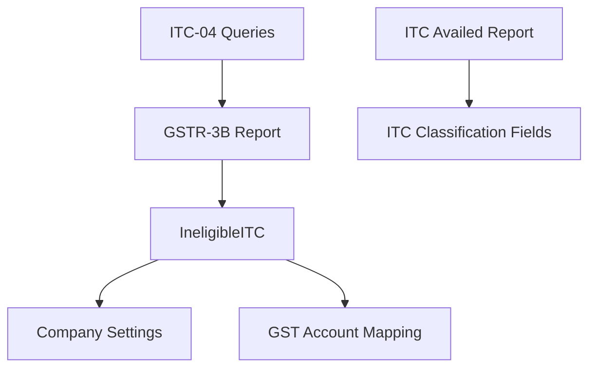

# ITC Management

<cite>
**Referenced Files in This Document**
- [ineligible_itc.py](file://india_compliance/gst_india/overrides/ineligible_itc.py)
- [test_ineligible_itc.py](file://india_compliance/gst_india/overrides/test_ineligible_itc.py)
- [gstr_3b_report.py](file://india_compliance/gst_india/doctype/gstr_3b_report/gstr_3b_report.py)
- [summary_of_itc_availed.py](file://india_compliance/gst_india/report/summary_of_itc_availed/summary_of_itc_availed.py)
- [itc_04_data.py](file://india_compliance/gst_india/utils/itc_04/itc_04_data.py)
- [transaction.py](file://india_compliance/gst_india/overrides/transaction.py)
- [custom_fields.py](file://india_compliance/gst_india/constants/custom_fields.py)
- [update_itc_classification_field.py](file://india_compliance/patches/post_install/update_itc_classification_field.py)
- [remove_itc_amount_custom_fields.py](file://india_compliance/patches/v15/remove_itc_amount_custom_fields.py)
</cite>

## Table of Contents
1. [Introduction](#introduction)
2. [Project Structure](#project-structure)
3. [Core Components](#core-components)
4. [Architecture Overview](#architecture-overview)
5. [Detailed Component Analysis](#detailed-component-analysis)
6. [Dependency Analysis](#dependency-analysis)
7. [Performance Considerations](#performance-considerations)
8. [Troubleshooting Guide](#troubleshooting-guide)
9. [Conclusion](#conclusion)

## Introduction
This document explains the Input Tax Credit (ITC) management capabilities implemented in the India Compliance module. It covers:
- ITC eligibility validation and classification
- Credit utilization rules and reporting
- Ineligible ITC handling via GST Expense entries and valuation adjustments
- Calculation workflow, partial applications, and carry-forward mechanisms
- Validation based on transaction type, supplier GSTIN, and goods/services received
- Practical scenarios, including mismatches, ineligible purchases, and timing differences

## Project Structure
Key modules involved in ITC management:
- Overrides for transactions and ITC handling
- Reports for ITC classification and GSTR-3B reconciliation
- Utilities for ITC-related exports and queries
- Patch scripts to maintain backward compatibility and clean obsolete fields

**Diagram sources**
- [ineligible_itc.py](file://india_compliance/gst_india/overrides/ineligible_itc.py#L18-L505)
- [transaction.py](file://india_compliance/gst_india/overrides/transaction.py#L176-L200)
- [gstr_3b_report.py](file://india_compliance/gst_india/doctype/gstr_3b_report/gstr_3b_report.py#L147-L214)
- [summary_of_itc_availed.py](file://india_compliance/gst_india/report/summary_of_itc_availed/summary_of_itc_availed.py#L25-L268)
- [itc_04_data.py](file://india_compliance/gst_india/utils/itc_04/itc_04_data.py#L13-L243)
- [custom_fields.py](file://india_compliance/gst_india/constants/custom_fields.py#L978-L1014)
- [update_itc_classification_field.py](file://india_compliance/patches/post_install/update_itc_classification_field.py#L15-L42)
- [remove_itc_amount_custom_fields.py](file://india_compliance/patches/v15/remove_itc_amount_custom_fields.py#L1-L15)

**Section sources**
- [ineligible_itc.py](file://india_compliance/gst_india/overrides/ineligible_itc.py#L18-L505)
- [gstr_3b_report.py](file://india_compliance/gst_india/doctype/gstr_3b_report/gstr_3b_report.py#L147-L214)
- [summary_of_itc_availed.py](file://india_compliance/gst_india/report/summary_of_itc_availed/summary_of_itc_availed.py#L25-L268)
- [itc_04_data.py](file://india_compliance/gst_india/utils/itc_04/itc_04_data.py#L13-L243)
- [custom_fields.py](file://india_compliance/gst_india/constants/custom_fields.py#L978-L1014)
- [update_itc_classification_field.py](file://india_compliance/patches/post_install/update_itc_classification_field.py#L15-L42)
- [remove_itc_amount_custom_fields.py](file://india_compliance/patches/v15/remove_itc_amount_custom_fields.py#L1-L15)

## Core Components
- IneligibleITC and subclasses (PurchaseInvoice, PurchaseReceipt, BillOfEntry)
  - Validates item-level ITC eligibility
  - Computes proportionate ineligible taxes per GST account
  - Adjusts valuation rates for stock/asset items
  - Books GST Expense and reversals in GL entries
- Transaction override helpers
  - Place of supply determination and validations
  - GST category and treatment checks
- GSTR-3B reconciliation
  - Pulls ineligible ITC by classification and PoS rules
  - Updates ITC reversal buckets in the GSTR-3B JSON template
- ITC Availed report
  - Classifies purchases by category and subcategory
  - Aggregates IGST/CGST/SGST/Cess amounts
- ITC-04 export utilities
  - Builds queries for job worker tables (Table-4 and Table-5A)
- Custom fields and patches
  - ITC Classification and Ineligibility Reason fields
  - Migration patches to align legacy fields

**Section sources**
- [ineligible_itc.py](file://india_compliance/gst_india/overrides/ineligible_itc.py#L18-L505)
- [transaction.py](file://india_compliance/gst_india/overrides/transaction.py#L176-L200)
- [gstr_3b_report.py](file://india_compliance/gst_india/doctype/gstr_3b_report/gstr_3b_report.py#L147-L214)
- [summary_of_itc_availed.py](file://india_compliance/gst_india/report/summary_of_itc_availed/summary_of_itc_availed.py#L25-L268)
- [itc_04_data.py](file://india_compliance/gst_india/utils/itc_04/itc_04_data.py#L13-L243)
- [custom_fields.py](file://india_compliance/gst_india/constants/custom_fields.py#L978-L1014)
- [update_itc_classification_field.py](file://india_compliance/patches/post_install/update_itc_classification_field.py#L15-L42)
- [remove_itc_amount_custom_fields.py](file://india_compliance/patches/v15/remove_itc_amount_custom_fields.py#L1-L15)

## Architecture Overview
End-to-end ITC lifecycle:
- Validation: Place of supply and GST category determine eligibility and classification
- Classification: ITC Classification and Ineligibility Reason fields drive downstream logic
- Valuation: Ineligible taxes adjust stock/asset valuation rates
- Accounting: GST Expense entries and tax reversals are posted
- Reporting: ITC Availed report and GSTR-3B reconciliation reflect eligible vs. ineligible ITC

**Diagram sources**
- [transaction.py](file://india_compliance/gst_india/overrides/transaction.py#L176-L200)
- [ineligible_itc.py](file://india_compliance/gst_india/overrides/ineligible_itc.py#L75-L139)
- [gstr_3b_report.py](file://india_compliance/gst_india/doctype/gstr_3b_report/gstr_3b_report.py#L152-L214)

## Detailed Component Analysis

### IneligibleITC and Subclasses
Responsibilities:
- Detects ineligibility reasons (Section 17(5) and PoS restrictions)
- Computes per-item ineligible taxes mapped to GST accounts
- Adjusts valuation rate for stock/asset items
- Posts GL entries:
  - GST Expense Dr for ineligible taxes
  - Reverse tax credits per GST account head
  - Expense transfers for non-stock/asset items
- Handles Purchase Receipt and Bill of Entry specifics (stock adjustment reversals, landed cost integration)

**Diagram sources**
- [ineligible_itc.py](file://india_compliance/gst_india/overrides/ineligible_itc.py#L18-L505)

**Section sources**
- [ineligible_itc.py](file://india_compliance/gst_india/overrides/ineligible_itc.py#L18-L505)

### ITC Eligibility Validation and Classification
- Place of supply and GST category are validated during transaction processing.
- ITC Classification and Ineligibility Reason fields are populated based on:
  - Import of goods/services
  - Reverse charge
  - Input Service Distributor
  - Defaults for other purchases
- Legacy eligibility_for_itc and reversal_type fields were migrated to new fields via patches.

**Diagram sources**
- [transaction.py](file://india_compliance/gst_india/overrides/transaction.py#L176-L200)
- [custom_fields.py](file://india_compliance/gst_india/constants/custom_fields.py#L978-L1014)
- [update_itc_classification_field.py](file://india_compliance/patches/post_install/update_itc_classification_field.py#L15-L42)

**Section sources**
- [transaction.py](file://india_compliance/gst_india/overrides/transaction.py#L176-L200)
- [custom_fields.py](file://india_compliance/gst_india/constants/custom_fields.py#L978-L1014)
- [update_itc_classification_field.py](file://india_compliance/patches/post_install/update_itc_classification_field.py#L15-L42)

### ITC Calculation Workflow and Partial Applications
- Per-item computation:
  - Sums GST tax components per item and maps to GST account heads
  - Stores proportionate ineligible tax per account and total ineligible amount
- Partial applications:
  - For stock/asset items, valuation rates are adjusted upward by ineligible tax
  - For expense items, GST Expense is debited and tax accounts credited
- Returns:
  - Negative amounts are handled consistently for returns

**Diagram sources**
- [ineligible_itc.py](file://india_compliance/gst_india/overrides/ineligible_itc.py#L277-L314)

**Section sources**
- [ineligible_itc.py](file://india_compliance/gst_india/overrides/ineligible_itc.py#L277-L314)

### Carry-forward Mechanisms
- GSTR-3B reconciliation:
  - Pulls ineligible ITC grouped by classification and reason
  - Updates ITC reversal buckets for the period
- ITC Availed report:
  - Aggregates eligible ITC by category and subcategory
  - Supports filtering by company and GSTIN

**Diagram sources**
- [gstr_3b_report.py](file://india_compliance/gst_india/doctype/gstr_3b_report/gstr_3b_report.py#L152-L214)

**Section sources**
- [gstr_3b_report.py](file://india_compliance/gst_india/doctype/gstr_3b_report/gstr_3b_report.py#L152-L214)
- [summary_of_itc_availed.py](file://india_compliance/gst_india/report/summary_of_itc_availed/summary_of_itc_availed.py#L181-L268)

### Practical Scenarios and Examples
- Ineligible under Section 17(5):
  - Full or partial ITC reversed depending on item composition
  - GST Expense debits and tax account credits recorded
- Ineligible due to PoS rules:
  - IGST-only reversal for out-state supplies
  - Expense items may retain partial ITC while stock/assets reverse full ineligible portion
- Returns:
  - Reversals are posted with opposite signs for returns
- Job worker transactions:
  - ITC-04 queries support Table-4 (sent to job worker) and Table-5A (received from job worker)

**Section sources**
- [test_ineligible_itc.py](file://india_compliance/gst_india/overrides/test_ineligible_itc.py#L110-L507)
- [itc_04_data.py](file://india_compliance/gst_india/utils/itc_04/itc_04_data.py#L26-L243)

## Dependency Analysis
- IneligibleITC depends on:
  - Company settings (default GST expense account)
  - Perpetual inventory settings
  - GST account mapping per tax type
- GSTR-3B depends on:
  - IneligibleITC query results
  - GST account types and tax mappings
- Reports depend on:
  - ITC Classification and Ineligibility Reason fields
  - Filters by date range, company, and GSTIN

**Diagram sources**
- [ineligible_itc.py](file://india_compliance/gst_india/overrides/ineligible_itc.py#L22-L83)
- [gstr_3b_report.py](file://india_compliance/gst_india/doctype/gstr_3b_report/gstr_3b_report.py#L152-L214)
- [summary_of_itc_availed.py](file://india_compliance/gst_india/report/summary_of_itc_availed/summary_of_itc_availed.py#L102-L178)
- [itc_04_data.py](file://india_compliance/gst_india/utils/itc_04/itc_04_data.py#L13-L243)

**Section sources**
- [ineligible_itc.py](file://india_compliance/gst_india/overrides/ineligible_itc.py#L22-L83)
- [gstr_3b_report.py](file://india_compliance/gst_india/doctype/gstr_3b_report/gstr_3b_report.py#L152-L214)
- [summary_of_itc_availed.py](file://india_compliance/gst_india/report/summary_of_itc_availed/summary_of_itc_availed.py#L102-L178)
- [itc_04_data.py](file://india_compliance/gst_india/utils/itc_04/itc_04_data.py#L13-L243)

## Performance Considerations
- Batch processing:
  - IneligibleITC computes per item; ensure item counts are reasonable
  - Use filters in reports to limit scope
- Valuation adjustments:
  - Stock/asset valuation updates are precise; avoid unnecessary reposts
- Reconciliation:
  - GSTR-3B pulls ineligible ITC by classification; grouping reduces overhead

## Troubleshooting Guide
Common issues and resolutions:
- Missing Default GST Expense Account:
  - Resolution: Set default GST expense account in Company; otherwise posting throws an error
- Ineligible ITC not appearing in GSTR-3B:
  - Resolution: Verify ITC Classification and Ineligibility Reason; ensure records fall within the selected period
- Mismatched GSTIN:
  - Resolution: Confirm supplier GSTIN and company GSTIN; ensure place of supply is correctly derived
- Timing differences:
  - Resolution: Align posting dates with reporting periods; reconcile using Purchase Reconciliation Tool
- Obsolete fields:
  - Resolution: Patches migrate legacy fields; confirm cleanup completed

**Section sources**
- [ineligible_itc.py](file://india_compliance/gst_india/overrides/ineligible_itc.py#L62-L67)
- [custom_fields.py](file://india_compliance/gst_india/constants/custom_fields.py#L978-L1014)
- [update_itc_classification_field.py](file://india_compliance/patches/post_install/update_itc_classification_field.py#L15-L42)
- [remove_itc_amount_custom_fields.py](file://india_compliance/patches/v15/remove_itc_amount_custom_fields.py#L1-L15)

## Conclusion
The ITC management implementation integrates eligibility validation, classification, valuation adjustments, and comprehensive reporting. It supports both full and partial ITC reversals, handles returns and job worker transactions, and aligns with GSTR-3B reconciliation and ITC Availed reporting. Proper configuration of GST expense accounts, classification fields, and timely reconciliations ensures accurate ITC handling across transactions.