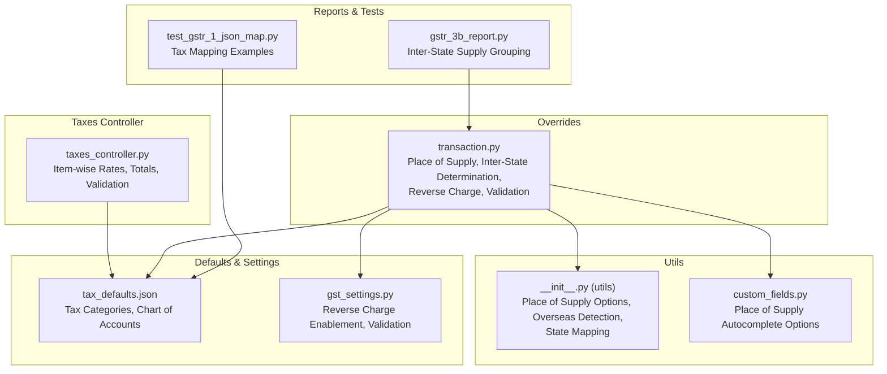
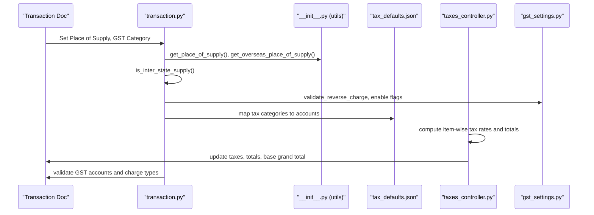
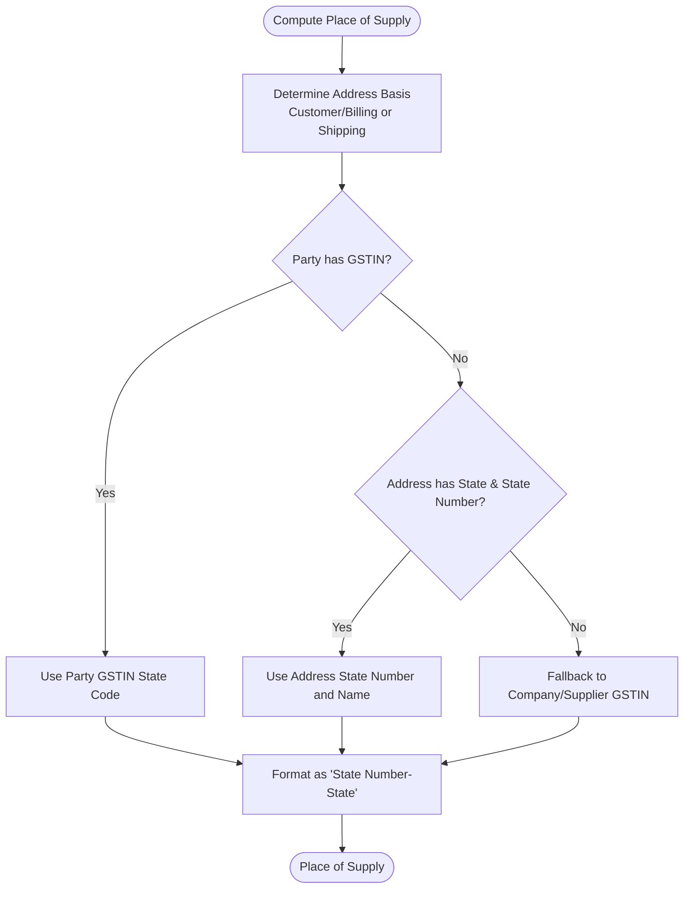
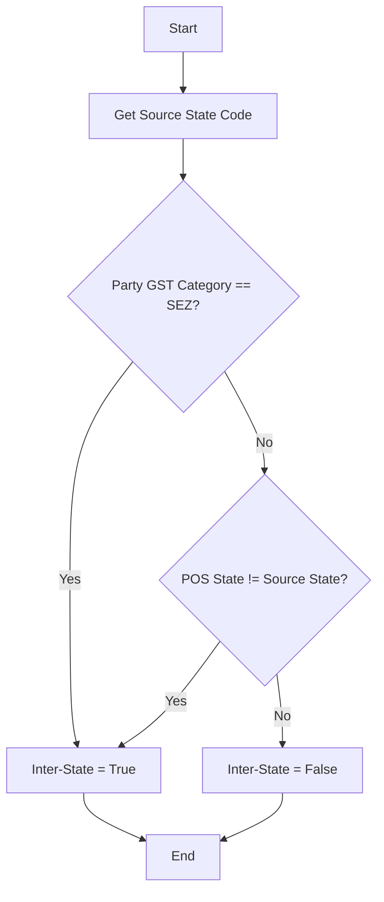
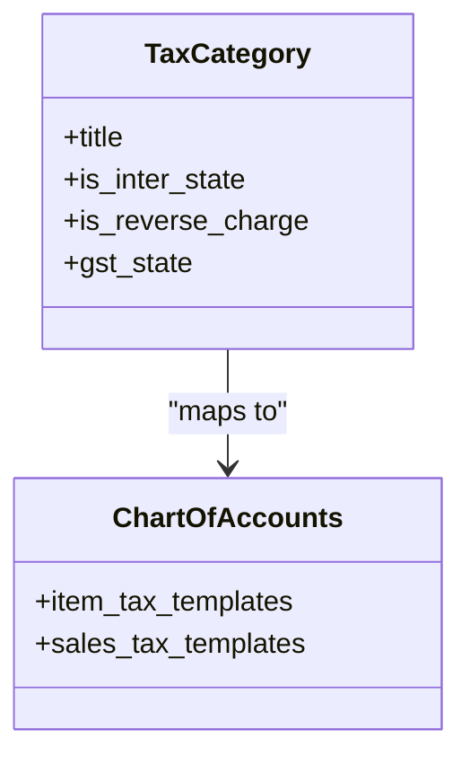
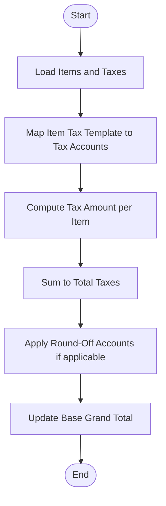
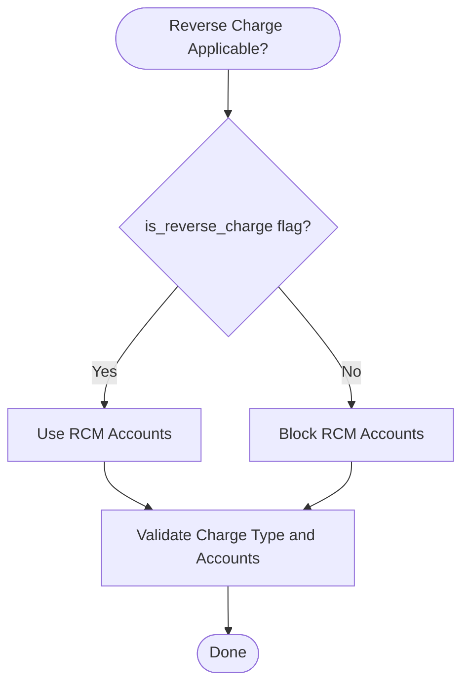
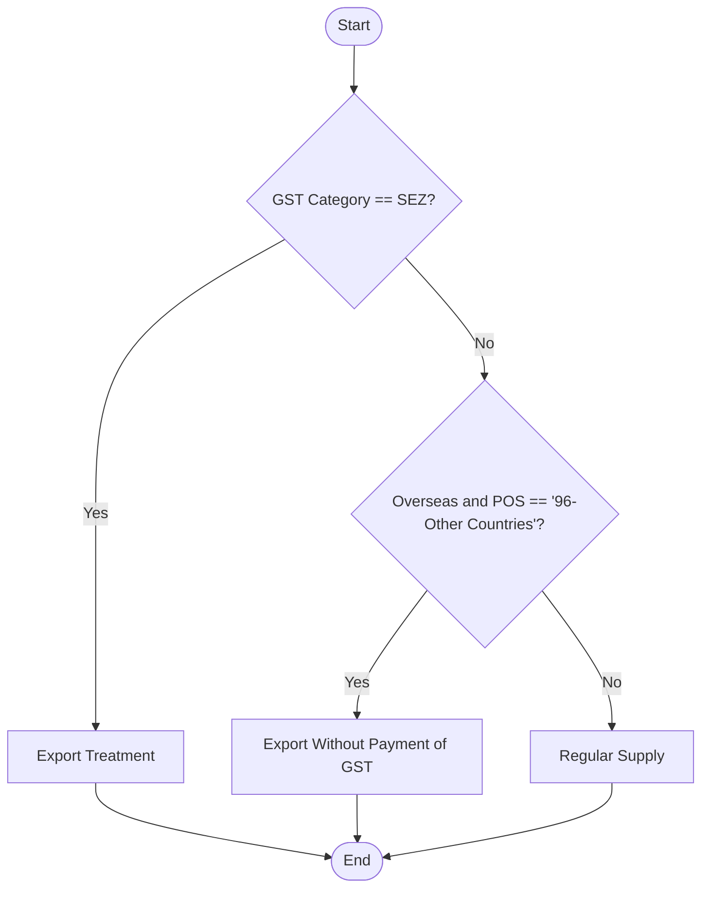
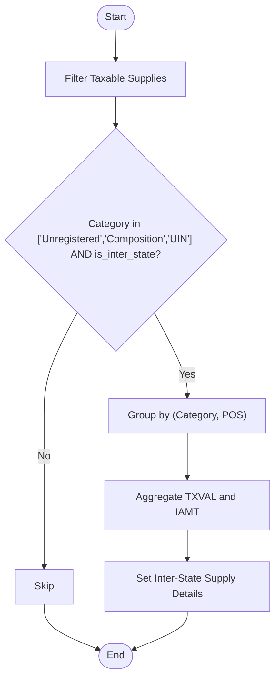
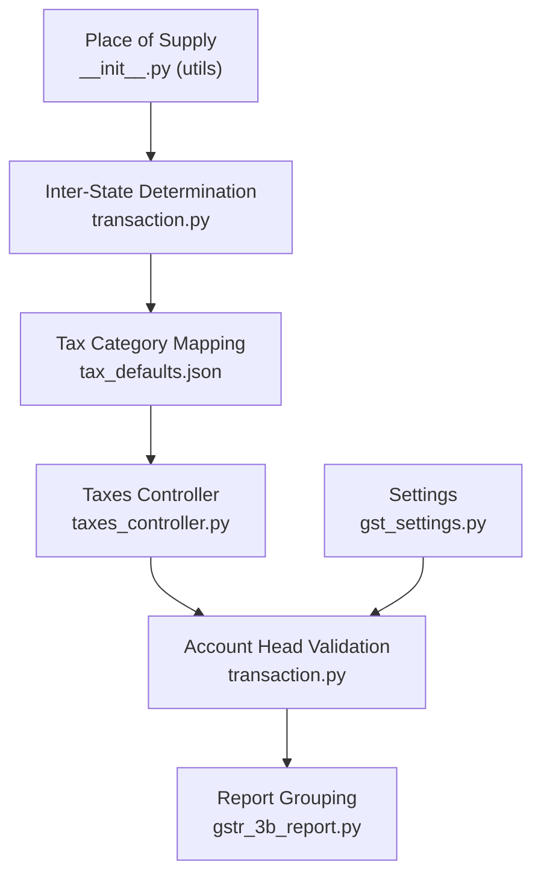

# Multi-State Calculations

<cite>
**Referenced Files in This Document**
- [taxes_controller.py](file://india_compliance/gst_india/utils/taxes_controller.py)
- [transaction.py](file://india_compliance/gst_india/overrides/transaction.py)
- [__init__.py (utils)](file://india_compliance/gst_india/utils/__init__.py)
- [custom_fields.py](file://india_compliance/gst_india/constants/custom_fields.py)
- [tax_defaults.json](file://india_compliance/gst_india/data/tax_defaults.json)
- [gst_settings.py](file://india_compliance/gst_india/doctype/gst_settings/gst_settings.py)
- [gstr_3b_report.py](file://india_compliance/gst_india/doctype/gstr_3b_report/gstr_3b_report.py)
- [test_gstr_1_json_map.py](file://india_compliance/gst_india/utils/gstr_1/test_gstr_1_json_map.py)
- [__init__.py (constants)](file://india_compliance/gst_india/constants/__init__.py)
</cite>

## Table of Contents
1. [Introduction](#introduction)
2. [Project Structure](#project-structure)
3. [Core Components](#core-components)
4. [Architecture Overview](#architecture-overview)
5. [Detailed Component Analysis](#detailed-component-analysis)
6. [Dependency Analysis](#dependency-analysis)
7. [Performance Considerations](#performance-considerations)
8. [Troubleshooting Guide](#troubleshooting-guide)
9. [Conclusion](#conclusion)
10. [Appendices](#appendices)

## Introduction
This document explains multi-state tax calculation logic in the India Compliance module, focusing on:
- Inter-state vs intra-state tax computations
- IGST vs CGST/SGST application
- Place of supply determination
- Reverse charge mechanisms
- Export transactions and supplies to special category states
- Practical examples and common calculation errors with solutions

It consolidates how the system determines tax type, applies appropriate tax heads, and maps them to accounting entries across sales and purchase documents.

## Project Structure
The multi-state tax logic spans several modules:
- Transaction overrides for validation, place-of-supply derivation, and inter-state determination
- Utilities for place-of-supply options, state/state number mapping, and overseas determination
- Tax controller utilities for item-wise tax rates and totals computation
- Defaults and templates for tax categories and chart of accounts
- Settings for enabling reverse charge and related validations
- Reports and tests that validate inter-state supply grouping and tax mapping

**Diagram sources**
- [transaction.py](file://india_compliance/gst_india/overrides/transaction.py#L581-L660)
- [__init__.py (utils)](file://india_compliance/gst_india/utils/__init__.py#L382-L484)
- [custom_fields.py](file://india_compliance/gst_india/constants/custom_fields.py#L125-L134)
- [taxes_controller.py](file://india_compliance/gst_india/utils/taxes_controller.py#L104-L275)
- [tax_defaults.json](file://india_compliance/gst_india/data/tax_defaults.json#L1-L963)
- [gst_settings.py](file://india_compliance/gst_india/doctype/gst_settings/gst_settings.py#L180-L191)
- [gstr_3b_report.py](file://india_compliance/gst_india/doctype/gstr_3b_report/gstr_3b_report.py#L610-L639)
- [test_gstr_1_json_map.py](file://india_compliance/gst_india/utils/gstr_1/test_gstr_1_json_map.py#L1095-L1130)

**Section sources**
- [transaction.py](file://india_compliance/gst_india/overrides/transaction.py#L581-L660)
- [__init__.py (utils)](file://india_compliance/gst_india/utils/__init__.py#L382-L484)
- [custom_fields.py](file://india_compliance/gst_india/constants/custom_fields.py#L125-L134)
- [taxes_controller.py](file://india_compliance/gst_india/utils/taxes_controller.py#L104-L275)
- [tax_defaults.json](file://india_compliance/gst_india/data/tax_defaults.json#L1-L963)
- [gst_settings.py](file://india_compliance/gst_india/doctype/gst_settings/gst_settings.py#L180-L191)
- [gstr_3b_report.py](file://india_compliance/gst_india/doctype/gstr_3b_report/gstr_3b_report.py#L610-L639)
- [test_gstr_1_json_map.py](file://india_compliance/gst_india/utils/gstr_1/test_gstr_1_json_map.py#L1095-L1130)

## Core Components
- Place of supply determination and validation
- Inter-state determination logic
- Tax category and chart of accounts mapping
- Item-wise tax rate computation and totals
- Reverse charge and export validations
- Inter-state supply grouping in reports

**Section sources**
- [transaction.py](file://india_compliance/gst_india/overrides/transaction.py#L581-L660)
- [__init__.py (utils)](file://india_compliance/gst_india/utils/__init__.py#L402-L484)
- [tax_defaults.json](file://india_compliance/gst_india/data/tax_defaults.json#L1-L963)
- [taxes_controller.py](file://india_compliance/gst_india/utils/taxes_controller.py#L104-L275)
- [gst_settings.py](file://india_compliance/gst_india/doctype/gst_settings/gst_settings.py#L180-L191)
- [gstr_3b_report.py](file://india_compliance/gst_india/doctype/gstr_3b_report/gstr_3b_report.py#L610-L639)

## Architecture Overview
The multi-state tax architecture integrates place-of-supply logic, inter-state detection, and tax application rules into transaction workflows. It validates and computes taxes, ensures correct account heads are used, and aggregates inter-state supplies for reporting.

**Diagram sources**
- [transaction.py](file://india_compliance/gst_india/overrides/transaction.py#L581-L660)
- [__init__.py (utils)](file://india_compliance/gst_india/utils/__init__.py#L402-L484)
- [tax_defaults.json](file://india_compliance/gst_india/data/tax_defaults.json#L1-L963)
- [taxes_controller.py](file://india_compliance/gst_india/utils/taxes_controller.py#L104-L275)
- [gst_settings.py](file://india_compliance/gst_india/doctype/gst_settings/gst_settings.py#L180-L191)

## Detailed Component Analysis

### Place of Supply Determination
- Determines POS based on customer/billing address, shipping address, and GSTIN presence.
- Overseas transactions derive POS differently, considering shipping address within India.
- Provides autocomplete options for POS selection.

**Diagram sources**
- [__init__.py (utils)](file://india_compliance/gst_india/utils/__init__.py#L402-L484)
- [custom_fields.py](file://india_compliance/gst_india/constants/custom_fields.py#L125-L134)

**Section sources**
- [__init__.py (utils)](file://india_compliance/gst_india/utils/__init__.py#L402-L484)
- [custom_fields.py](file://india_compliance/gst_india/constants/custom_fields.py#L125-L134)

### Inter-State Determination
- Inter-state is determined when the POS state differs from the supplier’s source state.
- Special cases: SEZ supplies are treated as inter-state; overseas exports with shipping within India use the shipping address state.

**Diagram sources**
- [transaction.py](file://india_compliance/gst_india/overrides/transaction.py#L615-L626)

**Section sources**
- [transaction.py](file://india_compliance/gst_india/overrides/transaction.py#L615-L626)

### Tax Category and Account Mapping
- Tax categories define intra-state vs inter-state and reverse charge applicability.
- Chart of accounts defines which tax heads apply for each category and rate.
- Defaults include separate mappings for output/input tax templates and intra/inter-state.

**Diagram sources**
- [tax_defaults.json](file://india_compliance/gst_india/data/tax_defaults.json#L1-L963)

**Section sources**
- [tax_defaults.json](file://india_compliance/gst_india/data/tax_defaults.json#L1-L963)

### Item-wise Tax Rates and Totals
- Computes item-wise tax rates from item tax templates and applies them to amounts or quantities.
- Supports actual, on-item-quantity, and percentage-based charge types.
- Validates round-off accounts and updates totals accordingly.

**Diagram sources**
- [taxes_controller.py](file://india_compliance/gst_india/utils/taxes_controller.py#L104-L275)

**Section sources**
- [taxes_controller.py](file://india_compliance/gst_india/utils/taxes_controller.py#L104-L275)

### Reverse Charge Mechanisms
- Validates reverse charge usage based on transaction type and party category.
- Ensures correct RCM accounts are used only when reverse charge is applicable.
- Settings control enabling reverse charge in sales.

**Diagram sources**
- [transaction.py](file://india_compliance/gst_india/overrides/transaction.py#L366-L411)
- [gst_settings.py](file://india_compliance/gst_india/doctype/gst_settings/gst_settings.py#L187-L190)

**Section sources**
- [transaction.py](file://india_compliance/gst_india/overrides/transaction.py#L366-L411)
- [gst_settings.py](file://india_compliance/gst_india/doctype/gst_settings/gst_settings.py#L187-L190)

### Export and Special Category Treatments
- Overseas and SEZ supplies are handled separately with specific place-of-supply rules.
- Export without payment of GST is validated and restricted for charging output tax.
- Tests demonstrate tax mapping for exports and deemed exports.

**Diagram sources**
- [__init__.py (utils)](file://india_compliance/gst_india/utils/__init__.py#L364-L384)
- [transaction.py](file://india_compliance/gst_india/overrides/transaction.py#L385-L390)
- [test_gstr_1_json_map.py](file://india_compliance/gst_india/utils/gstr_1/test_gstr_1_json_map.py#L1095-L1130)

**Section sources**
- [__init__.py (utils)](file://india_compliance/gst_india/utils/__init__.py#L364-L384)
- [transaction.py](file://india_compliance/gst_india/overrides/transaction.py#L385-L390)
- [test_gstr_1_json_map.py](file://india_compliance/gst_india/utils/gstr_1/test_gstr_1_json_map.py#L1095-L1130)

### Inter-State Supply Reporting
- Inter-state supplies are grouped by GST category and place of supply for GSTR-3B.
- Only taxable supplies with eligible categories contribute to inter-state totals.

**Diagram sources**
- [gstr_3b_report.py](file://india_compliance/gst_india/doctype/gstr_3b_report/gstr_3b_report.py#L610-L639)

**Section sources**
- [gstr_3b_report.py](file://india_compliance/gst_india/doctype/gstr_3b_report/gstr_3b_report.py#L610-L639)

## Dependency Analysis
- Place of supply depends on party address fields and GSTIN presence; validated via utils and constants.
- Inter-state determination relies on POS and source state code extraction.
- Tax application depends on tax defaults and settings for reverse charge enablement.
- Reports rely on inter-state grouping logic.

**Diagram sources**
- [__init__.py (utils)](file://india_compliance/gst_india/utils/__init__.py#L402-L484)
- [transaction.py](file://india_compliance/gst_india/overrides/transaction.py#L581-L660)
- [tax_defaults.json](file://india_compliance/gst_india/data/tax_defaults.json#L1-L963)
- [taxes_controller.py](file://india_compliance/gst_india/utils/taxes_controller.py#L104-L275)
- [gstr_3b_report.py](file://india_compliance/gst_india/doctype/gstr_3b_report/gstr_3b_report.py#L610-L639)
- [gst_settings.py](file://india_compliance/gst_india/doctype/gst_settings/gst_settings.py#L180-L191)

**Section sources**
- [__init__.py (utils)](file://india_compliance/gst_india/utils/__init__.py#L402-L484)
- [transaction.py](file://india_compliance/gst_india/overrides/transaction.py#L581-L660)
- [tax_defaults.json](file://india_compliance/gst_india/data/tax_defaults.json#L1-L963)
- [taxes_controller.py](file://india_compliance/gst_india/utils/taxes_controller.py#L104-L275)
- [gstr_3b_report.py](file://india_compliance/gst_india/doctype/gstr_3b_report/gstr_3b_report.py#L610-L639)
- [gst_settings.py](file://india_compliance/gst_india/doctype/gst_settings/gst_settings.py#L180-L191)

## Performance Considerations
- Place of supply computation is lightweight and cached via helpers.
- Inter-state determination uses simple string comparisons on state codes.
- Tax computation iterates items and taxes; ensure minimal item count and avoid unnecessary recalculations.
- Report grouping aggregates per category and POS; keep filters tight to reduce dataset size.

[No sources needed since this section provides general guidance]

## Troubleshooting Guide
Common multi-state calculation errors and resolutions:
- Wrong tax type selection
  - Symptom: CGST/SGST used in inter-state or IGST used in intra-state.
  - Resolution: Ensure inter-state uses IGST and intra-state uses CGST+SGST; validation enforces this.
  - Section sources
    - [transaction.py](file://india_compliance/gst_india/overrides/transaction.py#L412-L464)

- Incorrect place of supply
  - Symptom: POS does not match party address or GSTIN.
  - Resolution: Verify billing/shipping address fields and GSTIN; POS computed from these.
  - Section sources
    - [__init__.py (utils)](file://india_compliance/gst_india/utils/__init__.py#L402-L484)
    - [custom_fields.py](file://india_compliance/gst_india/constants/custom_fields.py#L125-L134)

- Account head mismatches
  - Symptom: Using non-GST accounts or mismatched RCM accounts.
  - Resolution: Use accounts configured in GST Settings; reverse charge accounts only when applicable.
  - Section sources
    - [transaction.py](file://india_compliance/gst_india/overrides/transaction.py#L290-L311)
    - [gst_settings.py](file://india_compliance/gst_india/doctype/gst_settings/gst_settings.py#L180-L191)

- Reverse charge misapplication
  - Symptom: RCM accounts used without reverse charge flag.
  - Resolution: Enable reverse charge in settings and ensure transaction flag is set.
  - Section sources
    - [transaction.py](file://india_compliance/gst_india/overrides/transaction.py#L366-L411)
    - [gst_settings.py](file://india_compliance/gst_india/doctype/gst_settings/gst_settings.py#L187-L190)

- Export tax errors
  - Symptom: Charging output tax on export without payment of GST.
  - Resolution: Validate export without payment of GST; block output tax application.
  - Section sources
    - [transaction.py](file://india_compliance/gst_india/overrides/transaction.py#L385-L390)

## Conclusion
The multi-state tax system integrates place-of-supply logic, inter-state determination, and strict account mapping to ensure accurate IGST/CGST/SGST application. Robust validations prevent common errors, while defaults and settings provide flexibility for reverse charge and export treatments. Reporting modules aggregate inter-state supplies for compliance filings.

[No sources needed since this section summarizes without analyzing specific files]

## Appendices

### Practical Examples

- Example 1: Inter-state sale with IGST
  - Scenario: Company in Maharashtra (27) supplies to customer in Tamil Nadu (33).
  - Place of supply: TN-33; Inter-state = True; Apply IGST.
  - Section sources
    - [transaction.py](file://india_compliance/gst_india/overrides/transaction.py#L615-L626)
    - [tax_defaults.json](file://india_compliance/gst_india/data/tax_defaults.json#L756-L792)

- Example 2: Intra-state sale with CGST/SGST
  - Scenario: Company and customer both in Gujarat (24).
  - Place of supply: GJ-24; Inter-state = False; Apply CGST+SGST.
  - Section sources
    - [transaction.py](file://india_compliance/gst_india/overrides/transaction.py#L615-L626)
    - [tax_defaults.json](file://india_compliance/gst_india/data/tax_defaults.json#L756-L778)

- Example 3: Export without payment of GST
  - Scenario: Overseas customer with POS “96-Other Countries”.
  - Place of supply: 96-Other Countries; No output tax; validation blocks tax rows.
  - Section sources
    - [__init__.py (utils)](file://india_compliance/gst_india/utils/__init__.py#L364-L384)
    - [transaction.py](file://india_compliance/gst_india/overrides/transaction.py#L385-L390)

- Example 4: Reverse charge purchase
  - Scenario: Purchase from unregistered supplier with reverse charge flag.
  - Use RCM accounts; validation prevents non-RCM accounts.
  - Section sources
    - [transaction.py](file://india_compliance/gst_india/overrides/transaction.py#L366-L411)
    - [gst_settings.py](file://india_compliance/gst_india/doctype/gst_settings/gst_settings.py#L187-L190)

- Example 5: Bonded warehouse (special case)
  - Guidance: Place of supply determined by shipping address within India for bonded locations; ensure POS reflects the actual destination state.
  - Section sources
    - [__init__.py (utils)](file://india_compliance/gst_india/utils/__init__.py#L460-L484)

### Tax Rate Differences Between States
- Defaults define multiple tax templates (e.g., 5%, 12%, 18%, 28%) with corresponding CGST/SGST or IGST allocations.
- Section sources
  - [tax_defaults.json](file://india_compliance/gst_india/data/tax_defaults.json#L33-L754)

### Proper Account Mapping for Inter-State Supplies
- Output IGST template for out-state supplies; Input IGST template for purchases out-state.
- Section sources
  - [tax_defaults.json](file://india_compliance/gst_india/data/tax_defaults.json#L756-L792)
  - [tax_defaults.json](file://india_compliance/gst_india/data/tax_defaults.json#L880-L893)