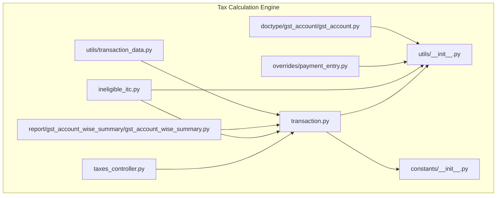
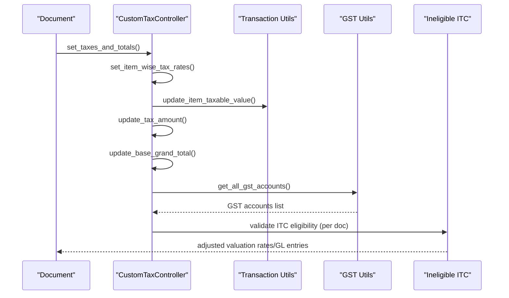
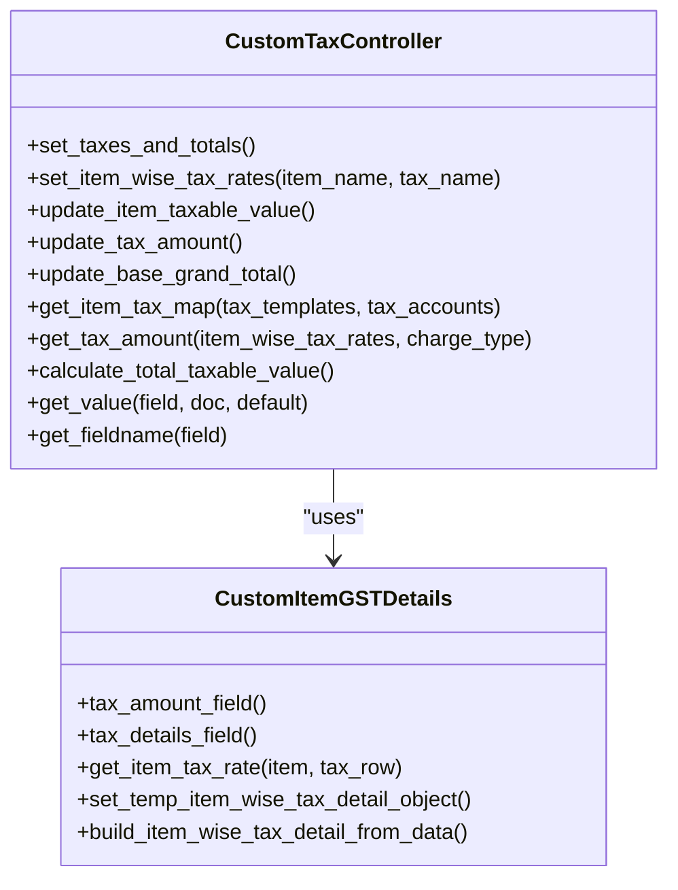
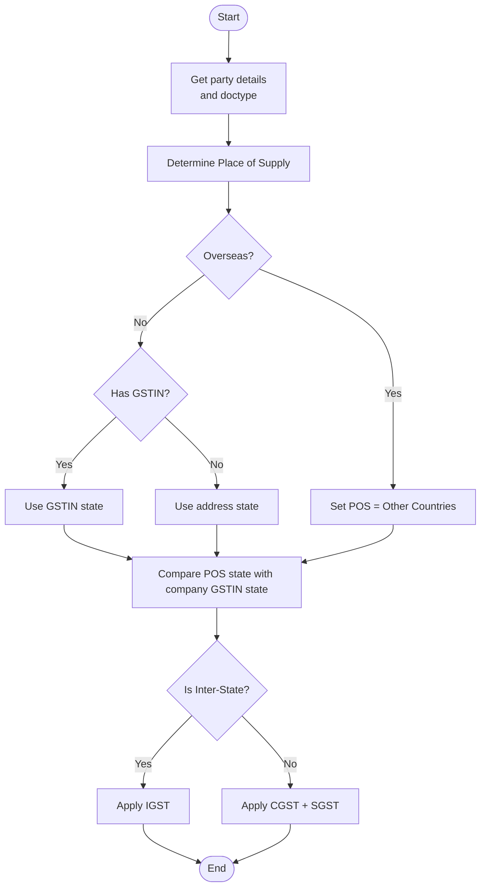
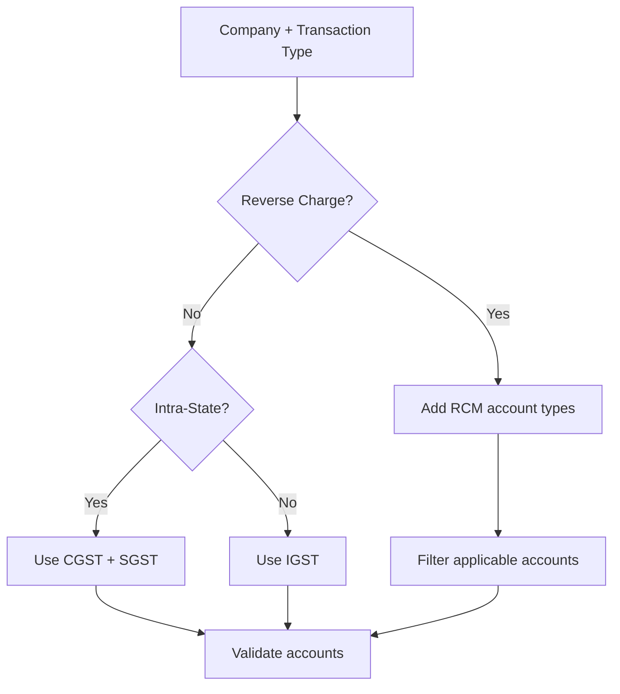
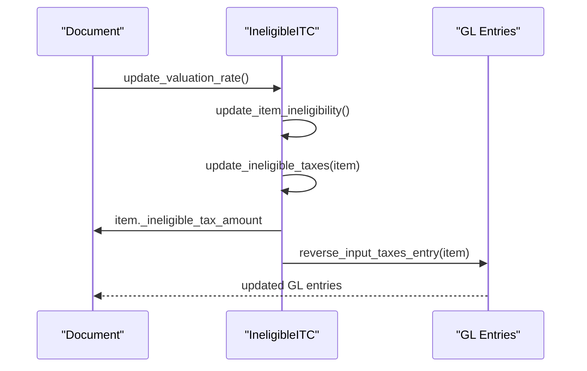
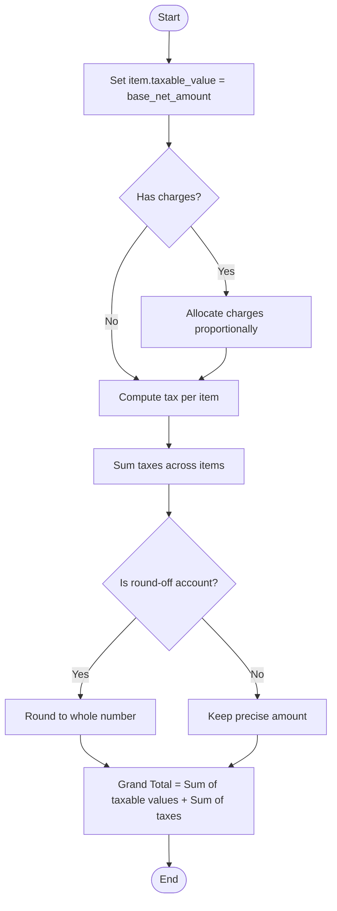
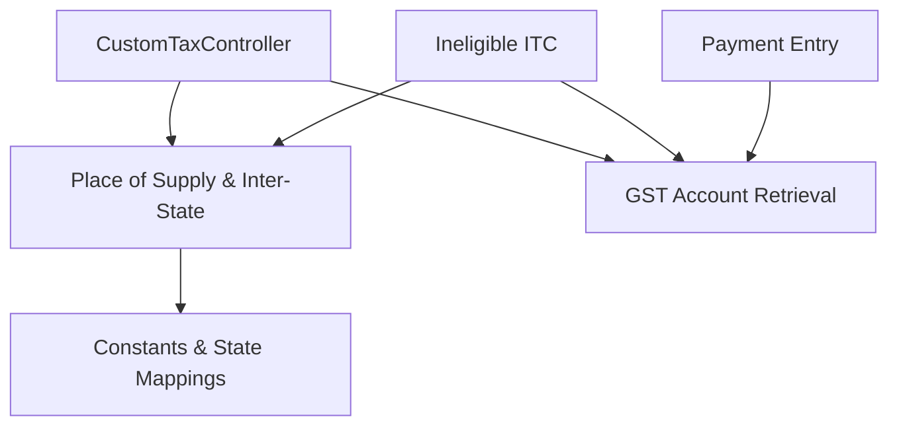

# Tax Calculation Engine

<cite>
**Referenced Files in This Document**
- [taxes_controller.py](file://india_compliance/gst_india/utils/taxes_controller.py)
- [transaction.py](file://india_compliance/gst_india/overrides/transaction.py)
- [ineligible_itc.py](file://india_compliance/gst_india/overrides/ineligible_itc.py)
- [__init__.py](file://india_compliance/gst_india/utils/__init__.py)
- [constants/__init__.py](file://india_compliance/gst_india/constants/__init__.py)
- [gst_account.py](file://india_compliance/gst_india/doctype/gst_account/gst_account.py)
- [payment_entry.py](file://india_compliance/gst_india/overrides/payment_entry.py)
- [gst_account_wise_summary.py](file://india_compliance/gst_india/report/gst_account_wise_summary/gst_account_wise_summary.py)
- [transaction_data.py](file://india_compliance/gst_india/utils/transaction_data.py)
</cite>

## Table of Contents
1. [Introduction](#introduction)
2. [Project Structure](#project-structure)
3. [Core Components](#core-components)
4. [Architecture Overview](#architecture-overview)
5. [Detailed Component Analysis](#detailed-component-analysis)
6. [Dependency Analysis](#dependency-analysis)
7. [Performance Considerations](#performance-considerations)
8. [Troubleshooting Guide](#troubleshooting-guide)
9. [Conclusion](#conclusion)
10. [Appendices](#appendices)

## Introduction
This document explains the Tax Calculation Engine for India Compliance with a focus on:
- GST rate application and mapping
- Multi-state (inter-state vs intra-state) calculations
- ITC (Input Tax Credit) management and validation
- Taxes controller utility functions for tax computation logic
- Place of supply determination
- Proportional charges allocation and tax rounding
- GST account mapping by transaction type, place of supply, and reverse charge conditions
- Practical scenarios and common issues with resolutions

## Project Structure
The Tax Calculation Engine spans Python utilities, overrides, reports, and constants:
- taxes_controller.py: Centralized tax computation logic for item-level to document-level totals
- transaction.py: Place of supply, inter-state determination, tax template selection, validations, and GST account mapping
- ineligible_itc.py: ITC eligibility, proportionate reversal, and valuation adjustments
- utils/__init__.py: Place of supply helpers, GST account retrieval, and regional helpers
- constants/__init__.py: GST constants, state mappings, and tax type definitions
- Reports and utilities: Apportionment of charges and progressive tax amount handling

**Diagram sources**
- [taxes_controller.py](file://india_compliance/gst_india/utils/taxes_controller.py#L104-L275)
- [transaction.py](file://india_compliance/gst_india/overrides/transaction.py#L212-L275)
- [ineligible_itc.py](file://india_compliance/gst_india/overrides/ineligible_itc.py#L18-L140)
- [__init__.py](file://india_compliance/gst_india/utils/__init__.py#L487-L646)
- [constants/__init__.py](file://india_compliance/gst_india/constants/__init__.py#L9-L23)
- [gst_account.py](file://india_compliance/gst_india/doctype/gst_account/gst_account.py#L1-L10)
- [payment_entry.py](file://india_compliance/gst_india/overrides/payment_entry.py#L276-L310)
- [gst_account_wise_summary.py](file://india_compliance/gst_india/report/gst_account_wise_summary/gst_account_wise_summary.py#L81-L158)
- [transaction_data.py](file://india_compliance/gst_india/utils/transaction_data.py#L386-L426)

**Section sources**
- [taxes_controller.py](file://india_compliance/gst_india/utils/taxes_controller.py#L104-L275)
- [transaction.py](file://india_compliance/gst_india/overrides/transaction.py#L212-L275)
- [ineligible_itc.py](file://india_compliance/gst_india/overrides/ineligible_itc.py#L18-L140)
- [__init__.py](file://india_compliance/gst_india/utils/__init__.py#L487-L646)
- [constants/__init__.py](file://india_compliance/gst_india/constants/__init__.py#L9-L23)
- [gst_account.py](file://india_compliance/gst_india/doctype/gst_account/gst_account.py#L1-L10)
- [payment_entry.py](file://india_compliance/gst_india/overrides/payment_entry.py#L276-L310)
- [gst_account_wise_summary.py](file://india_compliance/gst_india/report/gst_account_wise_summary/gst_account_wise_summary.py#L81-L158)
- [transaction_data.py](file://india_compliance/gst_india/utils/transaction_data.py#L386-L426)

## Core Components
- Taxes Controller (CustomTaxController): Computes item-wise tax rates, updates taxable values, computes tax amounts per row, and sets totals and grand totals. Handles actual vs percentage charge types and rounding for GST accounts.
- Place of Supply and Inter-State Determination: Determines POS based on party/address and compares with company GSTIN state to decide intra/inter-state.
- GST Account Mapping: Maps transaction type (sales/purchase), POS, and reverse charge to applicable GST accounts (CGST/SGST/IGST).
- ITC Management: Validates ITC eligibility, computes proportionate ineligible tax amounts, adjusts valuation rates, and books reversing entries.

**Section sources**
- [taxes_controller.py](file://india_compliance/gst_india/utils/taxes_controller.py#L104-L275)
- [transaction.py](file://india_compliance/gst_india/overrides/transaction.py#L402-L483)
- [ineligible_itc.py](file://india_compliance/gst_india/overrides/ineligible_itc.py#L75-L140)
- [__init__.py](file://india_compliance/gst_india/utils/__init__.py#L402-L484)

## Architecture Overview
The engine orchestrates tax computation across item and document levels, with validations and account mapping integrated into transaction processing.

**Diagram sources**
- [taxes_controller.py](file://india_compliance/gst_india/utils/taxes_controller.py#L118-L183)
- [transaction.py](file://india_compliance/gst_india/overrides/transaction.py#L402-L483)
- [__init__.py](file://india_compliance/gst_india/utils/__init__.py#L627-L646)
- [ineligible_itc.py](file://india_compliance/gst_india/overrides/ineligible_itc.py#L75-L140)

## Detailed Component Analysis

### Taxes Controller Utility Functions
- Purpose: Compute tax amounts per item and document totals, apply charge types, and manage rounding for GST accounts.
- Key responsibilities:
  - Item-wise tax rate mapping from templates/accounts
  - Taxable value updates with proportional charges
  - Tax amount computation by charge type (percentage vs quantity)
  - Round-off handling for GST accounts
  - Total and grand total updates

**Diagram sources**
- [taxes_controller.py](file://india_compliance/gst_india/utils/taxes_controller.py#L104-L275)

**Section sources**
- [taxes_controller.py](file://india_compliance/gst_india/utils/taxes_controller.py#L118-L246)

### Place of Supply and Inter-State Determination
- Place of Supply (POS) determination:
  - Uses party address and GSTIN to derive state code and name
  - Supports overseas exports and fallbacks for unregistered customers
- Inter-State determination:
  - Compares POS state code with company GSTIN state code
  - Treats SEZ as inter-state for output transactions

**Diagram sources**
- [__init__.py](file://india_compliance/gst_india/utils/__init__.py#L402-L484)
- [transaction.py](file://india_compliance/gst_india/overrides/transaction.py#L615-L627)

**Section sources**
- [__init__.py](file://india_compliance/gst_india/utils/__init__.py#L402-L484)
- [transaction.py](file://india_compliance/gst_india/overrides/transaction.py#L615-L627)

### GST Account Mapping System
- Mapping by transaction type (sales vs purchase), intra/inter-state, and reverse charge:
  - Output: CGST + SGST for intra-state; IGST for inter-state
  - Input: CGST + SGST for intra-state; IGST for inter-state; RCM variants
- Validation ensures only valid GST accounts are used for the transaction type and POS.

**Diagram sources**
- [transaction.py](file://india_compliance/gst_india/overrides/transaction.py#L212-L275)
- [__init__.py](file://india_compliance/gst_india/utils/__init__.py#L509-L586)

**Section sources**
- [transaction.py](file://india_compliance/gst_india/overrides/transaction.py#L212-L275)
- [__init__.py](file://india_compliance/gst_india/utils/__init__.py#L509-L586)

### ITC Management and Validation
- Eligibility checks:
  - Restrictions due to POS rules
  - Composition dealers and unregistered suppliers
- Proportionate reversal:
  - Computes ineligible tax per item and per tax component
  - Adjusts valuation rates and books reversing entries
- Default GST expense account required for reversing entries

**Diagram sources**
- [ineligible_itc.py](file://india_compliance/gst_india/overrides/ineligible_itc.py#L75-L140)
- [ineligible_itc.py](file://india_compliance/gst_india/overrides/ineligible_itc.py#L106-L139)

**Section sources**
- [ineligible_itc.py](file://india_compliance/gst_india/overrides/ineligible_itc.py#L75-L140)
- [ineligible_itc.py](file://india_compliance/gst_india/overrides/ineligible_itc.py#L106-L139)

### Tax Calculation Workflow: Item-Level to Document-Level
- Item-level:
  - Base net amount becomes taxable value
  - Proportional charges allocated based on total value (net or qty)
  - Item-wise tax computed using mapped rates and charge type
- Document-level:
  - Sum of item tax amounts equals total taxes
  - Grand total = total taxable value + total taxes
  - Rounding handled for GST accounts

**Diagram sources**
- [transaction.py](file://india_compliance/gst_india/overrides/transaction.py#L69-L133)
- [taxes_controller.py](file://india_compliance/gst_india/utils/taxes_controller.py#L155-L183)

**Section sources**
- [transaction.py](file://india_compliance/gst_india/overrides/transaction.py#L69-L133)
- [taxes_controller.py](file://india_compliance/gst_india/utils/taxes_controller.py#L155-L183)

### Proportional Charges Allocation and Tax Rounding
- Charges allocation:
  - Uses total charges minus TDS and previous row totals
  - Allocates proportionally based on base_net_total or qty
- Rounding:
  - Applies rounding for GST accounts via round-off accounts
  - Ensures final tax amount matches computed value

**Section sources**
- [transaction.py](file://india_compliance/gst_india/overrides/transaction.py#L69-L133)
- [taxes_controller.py](file://india_compliance/gst_india/utils/taxes_controller.py#L162-L176)

### Reverse Charge and Payment Entry Reversal
- Reverse charge:
  - Validates positive/negative amounts depending on RCM vs non-RCM
  - Ensures net GST plus reverse charge equals zero
- Payment entry:
  - Calculates proportionate taxes for reference allocations
  - Balances taxes on final allocation

**Section sources**
- [transaction.py](file://india_compliance/gst_india/overrides/transaction.py#L1040-L1104)
- [payment_entry.py](file://india_compliance/gst_india/overrides/payment_entry.py#L276-L310)

### Practical Examples

- Example 1: Multi-state sale (intra-state)
  - POS: Maharashtra (27)
  - Company GSTIN: 27... (same state)
  - Apply: CGST + SGST
  - ITC: Available if conditions met

- Example 2: Multi-state sale (inter-state)
  - POS: Gujarat (24)
  - Company GSTIN: 27...
  - Apply: IGST
  - ITC: Available depending on recipient’s eligibility

- Example 3: ITC eligibility validation
  - Scenario: Supplies to unregistered person in another state
  - Rule: ITC restricted due to POS rules
  - Outcome: Ineligible ITC computed and reversed

- Example 4: Proportional charges allocation
  - Document has shipping and discount
  - Charges allocated proportionally to items based on base_net_amount or qty

**Section sources**
- [transaction.py](file://india_compliance/gst_india/overrides/transaction.py#L615-L627)
- [ineligible_itc.py](file://india_compliance/gst_india/overrides/ineligible_itc.py#L277-L306)
- [transaction.py](file://india_compliance/gst_india/overrides/transaction.py#L69-L133)

## Dependency Analysis
- Taxes Controller depends on:
  - Item-level tax templates and account mappings
  - Place of supply and inter-state determination
  - GST account lists and validation
- ITC module depends on:
  - Document taxes and tax components
  - Company settings for default GST expense account
  - Valuation and warehouse/account mappings

**Diagram sources**
- [taxes_controller.py](file://india_compliance/gst_india/utils/taxes_controller.py#L104-L275)
- [transaction.py](file://india_compliance/gst_india/overrides/transaction.py#L212-L275)
- [__init__.py](file://india_compliance/gst_india/utils/__init__.py#L487-L646)
- [ineligible_itc.py](file://india_compliance/gst_india/overrides/ineligible_itc.py#L18-L140)
- [payment_entry.py](file://india_compliance/gst_india/overrides/payment_entry.py#L276-L310)

**Section sources**
- [taxes_controller.py](file://india_compliance/gst_india/utils/taxes_controller.py#L104-L275)
- [transaction.py](file://india_compliance/gst_india/overrides/transaction.py#L212-L275)
- [__init__.py](file://india_compliance/gst_india/utils/__init__.py#L487-L646)
- [ineligible_itc.py](file://india_compliance/gst_india/overrides/ineligible_itc.py#L18-L140)
- [payment_entry.py](file://india_compliance/gst_india/overrides/payment_entry.py#L276-L310)

## Performance Considerations
- Efficient item-wise tax rate mapping using pre-fetched templates and tax accounts
- Minimal database queries for GST account retrieval and state mappings
- Rounding only for GST accounts to reduce floating-point drift
- Batch processing of items and taxes to avoid repeated computations

## Troubleshooting Guide
Common issues and resolutions:
- Incorrect tax rates
  - Symptom: Item GST details mismatch
  - Resolution: Recompute using mapped rates and charge type; validate differences within allowable tolerance

- Missing place of supply
  - Symptom: Validation failure for POS
  - Resolution: Ensure party address/GSTIN is set; POS derived from GSTIN or address state

- Validation failures
  - Symptom: Invalid GST accounts or charge types
  - Resolution: Use only valid accounts for transaction type and POS; ensure charge type compliance for cess/non-advol

- ITC restriction due to POS
  - Symptom: Ineligible ITC flagged
  - Resolution: Confirm recipient category and POS; adjust valuation rates and reverse entries accordingly

- Reverse charge mismatch
  - Symptom: Non-zero net GST + reverse charge
  - Resolution: Ensure correct sign and amounts for RCM rows; verify total equals zero

**Section sources**
- [transaction.py](file://india_compliance/gst_india/overrides/transaction.py#L1338-L1370)
- [transaction.py](file://india_compliance/gst_india/overrides/transaction.py#L581-L613)
- [transaction.py](file://india_compliance/gst_india/overrides/transaction.py#L1040-L1104)
- [ineligible_itc.py](file://india_compliance/gst_india/overrides/ineligible_itc.py#L277-L306)

## Conclusion
The Tax Calculation Engine integrates place of supply determination, GST account mapping, and robust tax computation with proportional charges and rounding. It enforces ITC eligibility and validates reverse charge logic, ensuring accurate tax reporting and compliance across intra-state and inter-state transactions.

## Appendices

### GST Account Types and Fields
- Account types: CGST, SGST, IGST, CESS, CESS Non-Advol
- Tax types: cgst, sgst, igst, cess, cess_non_advol
- Constants define state mappings and valid UOMs

**Section sources**
- [constants/__init__.py](file://india_compliance/gst_india/constants/__init__.py#L9-L23)
- [constants/__init__.py](file://india_compliance/gst_india/constants/__init__.py#L66-L105)

### Report-Level Apportionment and Progressive Tax Amounts
- Reports allocate additional charges proportionally and compute progressive tax amounts to minimize rounding errors
- Handles before/after GST tax rows and TDS adjustments

**Section sources**
- [gst_account_wise_summary.py](file://india_compliance/gst_india/report/gst_account_wise_summary/gst_account_wise_summary.py#L81-L158)
- [transaction_data.py](file://india_compliance/gst_india/utils/transaction_data.py#L386-L426)