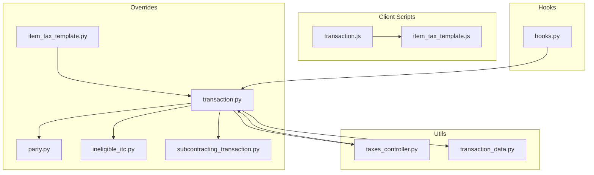
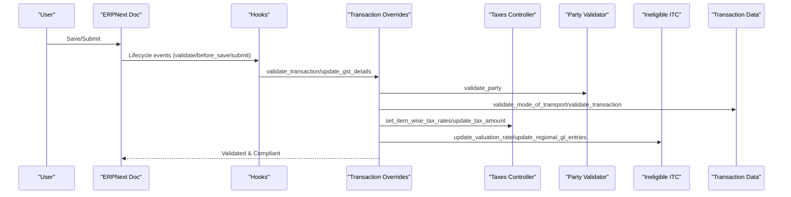
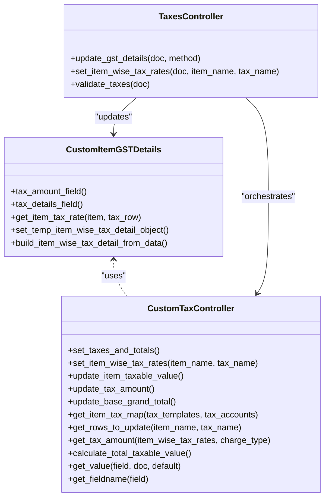
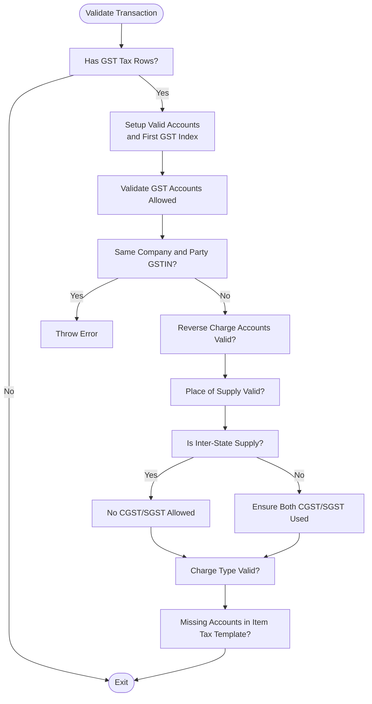
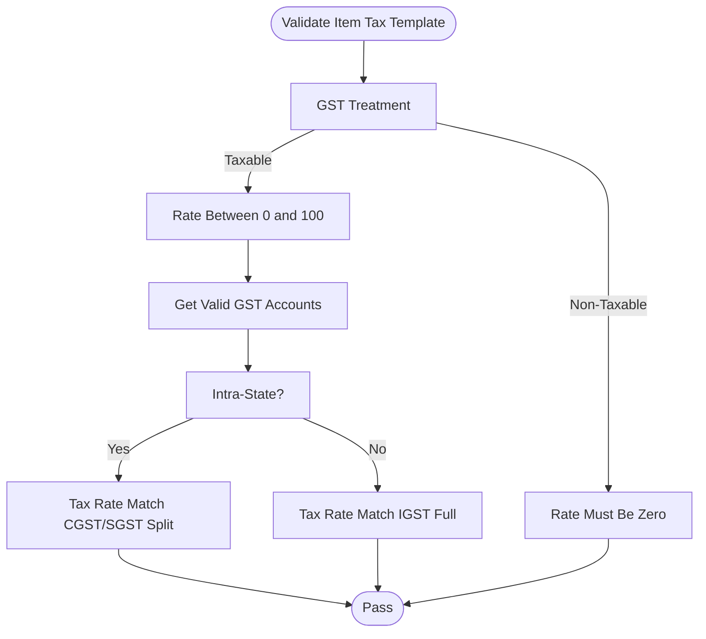
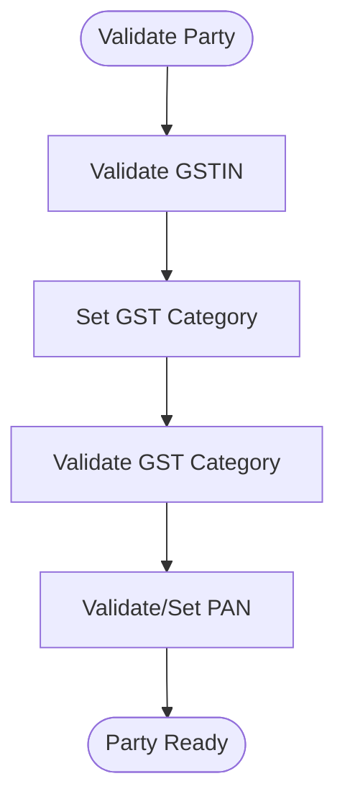
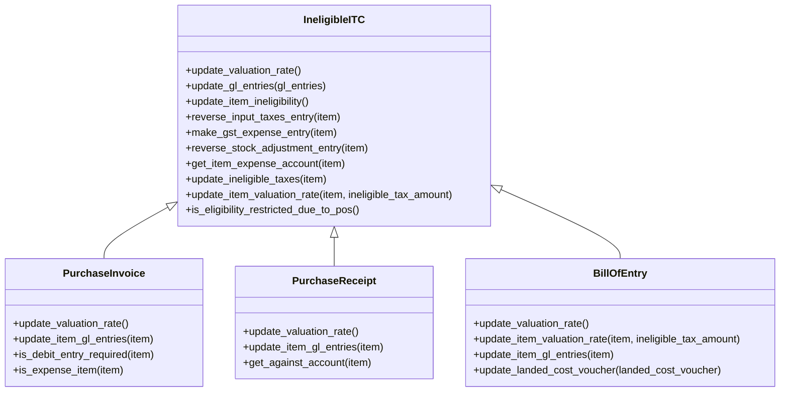
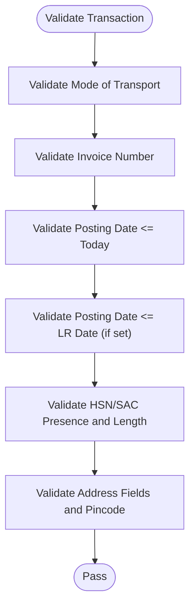
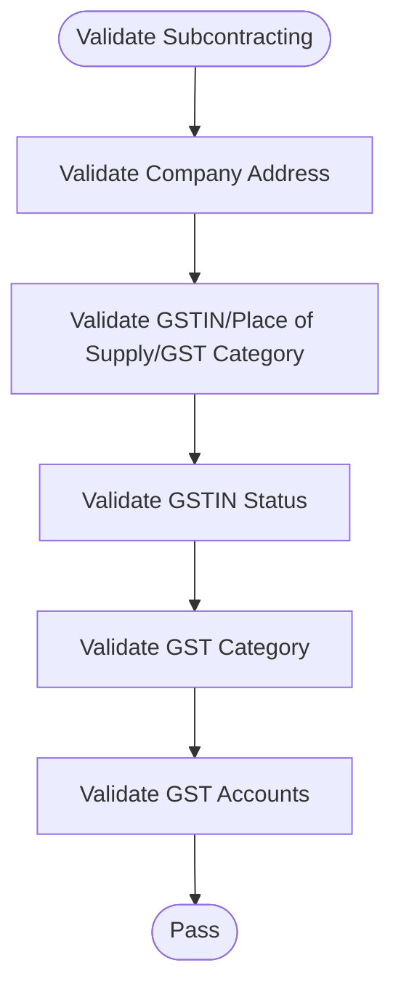
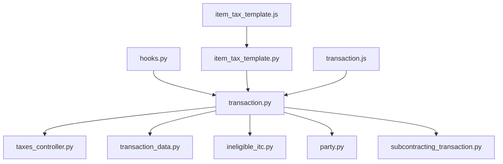

# Transaction Processing

<cite>
**Referenced Files in This Document**
- [taxes_controller.py](file://india_compliance/gst_india/utils/taxes_controller.py)
- [transaction.py](file://india_compliance/gst_india/overrides/transaction.py)
- [item_tax_template.py](file://india_compliance/gst_india/overrides/item_tax_template.py)
- [party.py](file://india_compliance/gst_india/overrides/party.py)
- [ineligible_itc.py](file://india_compliance/gst_india/overrides/ineligible_itc.py)
- [transaction_data.py](file://india_compliance/gst_india/utils/transaction_data.py)
- [test_transaction.py](file://india_compliance/gst_india/overrides/test_transaction.py)
- [test_transaction_data.py](file://india_compliance/gst_india/overrides/test_transaction_data.py)
- [subcontracting_transaction.py](file://india_compliance/gst_india/overrides/subcontracting_transaction.py)
- [gstin.py](file://india_compliance/gst_india/doctype/gstin/gstin.py)
- [hooks.py](file://india_compliance/hooks.py)
- [transaction.js](file://india_compliance/public/js/transaction.js)
- [item_tax_template.js](file://india_compliance/gst_india/client_scripts/item_tax_template.js)
</cite>

## Table of Contents
1. [Introduction](#introduction)
2. [Project Structure](#project-structure)
3. [Core Components](#core-components)
4. [Architecture Overview](#architecture-overview)
5. [Detailed Component Analysis](#detailed-component-analysis)
6. [Dependency Analysis](#dependency-analysis)
7. [Performance Considerations](#performance-considerations)
8. [Troubleshooting Guide](#troubleshooting-guide)
9. [Conclusion](#conclusion)
10. [Appendices](#appendices)

## Introduction
This document explains the Transaction Processing system for GST compliance in ERPNext with India Compliance. It covers:
- Tax calculation engine and item-wise tax rate application
- Document validation and compliance enforcement
- Transaction override system that modifies ERPNext document behavior for GST
- Taxes controller utility for GST rate application, multi-state calculations, and ITC management
- Validation rules for party details, item classification, and tax category assignments
- Practical workflows and examples for tax calculation, validation, and compliance checks
- Resolution procedures for common issues such as incorrect tax rates, missing party details, and validation failures

## Project Structure
The Transaction Processing system spans Python overrides, JavaScript client scripts, and utility modules:
- Overrides enforce GST-specific validation and tax behavior during document lifecycle events
- Utilities compute tax totals, sanitize transaction data, and manage ITC adjustments
- Client scripts assist in dynamic tax rate computation and validation feedback

**Diagram sources**
- [transaction.py](file://india_compliance/gst_india/overrides/transaction.py#L1-L120)
- [taxes_controller.py](file://india_compliance/gst_india/utils/taxes_controller.py#L1-L120)
- [item_tax_template.py](file://india_compliance/gst_india/overrides/item_tax_template.py#L1-L60)
- [party.py](file://india_compliance/gst_india/overrides/party.py#L1-L60)
- [ineligible_itc.py](file://india_compliance/gst_india/overrides/ineligible_itc.py#L1-L60)
- [transaction_data.py](file://india_compliance/gst_india/utils/transaction_data.py#L1-L80)
- [transaction.js](file://india_compliance/public/js/transaction.js#L1-L46)
- [item_tax_template.js](file://india_compliance/gst_india/client_scripts/item_tax_template.js#L49-L98)
- [hooks.py](file://india_compliance/hooks.py#L243-L267)

**Section sources**
- [hooks.py](file://india_compliance/hooks.py#L243-L267)
- [transaction.js](file://india_compliance/public/js/transaction.js#L1-L46)
- [item_tax_template.js](file://india_compliance/gst_india/client_scripts/item_tax_template.js#L49-L98)

## Core Components
- Taxes Controller Utility: Computes item-wise tax rates, updates tax amounts, and ensures totals align with GST rules
- Transaction Overrides: Enforce GST-specific validations, place-of-supply rules, HSN/SAC validation, and GST account usage
- Item Tax Template Validator: Ensures tax template rates match company GST rate and valid GST accounts
- Party Validator: Validates GSTIN, PAN, and GST category assignment
- Ineligible ITC Manager: Adjusts valuation rates and GL entries for ITC disallowed items
- Transaction Data Utility: Builds standardized transaction data for e-Waybill/e-Invoice and enforces transport/address validations
- Client Scripts: Assist in dynamic tax rate computation and validation feedback

**Section sources**
- [taxes_controller.py](file://india_compliance/gst_india/utils/taxes_controller.py#L85-L120)
- [transaction.py](file://india_compliance/gst_india/overrides/transaction.py#L277-L311)
- [item_tax_template.py](file://india_compliance/gst_india/overrides/item_tax_template.py#L9-L68)
- [party.py](file://india_compliance/gst_india/overrides/party.py#L17-L41)
- [ineligible_itc.py](file://india_compliance/gst_india/overrides/ineligible_itc.py#L18-L100)
- [transaction_data.py](file://india_compliance/gst_india/utils/transaction_data.py#L34-L145)

## Architecture Overview
The system integrates with ERPNext’s document lifecycle via hooks and overrides. On save/submit, transaction validations and tax computations run, ensuring GST compliance. Client scripts enhance UX by dynamically computing rates and highlighting missing fields.

**Diagram sources**
- [hooks.py](file://india_compliance/hooks.py#L243-L267)
- [transaction.py](file://india_compliance/gst_india/overrides/transaction.py#L277-L311)
- [party.py](file://india_compliance/gst_india/overrides/party.py#L17-L41)
- [transaction_data.py](file://india_compliance/gst_india/utils/transaction_data.py#L192-L231)
- [taxes_controller.py](file://india_compliance/gst_india/utils/taxes_controller.py#L104-L153)
- [ineligible_itc.py](file://india_compliance/gst_india/overrides/ineligible_itc.py#L477-L492)

## Detailed Component Analysis

### Tax Calculation Engine and Taxes Controller Utility
The Taxes Controller utility computes item-wise tax rates and updates tax totals:
- ItemGSTDetails and CustomItemGSTDetails support item-wise tax rates in the Taxes table
- CustomTaxController orchestrates setting item-wise rates, updating taxable values, computing tax amounts, and rounding behavior
- validate_taxes ensures only GST accounts are used in taxes

**Diagram sources**
- [taxes_controller.py](file://india_compliance/gst_india/utils/taxes_controller.py#L17-L83)
- [taxes_controller.py](file://india_compliance/gst_india/utils/taxes_controller.py#L104-L261)
- [taxes_controller.py](file://india_compliance/gst_india/utils/taxes_controller.py#L85-L120)
- [taxes_controller.py](file://india_compliance/gst_india/utils/taxes_controller.py#L263-L275)

Key behaviors:
- Item-wise tax rates are derived from Item Tax Template Details and applied per item
- Tax amounts are computed based on charge type and aggregated into totals
- Round-off accounts receive rounded tax amounts

Practical example paths:
- [Set item-wise tax rates](file://india_compliance/gst_india/utils/taxes_controller.py#L124-L153)
- [Compute tax amount per row](file://india_compliance/gst_india/utils/taxes_controller.py#L159-L178)

**Section sources**
- [taxes_controller.py](file://india_compliance/gst_india/utils/taxes_controller.py#L85-L120)
- [taxes_controller.py](file://india_compliance/gst_india/utils/taxes_controller.py#L104-L153)
- [taxes_controller.py](file://india_compliance/gst_india/utils/taxes_controller.py#L263-L275)

### Transaction Override System and GST Account Validation
The transaction override system enforces GST-specific rules:
- GSTAccounts.validate enforces valid GST accounts, inter-state/intra-state rules, charge types, and missing accounts in item tax templates
- get_applicable_gst_accounts and get_valid_accounts derive allowed accounts per transaction type and inter-state conditions
- validate_place_of_supply and is_inter_state_supply ensure correct tax type usage
- validate_hsn_codes enforces HSN/SAC presence and length

**Diagram sources**
- [transaction.py](file://india_compliance/gst_india/overrides/transaction.py#L290-L311)
- [transaction.py](file://india_compliance/gst_india/overrides/transaction.py#L412-L464)
- [transaction.py](file://india_compliance/gst_india/overrides/transaction.py#L465-L520)
- [transaction.py](file://india_compliance/gst_india/overrides/transaction.py#L521-L539)

Validation highlights:
- Prevents charging GST when company and party GSTIN are identical
- Restricts CGST/SGST for inter-state supplies and IGST for intra-state
- Enforces both CGST and SGST for intra-state supplies
- Validates charge types for Cess Non-Advol accounts

Practical example paths:
- [GST account validation](file://india_compliance/gst_india/overrides/transaction.py#L334-L347)
- [Inter-state validation](file://india_compliance/gst_india/overrides/transaction.py#L434-L450)
- [Charge type validation](file://india_compliance/gst_india/overrides/transaction.py#L465-L520)

**Section sources**
- [transaction.py](file://india_compliance/gst_india/overrides/transaction.py#L290-L311)
- [transaction.py](file://india_compliance/gst_india/overrides/transaction.py#L412-L464)
- [transaction.py](file://india_compliance/gst_india/overrides/transaction.py#L465-L520)

### Item Tax Template Validation and GST Rate Application
Item Tax Template validator ensures:
- GST rate is non-zero for taxable treatment
- Tax rates align with company GST rate for intra-state (half split) and inter-state (full rate)
- Negative-rate accounts (RCM/Refund) are handled appropriately

**Diagram sources**
- [item_tax_template.py](file://india_compliance/gst_india/overrides/item_tax_template.py#L9-L31)
- [item_tax_template.py](file://india_compliance/gst_india/overrides/item_tax_template.py#L36-L67)

Practical example paths:
- [Validate tax template](file://india_compliance/gst_india/overrides/item_tax_template.py#L9-L13)
- [Validate tax rates vs GST rate](file://india_compliance/gst_india/overrides/item_tax_template.py#L27-L67)

**Section sources**
- [item_tax_template.py](file://india_compliance/gst_india/overrides/item_tax_template.py#L9-L31)
- [item_tax_template.py](file://india_compliance/gst_india/overrides/item_tax_template.py#L36-L67)

### Party Details Validation and GST Category Assignment
Party validator:
- Validates GSTIN format and status
- Assigns and updates GST category based on GSTIN and settings
- Validates PAN format and auto-fills from GSTIN when applicable

**Diagram sources**
- [party.py](file://india_compliance/gst_india/overrides/party.py#L17-L41)
- [party.py](file://india_compliance/gst_india/overrides/party.py#L61-L79)

Practical example paths:
- [Validate party and category](file://india_compliance/gst_india/overrides/party.py#L17-L22)
- [Validate PAN](file://india_compliance/gst_india/overrides/party.py#L61-L79)

**Section sources**
- [party.py](file://india_compliance/gst_india/overrides/party.py#L17-L41)
- [party.py](file://india_compliance/gst_india/overrides/party.py#L61-L79)

### Ineligible ITC Management
Ineligible ITC adjusts item valuation rates and GL entries for items where ITC is disallowed:
- Identifies ineligible taxes per item and proportionally reverses ITC
- Books GST expense and adjusts stock/asset/fixed asset accounts
- Supports Purchase Invoice, Purchase Receipt, and Bill of Entry

**Diagram sources**
- [ineligible_itc.py](file://india_compliance/gst_india/overrides/ineligible_itc.py#L18-L100)
- [ineligible_itc.py](file://india_compliance/gst_india/overrides/ineligible_itc.py#L362-L401)
- [ineligible_itc.py](file://india_compliance/gst_india/overrides/ineligible_itc.py#L333-L361)
- [ineligible_itc.py](file://india_compliance/gst_india/overrides/ineligible_itc.py#L403-L467)

Practical example paths:
- [Update valuation rate for ITC](file://india_compliance/gst_india/overrides/ineligible_itc.py#L477-L482)
- [Update GL entries for ITC](file://india_compliance/gst_india/overrides/ineligible_itc.py#L485-L492)

**Section sources**
- [ineligible_itc.py](file://india_compliance/gst_india/overrides/ineligible_itc.py#L18-L100)
- [ineligible_itc.py](file://india_compliance/gst_india/overrides/ineligible_itc.py#L477-L492)

### Document Validation and Compliance Checks
Transaction Data utility:
- Validates transport details for e-Waybill generation
- Validates invoice number, posting date, and LR date constraints
- Enforces HSN/SAC presence and length for e-Invoice/e-Waybill
- Sanitizes and structures transaction data for GST APIs

**Diagram sources**
- [transaction_data.py](file://india_compliance/gst_india/utils/transaction_data.py#L192-L231)
- [transaction_data.py](file://india_compliance/gst_india/utils/transaction_data.py#L280-L316)
- [transaction_data.py](file://india_compliance/gst_india/utils/transaction_data.py#L436-L498)

Practical example paths:
- [Transport validation](file://india_compliance/gst_india/utils/transaction_data.py#L192-L231)
- [Transaction validation](file://india_compliance/gst_india/utils/transaction_data.py#L280-L316)
- [Address validation](file://india_compliance/gst_india/utils/transaction_data.py#L500-L527)

**Section sources**
- [transaction_data.py](file://india_compliance/gst_india/utils/transaction_data.py#L192-L231)
- [transaction_data.py](file://india_compliance/gst_india/utils/transaction_data.py#L280-L316)
- [transaction_data.py](file://india_compliance/gst_india/utils/transaction_data.py#L436-L498)

### Subcontracting Transaction Validation
Subcontracting transactions require:
- Mandatory company address and place of supply
- GST category and GSTIN validation
- GST account validation tailored for subcontracting

**Diagram sources**
- [subcontracting_transaction.py](file://india_compliance/gst_india/overrides/subcontracting_transaction.py#L298-L343)

**Section sources**
- [subcontracting_transaction.py](file://india_compliance/gst_india/overrides/subcontracting_transaction.py#L298-L343)

## Dependency Analysis
The system relies on hooks to trigger validations and updates during document lifecycle. Overrides depend on utility modules for tax computation and transaction data preparation.

**Diagram sources**
- [hooks.py](file://india_compliance/hooks.py#L243-L267)
- [transaction.py](file://india_compliance/gst_india/overrides/transaction.py#L1-L120)
- [taxes_controller.py](file://india_compliance/gst_india/utils/taxes_controller.py#L1-L120)
- [transaction_data.py](file://india_compliance/gst_india/utils/transaction_data.py#L1-L80)
- [ineligible_itc.py](file://india_compliance/gst_india/overrides/ineligible_itc.py#L1-L60)
- [party.py](file://india_compliance/gst_india/overrides/party.py#L1-L60)
- [subcontracting_transaction.py](file://india_compliance/gst_india/overrides/subcontracting_transaction.py#L298-L343)
- [item_tax_template.py](file://india_compliance/gst_india/overrides/item_tax_template.py#L1-L60)
- [item_tax_template.js](file://india_compliance/gst_india/client_scripts/item_tax_template.js#L49-L98)
- [transaction.js](file://india_compliance/public/js/transaction.js#L1-L46)

**Section sources**
- [hooks.py](file://india_compliance/hooks.py#L243-L267)

## Performance Considerations
- Minimize repeated database queries by caching company GST accounts in client scripts
- Use item-wise tax rates to avoid recalculating totals unnecessarily
- Apply rounding only at designated round-off accounts to reduce cumulative drift
- Validate early in the lifecycle to fail fast and reduce reprocessing

[No sources needed since this section provides general guidance]

## Troubleshooting Guide
Common issues and resolutions:
- Incorrect tax rates in Item Tax Template
  - Symptom: Validation error indicating inconsistent tax rates
  - Resolution: Align template tax rates with company GST rate (split for intra-state; full for inter-state)
  - References: [Item tax template validation](file://india_compliance/gst_india/overrides/item_tax_template.py#L27-L67)

- Missing party details (GSTIN, PAN, GST category)
  - Symptom: Validation errors for missing mandatory fields
  - Resolution: Ensure GSTIN/PAN are valid and GST category is set; update address fields
  - References: [Party validation](file://india_compliance/gst_india/overrides/party.py#L17-L41), [GSTIN status validation](file://india_compliance/gst_india/doctype/gstin/gstin.py#L188-L235)

- Validation failures for transport/address fields
  - Symptom: Errors for mode of transport, vehicle/LR details, or address completeness
  - Resolution: Fill required transport fields and ensure address has title, line, city, pincode
  - References: [Transport validation](file://india_compliance/gst_india/utils/transaction_data.py#L192-L231), [Address validation](file://india_compliance/gst_india/utils/transaction_data.py#L500-L527)

- GST account misuse (wrong CGST/SGST/IGST for supply type)
  - Symptom: Error stating invalid account type for intra/inter-state
  - Resolution: Use appropriate accounts per place of supply and supply type
  - References: [GST account validation](file://india_compliance/gst_india/overrides/transaction.py#L412-L464)

- HSN/SAC validation failures
  - Symptom: Errors for missing or invalid HSN/SAC length
  - Resolution: Enter HSN/SAC with correct length as per settings
  - References: [HSN validation](file://india_compliance/gst_india/utils/transaction_data.py#L317-L346), [HSN validation logic](file://india_compliance/gst_india/overrides/transaction.py#L672-L747)

**Section sources**
- [item_tax_template.py](file://india_compliance/gst_india/overrides/item_tax_template.py#L27-L67)
- [party.py](file://india_compliance/gst_india/overrides/party.py#L17-L41)
- [gstin.py](file://india_compliance/gst_india/doctype/gstin/gstin.py#L188-L235)
- [transaction_data.py](file://india_compliance/gst_india/utils/transaction_data.py#L192-L231)
- [transaction_data.py](file://india_compliance/gst_india/utils/transaction_data.py#L317-L346)
- [transaction.py](file://india_compliance/gst_india/overrides/transaction.py#L412-L464)
- [transaction.py](file://india_compliance/gst_india/overrides/transaction.py#L672-L747)

## Conclusion
The Transaction Processing system integrates tightly with ERPNext to ensure GST compliance at every stage. It enforces accurate tax calculations, validates party and item details, manages ITC eligibility, and prepares transaction data for e-Waybill/e-Invoice. By leveraging the overrides, utilities, and client scripts, organizations can maintain robust compliance while preserving seamless workflows.

[No sources needed since this section summarizes without analyzing specific files]

## Appendices

### Practical Examples

- Tax calculation workflow
  - Steps: Set item-wise tax rates → Update taxable values → Compute tax amounts → Aggregate totals
  - References: [Taxes controller orchestration](file://india_compliance/gst_india/utils/taxes_controller.py#L118-L123), [Update tax amounts](file://india_compliance/gst_india/utils/taxes_controller.py#L159-L178)

- Document validation process
  - Steps: Validate transport details → Validate invoice/date constraints → Validate HSN/SAC → Validate address fields
  - References: [Transport validation](file://india_compliance/gst_india/utils/transaction_data.py#L192-L231), [Transaction validation](file://india_compliance/gst_india/utils/transaction_data.py#L280-L316), [Address validation](file://india_compliance/gst_india/utils/transaction_data.py#L500-L527)

- Compliance checks
  - Steps: Validate GST accounts per supply type → Enforce charge type rules → Ensure template accounts match
  - References: [GST account validation](file://india_compliance/gst_india/overrides/transaction.py#L334-L347), [Charge type validation](file://india_compliance/gst_india/overrides/transaction.py#L465-L520), [Missing template accounts](file://india_compliance/gst_india/overrides/transaction.py#L521-L539)

**Section sources**
- [taxes_controller.py](file://india_compliance/gst_india/utils/taxes_controller.py#L118-L123)
- [taxes_controller.py](file://india_compliance/gst_india/utils/taxes_controller.py#L159-L178)
- [transaction_data.py](file://india_compliance/gst_india/utils/transaction_data.py#L192-L231)
- [transaction_data.py](file://india_compliance/gst_india/utils/transaction_data.py#L280-L316)
- [transaction_data.py](file://india_compliance/gst_india/utils/transaction_data.py#L500-L527)
- [transaction.py](file://india_compliance/gst_india/overrides/transaction.py#L334-L347)
- [transaction.py](file://india_compliance/gst_india/overrides/transaction.py#L465-L520)
- [transaction.py](file://india_compliance/gst_india/overrides/transaction.py#L521-L539)