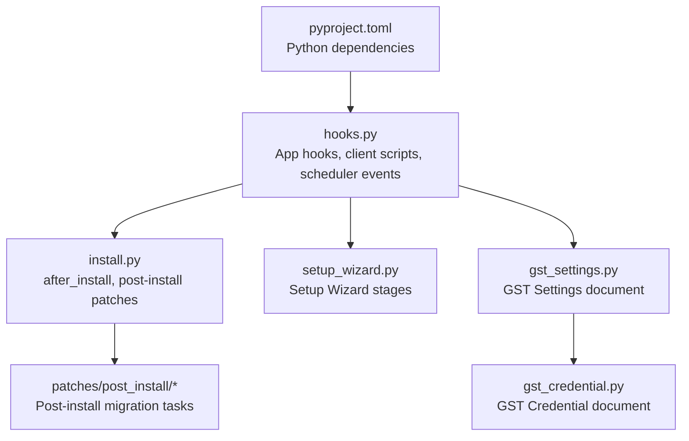
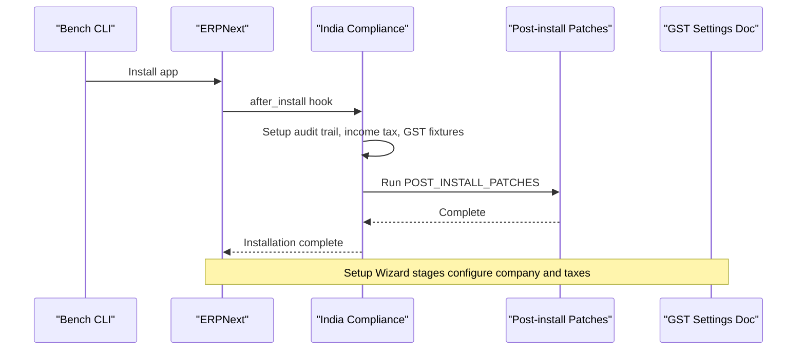
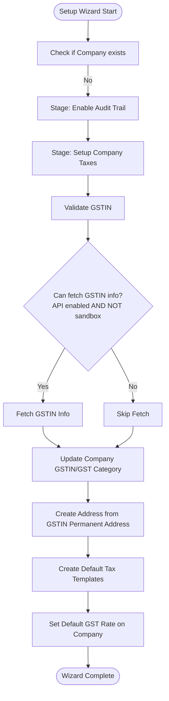
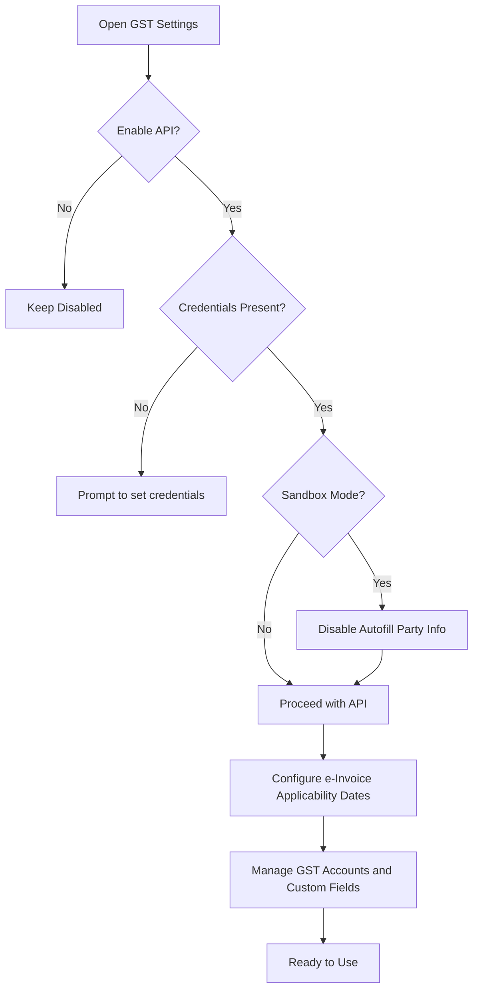
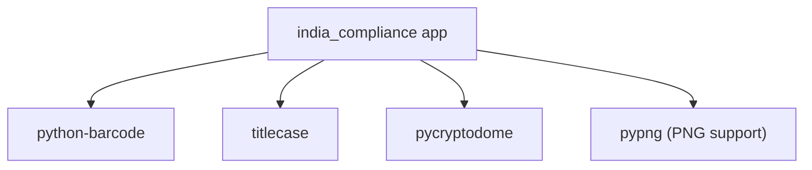

# Getting Started

<cite>
**Referenced Files in This Document**
- [README.md](file://README.md)
- [hooks.py](file://india_compliance/hooks.py)
- [install.py](file://india_compliance/install.py)
- [setup_wizard.py](file://india_compliance/setup_wizard.py)
- [gst_settings.py](file://india_compliance/gst_india/doctype/gst_settings/gst_settings.py)
- [gst_credential.py](file://india_compliance/gst_india/doctype/gst_credential/gst_credential.py)
- [pyproject.toml](file://pyproject.toml)
</cite>

## Table of Contents
1. [Introduction](#introduction)
2. [Project Structure](#project-structure)
3. [Core Components](#core-components)
4. [Architecture Overview](#architecture-overview)
5. [Detailed Component Analysis](#detailed-component-analysis)
6. [Dependency Analysis](#dependency-analysis)
7. [Performance Considerations](#performance-considerations)
8. [Troubleshooting Guide](#troubleshooting-guide)
9. [Conclusion](#conclusion)
10. [Appendices](#appendices)

## Introduction
This guide helps you install and set up India Compliance for ERPNext, covering prerequisites, installation across development, staging, and production environments, the Setup Wizard, GST API credentials, sandbox versus production modes, verification steps, and licensing/account requirements.

Key highlights:
- India Compliance integrates with ERPNext and Frappe Framework.
- It provides GST-related automation, including e-Invoice, e-Waybill, GSTR downloads, and reporting.
- Some advanced features require an India Compliance Account and API credentials.

**Section sources**
- [README.md](file://README.md#L26-L64)

## Project Structure
India Compliance is packaged as an ERPNext app with:
- App metadata and hooks
- Installation and post-install patches
- Setup Wizard for company and tax configuration
- GST Settings and Credentials documents
- Python dependencies declared for runtime and dev

**Diagram sources**
- [hooks.py](file://india_compliance/hooks.py#L1-L684)
- [install.py](file://india_compliance/install.py#L1-L119)
- [setup_wizard.py](file://india_compliance/setup_wizard.py#L1-L135)
- [gst_settings.py](file://india_compliance/gst_india/doctype/gst_settings/gst_settings.py#L1-L595)
- [gst_credential.py](file://india_compliance/gst_india/doctype/gst_credential/gst_credential.py#L1-L10)
- [pyproject.toml](file://pyproject.toml#L1-L32)

**Section sources**
- [hooks.py](file://india_compliance/hooks.py#L1-L684)
- [install.py](file://india_compliance/install.py#L1-L119)
- [setup_wizard.py](file://india_compliance/setup_wizard.py#L1-L135)
- [gst_settings.py](file://india_compliance/gst_india/doctype/gst_settings/gst_settings.py#L1-L595)
- [gst_credential.py](file://india_compliance/gst_india/doctype/gst_credential/gst_credential.py#L1-L10)
- [pyproject.toml](file://pyproject.toml#L1-L32)

## Core Components
- Hooks and app configuration define required apps, client script inclusion, scheduler jobs, and setup wizard integration.
- Installation routine sets up audit trail, income tax fixtures, GST fixtures, runs post-install patches, and disables the India Compliance Account page when API secrets are configured.
- Setup Wizard automates company configuration, GSTIN validation, address creation, and default tax templates.
- GST Settings manages API enablement, credentials, sandbox mode, and e-Invoice applicability.
- GST Credential stores per-GSTIN service credentials.

**Section sources**
- [hooks.py](file://india_compliance/hooks.py#L1-L684)
- [install.py](file://india_compliance/install.py#L55-L119)
- [setup_wizard.py](file://india_compliance/setup_wizard.py#L32-L135)
- [gst_settings.py](file://india_compliance/gst_india/doctype/gst_settings/gst_settings.py#L40-L343)
- [gst_credential.py](file://india_compliance/gst_india/doctype/gst_credential/gst_credential.py#L1-L10)

## Architecture Overview
High-level flow during installation and setup:

**Diagram sources**
- [install.py](file://india_compliance/install.py#L55-L119)
- [setup_wizard.py](file://india_compliance/setup_wizard.py#L32-L135)

## Detailed Component Analysis

### Prerequisites and System Dependencies
- Required app: ERPNext (and Frappe Framework).
- Python dependencies for the app include cryptography-related packages and optional image/QR generation libraries.
- Ensure your environment meets ERPNext’s system requirements before installing.

Verification steps:
- Confirm ERPNext is installed and running.
- Verify Python environment and pip dependencies.

**Section sources**
- [hooks.py](file://india_compliance/hooks.py#L9)
- [pyproject.toml](file://pyproject.toml#L9-L16)

### Installation Procedures

#### Development Environment
- Install the app in a development bench using ERPNext.
- After installation, run post-install patches automatically executed by the app.
- Access the Setup Wizard via the standard ERPNext Setup Wizard flow.

Recommended steps:
- Create a new site or use an existing development site.
- Install the app via bench.
- Open ERPNext Desk and start the Setup Wizard.

**Section sources**
- [install.py](file://india_compliance/install.py#L55-L80)
- [setup_wizard.py](file://india_compliance/setup_wizard.py#L32-L61)

#### Staging Environment
- Use a staging bench mirroring production configuration.
- Install the app and run migrations.
- Validate GST Settings and credentials in a controlled environment before promoting to production.

Recommended steps:
- Install app and run migrations.
- Configure GST Settings and credentials.
- Test e-Invoice/e-Waybill flows in sandbox mode.

**Section sources**
- [hooks.py](file://india_compliance/hooks.py#L30-L31)
- [gst_settings.py](file://india_compliance/gst_india/doctype/gst_settings/gst_settings.py#L268-L292)

#### Production Environment
- Install the app on a production bench.
- Enable API features only after configuring credentials and verifying connectivity.
- Keep sandbox mode disabled for production.

Recommended steps:
- Install app and run migrations.
- Configure GST Settings and credentials.
- Switch off sandbox mode and test API integrations.

**Section sources**
- [gst_settings.py](file://india_compliance/gst_india/doctype/gst_settings/gst_settings.py#L240-L262)

### Setup Wizard Walkthrough
The Setup Wizard performs the following stages when no Company exists:

1. Enable Audit Trail (optional)
2. Configure Company Taxes:
   - Validate GSTIN and fetch GSTIN info if API is enabled and not in sandbox mode.
   - Guess GST category if missing.
   - Create Address from GSTIN permanent address.
   - Create default tax templates and set default GST rate on Company.

**Diagram sources**
- [setup_wizard.py](file://india_compliance/setup_wizard.py#L32-L135)

**Section sources**
- [setup_wizard.py](file://india_compliance/setup_wizard.py#L32-L135)

### GST Settings and API Credentials
Key areas to configure:
- Enable API features and set credentials.
- Manage sandbox mode.
- Configure e-Invoice applicability dates and applicable companies.
- Manage GST accounts and custom fields for e-Invoice/e-Waybill.

Important validations:
- Credentials require passwords for e-Waybill/e-Invoice services.
- App Key for Returns service is validated and auto-generated if missing.
- Enabling API requires a valid India Compliance Account configuration.
- Sandbox mode disables autofill of party info based on GSTIN.

**Diagram sources**
- [gst_settings.py](file://india_compliance/gst_india/doctype/gst_settings/gst_settings.py#L219-L292)

**Section sources**
- [gst_settings.py](file://india_compliance/gst_india/doctype/gst_settings/gst_settings.py#L219-L292)

### Sandbox vs Production Modes
- Sandbox mode:
  - Disables autofill of party information based on GSTIN.
  - Intended for testing without hitting production APIs.
- Production mode:
  - Requires valid credentials and real API access.
  - Enables e-Invoice/e-Waybill and GSTR downloads.

Operational impact:
- Switch off sandbox mode before enabling e-Invoice/e-Waybill in production.
- Use sandbox for development and testing flows.

**Section sources**
- [gst_settings.py](file://india_compliance/gst_india/doctype/gst_settings/gst_settings.py#L282-L292)

### Verification Steps
After installation and setup:
- Confirm app installation and post-install patches completion.
- Verify company details, GSTIN, GST category, and default tax templates.
- Check GST Settings for API enablement and credentials.
- Validate that audit trail is enabled if selected.
- Test basic GST workflows (e.g., Sales Invoice validation and GST calculations).

**Section sources**
- [install.py](file://india_compliance/install.py#L55-L80)
- [setup_wizard.py](file://india_compliance/setup_wizard.py#L64-L135)
- [gst_settings.py](file://india_compliance/gst_india/doctype/gst_settings/gst_settings.py#L48-L61)

### Licensing and India Compliance Account
- The app is licensed under GNU General Public License v3.
- Some automation features require access to GST APIs via an India Compliance Account.
- After installation, you can link your account to enable API features.

**Section sources**
- [README.md](file://README.md#L80-L83)
- [README.md](file://README.md#L71-L74)

## Dependency Analysis
Runtime and build dependencies are declared in the project configuration.

**Diagram sources**
- [pyproject.toml](file://pyproject.toml#L9-L16)

**Section sources**
- [pyproject.toml](file://pyproject.toml#L9-L16)

## Performance Considerations
- Scheduler jobs handle periodic tasks like retrying e-Invoice/e-Waybill generation, auto-refreshing auth tokens, downloading GSTR data, and reconciliation.
- Ensure scheduler is enabled and properly configured in your environment.

**Section sources**
- [hooks.py](file://india_compliance/hooks.py#L473-L492)

## Troubleshooting Guide
Common issues and resolutions:
- Installation fails:
  - Review logs from the after_install routine and re-run installation.
  - Ensure ERPNext prerequisites are met.
- Missing GST category:
  - Use the background job to update GST categories from GSTIN info.
- API not enabling:
  - Confirm India Compliance Account configuration and credentials.
  - Ensure sandbox mode is disabled for production APIs.
- Credentials missing for e-Waybill/e-Invoice:
  - Add credentials with required passwords for respective services.
- Autofill not working in sandbox:
  - This is expected behavior; switch off sandbox mode for autofill.

**Section sources**
- [install.py](file://india_compliance/install.py#L69-L78)
- [gst_settings.py](file://india_compliance/gst_india/doctype/gst_settings/gst_settings.py#L414-L421)
- [gst_settings.py](file://india_compliance/gst_india/doctype/gst_settings/gst_settings.py#L268-L292)
- [gst_settings.py](file://india_compliance/gst_india/doctype/gst_settings/gst_settings.py#L240-L262)

## Conclusion
You now have the essentials to install India Compliance, configure GST settings, manage sandbox versus production modes, and verify functionality. For advanced workflows like e-Invoice/e-Waybill and GSTR downloads, connect your India Compliance Account and configure credentials in GST Settings.

[No sources needed since this section summarizes without analyzing specific files]

## Appendices

### Appendix A: ERPNext Version Requirements
- The app requires ERPNext (and Frappe Framework). Ensure your ERPNext version is compatible with the app’s hooks and migrations.

**Section sources**
- [hooks.py](file://india_compliance/hooks.py#L9)

### Appendix B: Initial Data Import
- Use ERPNext’s standard import tools for master data (Companies, Items, Parties).
- After importing, run the Setup Wizard to finalize company and tax configurations.

[No sources needed since this section provides general guidance]