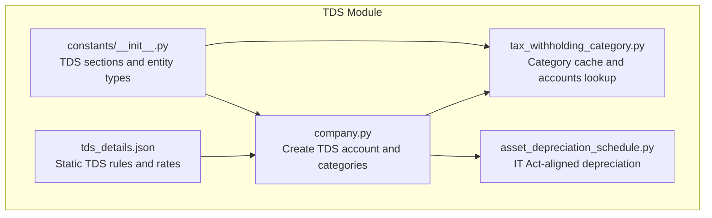
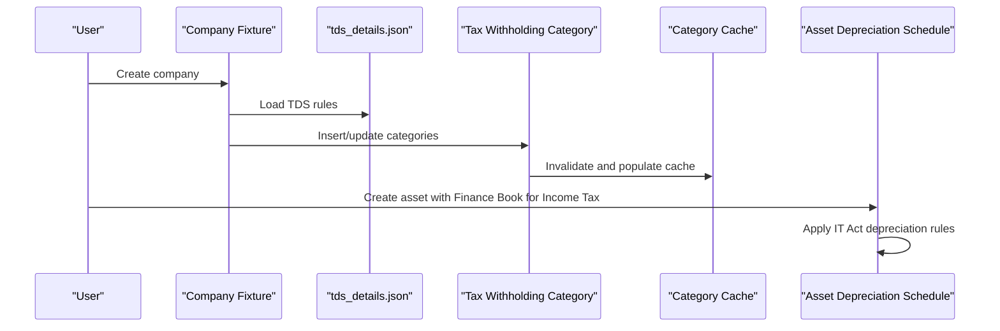
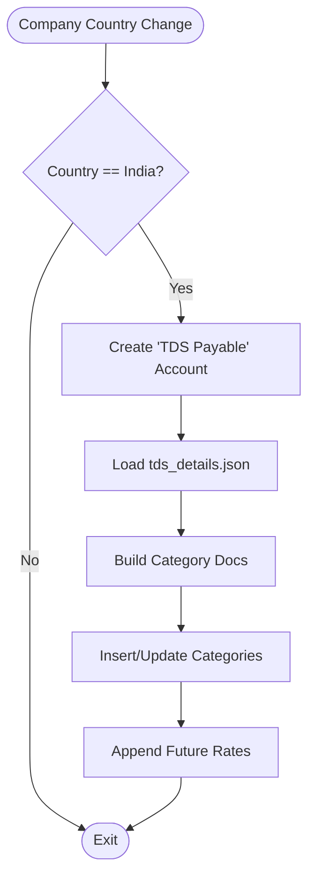
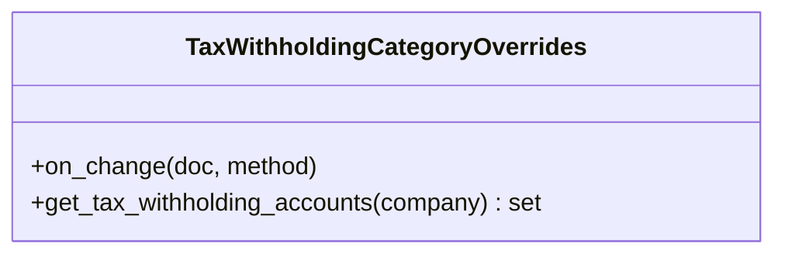
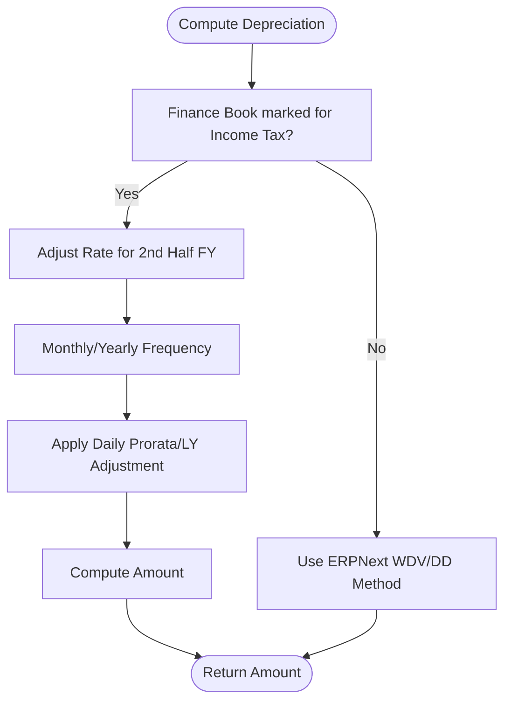
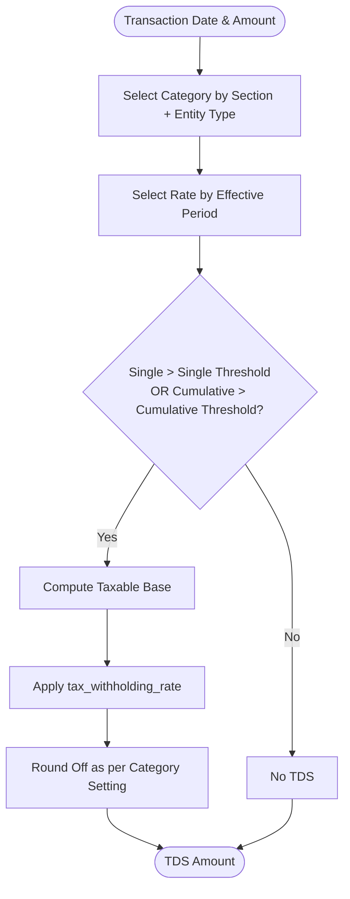
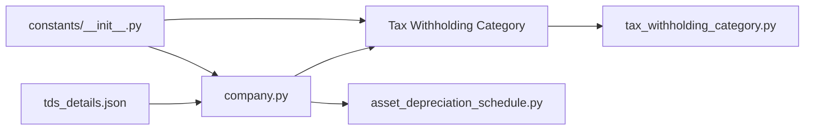

# Income Tax (TDS) Management

<cite>
**Referenced Files in This Document**
- [tds_details.json](file://india_compliance/income_tax_india/data/tds_details.json)
- [company.py](file://india_compliance/income_tax_india/overrides/company.py)
- [tax_withholding_category.py](file://india_compliance/income_tax_india/overrides/tax_withholding_category.py)
- [asset_depreciation_schedule.py](file://india_compliance/income_tax_india/overrides/asset_depreciation_schedule.py)
- [__init__.py](file://india_compliance/income_tax_india/constants/__init__.py)
</cite>

## Table of Contents
1. [Introduction](#introduction)
2. [Project Structure](#project-structure)
3. [Core Components](#core-components)
4. [Architecture Overview](#architecture-overview)
5. [Detailed Component Analysis](#detailed-component-analysis)
6. [Dependency Analysis](#dependency-analysis)
7. [Performance Considerations](#performance-considerations)
8. [Troubleshooting Guide](#troubleshooting-guide)
9. [Conclusion](#conclusion)
10. [Appendices](#appendices)

## Introduction
This document explains the Income Tax (TDS) management module for Indian businesses within the India Compliance app. It covers automation of TDS calculation, deduction, and compliance, including TDS category configuration, rates, thresholds, integration with asset depreciation schedules, company tax settings, and tax withholding category overrides that adjust ERPNext behavior for TDS compliance. It also outlines calculation algorithms for different entity types, reporting capabilities for TDS certificates and challans, and relationships with salary processing and vendor payments. Finally, it addresses common scenarios, error handling, and compliance requirements for TDS filing.

## Project Structure
The TDS module is organized around:
- Static TDS rules and rates defined in a JSON dataset
- Overrides that configure company fixtures, TDS accounts, and Tax Withholding Categories
- Asset depreciation schedule overrides aligned with Income Tax Act provisions
- Constants enumerating TDS sections and entity types

**Diagram sources**
- [tds_details.json](file://india_compliance/income_tax_india/data/tds_details.json#L1-L1895)
- [company.py](file://india_compliance/income_tax_india/overrides/company.py#L1-L148)
- [tax_withholding_category.py](file://india_compliance/income_tax_india/overrides/tax_withholding_category.py#L1-L19)
- [asset_depreciation_schedule.py](file://india_compliance/income_tax_india/overrides/asset_depreciation_schedule.py#L1-L160)
- [__init__.py](file://india_compliance/income_tax_india/constants/__init__.py#L1-L32)

**Section sources**
- [tds_details.json](file://india_compliance/income_tax_india/data/tds_details.json#L1-L1895)
- [company.py](file://india_compliance/income_tax_india/overrides/company.py#L1-L148)
- [tax_withholding_category.py](file://india_compliance/income_tax_india/overrides/tax_withholding_category.py#L1-L19)
- [asset_depreciation_schedule.py](file://india_compliance/income_tax_india/overrides/asset_depreciation_schedule.py#L1-L160)
- [__init__.py](file://india_compliance/income_tax_india/constants/__init__.py#L1-L32)

## Core Components
- TDS rules dataset: Defines categories, sections, entity types, and applicable rates with single and cumulative thresholds across effective date ranges.
- Company fixture creation: Automatically creates a TDS Payable account and populates Tax Withholding Categories from the dataset.
- Tax Withholding Category overrides: Provides caching and account lookup utilities for TDS categories.
- Asset depreciation schedule overrides: Applies Income Tax Act adjustments for asset depreciation and sale-year entries.
- Constants: Enumerates supported TDS sections and entity types.

**Section sources**
- [tds_details.json](file://india_compliance/income_tax_india/data/tds_details.json#L1-L1895)
- [company.py](file://india_compliance/income_tax_india/overrides/company.py#L14-L148)
- [tax_withholding_category.py](file://india_compliance/income_tax_india/overrides/tax_withholding_category.py#L1-L19)
- [asset_depreciation_schedule.py](file://india_compliance/income_tax_india/overrides/asset_depreciation_schedule.py#L23-L160)
- [__init__.py](file://india_compliance/income_tax_india/constants/__init__.py#L1-L32)

## Architecture Overview
The TDS module integrates with ERPNext’s accounting and asset systems to automate TDS compliance. At runtime:
- Company creation triggers TDS account and category setup from the static dataset.
- TDS categories are cached for fast retrieval.
- Asset depreciation follows IT Act rules for proration and sale-year cancellations.
- Transaction-level TDS behavior is governed by Tax Withholding Categories and company-specific accounts.

**Diagram sources**
- [company.py](file://india_compliance/income_tax_india/overrides/company.py#L14-L148)
- [tax_withholding_category.py](file://india_compliance/income_tax_india/overrides/tax_withholding_category.py#L4-L19)
- [asset_depreciation_schedule.py](file://india_compliance/income_tax_india/overrides/asset_depreciation_schedule.py#L23-L160)
- [tds_details.json](file://india_compliance/income_tax_india/data/tds_details.json#L1-L1895)

## Detailed Component Analysis

### TDS Category Configuration and Rates
- Categories are defined by TDS section, category name, and entity type (Company, Individual, Company Assessee, No PAN / Invalid PAN).
- Each category includes:
  - Round-off behavior for tax amounts
  - Consideration of party ledger amount
  - Tax-on-excess amount flag
  - Rate tiers with from_date, to_date, tax_withholding_rate, single_threshold, and cumulative_threshold
- Effective-date filtering ensures only prospective rates are applied.

Key behaviors:
- Single threshold: Deduction applies if a single invoice exceeds this amount.
- Cumulative threshold: Deduction applies if the aggregate amount across the financial year exceeds this amount.
- Entity-type variants: Different rates apply depending on whether the recipient is a Company, Individual, Company Assessee, or lacks a valid PAN.

Common categories include:
- Payments to contractors, insurance commissions, non-exempt life insurance payouts, commission/brokerage, rent on assets, professional and technical fees, dividends, interest on securities, horse and lottery winnings, EPF premature withdrawal, mutual fund units, property transfers, purchasing agent TDS, sale of goods, and more.

**Section sources**
- [tds_details.json](file://india_compliance/income_tax_india/data/tds_details.json#L1-L1895)
- [__init__.py](file://india_compliance/income_tax_india/constants/__init__.py#L1-L32)

### Company Fixture Creation and Category Synchronization
- On company creation or country change to India, the module:
  - Creates a “TDS Payable” account under the appropriate ledger group.
  - Loads TDS rules from the dataset and inserts or updates Tax Withholding Categories.
  - Ensures company-specific accounts are linked to categories.
  - Adds future-effective rates while preserving existing ones.

Operational highlights:
- Prospective rate selection prevents historical rates from being enforced.
- Existing categories are updated by appending new rate rows after the latest effective date.
- Errors during update are logged with traceback and reference details.

**Diagram sources**
- [company.py](file://india_compliance/income_tax_india/overrides/company.py#L7-L148)
- [tds_details.json](file://india_compliance/income_tax_india/data/tds_details.json#L106-L147)

**Section sources**
- [company.py](file://india_compliance/income_tax_india/overrides/company.py#L7-L148)
- [tds_details.json](file://india_compliance/income_tax_india/data/tds_details.json#L106-L147)

### Tax Withholding Category Overrides
- Cache invalidation on category changes ensures fresh lookups.
- Cached retrieval of TDS accounts per company avoids repeated database queries.
- These utilities support downstream TDS calculations and validations.

**Diagram sources**
- [tax_withholding_category.py](file://india_compliance/income_tax_india/overrides/tax_withholding_category.py#L1-L19)

**Section sources**
- [tax_withholding_category.py](file://india_compliance/income_tax_india/overrides/tax_withholding_category.py#L1-L19)

### Asset Depreciation Schedule Overrides (Income Tax Act)
- Applies IT Act adjustments:
  - If an asset is acquired in the second half of the fiscal year, the rate is halved for the first year.
  - Supports monthly and yearly depreciation frequencies.
  - Adjusts daily proration and leap year considerations.
  - Cancels depreciation entries for the current fiscal year upon asset sale to align with IT Act requirements.

**Diagram sources**
- [asset_depreciation_schedule.py](file://india_compliance/income_tax_india/overrides/asset_depreciation_schedule.py#L23-L127)

**Section sources**
- [asset_depreciation_schedule.py](file://india_compliance/income_tax_india/overrides/asset_depreciation_schedule.py#L23-L160)

### Calculation Algorithms for Different Entity Types
- Selection logic:
  - Choose the category matching the TDS section and entity type.
  - Select the rate row whose effective period includes the transaction date.
- Deduction trigger:
  - Compare the single transaction amount against the single threshold.
  - Sum prior period amounts and compare against the cumulative threshold.
- Tax amount computation:
  - Apply the selected tax_withholding_rate to the taxable amount (subject to category-specific flags).
  - Round off according to round_off_tax_amount setting.

Entity-type variants:
- Company, Individual, Company Assessee, and No PAN / Invalid PAN each have distinct rates and thresholds.

**Diagram sources**
- [tds_details.json](file://india_compliance/income_tax_india/data/tds_details.json#L1-L1895)
- [company.py](file://india_compliance/income_tax_india/overrides/company.py#L106-L147)

**Section sources**
- [tds_details.json](file://india_compliance/income_tax_india/data/tds_details.json#L1-L1895)
- [company.py](file://india_compliance/income_tax_india/overrides/company.py#L106-L147)

### Reporting Capabilities for TDS Certificates and Challans
- TDS certificate generation and challan printing are supported via standard ERPNext mechanisms integrated with TDS Payable accounts and Tax Withholding Categories.
- Reports can be built on top of Payment Entries and GL Entries tagged to TDS Payable to reconcile TDS deducted and deposited.

Note: Specific report definitions are outside the scope of the referenced files; consult ERPNext’s standard TDS reporting features and the TDS Payable account setup.

[No sources needed since this section describes general reporting capabilities without analyzing specific files]

### Relationship with Salary Processing and Vendor Payments
- Salary processing:
  - TDS on salaries is managed via Tax Deducted at Source (TDS) settings in ERPNext. The TDS module’s categories and accounts integrate with salary components and tax calculations.
- Vendor payments:
  - Vendor invoices can trigger TDS based on the vendor’s entity type and applicable TDS section. Categories configured from tds_details.json govern the deduction logic.

[No sources needed since this section explains general relationships without analyzing specific files]

## Dependency Analysis
- Static dataset dependency:
  - company.py depends on tds_details.json for category and rate definitions.
- Runtime dependencies:
  - Tax Withholding Category overrides rely on ERPNext’s caching framework and Tax Withholding Accounts.
  - Asset depreciation overrides depend on ERPNext’s asset and finance book mechanics and fiscal year utilities.
- Constants:
  - TDS sections and entity types enumerate supported configurations.

**Diagram sources**
- [tds_details.json](file://india_compliance/income_tax_india/data/tds_details.json#L106-L147)
- [company.py](file://india_compliance/income_tax_india/overrides/company.py#L106-L147)
- [tax_withholding_category.py](file://india_compliance/income_tax_india/overrides/tax_withholding_category.py#L1-L19)
- [asset_depreciation_schedule.py](file://india_compliance/income_tax_india/overrides/asset_depreciation_schedule.py#L1-L160)
- [__init__.py](file://india_compliance/income_tax_india/constants/__init__.py#L1-L32)

**Section sources**
- [company.py](file://india_compliance/income_tax_india/overrides/company.py#L106-L147)
- [__init__.py](file://india_compliance/income_tax_india/constants/__init__.py#L1-L32)

## Performance Considerations
- Caching:
  - Tax Withholding Category accounts are cached to reduce repeated database queries.
- Prospective rate filtering:
  - Historical rates are excluded to minimize unnecessary category rows and improve performance.
- Asset depreciation:
  - IT Act adjustments avoid excessive recomputation by leveraging proration and leap year logic efficiently.

[No sources needed since this section provides general guidance]

## Troubleshooting Guide
- Category update errors:
  - Errors during category updates are logged with traceback and reference details to assist debugging.
- Cache invalidation:
  - If TDS categories appear stale, triggering on-change handlers clears the cache so that subsequent lookups reflect the latest configuration.
- Asset sale entries:
  - If sale-year entries persist, ensure the cancellation routine runs for the current fiscal year and that Finance Books are marked for Income Tax.

**Section sources**
- [company.py](file://india_compliance/income_tax_india/overrides/company.py#L94-L103)
- [tax_withholding_category.py](file://india_compliance/income_tax_india/overrides/tax_withholding_category.py#L4-L5)
- [asset_depreciation_schedule.py](file://india_compliance/income_tax_india/overrides/asset_depreciation_schedule.py#L134-L160)

## Conclusion
The TDS management module automates TDS configuration, calculation, and compliance for Indian businesses by integrating static TDS rules, company fixtures, category caching, and Income Tax Act-aligned asset depreciation. It supports diverse entity types and TDS sections, enabling accurate deductions and streamlined reporting for TDS certificates and challans. Proper setup of TDS Payable accounts, categories, and Finance Books ensures alignment with legal requirements and operational efficiency.

[No sources needed since this section summarizes without analyzing specific files]

## Appendices

### Appendix A: Supported TDS Sections and Entity Types
- TDS sections include, but are not limited to: 193, 194, 194BB, 194EE, 194A, 194B, 194C, 194D, 194F, 194G, 194H, 194I(a), 194I(b), 194JA, 194JB, 194LA, 194LBA, 194DA, 192A, 192B, 194LBB, 194IA, 194N, 194Q, 194T, 195, 206C(1H).
- Entity types: Individual, Company, Company Assessee, No PAN / Invalid PAN.

**Section sources**
- [__init__.py](file://india_compliance/income_tax_india/constants/__init__.py#L1-L32)