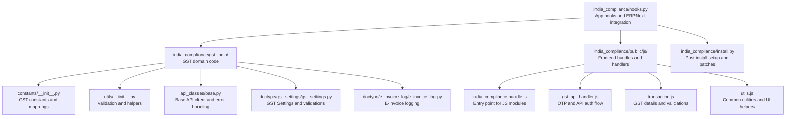
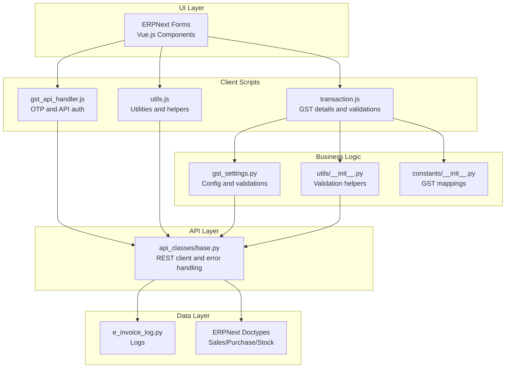
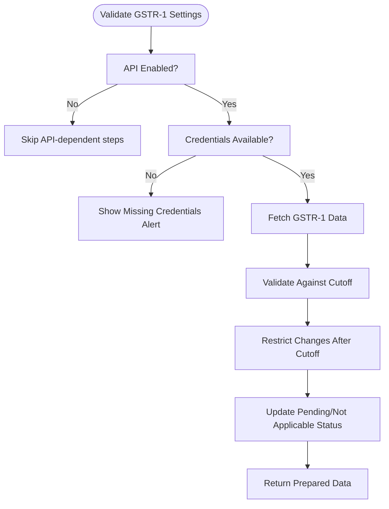
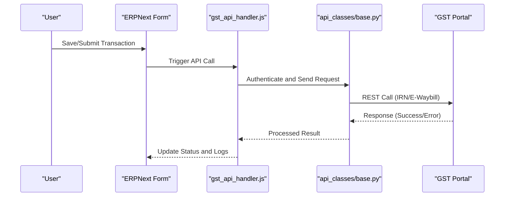
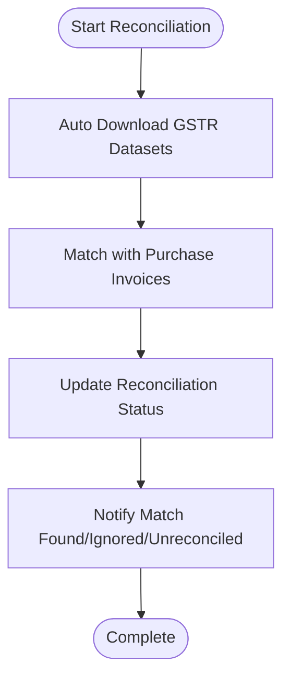
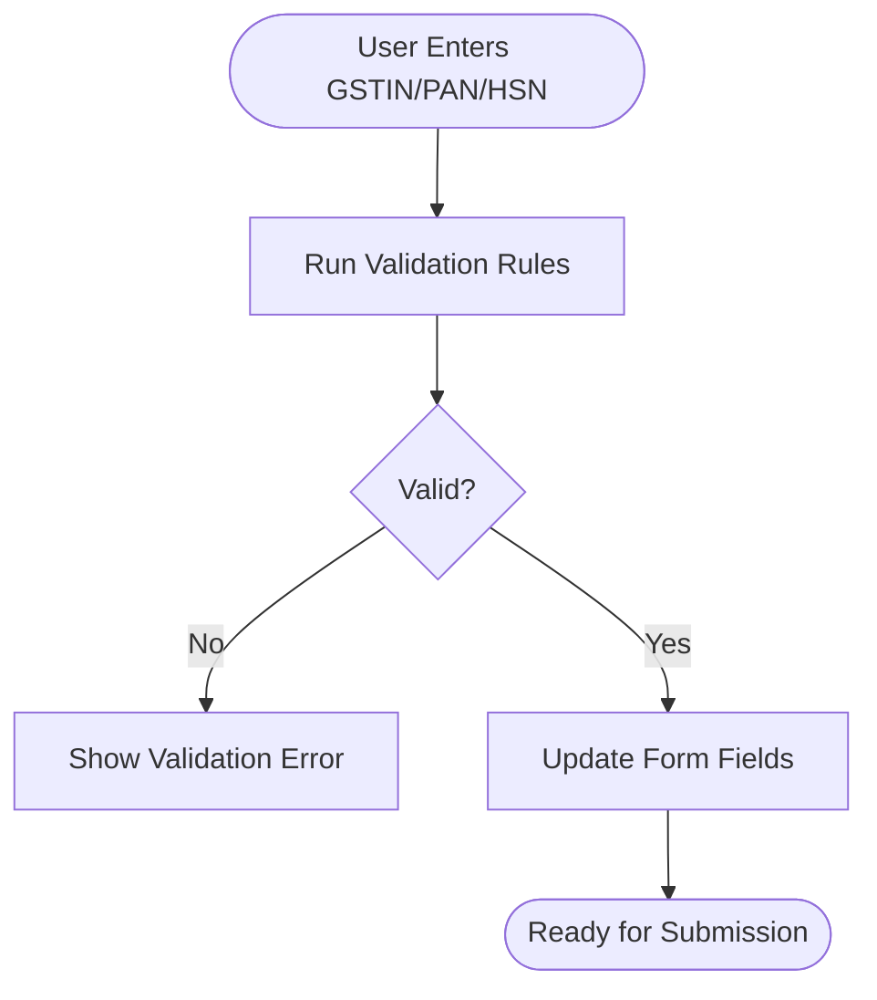
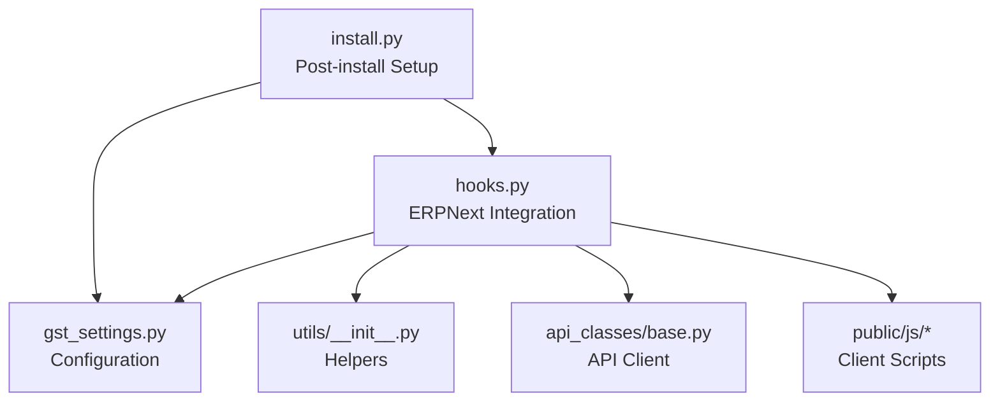

# Project Overview

<cite>
**Referenced Files in This Document**
- [README.md](file://README.md)
- [hooks.py](file://india_compliance/hooks.py)
- [install.py](file://india_compliance/install.py)
- [__init__.py](file://india_compliance/gst_india/__init__.py)
- [constants/__init__.py](file://india_compliance/gst_india/constants/__init__.py)
- [utils/__init__.py](file://india_compliance/gst_india/utils/__init__.py)
- [api_classes/base.py](file://india_compliance/gst_india/api_classes/base.py)
- [gst_settings.py](file://india_compliance/gst_india/doctype/gst_settings/gst_settings.py)
- [e_invoice_log.py](file://india_compliance/gst_india/doctype/e_invoice_log/e_invoice_log.py)
- [public/js/india_compliance.bundle.js](file://india_compliance/public/js/india_compliance.bundle.js)
- [public/js/gst_api_handler.js](file://india_compliance/public/js/gst_api_handler.js)
- [public/js/transaction.js](file://india_compliance/public/js/transaction.js)
- [public/js/utils.js](file://india_compliance/public/js/utils.js)
</cite>

## Table of Contents
1. [Introduction](#introduction)
2. [Project Structure](#project-structure)
3. [Core Components](#core-components)
4. [Architecture Overview](#architecture-overview)
5. [Detailed Component Analysis](#detailed-component-analysis)
6. [Dependency Analysis](#dependency-analysis)
7. [Performance Considerations](#performance-considerations)
8. [Troubleshooting Guide](#troubleshooting-guide)
9. [Conclusion](#conclusion)

## Introduction
India Compliance is a GST compliance automation solution for Indian businesses built on ERPNext and the Frappe Framework. It streamlines recurring compliance tasks by integrating with GST APIs, automating return preparation, e-invoice and e-waybill generation, purchase reconciliation, and real-time validation of GSTINs and documents. The project aims to make compliance with Indian rules and regulations simple, swift, and reliable.

Target audience:
- Indian businesses: Automate filing, reconciliation, and validations to reduce manual effort and risk.
- Tax professionals: Enhance accuracy and audit trail with integrated reporting and real-time validations.

Key value propositions:
- Automated GST return filing with intelligent data mapping and error validation.
- E-invoice and e-waybill integration with seamless government portal connectivity.
- Advanced purchase reconciliation leveraging GSTR-2A/2B and IMS.
- Real-time validation of GSTINs, documents, and tax categories.
- Intelligent reporting for GSTR-1, GSTR-2A/2B reconciliation, and tax liability.

Technology stack overview:
- Backend: Python (Frappe/ERPNext framework).
- Frontend: JavaScript, Vue.js (via Frappe UI), and ERPNext client scripts.
- Integration: REST APIs to GST portals via a secure gateway, with sandbox and production modes.

Regulatory compliance context:
- Aligns with GST laws and government-mandated filings (e.g., GSTR-1, GSTR-3B).
- Supports e-invoice applicability dates and e-waybill thresholds.
- Provides audit trail and validation to mitigate penalties.

Practical compliance scenarios automated:
- Automatically preparing GSTR-1 data and validating against government datasets.
- Generating IRNs and e-waybills for applicable invoices and deliveries.
- Matching inward supplies with GSTR-2A/2B and reconciling ITC claims.
- Real-time GSTIN verification and document validation during creation/editing.

**Section sources**
- [README.md](file://README.md#L26-L64)
- [hooks.py](file://india_compliance/hooks.py#L1-L10)
- [gst_settings.py](file://india_compliance/gst_india/doctype/gst_settings/gst_settings.py#L192-L218)

## Project Structure
High-level structure highlights:
- Core app metadata and integration hooks with ERPNext.
- GST-specific constants, utilities, and API classes for government integrations.
- Doctypes for GST settings, e-invoice logs, and reconciliation tools.
- Frontend assets bundling client-side scripts for transaction handling and API interactions.
- Installation and post-install patches to configure company fixtures and settings.

**Diagram sources**
- [hooks.py](file://india_compliance/hooks.py#L1-L10)
- [constants/__init__.py](file://india_compliance/gst_india/constants/__init__.py#L1-L100)
- [utils/__init__.py](file://india_compliance/gst_india/utils/__init__.py#L1-L120)
- [api_classes/base.py](file://india_compliance/gst_india/api_classes/base.py#L1-L60)
- [gst_settings.py](file://india_compliance/gst_india/doctype/gst_settings/gst_settings.py#L1-L60)
- [e_invoice_log.py](file://india_compliance/gst_india/doctype/e_invoice_log/e_invoice_log.py#L1-L10)
- [public/js/india_compliance.bundle.js](file://india_compliance/public/js/india_compliance.bundle.js#L1-L14)
- [public/js/gst_api_handler.js](file://india_compliance/public/js/gst_api_handler.js#L1-L40)
- [public/js/transaction.js](file://india_compliance/public/js/transaction.js#L1-L40)
- [public/js/utils.js](file://india_compliance/public/js/utils.js#L1-L40)
- [install.py](file://india_compliance/install.py#L1-L60)

**Section sources**
- [hooks.py](file://india_compliance/hooks.py#L1-L10)
- [install.py](file://india_compliance/install.py#L1-L60)
- [public/js/india_compliance.bundle.js](file://india_compliance/public/js/india_compliance.bundle.js#L1-L14)

## Core Components
- GST Settings: Central configuration for API enablement, e-invoice applicability, credentials, and validation toggles.
- API Base Client: Shared logic for connecting to GST APIs, masking sensitive data, handling errors, and scheduling jobs.
- Transaction Utilities: Validation helpers for GSTIN, PAN, HSN, place of supply, and overseas transactions.
- Frontend Handlers: Client-side scripts for fetching GST details, OTP-based authentication, and real-time validations.
- Installation and Patches: Post-install setup to configure company fixtures, migrate legacy data, and enforce compliance settings.

Key capabilities:
- Real-time GSTIN and PAN validation with status display and refresh controls.
- Automated e-invoice and e-waybill status updates and retry mechanisms.
- Purchase reconciliation with GSTR-2A/2B and IMS datasets.
- Audit trail and logging for GST-related actions.

**Section sources**
- [gst_settings.py](file://india_compliance/gst_india/doctype/gst_settings/gst_settings.py#L192-L343)
- [api_classes/base.py](file://india_compliance/gst_india/api_classes/base.py#L120-L220)
- [utils/__init__.py](file://india_compliance/gst_india/utils/__init__.py#L163-L296)
- [public/js/utils.js](file://india_compliance/public/js/utils.js#L133-L204)
- [public/js/gst_api_handler.js](file://india_compliance/public/js/gst_api_handler.js#L14-L94)
- [install.py](file://india_compliance/install.py#L55-L119)

## Architecture Overview
The system integrates ERPNext with GST APIs through a layered architecture:
- UI Layer: ERPNext forms and reports with Frappe UI and Vue.js components.
- Client Scripts: JavaScript handlers for real-time validations and API interactions.
- Business Logic: Python modules for GST calculations, validations, and integrations.
- API Layer: Secure REST clients to GST portals with error handling and logging.
- Data Layer: ERPNext doctypes and custom GST doctypes for audit and reconciliation.

**Diagram sources**
- [public/js/transaction.js](file://india_compliance/public/js/transaction.js#L41-L167)
- [public/js/gst_api_handler.js](file://india_compliance/public/js/gst_api_handler.js#L4-L12)
- [public/js/utils.js](file://india_compliance/public/js/utils.js#L133-L204)
- [gst_settings.py](file://india_compliance/gst_india/doctype/gst_settings/gst_settings.py#L192-L343)
- [utils/__init__.py](file://india_compliance/gst_india/utils/__init__.py#L163-L296)
- [constants/__init__.py](file://india_compliance/gst_india/constants/__init__.py#L1-L100)
- [api_classes/base.py](file://india_compliance/gst_india/api_classes/base.py#L120-L220)
- [e_invoice_log.py](file://india_compliance/gst_india/doctype/e_invoice_log/e_invoice_log.py#L1-L10)

## Detailed Component Analysis

### Automated GST Return Filing
- Purpose: Prepare GSTR-1-like data and validate against government datasets.
- Implementation highlights:
  - Configurable applicability dates and company-wise rules.
  - Validation of transaction dates relative to GSTR-1 filing cutoffs.
  - Restriction on modifying transactions after the GSTR-1 cutoff for selected roles.
- Practical scenario:
  - Sales invoices meeting e-invoice thresholds are marked as “Pending” or “Not Applicable” based on posting date and company settings.

**Diagram sources**
- [gst_settings.py](file://india_compliance/gst_india/doctype/gst_settings/gst_settings.py#L381-L404)
- [gst_settings.py](file://india_compliance/gst_india/doctype/gst_settings/gst_settings.py#L558-L595)
- [gst_settings.py](file://india_compliance/gst_india/doctype/gst_settings/gst_settings.py#L462-L556)

**Section sources**
- [gst_settings.py](file://india_compliance/gst_india/doctype/gst_settings/gst_settings.py#L381-L404)
- [gst_settings.py](file://india_compliance/gst_india/doctype/gst_settings/gst_settings.py#L558-L595)
- [gst_settings.py](file://india_compliance/gst_india/doctype/gst_settings/gst_settings.py#L462-L556)

### E-Invoice and E-Waybill Integration
- Purpose: Automate IRN generation and e-waybill creation for applicable transactions.
- Implementation highlights:
  - Base API client handles authentication, request masking, and error propagation.
  - Scheduler ensures retries for failed e-invoice/e-waybill generations.
  - Frontend OTP handler for GST portal authentication flows.
- Practical scenario:
  - Sales invoices with valid GSTINs and thresholds trigger IRN generation; e-waybills are auto-generated for applicable deliveries.

**Diagram sources**
- [public/js/gst_api_handler.js](file://india_compliance/public/js/gst_api_handler.js#L4-L12)
- [api_classes/base.py](file://india_compliance/gst_india/api_classes/base.py#L120-L220)
- [e_invoice_log.py](file://india_compliance/gst_india/doctype/e_invoice_log/e_invoice_log.py#L1-L10)

**Section sources**
- [api_classes/base.py](file://india_compliance/gst_india/api_classes/base.py#L120-L220)
- [public/js/gst_api_handler.js](file://india_compliance/public/js/gst_api_handler.js#L14-L94)
- [e_invoice_log.py](file://india_compliance/gst_india/doctype/e_invoice_log/e_invoice_log.py#L1-L10)

### Purchase Reconciliation
- Purpose: Maximize ITC claims by matching inward supplies with GSTR-2A/2B and IMS.
- Implementation highlights:
  - Auto-download and reconcile GSTR datasets with purchase invoices.
  - Scheduled jobs for periodic refresh and auto-reconciliation.
  - Reconciliation status indicators and match-found notifications.
- Practical scenario:
  - Purchase invoices are matched with GSTR-2A/2B records; unmatched items are flagged for manual review.

**Diagram sources**
- [hooks.py](file://india_compliance/hooks.py#L473-L492)

**Section sources**
- [hooks.py](file://india_compliance/hooks.py#L473-L492)

### Real-Time Validation
- Purpose: Ensure GSTINs, PANs, HSN codes, and invoice numbers conform to GST requirements.
- Implementation highlights:
  - Frontend utilities for GSTIN/PAN validation and status refresh.
  - Backend validators for place of supply, overseas transactions, and invoice naming.
  - Real-time GSTIN status checks and alerts for invalid registrations or cancellations.
- Practical scenario:
  - On entering a GSTIN, the system validates the check digit, category, and registration status, and prevents invalid transactions.

**Diagram sources**
- [public/js/utils.js](file://india_compliance/public/js/utils.js#L133-L204)
- [utils/__init__.py](file://india_compliance/gst_india/utils/__init__.py#L163-L296)
- [utils/__init__.py](file://india_compliance/gst_india/utils/__init__.py#L402-L484)

**Section sources**
- [public/js/utils.js](file://india_compliance/public/js/utils.js#L133-L204)
- [utils/__init__.py](file://india_compliance/gst_india/utils/__init__.py#L163-L296)
- [utils/__init__.py](file://india_compliance/gst_india/utils/__init__.py#L402-L484)

## Dependency Analysis
- ERPNext integration: Hooks define doctype events, regional overrides, and scheduled tasks.
- GST Settings dependency: Centralized configuration for API enablement, credentials, and validation toggles.
- Frontend bundling: Entry point aggregates client-side modules for transaction handling and API interactions.
- Installation pipeline: Post-install patches ensure company fixtures and migration of legacy data.

**Diagram sources**
- [hooks.py](file://india_compliance/hooks.py#L118-L389)
- [gst_settings.py](file://india_compliance/gst_india/doctype/gst_settings/gst_settings.py#L1-L60)
- [utils/__init__.py](file://india_compliance/gst_india/utils/__init__.py#L1-L120)
- [api_classes/base.py](file://india_compliance/gst_india/api_classes/base.py#L1-L60)
- [public/js/india_compliance.bundle.js](file://india_compliance/public/js/india_compliance.bundle.js#L1-L14)
- [install.py](file://india_compliance/install.py#L55-L119)

**Section sources**
- [hooks.py](file://india_compliance/hooks.py#L118-L389)
- [install.py](file://india_compliance/install.py#L55-L119)

## Performance Considerations
- Scheduler dependency: E-invoice and e-waybill features require the Frappe scheduler to be enabled; otherwise, API calls and retries are blocked.
- API rate limits: The base API client handles rate-limiting and throttling responses gracefully.
- Batch operations: Scheduled jobs automate reconciliation and dataset downloads to avoid manual overhead.

Recommendations:
- Enable the scheduler for production environments.
- Monitor API credits and sandbox mode usage.
- Use batch reconciliation during off-peak hours to minimize impact on live operations.

**Section sources**
- [api_classes/base.py](file://india_compliance/gst_india/api_classes/base.py#L372-L394)
- [hooks.py](file://india_compliance/hooks.py#L473-L492)

## Troubleshooting Guide
Common issues and resolutions:
- API credentials missing: Ensure credentials are configured for e-Waybill/e-Invoice services in GST Settings.
- Invalid GSTIN/PAN: Validate using frontend utilities and backend validators; check registration status and cancellation dates.
- Scheduler disabled: Enable the Frappe scheduler to allow e-invoice/e-waybill retries and reconciliation jobs.
- OTP authentication failures: Use the OTP dialog to resend and re-enter OTP for GST portal authentication.

Support resources:
- Documentation links and community support are available via the project’s website and GitHub discussions.

**Section sources**
- [gst_settings.py](file://india_compliance/gst_india/doctype/gst_settings/gst_settings.py#L219-L263)
- [public/js/gst_api_handler.js](file://india_compliance/public/js/gst_api_handler.js#L14-L94)
- [api_classes/base.py](file://india_compliance/gst_india/api_classes/base.py#L372-L394)
- [README.md](file://README.md#L71-L74)

## Conclusion
India Compliance delivers a robust, automated GST compliance solution tailored for Indian businesses within ERPNext. By integrating with GST APIs, it automates return filing, e-invoice/e-waybill generation, purchase reconciliation, and real-time validations. Its modular architecture, centralized configuration, and scheduler-driven workflows ensure scalability, reliability, and adherence to regulatory requirements.