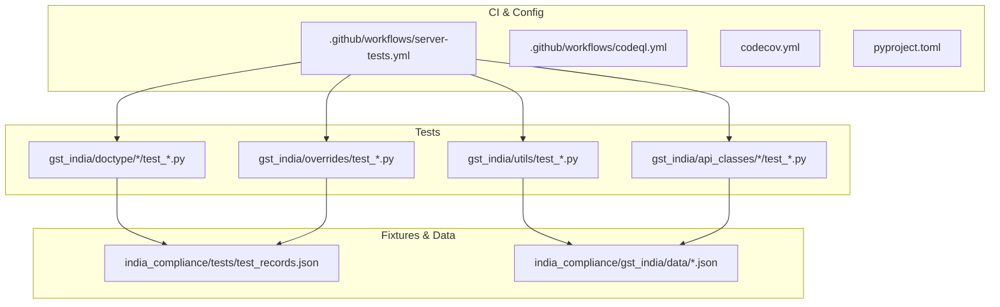
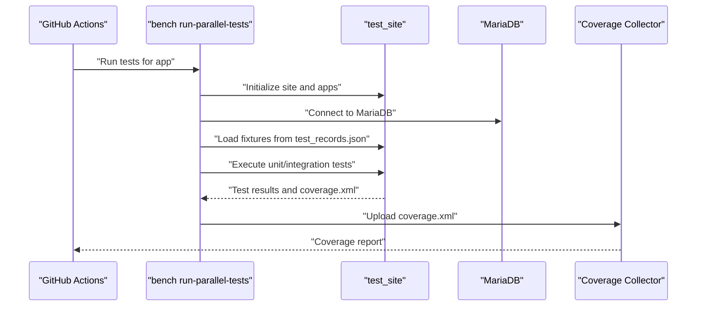
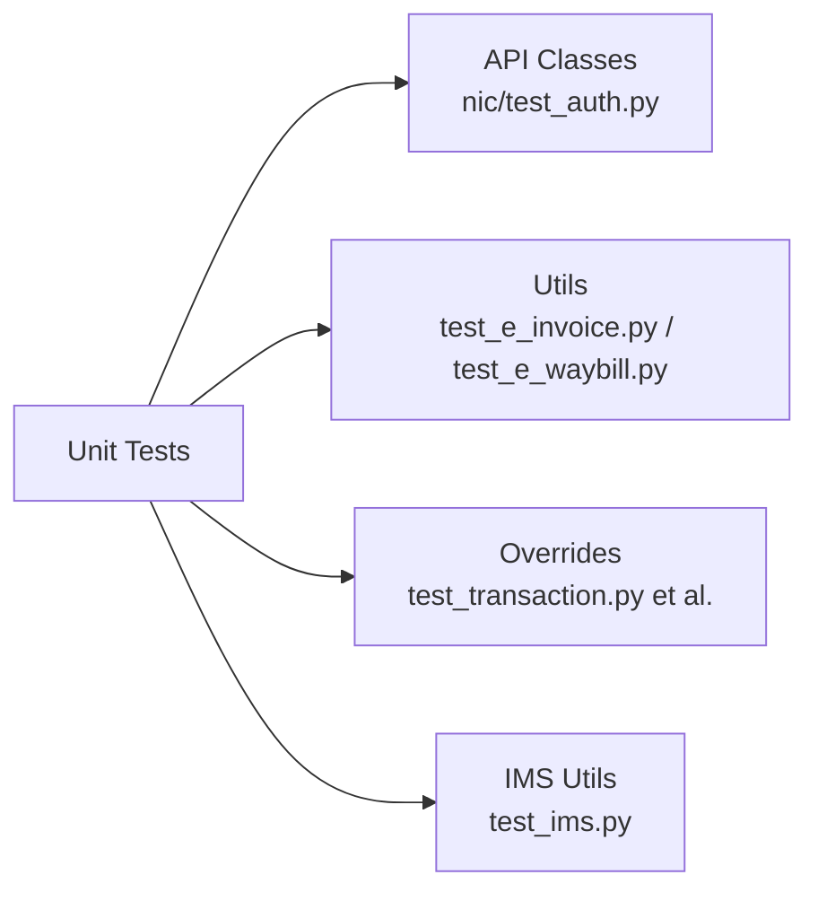
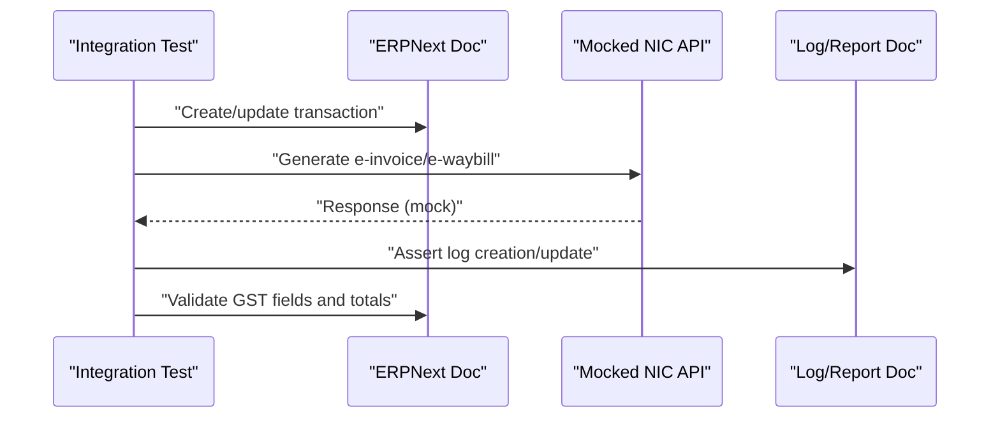
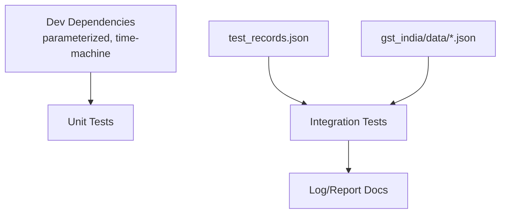

# Testing & Quality Assurance

<cite>
**Referenced Files in This Document**
- [README.md](file://README.md)
- [codecov.yml](file://codecov.yml)
- [.github/workflows/server-tests.yml](file://.github/workflows/server-tests.yml)
- [.github/workflows/codeql.yml](file://.github/workflows/codeql.yml)
- [pyproject.toml](file://pyproject.toml)
- [india_compliance/tests/test_records.json](file://india_compliance/tests/test_records.json)
- [india_compliance/gst_india/api_classes/nic/test_auth.py](file://india_compliance/gst_india/api_classes/nic/test_auth.py)
- [india_compliance/gst_india/api_classes/test_mask_sensitive_info.py](file://india_compliance/gst_india/api_classes/test_mask_sensitive_info.py)
- [india_compliance/gst_india/utils/test_e_invoice.py](file://india_compliance/gst_india/utils/test_e_invoice.py)
- [india_compliance/gst_india/utils/test_e_waybill.py](file://india_compliance/gst_india/utils/test_e_waybill.py)
- [india_compliance/gst_india/utils/gstr_2/test_ims.py](file://india_compliance/gst_india/utils/gstr_2/test_ims.py)
- [india_compliance/gst_india/data/test_e_invoice.json](file://india_compliance/gst_india/data/test_e_invoice.json)
- [india_compliance/gst_india/data/test_e_waybill.json](file://india_compliance/gst_india/data/test_e_waybill.json)
- [india_compliance/gst_india/data/test_ims.json](file://india_compliance/gst_india/data/test_ims.json)
- [india_compliance/gst_india/doctype/e_invoice_log/test_e_invoice_log.py](file://india_compliance/gst_india/doctype/e_invoice_log/test_e_invoice_log.py)
- [india_compliance/gst_india/doctype/e_waybill_log/test_e_waybill_log.py](file://india_compliance/gst_india/doctype/e_waybill_log/test_e_waybill_log.py)
- [india_compliance/gst_india/doctype/gstr_import_log/test_gstr_import_log.py](file://india_compliance/gst_india/doctype/gstr_import_log/test_gstr_import_log.py)
- [india_compliance/gst_india/doctype/gst_settings/test_gst_settings.py](file://india_compliance/gst_india/doctype/gst_settings/test_gst_settings.py)
- [india_compliance/gst_india/doctype/gstin/test_gstin.py](file://india_compliance/gst_india/doctype/gstin/test_gstin.py)
- [india_compliance/gst_india/doctype/purchase_reconciliation_tool/test_purchase_reconciliation_tool.py](file://india_compliance/gst_india/doctype/purchase_reconciliation_tool/test_purchase_reconciliation_tool.py)
- [india_compliance/gst_india/doctype/bill_of_entry/test_bill_of_entry.py](file://india_compliance/gst_india/doctype/bill_of_entry/test_bill_of_entry.py)
- [india_compliance/gst_india/doctype/gstr_1/test_gstr_1.py](file://india_compliance/gst_india/doctype/gstr_1/test_gstr_1.py)
- [india_compliance/gst_india/doctype/gstr_3b_report/test_gstr_3b_report.py](file://india_compliance/gst_india/doctype/gstr_3b_report/test_gstr_3b_report.py)
- [india_compliance/gst_india/doctype/gst_inward_supply/test_gst_inward_supply.py](file://india_compliance/gst_india/doctype/gst_inward_supply/test_gst_inward_supply.py)
- [india_compliance/gst_india/doctype/gst_hsn_code/test_gst_hsn_code.py](file://india_compliance/gst_india/doctype/gst_hsn_code/test_gst_hsn_code.py)
- [india_compliance/gst_india/doctype/pan/test_pan.py](file://india_compliance/gst_india/doctype/pan/test_pan.py)
- [india_compliance/gst_india/doctype/sales_register/test_sales_register.py](file://india_compliance/gst_india/doctype/sales_register/test_sales_register.py)
- [india_compliance/gst_india/doctype/gst_return_log/test_gst_return_log.py](file://india_compliance/gst_india/doctype/gst_return_log/test_gst_return_log.py)
- [india_compliance/gst_india/overrides/test_transaction.py](file://india_compliance/gst_india/overrides/test_transaction.py)
- [india_compliance/gst_india/overrides/test_company.py](file://india_compliance/gst_india/overrides/test_company.py)
- [india_compliance/gst_india/overrides/test_party.py](file://india_compliance/gst_india/overrides/test_party.py)
- [india_compliance/gst_india/overrides/test_item_tax_template.py](file://india_compliance/gst_india/overrides/test_item_tax_template.py)
- [india_compliance/gst_india/overrides/test_sales_invoice.py](file://india_compliance/gst_india/overrides/test_sales_invoice.py)
- [india_compliance/gst_india/overrides/test_purchase_invoice.py](file://india_compliance/gst_india/overrides/test_purchase_invoice.py)
- [india_compliance/gst_india/overrides/test_advance_payment_entry.py](file://india_compliance/gst_india/overrides/test_advance_payment_entry.py)
- [india_compliance/gst_india/overrides/test_subcontracting_transaction.py](file://india_compliance/gst_india/overrides/test_subcontracting_transaction.py)
- [india_compliance/gst_india/overrides/test_transaction_data.py](file://india_compliance/gst_india/overrides/test_transaction_data.py)
- [india_compliance/gst_india/overrides/test_setup_wizard.py](file://india_compliance/gst_india/overrides/test_setup_wizard.py)
- [india_compliance/gst_india/overrides/test_ineligible_itc.py](file://india_compliance/gst_india/overrides/test_ineligible_itc.py)
- [india_compliance/gst_india/overrides/test_item_tax_template.py](file://india_compliance/gst_india/overrides/test_item_tax_template.py)
- [india_compliance/gst_india/overrides/test_party.py](file://india_compliance/gst_india/overrides/test_party.py)
- [india_compliance/gst_india/overrides/test_company.py](file://india_compliance/gst_india/overrides/test_company.py)
- [india_compliance/gst_india/overrides/test_transaction.py](file://india_compliance/gst_india/overrides/test_transaction.py)
- [india_compliance/gst_india/overrides/test_purchase_invoice.py](file://india_compliance/gst_india/overrides/test_purchase_invoice.py)
- [india_compliance/gst_india/overrides/test_sales_invoice.py](file://india_compliance/gst_india/overrides/test_sales_invoice.py)
- [india_compliance/gst_india/overrides/test_subcontracting_transaction.py](file://india_compliance/gst_india/overrides/test_subcontracting_transaction.py)
- [india_compliance/gst_india/overrides/test_transaction_data.py](file://india_compliance/gst_india/overrides/test_transaction_data.py)
- [india_compliance/gst_india/overrides/test_setup_wizard.py](file://india_compliance/gst_india/overrides/test_setup_wizard.py)
- [india_compliance/gst_india/overrides/test_ineligible_itc.py](file://india_compliance/gst_india/overrides/test_ineligible_itc.py)
- [india_compliance/gst_india/overrides/test_advance_payment_entry.py](file://india_compliance/gst_india/overrides/test_advance_payment_entry.py)
</cite>

## Table of Contents
1. [Introduction](#introduction)
2. [Project Structure](#project-structure)
3. [Core Components](#core-components)
4. [Architecture Overview](#architecture-overview)
5. [Detailed Component Analysis](#detailed-component-analysis)
6. [Dependency Analysis](#dependency-analysis)
7. [Performance Considerations](#performance-considerations)
8. [Troubleshooting Guide](#troubleshooting-guide)
9. [Conclusion](#conclusion)
10. [Appendices](#appendices)

## Introduction
This document describes the testing and quality assurance processes for the India Compliance application. It covers the test infrastructure, fixtures, mock data, unit and integration tests, parameterized testing, test data management, environment setup, continuous integration, code coverage, performance and security validation, deployment-specific strategies, regression testing, and debugging/logging approaches used during testing.

## Project Structure
The repository organizes tests primarily alongside application modules:
- Unit and integration tests are located adjacent to the tested modules (e.g., under gst_india/doctype/, gst_india/utils/, gst_india/api_classes/).
- Shared test fixtures and records are centralized under india_compliance/tests/test_records.json.
- Test data for government APIs and workflows is stored under india_compliance/gst_india/data/.
- Continuous integration is configured via GitHub Actions workflows under .github/workflows/.

**Diagram sources**
- [.github/workflows/server-tests.yml](file://.github/workflows/server-tests.yml#L1-L145)
- [.github/workflows/codeql.yml](file://.github/workflows/codeql.yml#L1-L61)
- [codecov.yml](file://codecov.yml#L1-L34)
- [pyproject.toml](file://pyproject.toml#L29-L31)
- [india_compliance/tests/test_records.json](file://india_compliance/tests/test_records.json#L1-L543)
- [india_compliance/gst_india/data/test_e_invoice.json](file://india_compliance/gst_india/data/test_e_invoice.json)
- [india_compliance/gst_india/data/test_e_waybill.json](file://india_compliance/gst_india/data/test_e_waybill.json)
- [india_compliance/gst_india/data/test_ims.json](file://india_compliance/gst_india/data/test_ims.json)

**Section sources**
- [.github/workflows/server-tests.yml](file://.github/workflows/server-tests.yml#L1-L145)
- [codecov.yml](file://codecov.yml#L1-L34)
- [pyproject.toml](file://pyproject.toml#L29-L31)
- [india_compliance/tests/test_records.json](file://india_compliance/tests/test_records.json#L1-L543)

## Core Components
- Test Infrastructure
  - Server tests run via Bench’s parallel test runner with coverage collection.
  - MariaDB service is provisioned in CI for database-backed tests.
  - Python 3.14 and Node.js 24 are used; caches are leveraged for pip, node modules, and yarn.
- Test Fixtures and Records
  - Centralized fixture data for Companies, Items, Customers, Suppliers, and Addresses under test_records.json.
  - Used by integration tests to bootstrap ERPNext documents and validate GST workflows.
- Mock Data and Parameterized Scenarios
  - JSON test datasets under gst_india/data/ provide realistic payloads for e-invoice, e-waybill, and IMS.
  - Parameterized testing is enabled via dev-dependencies declared in pyproject.toml.
- Continuous Integration
  - Server tests workflow triggers on PRs and pushes to release branches, collects coverage, and uploads artifacts.
  - CodeQL workflow scans Python and JavaScript for security vulnerabilities.
  - Codecov configuration enforces coverage thresholds and annotations.

**Section sources**
- [.github/workflows/server-tests.yml](file://.github/workflows/server-tests.yml#L36-L145)
- [.github/workflows/codeql.yml](file://.github/workflows/codeql.yml#L1-L61)
- [codecov.yml](file://codecov.yml#L9-L34)
- [pyproject.toml](file://pyproject.toml#L29-L31)
- [india_compliance/tests/test_records.json](file://india_compliance/tests/test_records.json#L1-L543)

## Architecture Overview
The testing architecture integrates CI, test runners, fixtures, and mock data to validate GST compliance workflows.

**Diagram sources**
- [.github/workflows/server-tests.yml](file://.github/workflows/server-tests.yml#L106-L126)
- [india_compliance/tests/test_records.json](file://india_compliance/tests/test_records.json#L1-L543)

## Detailed Component Analysis

### Test Infrastructure and CI/CD
- Server Tests Workflow
  - Runs on Ubuntu latest with MariaDB service.
  - Installs dependencies using a helper script, then executes bench run-parallel-tests with coverage.
  - Uploads coverage artifacts and integrates with Codecov on push events.
- CodeQL Security Scanning
  - Analyzes Python and JavaScript for security issues on a schedule and on PRs.
- Code Coverage Configuration
  - Enforces project-wide and patch coverage targets and uses GitHub checks annotations.

**Section sources**
- [.github/workflows/server-tests.yml](file://.github/workflows/server-tests.yml#L1-L145)
- [.github/workflows/codeql.yml](file://.github/workflows/codeql.yml#L1-L61)
- [codecov.yml](file://codecov.yml#L1-L34)

### Unit Test Coverage for Core Utilities
- API Classes
  - Authentication utilities under gst_india/api_classes/nic/test_auth.py validate cryptographic operations and session handling.
  - Additional masking tests under gst_india/api_classes/test_mask_sensitive_info.py ensure sensitive data handling.
- Business Logic Utilities
  - e-Invoice and e-Waybill utilities include extensive parameterized tests covering generation, cancellation, update, and return scenarios.
  - IMS ingestion tests validate parsing and saving of government data into ERPNext documents.
- Overrides and Controllers
  - Transaction, party, item tax template, company, and purchase/sales invoice override tests validate GST-specific business rules and data transformations.

**Diagram sources**
- [india_compliance/gst_india/api_classes/nic/test_auth.py](file://india_compliance/gst_india/api_classes/nic/test_auth.py#L63-L95)
- [india_compliance/gst_india/api_classes/test_mask_sensitive_info.py](file://india_compliance/gst_india/api_classes/test_mask_sensitive_info.py)
- [india_compliance/gst_india/utils/test_e_invoice.py](file://india_compliance/gst_india/utils/test_e_invoice.py#L1182-L1223)
- [india_compliance/gst_india/utils/test_e_waybill.py](file://india_compliance/gst_india/utils/test_e_waybill.py#L1365-L1435)
- [india_compliance/gst_india/utils/gstr_2/test_ims.py](file://india_compliance/gst_india/utils/gstr_2/test_ims.py#L11-L32)
- [india_compliance/gst_india/overrides/test_transaction.py](file://india_compliance/gst_india/overrides/test_transaction.py)
- [india_compliance/gst_india/overrides/test_sales_invoice.py](file://india_compliance/gst_india/overrides/test_sales_invoice.py)
- [india_compliance/gst_india/overrides/test_purchase_invoice.py](file://india_compliance/gst_india/overrides/test_purchase_invoice.py)

**Section sources**
- [india_compliance/gst_india/api_classes/nic/test_auth.py](file://india_compliance/gst_india/api_classes/nic/test_auth.py#L63-L95)
- [india_compliance/gst_india/api_classes/test_mask_sensitive_info.py](file://india_compliance/gst_india/api_classes/test_mask_sensitive_info.py)
- [india_compliance/gst_india/utils/test_e_invoice.py](file://india_compliance/gst_india/utils/test_e_invoice.py#L1182-L1223)
- [india_compliance/gst_india/utils/test_e_waybill.py](file://india_compliance/gst_india/utils/test_e_waybill.py#L1365-L1435)
- [india_compliance/gst_india/utils/gstr_2/test_ims.py](file://india_compliance/gst_india/utils/gstr_2/test_ims.py#L11-L32)
- [india_compliance/gst_india/overrides/test_transaction.py](file://india_compliance/gst_india/overrides/test_transaction.py)
- [india_compliance/gst_india/overrides/test_sales_invoice.py](file://india_compliance/gst_india/overrides/test_sales_invoice.py)
- [india_compliance/gst_india/overrides/test_purchase_invoice.py](file://india_compliance/gst_india/overrides/test_purchase_invoice.py)

### Integration Test Scenarios for GST Compliance Workflows
- Government API Interactions
  - E-Invoice and E-Waybill generation and retrieval are validated with mocked NIC responses and parameterized test data.
  - IMS ingestion tests load government data and persist it as ERPNext documents for reconciliation.
- Error Condition Handling
  - Tests cover duplicate IRN scenarios, invalid data handling, and cancellation workflows.
- Document Logs and Reports
  - Dedicated logs and reports (e_invoice_log, e_waybill_log, gstr_import_log, gst_return_log) are covered by their respective test modules.

**Diagram sources**
- [india_compliance/gst_india/utils/test_e_invoice.py](file://india_compliance/gst_india/utils/test_e_invoice.py#L1182-L1223)
- [india_compliance/gst_india/utils/test_e_waybill.py](file://india_compliance/gst_india/utils/test_e_waybill.py#L1365-L1435)
- [india_compliance/gst_india/utils/gstr_2/test_ims.py](file://india_compliance/gst_india/utils/gstr_2/test_ims.py#L11-L32)
- [india_compliance/gst_india/doctype/e_invoice_log/test_e_invoice_log.py](file://india_compliance/gst_india/doctype/e_invoice_log/test_e_invoice_log.py)
- [india_compliance/gst_india/doctype/e_waybill_log/test_e_waybill_log.py](file://india_compliance/gst_india/doctype/e_waybill_log/test_e_waybill_log.py)
- [india_compliance/gst_india/doctype/gstr_import_log/test_gstr_import_log.py](file://india_compliance/gst_india/doctype/gstr_import_log/test_gstr_import_log.py)
- [india_compliance/gst_india/doctype/gst_return_log/test_gst_return_log.py](file://india_compliance/gst_india/doctype/gst_return_log/test_gst_return_log.py)

**Section sources**
- [india_compliance/gst_india/utils/test_e_invoice.py](file://india_compliance/gst_india/utils/test_e_invoice.py#L1182-L1223)
- [india_compliance/gst_india/utils/test_e_waybill.py](file://india_compliance/gst_india/utils/test_e_waybill.py#L1365-L1435)
- [india_compliance/gst_india/utils/gstr_2/test_ims.py](file://india_compliance/gst_india/utils/gstr_2/test_ims.py#L11-L32)
- [india_compliance/gst_india/doctype/e_invoice_log/test_e_invoice_log.py](file://india_compliance/gst_india/doctype/e_invoice_log/test_e_invoice_log.py)
- [india_compliance/gst_india/doctype/e_waybill_log/test_e_waybill_log.py](file://india_compliance/gst_india/doctype/e_waybill_log/test_e_waybill_log.py)
- [india_compliance/gst_india/doctype/gstr_import_log/test_gstr_import_log.py](file://india_compliance/gst_india/doctype/gstr_import_log/test_gstr_import_log.py)
- [india_compliance/gst_india/doctype/gst_return_log/test_gst_return_log.py](file://india_compliance/gst_india/doctype/gst_return_log/test_gst_return_log.py)

### Parameterized Testing Approach
- Parameterization Support
  - Declared dev-dependency for parameterized testing enables scenario-driven tests across compliance categories, states, and transaction types.
- Practical Application
  - E-Invoice and E-Waybill tests leverage parameterized datasets to simulate diverse business scenarios (e.g., intra-state vs inter-state, nil-rated vs taxable).
  - Test data updates adjust dynamic fields (dates, amounts) to ensure deterministic assertions.

**Section sources**
- [pyproject.toml](file://pyproject.toml#L30-L31)
- [india_compliance/gst_india/utils/test_e_invoice.py](file://india_compliance/gst_india/utils/test_e_invoice.py#L1182-L1223)
- [india_compliance/gst_india/utils/test_e_waybill.py](file://india_compliance/gst_india/utils/test_e_waybill.py#L1365-L1435)

### Test Data Management
- Centralized Fixtures
  - test_records.json defines Companies, Items, Customers, Suppliers, and Addresses with GST attributes for realistic test scenarios.
- Domain-Specific Data
  - JSON files under gst_india/data/ provide structured payloads for e-invoice, e-waybill, and IMS to drive integration tests.

**Section sources**
- [india_compliance/tests/test_records.json](file://india_compliance/tests/test_records.json#L1-L543)
- [india_compliance/gst_india/data/test_e_invoice.json](file://india_compliance/gst_india/data/test_e_invoice.json)
- [india_compliance/gst_india/data/test_e_waybill.json](file://india_compliance/gst_india/data/test_e_waybill.json)
- [india_compliance/gst_india/data/test_ims.json](file://india_compliance/gst_india/data/test_ims.json)

### Test Environment Setup
- CI Environment
  - Ubuntu runner with MariaDB 11.8 service, Python 3.14, Node.js 24, and cached dependencies.
  - Bench installation and parallel test execution with coverage collection.
- Local Execution
  - Use Bench commands to run tests for the app and generate coverage reports locally.

**Section sources**
- [.github/workflows/server-tests.yml](file://.github/workflows/server-tests.yml#L36-L126)

### Quality Assurance Measures
- Code Coverage
  - Coverage collected via bench run-parallel-tests and uploaded to Codecov; configured with project and patch targets.
- Security Validation
  - CodeQL workflow scans Python and JavaScript for security issues.
- Performance Testing
  - Parallel test execution reduces runtime; consider adding targeted performance benchmarks for heavy workflows (e.g., bulk GSTR downloads).
- Regression Testing
  - Extensive override and domain tests ensure business logic regressions are caught across Sales/Purchase transactions, parties, items, and company settings.

**Section sources**
- [.github/workflows/server-tests.yml](file://.github/workflows/server-tests.yml#L121-L126)
- [codecov.yml](file://codecov.yml#L9-L34)
- [.github/workflows/codeql.yml](file://.github/workflows/codeql.yml#L1-L61)
- [india_compliance/gst_india/overrides/test_transaction.py](file://india_compliance/gst_india/overrides/test_transaction.py)
- [india_compliance/gst_india/overrides/test_sales_invoice.py](file://india_compliance/gst_india/overrides/test_sales_invoice.py)
- [india_compliance/gst_india/overrides/test_purchase_invoice.py](file://india_compliance/gst_india/overrides/test_purchase_invoice.py)

### Debugging Tools, Logging Patterns, and Troubleshooting
- Logging
  - Test logs are captured by Bench and uploaded as artifacts; review bench_start.log for failures.
- Assertions and Mocks
  - Integration tests assert on generated logs and document states; mocks emulate government API responses.
- Troubleshooting Tips
  - Validate fixture data alignment with test expectations.
  - Confirm mock matchers for requests and query parameters.
  - Inspect coverage.xml artifacts to identify untested modules.

**Section sources**
- [.github/workflows/server-tests.yml](file://.github/workflows/server-tests.yml#L117-L126)
- [india_compliance/gst_india/utils/test_e_waybill.py](file://india_compliance/gst_india/utils/test_e_waybill.py#L1392-L1435)

## Dependency Analysis
- Test Dependencies
  - parameterized and time-machine declared as dev-dependencies for parametric scenarios and deterministic time-based tests.
- Test-to-Fixture Coupling
  - Many tests depend on test_records.json for ERPNext documents; ensure schema changes are mirrored in fixtures.
- API Test Coupling
  - E-Invoice/E-Waybill tests rely on NIC mock responses and JSON datasets; keep datasets synchronized with expected payload formats.

**Diagram sources**
- [pyproject.toml](file://pyproject.toml#L29-L31)
- [india_compliance/tests/test_records.json](file://india_compliance/tests/test_records.json#L1-L543)
- [india_compliance/gst_india/data/test_e_invoice.json](file://india_compliance/gst_india/data/test_e_invoice.json)
- [india_compliance/gst_india/data/test_e_waybill.json](file://india_compliance/gst_india/data/test_e_waybill.json)
- [india_compliance/gst_india/data/test_ims.json](file://india_compliance/gst_india/data/test_ims.json)

**Section sources**
- [pyproject.toml](file://pyproject.toml#L29-L31)
- [india_compliance/tests/test_records.json](file://india_compliance/tests/test_records.json#L1-L543)

## Performance Considerations
- Optimize test suites by isolating heavy integration tests and using lightweight fixtures where possible.
- Use parameterized tests to reduce duplication while maintaining coverage breadth.
- Consider caching and reusing test sites to minimize cold-start overhead in CI.

## Troubleshooting Guide
- Coverage Missing
  - Verify bench run-parallel-tests is executed with coverage and that coverage.xml is produced and uploaded.
- Fixture Failures
  - Ensure test_records.json matches ERPNext doctypes and field names; regenerate fixtures if schema changes.
- Mock Mismatches
  - Align mock matchers with request/response payloads; confirm JSON datasets reflect expected formats.

**Section sources**
- [.github/workflows/server-tests.yml](file://.github/workflows/server-tests.yml#L112-L126)
- [india_compliance/tests/test_records.json](file://india_compliance/tests/test_records.json#L1-L543)

## Conclusion
The testing and QA framework combines CI-driven parallel tests, comprehensive fixtures, and parameterized scenarios to validate GST compliance workflows. With Codecov and CodeQL integrated, the project maintains strong coverage and security hygiene. Extending performance benchmarks and expanding domain-specific logs will further strengthen the QA process.

## Appendices
- Deployment-Specific Strategies
  - Sandbox mode and government API credentials are managed via settings; tests should isolate environment-dependent behavior behind mocks and configuration flags.
- Regression Testing Procedures
  - Run full suite on release branches; prioritize overrides and core utility tests to catch business logic regressions.