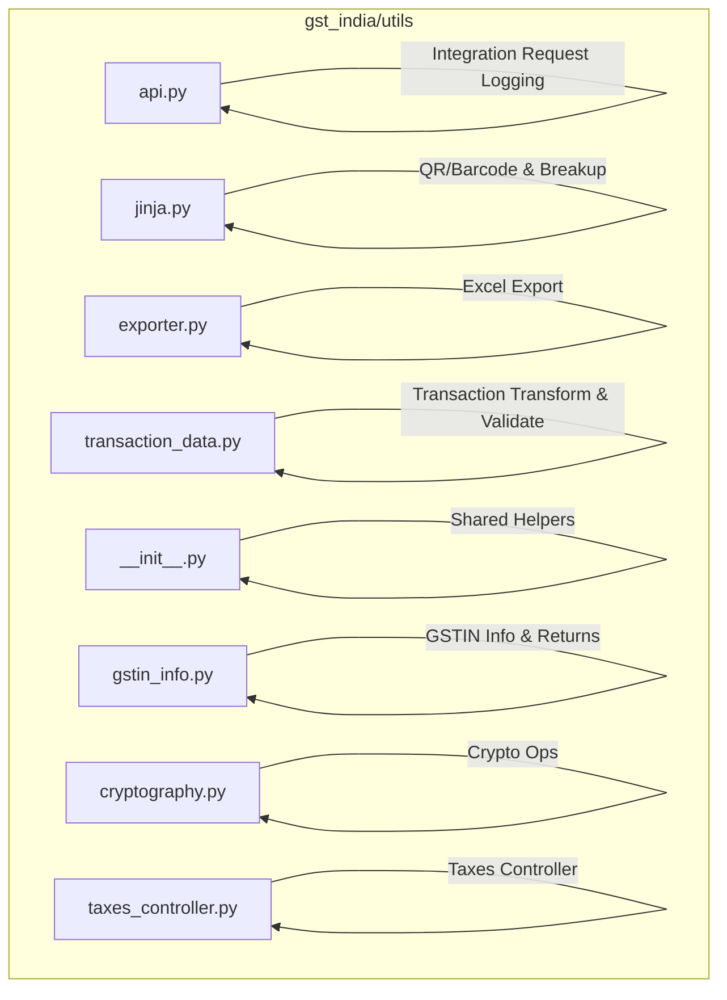
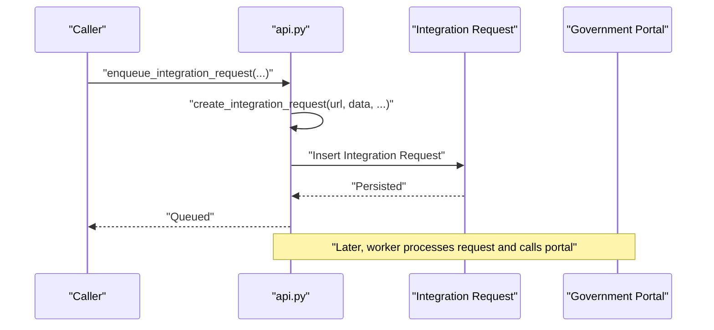
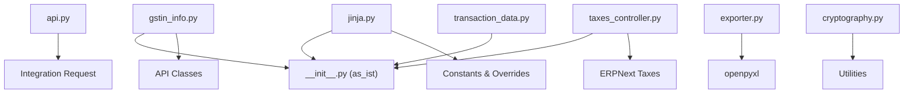

# Core Utilities

<cite>
**Referenced Files in This Document**
- [api.py](file://india_compliance/gst_india/utils/api.py)
- [jinja.py](file://india_compliance/gst_india/utils/jinja.py)
- [exporter.py](file://india_compliance/gst_india/utils/exporter.py)
- [transaction_data.py](file://india_compliance/gst_india/utils/transaction_data.py)
- [__init__.py](file://india_compliance/gst_india/utils/__init__.py)
- [gstin_info.py](file://india_compliance/gst_india/utils/gstin_info.py)
- [cryptography.py](file://india_compliance/gst_india/utils/cryptography.py)
- [taxes_controller.py](file://india_compliance/gst_india/utils/taxes_controller.py)
- [test_utils.py](file://india_compliance/gst_india/utils/test_utils.py)
- [tests.py](file://india_compliance/gst_india/utils/tests.py)
</cite>

## Table of Contents
1. [Introduction](#introduction)
2. [Project Structure](#project-structure)
3. [Core Components](#core-components)
4. [Architecture Overview](#architecture-overview)
5. [Detailed Component Analysis](#detailed-component-analysis)
6. [Dependency Analysis](#dependency-analysis)
7. [Performance Considerations](#performance-considerations)
8. [Troubleshooting Guide](#troubleshooting-guide)
9. [Conclusion](#conclusion)

## Introduction
This document provides comprehensive documentation for the core utility modules in India Compliance that power API communication, Jinja-based dynamic content generation, data export, and transaction data handling. It explains the purpose, usage patterns, parameters, return values, and integration points for each utility, along with performance considerations and best practices. The covered modules include:
- API communication helpers for government portals
- Jinja template utilities for dynamic content and formatting
- Exporter utilities for CSV, Excel, and PDF-like binary outputs
- Transaction data utilities for transformation, validation, and sanitization

## Project Structure
The core utilities reside under the gst_india/utils package. They are organized by functional domain:
- API helpers for integration request logging and pretty-printing
- Jinja utilities for e-waybill/e-invoice QR/barcode generation and GST breakup calculation
- Exporter utilities for Excel workbooks and worksheet formatting
- Transaction data utilities for GST-specific transformations and validations
- Supporting utilities for cryptography, GSTIN info retrieval, and taxes controller

**Diagram sources**
- [api.py](file://india_compliance/gst_india/utils/api.py#L1-L57)
- [jinja.py](file://india_compliance/gst_india/utils/jinja.py#L1-L262)
- [exporter.py](file://india_compliance/gst_india/utils/exporter.py#L1-L373)
- [transaction_data.py](file://india_compliance/gst_india/utils/transaction_data.py#L1-L704)
- [__init__.py](file://india_compliance/gst_india/utils/__init__.py#L1-L800)
- [gstin_info.py](file://india_compliance/gst_india/utils/gstin_info.py#L1-L524)
- [cryptography.py](file://india_compliance/gst_india/utils/cryptography.py#L1-L76)
- [taxes_controller.py](file://india_compliance/gst_india/utils/taxes_controller.py#L1-L275)

**Section sources**
- [api.py](file://india_compliance/gst_india/utils/api.py#L1-L57)
- [jinja.py](file://india_compliance/gst_india/utils/jinja.py#L1-L262)
- [exporter.py](file://india_compliance/gst_india/utils/exporter.py#L1-L373)
- [transaction_data.py](file://india_compliance/gst_india/utils/transaction_data.py#L1-L704)
- [__init__.py](file://india_compliance/gst_india/utils/__init__.py#L1-L800)
- [gstin_info.py](file://india_compliance/gst_india/utils/gstin_info.py#L1-L524)
- [cryptography.py](file://india_compliance/gst_india/utils/cryptography.py#L1-L76)
- [taxes_controller.py](file://india_compliance/gst_india/utils/taxes_controller.py#L1-L275)

## Core Components
This section summarizes the primary responsibilities and capabilities of each utility module.

- API Communication Helpers
  - Enqueue and create Integration Request entries for government portal calls
  - Pretty-print JSON-like structures for logging
  - Link Integration Requests to GSTR Actions

- Jinja Template Utilities
  - Generate QR codes and barcodes for e-waybills
  - Map numeric codes to human-readable labels (supply type, transport modes, etc.)
  - Compute GST breakup by HSN or item with tax headers and precision handling
  - Extract display fields with non-zero values and mandatory fields

- Exporter Utilities
  - ExcelExporter: Load/create workbook, manage sheets, insert data, apply styles, totals, and conditional formatting
  - Worksheet: Add filters, merged headers, formatted rows, and ranges; supports transforms and totals

- Transaction Data Utilities
  - GSTTransactionData: Aggregate totals, roundings, discounts, and other charges; validate transport and HSN; sanitize values; compute item tax amounts with progressive rounding; extract address details with validation
  - Shared helpers: sanitize_data, rounded, sanitize_value, validate_pincode, get_gst_uom, get_place_of_supply, etc.

- Supporting Utilities
  - GSTIN Info: Fetch GSTIN/business info, status, returns filing preference, and transport ID status
  - Cryptography: AES encryption/decryption, HMAC-SHA256, SHA256 hashing, RSA public-key encryption
  - Taxes Controller: Custom item-wise tax rates, tax computation, and validation against GST accounts

**Section sources**
- [api.py](file://india_compliance/gst_india/utils/api.py#L4-L57)
- [jinja.py](file://india_compliance/gst_india/utils/jinja.py#L51-L262)
- [exporter.py](file://india_compliance/gst_india/utils/exporter.py#L12-L373)
- [transaction_data.py](file://india_compliance/gst_india/utils/transaction_data.py#L34-L704)
- [__init__.py](file://india_compliance/gst_india/utils/__init__.py#L163-L800)
- [gstin_info.py](file://india_compliance/gst_india/utils/gstin_info.py#L44-L524)
- [cryptography.py](file://india_compliance/gst_india/utils/cryptography.py#L19-L76)
- [taxes_controller.py](file://india_compliance/gst_india/utils/taxes_controller.py#L85-L275)

## Architecture Overview
The utilities integrate with Frappe/ERPNext and external government APIs. Typical flows:
- API helpers enqueue jobs and persist integration requests for asynchronous processing
- Jinja utilities support printable outputs (QR/barcode) and structured breakup data
- Exporter utilities produce binary Excel outputs consumable by clients
- Transaction data utilities prepare validated, sanitized, and rounded data for e-Invoice/e-Waybill
- Supporting utilities provide cryptographic operations and GST-related validations

**Diagram sources**
- [api.py](file://india_compliance/gst_india/utils/api.py#L4-L46)

## Detailed Component Analysis

### API Communication Helpers
Purpose:
- Queue asynchronous integration requests for government API calls
- Persist request metadata and outcomes
- Link integration records to GSTR Actions

Key Functions:
- enqueue_integration_request: Enqueues creation of Integration Request
- create_integration_request: Creates and inserts Integration Request with pretty-printed JSON fields
- link_integration_request: Links Integration Request to GSTR Action by request_id
- pretty_json: Converts objects to indented JSON strings or returns as-is if already a string

Parameters and Return Values:
- enqueue_integration_request: Accepts kwargs forwarded to job; returns None
- create_integration_request: Accepts url, request_id, request_headers, data, output, error, reference_doctype, reference_name, update_gstr_action; returns None
- link_integration_request: Accepts request_id, doc_name; returns None
- pretty_json: Accepts obj; returns empty string if None, otherwise indented JSON string

Usage Patterns:
- Call enqueue_integration_request with endpoint URL and payload
- On completion, persist output/error and status
- Optionally link to GSTR Action for audit trail

Common Integration Patterns:
- Use with government portal endpoints (e-Invoice, e-Waybill, Public API)
- Store request/response for compliance and debugging

**Section sources**
- [api.py](file://india_compliance/gst_india/utils/api.py#L4-L57)

### Jinja Template Utilities
Purpose:
- Generate QR codes and barcodes for e-waybill documents
- Map numeric codes to descriptive labels
- Compute GST breakup by HSN or item with tax headers and precision handling
- Filter display fields based on non-zero values and mandatory fields

Key Functions:
- add_spacing: Insert spaces at fixed intervals
- get_supply_type, get_sub_supply_type, get_transport_mode, get_transport_type, get_e_waybill_document_type: Map codes to labels
- get_e_waybill_qr_code: Build QR text and encode as base64 PNG
- get_qr_code: Generate QR code image as base64 string
- get_ewaybill_barcode: Generate Code128 barcode as base64 PNG
- get_non_zero_fields: Collect fields with non-zero values
- get_fields_to_display: Combine non-zero fields with mandatory fields
- get_e_invoice_item_fields, get_e_invoice_amount_fields: Select display fields for e-invoice item and amount tables
- get_gst_breakup: Compute GST breakup data for a document

GSTBreakup Class:
- Computes HSN-wise or item-wise breakup depending on settings
- Handles IGST vs CGST/SGST based on inter-state supply
- Supports CESS headers when applicable
- Aggregates taxable amounts and tax components with precision

Parameters and Return Values:
- add_spacing: string, interval → formatted spaced string
- get_supply_type/get_sub_supply_type/get_transport_mode/get_transport_type/get_e_waybill_document_type: code → label
- get_e_waybill_qr_code: e_waybill, gstin, ewaybill_date → base64 PNG string
- get_qr_code: qr_text, scale → base64 PNG string
- get_ewaybill_barcode: ewaybill → base64 PNG string
- get_non_zero_fields: data, fields → set of fieldnames
- get_fields_to_display: data, field_map, mandatory_fields → filtered field map
- get_e_invoice_item_fields/get_e_invoice_amount_fields: data, doc → filtered field map
- get_gst_breakup: doc → JSON string of breakup data

Usage Patterns:
- Generate QR/barcode for e-waybill print formats
- Build display-friendly tables for e-invoice item and amount sections
- Compute tax breakup for audit/trail reports

**Section sources**
- [jinja.py](file://india_compliance/gst_india/utils/jinja.py#L51-L262)

### Exporter Utilities
Purpose:
- Provide a high-level ExcelExporter for creating, formatting, and saving workbooks
- Support worksheet creation with headers, filters, merged headers, totals, and conditional formatting

Key Classes and Methods:
- ExcelExporter
  - __init__: Load existing workbook or create new one
  - create_sheet: Delegate to Worksheet.create
  - insert_data: Delegate to Worksheet.insert_data
  - save_workbook: Save to file or BytesIO
  - export: Stream binary Excel file to client
  - remove_sheet, has_sheet, is_loaded: Workbook management helpers
- Worksheet
  - create: Add filters, merged headers, headers, data, totals; apply styles and conditional formatting
  - insert_data: Insert rows with optional transforms
  - add_data: Parse and write rows with formatting
  - add_merged_header: Merge and label header ranges
  - get_totals: Build totals row with SUM formulas for numeric columns
  - apply_format/apply_style: Apply fonts, alignment, number format, fills, widths, heights
  - apply_conditional_formatting: Highlight mismatches via formula rules
  - parse_data: Normalize dict/list inputs to list-of-lists
  - get_range/get_column_index: Helper utilities for ranges and column indices

Parameters and Return Values:
- ExcelExporter.create_sheet/insert_data: kwargs forwarded to Worksheet methods
- ExcelExporter.save_workbook: file_name=None → BytesIO; file_name=str → returns workbook
- ExcelExporter.export: file_name → streams binary Excel
- Worksheet.create: sheet_name, headers, data, filters, merged_headers, add_totals, default_* formats → None
- Worksheet.insert_data: workbook, sheet_name, headers, data, start_row, start_column → None

Usage Patterns:
- Prepare reports with merged headers and totals
- Apply conditional formatting for validation checks
- Export to client via provide_binary_file

**Section sources**
- [exporter.py](file://india_compliance/gst_india/utils/exporter.py#L12-L373)

### Transaction Data Utilities
Purpose:
- Transform ERPNext transaction data into GST-compliant structures
- Validate and sanitize values for e-Invoice/e-Waybill uploads
- Compute totals, discounts, and other charges with proper rounding

Key Classes and Methods:
- GSTTransactionData
  - __init__: Initialize with doc, settings, sandbox mode
  - set_transaction_details: Aggregate totals, rounding adjustments, discount, grand total, POS state code
  - update_transaction_details/update_totals_for_refund: Hooks for subclasses
  - update_discount_and_other_charges: Compute other charges and adjust rounding
  - validate_mode_of_transport: Validate transport details based on mode
  - set_transporter_details: Populate transport fields with sanitized values
  - validate_transaction: Validate document state, invoice number, dates, HSN codes
  - get_all_item_details/group_same_items: Normalize items, compute tax amounts with progressive rounding
  - set_item_list: Build item list via get_item_data
  - update_item_details/update_item_tax_details: Hook to enrich item details
  - get_progressive_item_tax_amount: Progressive rounding to avoid cumulative errors
  - get_address_details/check_missing_address_fields: Retrieve and validate address details
  - get_item_data: Abstract method to be implemented by subclasses
  - set_address_gstin_map: Map address fields to GSTIN values
  - sanitize_data/rounded/sanitize_value: Static helpers for data cleaning and rounding

Validation and Sanitization:
- sanitize_value: Enforce min/max lengths, regex filtering, truncation, and optional strict validation with error throwing
- validate_pincode: Validate Indian pincode and state mapping
- validate_gstin: Validate length, check digit, and category-specific formats
- validate_gst_tax_rate: Ensure tax rates conform to e-Invoice master codes

Parameters and Return Values:
- set_transaction_details: Updates internal transaction_details dict
- validate_mode_of_transport: Returns True or throws error based on throw flag
- get_all_item_details: Returns list of item details dicts
- get_progressive_item_tax_amount: amount, tax_type → rounded amount with error accumulation
- get_address_details: address_name, validate_gstin → dict with GSTIN, state number, address fields, pincode, country code
- sanitize_value: value, regex, min_length, max_length, truncate, fieldname, reference_doctype, reference_name → sanitized string or throws

Usage Patterns:
- Build e-Invoice/e-Waybill payloads with validated and rounded data
- Group same items with consistent HSN/UOM for upload compliance
- Compute and validate transport details before dispatch

**Section sources**
- [transaction_data.py](file://india_compliance/gst_india/utils/transaction_data.py#L34-L704)

### Supporting Utilities
- GSTIN Info
  - get_gstin_info/_get_gstin_info: Fetch business info via Public API with caching and archival lookup
  - get_archived_gstin_info: Retrieve from Integration Request archive
  - fetch_gstin_status: Get registration/cancellation status via Public or e-Invoice API
  - fetch_transporter_id_status: Validate transporter GSTIN via e-Waybill API
  - get_gstr_1_return_status/update_gstr_returns_info: Query returns filing status and update logs
  - get_and_update_filing_preference/fetch_filing_preference: Retrieve and persist filing preference
- Cryptography
  - aes_encrypt_data/aes_decrypt_data: AES ECB encryption/decryption
  - hmac_sha256/hash_sha256: HMAC-SHA256 and SHA256 hashing
  - encrypt_using_public_key: RSA encryption with certificate validation
- Taxes Controller
  - update_gst_details: Set GST treatment and item-wise tax rates
  - set_item_wise_tax_rates: Client-side handler to update item-wise tax rates
  - CustomTaxController: Compute tax amounts per item, update totals, validate GST accounts

**Section sources**
- [gstin_info.py](file://india_compliance/gst_india/utils/gstin_info.py#L44-L524)
- [cryptography.py](file://india_compliance/gst_india/utils/cryptography.py#L19-L76)
- [taxes_controller.py](file://india_compliance/gst_india/utils/taxes_controller.py#L85-L275)

## Dependency Analysis
High-level dependencies among core utilities:
- api.py depends on pretty_json and db updates
- jinja.py depends on constants, transaction overrides, and shared as_ist
- exporter.py depends on openpyxl and frappe’s binary file provider
- transaction_data.py depends on shared helpers (__init__.py), constants, and transaction overrides
- gstin_info.py depends on API classes and shared parsing/validation helpers
- cryptography.py provides crypto primitives used across integrations
- taxes_controller.py integrates with ERPNext taxes and GST settings

**Diagram sources**
- [api.py](file://india_compliance/gst_india/utils/api.py#L1-L57)
- [jinja.py](file://india_compliance/gst_india/utils/jinja.py#L1-L262)
- [exporter.py](file://india_compliance/gst_india/utils/exporter.py#L1-L373)
- [transaction_data.py](file://india_compliance/gst_india/utils/transaction_data.py#L1-L704)
- [__init__.py](file://india_compliance/gst_india/utils/__init__.py#L1-L800)
- [gstin_info.py](file://india_compliance/gst_india/utils/gstin_info.py#L1-L524)
- [cryptography.py](file://india_compliance/gst_india/utils/cryptography.py#L1-L76)
- [taxes_controller.py](file://india_compliance/gst_india/utils/taxes_controller.py#L1-L275)

**Section sources**
- [api.py](file://india_compliance/gst_india/utils/api.py#L1-L57)
- [jinja.py](file://india_compliance/gst_india/utils/jinja.py#L1-L262)
- [exporter.py](file://india_compliance/gst_india/utils/exporter.py#L1-L373)
- [transaction_data.py](file://india_compliance/gst_india/utils/transaction_data.py#L1-L704)
- [__init__.py](file://india_compliance/gst_india/utils/__init__.py#L1-L800)
- [gstin_info.py](file://india_compliance/gst_india/utils/gstin_info.py#L1-L524)
- [cryptography.py](file://india_compliance/gst_india/utils/cryptography.py#L1-L76)
- [taxes_controller.py](file://india_compliance/gst_india/utils/taxes_controller.py#L1-L275)

## Performance Considerations
- API helpers
  - Use enqueue_integration_request to offload heavy government API calls
  - Pretty-printing JSON adds overhead; avoid for large payloads unless needed for debugging
- Jinja utilities
  - QR/barcode generation is CPU-bound; cache results where feasible
  - GSTBreakup aggregates per item; minimize repeated computations by passing precomputed doc
- Exporter utilities
  - Conditional formatting and SUM formulas increase workbook size and rendering time
  - Prefer minimal formatting for large datasets; apply totals selectively
- Transaction data utilities
  - Progressive rounding prevents cumulative errors but requires maintaining error buffers
  - Validate early to fail fast and reduce downstream processing
- Cryptography
  - RSA encryption adds latency; reuse certificates and avoid frequent re-encryption
- Taxes controller
  - Item-wise tax computation scales with number of items and taxes; batch updates when possible

## Troubleshooting Guide
- API helpers
  - Verify Integration Request insertion and status; check error field for failures
  - Ensure update_gstr_action is set when linking to GSTR Action
- Jinja utilities
  - If QR/barcode is blank, confirm input values (e-waybill number, GSTIN, date) and timezone conversion via as_ist
  - For GST breakup discrepancies, check HSN-wise breakup setting and tax headers
- Exporter utilities
  - If totals show #VALUE!, ensure numeric columns are formatted correctly and ranges are valid
  - For missing styles, verify header definitions and default styles
- Transaction data utilities
  - sanitize_value throws errors for invalid characters or lengths; review fieldname and reference context
  - validate_pincode and validate_gstin enforce strict rules; ensure data matches required formats
  - validate_mode_of_transport enforces mode-specific fields; ensure vehicle/LR details are present as required
- GSTIN info
  - If server errors occur, cached error state prevents retries; wait for expiry or clear cache
  - Archive lookup may return stale data; trigger fresh API call when needed
- Taxes controller
  - validate_taxes ensures only GST accounts are used; verify account types in GST Settings

**Section sources**
- [api.py](file://india_compliance/gst_india/utils/api.py#L4-L57)
- [jinja.py](file://india_compliance/gst_india/utils/jinja.py#L164-L262)
- [exporter.py](file://india_compliance/gst_india/utils/exporter.py#L120-L373)
- [transaction_data.py](file://india_compliance/gst_india/utils/transaction_data.py#L280-L704)
- [gstin_info.py](file://india_compliance/gst_india/utils/gstin_info.py#L56-L300)
- [taxes_controller.py](file://india_compliance/gst_india/utils/taxes_controller.py#L263-L275)

## Conclusion
The core utilities in India Compliance provide robust, reusable building blocks for integrating with government APIs, generating printable outputs, exporting structured reports, and transforming transaction data into GST-compliant formats. By leveraging these utilities with careful attention to validation, sanitization, and performance, developers can implement reliable e-Invoice/e-Waybill workflows and reporting systems.