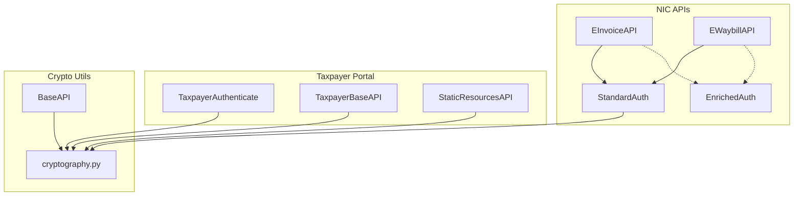
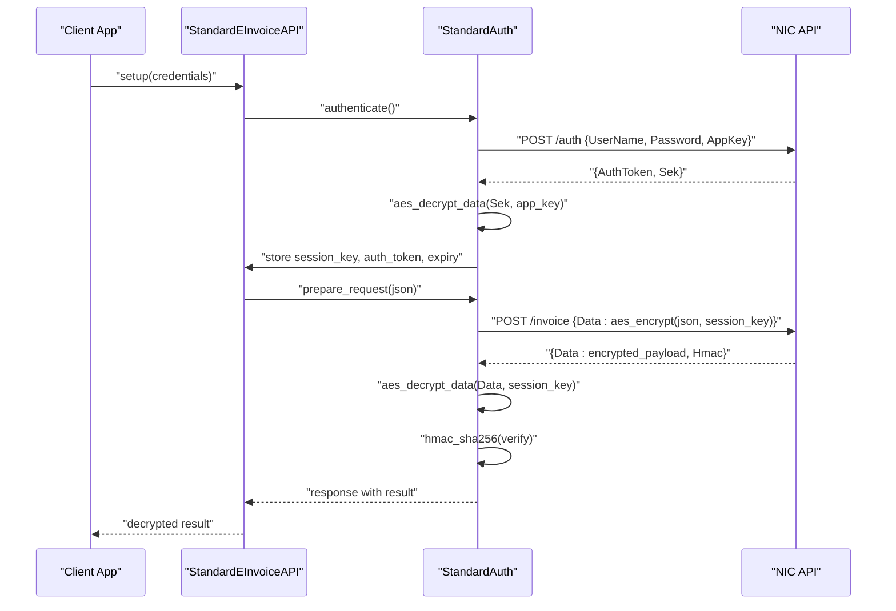
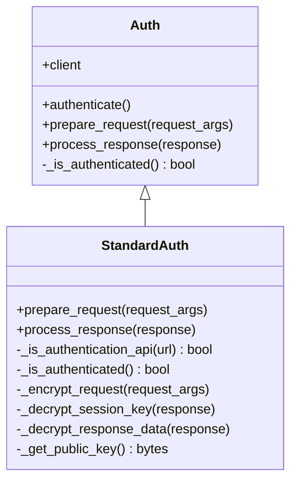
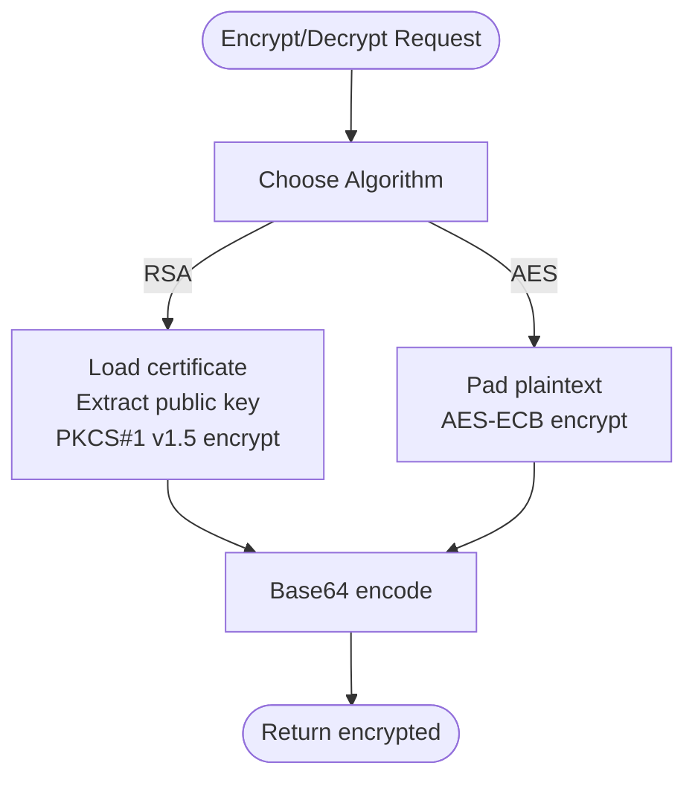
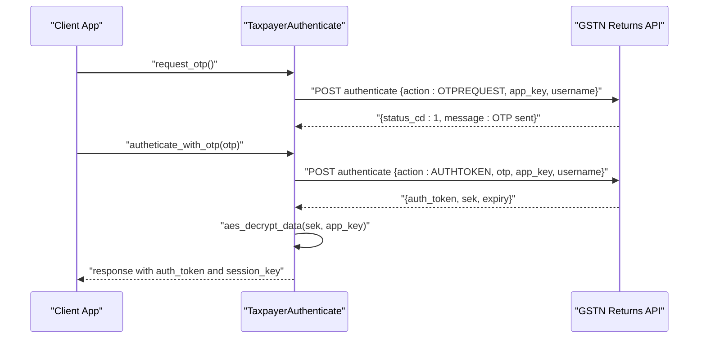
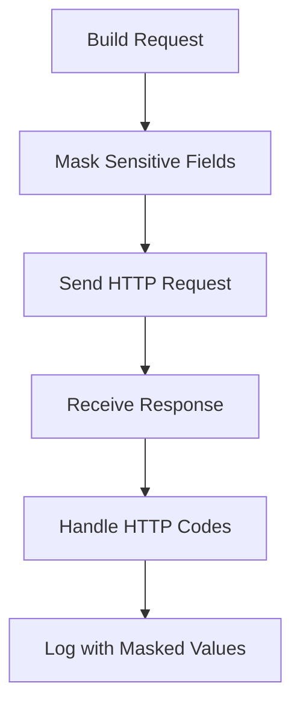
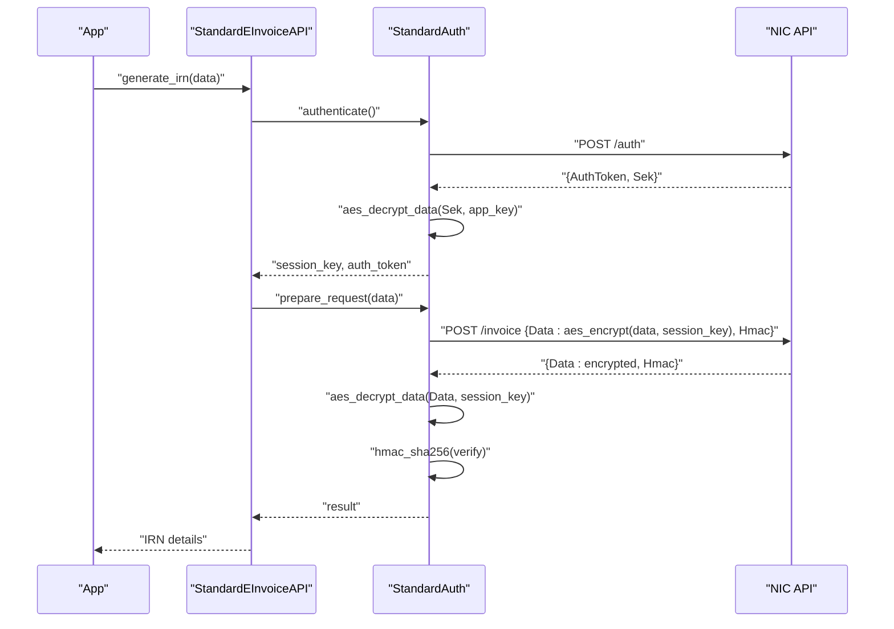
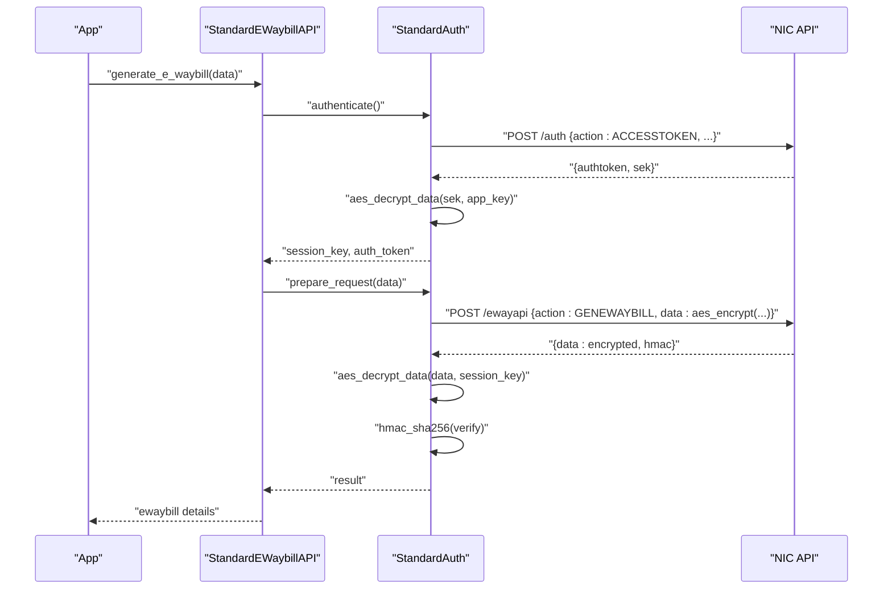
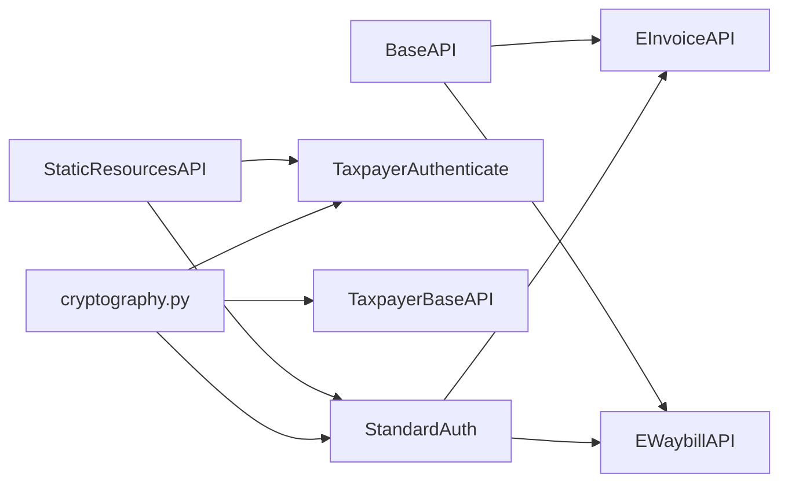

# Encryption & Security

<cite>
**Referenced Files in This Document**
- [auth.py](file://india_compliance/gst_india/api_classes/nic/auth.py)
- [cryptography.py](file://india_compliance/gst_india/utils/cryptography.py)
- [base.py](file://india_compliance/gst_india/api_classes/base.py)
- [taxpayer_base.py](file://india_compliance/gst_india/api_classes/taxpayer_base.py)
- [e_invoice.py](file://india_compliance/gst_india/api_classes/nic/e_invoice.py)
- [e_waybill.py](file://india_compliance/gst_india/api_classes/nic/e_waybill.py)
- [e_waybill_errors.py](file://india_compliance/gst_india/api_classes/nic/e_waybill_errors.py)
- [test_auth.py](file://india_compliance/gst_india/api_classes/nic/test_auth.py)
</cite>

## Table of Contents
1. [Introduction](#introduction)
2. [Project Structure](#project-structure)
3. [Core Components](#core-components)
4. [Architecture Overview](#architecture-overview)
5. [Detailed Component Analysis](#detailed-component-analysis)
6. [Dependency Analysis](#dependency-analysis)
7. [Performance Considerations](#performance-considerations)
8. [Troubleshooting Guide](#troubleshooting-guide)
9. [Conclusion](#conclusion)

## Introduction
This document explains the encryption and security utilities used to securely communicate with government portals (NIC and GSTN) via the India Compliance application. It covers cryptographic methods for digital signatures, certificate management, secure data transmission, authentication mechanisms for NIC portal access, token generation, session management, encryption algorithms, key management, and secure storage practices. It also outlines security protocols for protecting sensitive taxpayer data and maintaining compliance with data protection regulations, along with practical examples and best practices.

## Project Structure
The security-related functionality spans several modules:
- Authentication and request/response encryption for NIC APIs
- Cryptographic primitives for AES, HMAC, and RSA-based encryption
- Taxpayer portal authentication and session management
- API base classes handling masking of sensitive data and integration logging
- Tests validating encryption, decryption, HMAC validation, and session lifecycle

**Diagram sources**
- [e_invoice.py](file://india_compliance/gst_india/api_classes/nic/e_invoice.py#L1-L271)
- [e_waybill.py](file://india_compliance/gst_india/api_classes/nic/e_waybill.py#L1-L259)
- [auth.py](file://india_compliance/gst_india/api_classes/nic/auth.py#L1-L195)
- [taxpayer_base.py](file://india_compliance/gst_india/api_classes/taxpayer_base.py#L1-L527)
- [cryptography.py](file://india_compliance/gst_india/utils/cryptography.py#L1-L76)
- [base.py](file://india_compliance/gst_india/api_classes/base.py#L1-L413)

**Section sources**
- [e_invoice.py](file://india_compliance/gst_india/api_classes/nic/e_invoice.py#L1-L271)
- [e_waybill.py](file://india_compliance/gst_india/api_classes/nic/e_waybill.py#L1-L259)
- [auth.py](file://india_compliance/gst_india/api_classes/nic/auth.py#L1-L195)
- [taxpayer_base.py](file://india_compliance/gst_india/api_classes/taxpayer_base.py#L1-L527)
- [cryptography.py](file://india_compliance/gst_india/utils/cryptography.py#L1-L76)
- [base.py](file://india_compliance/gst_india/api_classes/base.py#L1-L413)

## Core Components
- StandardAuth: Implements encryption/decryption for NIC APIs, manages session keys and tokens, and validates HMAC on responses.
- EnrichedAuth: Delegates encryption/decryption to the GSP; used when fallback or enriched mode is enabled.
- Cryptography Utilities: Provides AES encryption/decryption (ECB mode), HMAC-SHA256, SHA256 hashing, and RSA public key encryption using certificates.
- Taxpayer APIs: Handle OTP-based authentication, session IP binding, token refresh, and decryption/validation of responses from the Returns API.
- BaseAPI: Centralizes request construction, response processing, error handling, and sensitive data masking.

**Section sources**
- [auth.py](file://india_compliance/gst_india/api_classes/nic/auth.py#L27-L195)
- [cryptography.py](file://india_compliance/gst_india/utils/cryptography.py#L19-L76)
- [taxpayer_base.py](file://india_compliance/gst_india/api_classes/taxpayer_base.py#L110-L425)
- [base.py](file://india_compliance/gst_india/api_classes/base.py#L23-L371)

## Architecture Overview
The system enforces layered security:
- Transport security: HTTPS endpoints and API keys
- Authentication: NIC session tokens and taxpayer OTP-based sessions
- Data-in-transit: RSA encryption for initial auth payloads and AES encryption for subsequent requests
- Integrity: HMAC-SHA256 validation on decrypted payloads
- Confidentiality: AES-ECB session keys stored and rotated per session
- Logging and masking: Sensitive fields masked in logs

**Diagram sources**
- [e_invoice.py](file://india_compliance/gst_india/api_classes/nic/e_invoice.py#L178-L214)
- [auth.py](file://india_compliance/gst_india/api_classes/nic/auth.py#L53-L195)
- [cryptography.py](file://india_compliance/gst_india/utils/cryptography.py#L19-L44)

## Detailed Component Analysis

### StandardAuth: NIC Authentication and Secure Communication
StandardAuth orchestrates:
- Public key encryption for authentication payloads
- Session key encryption for subsequent requests
- Decryption of session keys and HMAC validation of responses
- Token and session expiry checks

**Diagram sources**
- [auth.py](file://india_compliance/gst_india/api_classes/nic/auth.py#L27-L195)

Key behaviors:
- Authentication requests are encrypted using the NIC public key; other requests use the session key.
- On successful auth, the session key is decrypted using the app key and stored with an expiry.
- Responses are decrypted and HMAC validated before being returned.

**Section sources**
- [auth.py](file://india_compliance/gst_india/api_classes/nic/auth.py#L53-L195)

### Cryptographic Utilities
The cryptography module provides:
- AES encryption/decryption in ECB mode for session data
- HMAC-SHA256 for integrity verification
- SHA256 hashing for file integrity checks
- RSA public key encryption using X.509 certificates

**Diagram sources**
- [cryptography.py](file://india_compliance/gst_india/utils/cryptography.py#L19-L76)

Security notes:
- AES-ECB is used for session-based encryption; ensure deterministic behavior and avoid reuse of keys across unrelated messages.
- RSA encryption uses PKCS#1 v1.5 padding with X.509 certificates; certificate validity is checked before use.

**Section sources**
- [cryptography.py](file://india_compliance/gst_india/utils/cryptography.py#L19-L76)

### Taxpayer Portal Authentication and Session Management
Taxpayer APIs implement:
- OTP request and authentication with session IP binding
- Token refresh and session expiry validation
- Decryption of responses and HMAC verification
- Public certificate rotation and invalid public key handling

**Diagram sources**
- [taxpayer_base.py](file://india_compliance/gst_india/api_classes/taxpayer_base.py#L110-L245)

Operational safeguards:
- Session IP is bound to the originating IP and included in headers.
- Public certificate is fetched and validated; expired certificates trigger refresh.
- Tokens are cached briefly to avoid repeated OTP prompts.

**Section sources**
- [taxpayer_base.py](file://india_compliance/gst_india/api_classes/taxpayer_base.py#L110-L245)

### API Base Layer: Masking, Logging, and Error Handling
BaseAPI centralizes:
- Sensitive data masking in headers, request bodies, and responses
- Integration request logging with masked values
- HTTP error handling and special-case error mapping

**Diagram sources**
- [base.py](file://india_compliance/gst_india/api_classes/base.py#L124-L220)
- [base.py](file://india_compliance/gst_india/api_classes/base.py#L316-L355)

**Section sources**
- [base.py](file://india_compliance/gst_india/api_classes/base.py#L23-L371)

### Practical Examples and Workflows

#### Example: NIC e-Invoice Authentication and Data Exchange
- Setup credentials and initialize StandardEInvoiceAPI
- Authenticate to obtain AuthToken and Sek
- Decrypt Sek using app_key to derive session_key
- Encrypt request payloads with session_key and send to /invoice
- Validate HMAC on response and parse result

**Diagram sources**
- [e_invoice.py](file://india_compliance/gst_india/api_classes/nic/e_invoice.py#L178-L214)
- [auth.py](file://india_compliance/gst_india/api_classes/nic/auth.py#L80-L195)
- [cryptography.py](file://india_compliance/gst_india/utils/cryptography.py#L19-L44)

#### Example: NIC e-Waybill Authentication and HMAC Validation
- Initialize StandardEWaybillAPI
- Authenticate to receive authtoken and sek
- Encrypt request payloads with session_key
- Validate HMAC on response before parsing

**Diagram sources**
- [e_waybill.py](file://india_compliance/gst_india/api_classes/nic/e_waybill.py#L152-L191)
- [auth.py](file://india_compliance/gst_india/api_classes/nic/auth.py#L80-L195)
- [cryptography.py](file://india_compliance/gst_india/utils/cryptography.py#L19-L44)

## Dependency Analysis
- StandardAuth depends on cryptography utilities for AES and HMAC operations.
- NIC APIs (e_invoice, e_waybill) instantiate StandardAuth and rely on BaseAPI for request/response handling.
- Taxpayer APIs depend on cryptography utilities for RSA encryption and session key handling.
- StaticResourcesAPI fetches and updates public keys/certificates used by StandardAuth and Taxpayer APIs.

**Diagram sources**
- [auth.py](file://india_compliance/gst_india/api_classes/nic/auth.py#L1-L195)
- [taxpayer_base.py](file://india_compliance/gst_india/api_classes/taxpayer_base.py#L1-L527)
- [e_invoice.py](file://india_compliance/gst_india/api_classes/nic/e_invoice.py#L1-L271)
- [e_waybill.py](file://india_compliance/gst_india/api_classes/nic/e_waybill.py#L1-L259)
- [base.py](file://india_compliance/gst_india/api_classes/base.py#L1-L413)

**Section sources**
- [auth.py](file://india_compliance/gst_india/api_classes/nic/auth.py#L1-L195)
- [taxpayer_base.py](file://india_compliance/gst_india/api_classes/taxpayer_base.py#L1-L527)
- [e_invoice.py](file://india_compliance/gst_india/api_classes/nic/e_invoice.py#L1-L271)
- [e_waybill.py](file://india_compliance/gst_india/api_classes/nic/e_waybill.py#L1-L259)
- [base.py](file://india_compliance/gst_india/api_classes/base.py#L1-L413)

## Performance Considerations
- AES-ECB mode is fast but requires careful key management and deterministic inputs; ensure unique session keys per tenant/session.
- RSA encryption is CPU-intensive; minimize the number of RSA-encrypted requests and reuse session keys for subsequent requests.
- HMAC verification adds negligible overhead compared to the benefits of integrity assurance.
- Certificate validation occurs on-demand; caching validated certificates reduces repeated parsing costs.

[No sources needed since this section provides general guidance]

## Troubleshooting Guide
Common issues and mitigations:
- HMAC mismatch: Indicates tampering or incorrect decryption key; verify session key derivation and HMAC computation.
- Invalid token/expired session: Trigger re-authentication; ensure session expiry is respected and tokens refreshed.
- Invalid public key: Refresh public key/certificate from static resources and retry.
- OTP-related failures: Validate OTP flow and ensure IP binding is correct for taxpayer sessions.
- Error code mapping: Use e-waybill error map to translate provider error codes into actionable messages.

**Section sources**
- [auth.py](file://india_compliance/gst_india/api_classes/nic/auth.py#L157-L184)
- [taxpayer_base.py](file://india_compliance/gst_india/api_classes/taxpayer_base.py#L443-L477)
- [e_waybill_errors.py](file://india_compliance/gst_india/api_classes/nic/e_waybill_errors.py#L1-L337)
- [test_auth.py](file://india_compliance/gst_india/api_classes/nic/test_auth.py#L240-L265)

## Conclusion
The India Compliance application implements a robust, layered security model for government portal communications:
- RSA-based initial authentication and AES-based session encryption
- HMAC-based integrity verification
- OTP-driven taxpayer session management with IP binding
- Comprehensive masking and logging safeguards
- Clear separation of concerns between authentication, cryptography, and API orchestration

These practices collectively protect sensitive taxpayer data, maintain compliance with data protection requirements, and provide resilient, auditable integration with NIC and GSTN systems.