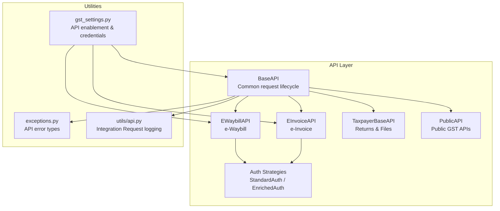
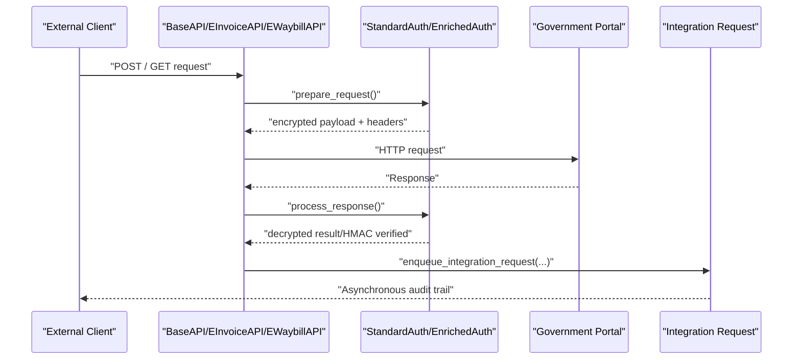
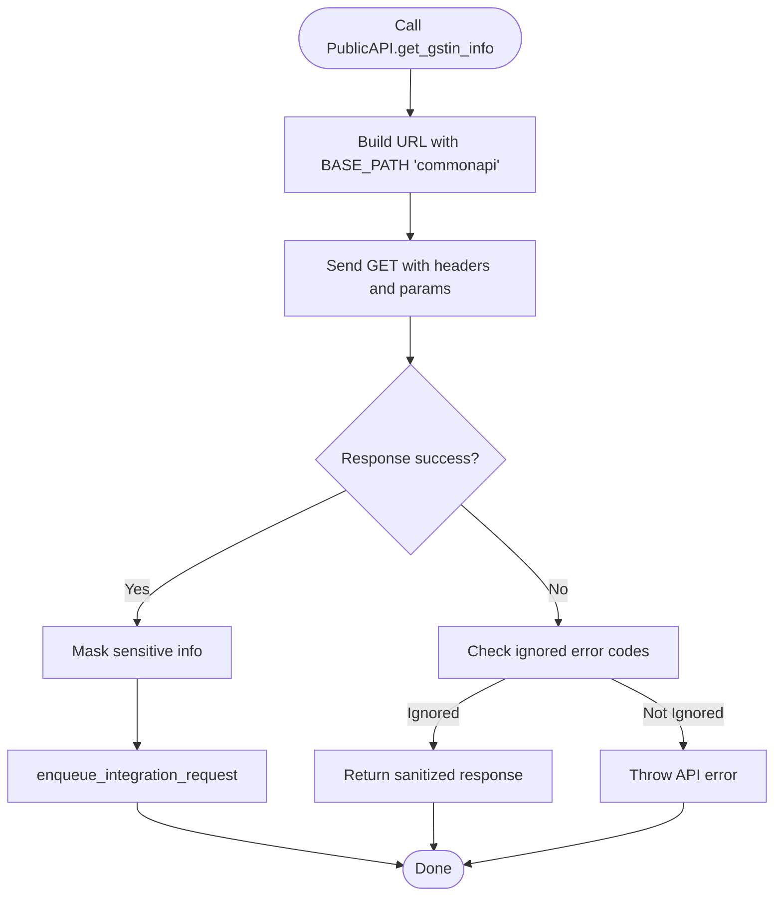
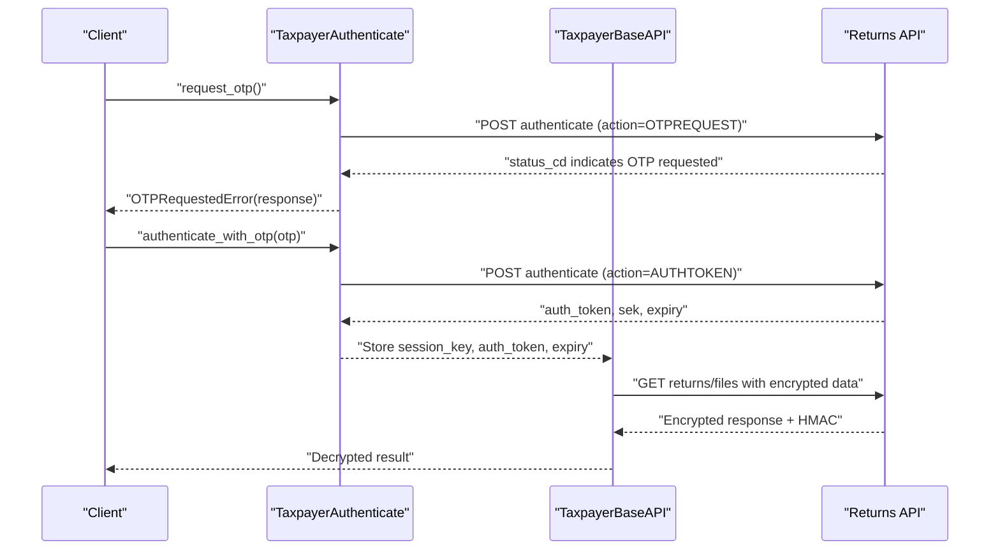
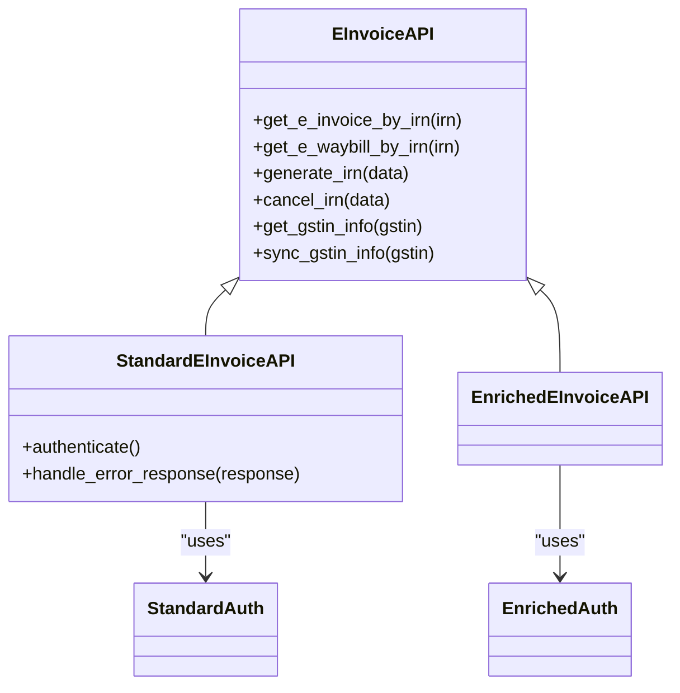
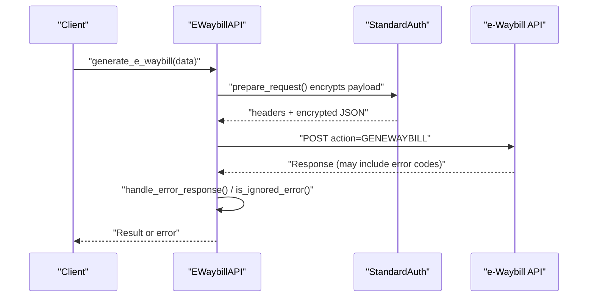
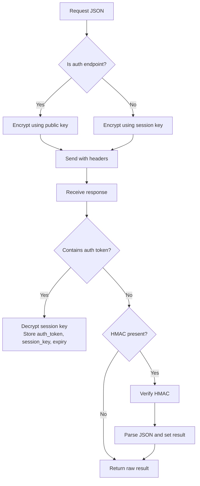
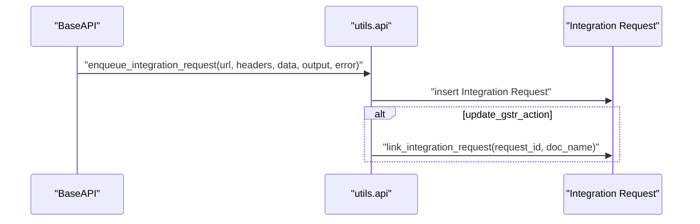
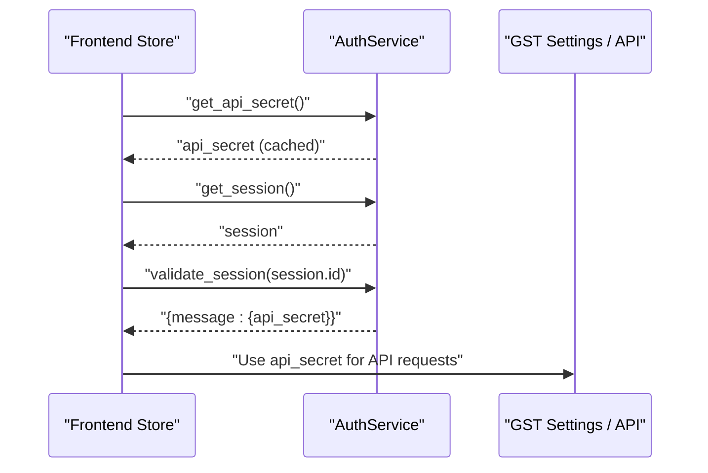
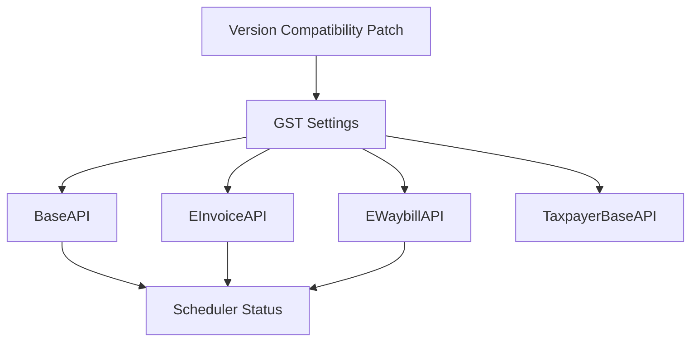

# External Interfaces

<cite>
**Referenced Files in This Document**
- [base.py](file://india_compliance/gst_india/api_classes/base.py)
- [public.py](file://india_compliance/gst_india/api_classes/public.py)
- [taxpayer_base.py](file://india_compliance/gst_india/api_classes/taxpayer_base.py)
- [e_invoice.py](file://india_compliance/gst_india/api_classes/nic/e_invoice.py)
- [e_waybill.py](file://india_compliance/gst_india/api_classes/nic/e_waybill.py)
- [auth.py](file://india_compliance/gst_india/api_classes/nic/auth.py)
- [api.py](file://india_compliance/gst_india/utils/api.py)
- [exceptions.py](file://india_compliance/exceptions.py)
- [gst_settings.py](file://india_compliance/gst_india/doctype/gst_settings/gst_settings.py)
- [india_compliance_api_usage.py](file://india_compliance/gst_india/report/india_compliance_api_usage/india_compliance_api_usage.py)
- [gstr_action.py](file://india_compliance/gst_india/doctype/gstr_action/gstr_action.py)
- [check_version_compatibility.py](file://india_compliance/patches/check_version_compatibility.py)
- [auth.js](file://india_compliance/public/js/india_compliance_account/store/modules/auth.js)
</cite>

## Table of Contents
1. [Introduction](#introduction)
2. [Project Structure](#project-structure)
3. [Core Components](#core-components)
4. [Architecture Overview](#architecture-overview)
5. [Detailed Component Analysis](#detailed-component-analysis)
6. [Dependency Analysis](#dependency-analysis)
7. [Performance Considerations](#performance-considerations)
8. [Troubleshooting Guide](#troubleshooting-guide)
9. [Conclusion](#conclusion)
10. [Appendices](#appendices)

## Introduction
This document describes the external API interfaces and integration points exposed by the application. It covers:
- Whitelisted methods available for external API access
- Authentication requirements and cryptographic handshakes
- Webhook and callback handling patterns
- Asynchronous processing and integration logging
- Integration patterns with government portals and third-party systems
- API versioning strategy, backward compatibility, and deprecation policies
- Practical integration examples, error recovery mechanisms, and security measures

## Project Structure
The external-facing APIs are implemented as Python classes under the GST India module, with shared base functionality and specialized clients for e-Invoice, e-Waybill, and Public APIs. Requests are logged asynchronously via Integration Request documents. Frontend authentication integrates with the India Compliance Account service.

**Diagram sources**
- [base.py](file://india_compliance/gst_india/api_classes/base.py#L23-L114)
- [public.py](file://india_compliance/gst_india/api_classes/public.py#L7-L47)
- [taxpayer_base.py](file://india_compliance/gst_india/api_classes/taxpayer_base.py#L321-L424)
- [e_invoice.py](file://india_compliance/gst_india/api_classes/nic/e_invoice.py#L12-L146)
- [e_waybill.py](file://india_compliance/gst_india/api_classes/nic/e_waybill.py#L17-L128)
- [auth.py](file://india_compliance/gst_india/api_classes/nic/auth.py#L27-L194)
- [api.py](file://india_compliance/gst_india/utils/api.py#L4-L57)
- [exceptions.py](file://india_compliance/exceptions.py#L1-L25)
- [gst_settings.py](file://india_compliance/gst_india/doctype/gst_settings/gst_settings.py#L40-L143)

**Section sources**
- [base.py](file://india_compliance/gst_india/api_classes/base.py#L23-L114)
- [api.py](file://india_compliance/gst_india/utils/api.py#L4-L57)

## Core Components
- BaseAPI: Centralizes request lifecycle, URL construction, default headers, request logging, and error handling. Provides masking of sensitive information and asynchronous logging via Integration Request.
- PublicAPI: Accesses Public GST APIs (e.g., GSTIN info, returns tracking) with sandbox restrictions and request ID generation.
- TaxpayerBaseAPI: Handles Returns and Files APIs with encryption/decryption, OTP handling, and HMAC verification.
- EInvoiceAPI and EWaybillAPI: Specialized clients for NIC APIs supporting both Standard and Enriched modes with authentication strategies.
- Auth Strategies: StandardAuth implements public-key and session-key encryption/decryption and HMAC validation; EnrichedAuth delegates encryption/decryption to the GSP.
- Integration Logging: Asynchronous creation of Integration Request records with masked logs.
- Error Handling: Unified exceptions and HTTP code handling for server and rate-limit errors.

**Section sources**
- [base.py](file://india_compliance/gst_india/api_classes/base.py#L23-L228)
- [public.py](file://india_compliance/gst_india/api_classes/public.py#L7-L65)
- [taxpayer_base.py](file://india_compliance/gst_india/api_classes/taxpayer_base.py#L321-L477)
- [e_invoice.py](file://india_compliance/gst_india/api_classes/nic/e_invoice.py#L12-L271)
- [e_waybill.py](file://india_compliance/gst_india/api_classes/nic/e_waybill.py#L17-L259)
- [auth.py](file://india_compliance/gst_india/api_classes/nic/auth.py#L27-L194)
- [api.py](file://india_compliance/gst_india/utils/api.py#L4-L57)
- [exceptions.py](file://india_compliance/exceptions.py#L1-L25)

## Architecture Overview
The external API architecture follows a layered pattern:
- API Clients encapsulate endpoints and authentication strategies.
- BaseAPI manages transport, logging, and error propagation.
- TaxpayerBaseAPI adds encryption/decryption and OTP flows.
- Integration Request logging ensures auditability and asynchronous processing.
- Frontend authentication integrates with the India Compliance Account service.

**Diagram sources**
- [base.py](file://india_compliance/gst_india/api_classes/base.py#L124-L228)
- [auth.py](file://india_compliance/gst_india/api_classes/nic/auth.py#L53-L194)
- [api.py](file://india_compliance/gst_india/utils/api.py#L4-L57)

## Detailed Component Analysis

### Public API (Party and Returns)
- Purpose: Retrieve GSTIN information and returns tracking details.
- Authentication: Uses x-api-key header sourced from GST Settings or frappe.conf.
- Sandbox Restrictions: Autofill party information is disabled in sandbox mode.
- Methods:
  - get_gstin_info(gstin): Search and return party details.
  - get_returns_info(gstin, fy): Track returns status.
- Error Handling: Ignores specific “no_docs_found” error codes and marks them as ignored.

**Diagram sources**
- [public.py](file://india_compliance/gst_india/api_classes/public.py#L31-L65)
- [base.py](file://india_compliance/gst_india/api_classes/base.py#L124-L228)

**Section sources**
- [public.py](file://india_compliance/gst_india/api_classes/public.py#L31-L65)
- [base.py](file://india_compliance/gst_india/api_classes/base.py#L61-L70)

### Taxpayer Returns and Files API
- Purpose: Authenticate, exchange tokens, and download encrypted files from government portals.
- Authentication: OTP-based flow with session IP and headers; supports refresh tokens.
- Encryption/Decryption: Public-key encryption for app_key during auth; AES encryption for session-bound requests; HMAC verification for integrity.
- Methods:
  - request_otp(): Initiate OTP request.
  - autheticate_with_otp(otp): Exchange OTP for auth token and session key.
  - refresh_auth_token(): Refresh existing token.
  - get_files(return_period, token, action, endpoint): Download and decrypt files.
- Error Handling: Specific error codes mapped to actionable states (e.g., otp_requested, invalid_otp).

**Diagram sources**
- [taxpayer_base.py](file://india_compliance/gst_india/api_classes/taxpayer_base.py#L127-L245)
- [taxpayer_base.py](file://india_compliance/gst_india/api_classes/taxpayer_base.py#L347-L424)

**Section sources**
- [taxpayer_base.py](file://india_compliance/gst_india/api_classes/taxpayer_base.py#L127-L245)
- [taxpayer_base.py](file://india_compliance/gst_india/api_classes/taxpayer_base.py#L347-L424)

### E-Invoice API
- Purpose: Generate, cancel, and fetch e-Invoices and associated e-Waybills.
- Modes:
  - StandardEInvoiceAPI: Uses StandardAuth with session tokens and encryption.
  - EnrichedEInvoiceAPI: Uses EnrichedAuth (encryption/decryption handled by GSP).
- Methods:
  - generate_irn(data): Submit invoice data.
  - cancel_irn(data): Cancel IRN.
  - get_e_invoice_by_irn(irn): Fetch invoice by IRN.
  - get_e_waybill_by_irn(irn): Fetch linked e-Waybill.
  - get_gstin_info(gstin), sync_gstin_info(gstin): Master data endpoints.
- Error Handling: Maps specific error codes to ignored or actionable states; updates distance metadata from alerts.

**Diagram sources**
- [e_invoice.py](file://india_compliance/gst_india/api_classes/nic/e_invoice.py#L12-L271)
- [auth.py](file://india_compliance/gst_india/api_classes/nic/auth.py#L53-L194)

**Section sources**
- [e_invoice.py](file://india_compliance/gst_india/api_classes/nic/e_invoice.py#L12-L271)
- [auth.py](file://india_compliance/gst_india/api_classes/nic/auth.py#L53-L194)

### E-Waybill API
- Purpose: Generate, cancel, update vehicle/transporter details, and extend validity of e-Waybills.
- Modes:
  - StandardEWaybillAPI: Uses StandardAuth with session tokens.
  - EnrichedEWaybillAPI: Uses EnrichedAuth.
- Methods:
  - generate_e_waybill(data)
  - cancel_e_waybill(data)
  - update_vehicle_info(data)
  - update_transporter(data)
  - extend_validity(data)
  - get_e_waybill(number), get_e_waybills_by_date(date)
  - get_transporter_details(transporter_id)
- Error Handling: Extracts and maps error codes; decodes base64-encoded errors; updates distance metadata.

**Diagram sources**
- [e_waybill.py](file://india_compliance/gst_india/api_classes/nic/e_waybill.py#L17-L259)
- [auth.py](file://india_compliance/gst_india/api_classes/nic/auth.py#L53-L194)

**Section sources**
- [e_waybill.py](file://india_compliance/gst_india/api_classes/nic/e_waybill.py#L17-L259)
- [auth.py](file://india_compliance/gst_india/api_classes/nic/auth.py#L53-L194)

### Authentication Strategies
- StandardAuth:
  - Encrypts request JSON using public key for auth and session key for subsequent requests.
  - Decrypts responses, validates HMAC, and stores session keys and tokens.
  - Adds auth-token header for non-auth requests.
- EnrichedAuth:
  - Delegates encryption/decryption to GSP; minimal client-side handling.

**Diagram sources**
- [auth.py](file://india_compliance/gst_india/api_classes/nic/auth.py#L80-L194)

**Section sources**
- [auth.py](file://india_compliance/gst_india/api_classes/nic/auth.py#L53-L194)

### Integration Logging and Audit Trail
- Asynchronous Logging: All requests are enqueued to create Integration Request entries with masked headers, data, and output.
- Linking to Actions: When applicable, Integration Requests are linked to GSTR Action records for queued downloads.
- Reporting: API usage reports aggregate endpoint-level counts and trends.

**Diagram sources**
- [base.py](file://india_compliance/gst_india/api_classes/base.py#L217-L228)
- [api.py](file://india_compliance/gst_india/utils/api.py#L4-L57)
- [gstr_action.py](file://india_compliance/gst_india/doctype/gstr_action/gstr_action.py#L12-L29)

**Section sources**
- [base.py](file://india_compliance/gst_india/api_classes/base.py#L217-L228)
- [api.py](file://india_compliance/gst_india/utils/api.py#L4-L57)
- [gstr_action.py](file://india_compliance/gst_india/doctype/gstr_action/gstr_action.py#L12-L29)
- [india_compliance_api_usage.py](file://india_compliance/gst_india/report/india_compliance_api_usage/india_compliance_api_usage.py#L105-L139)

### Frontend Authentication Integration
- The frontend store authenticates via the India Compliance Account service, retrieving an API secret and session, and validating sessions to obtain an API secret for backend requests.

**Diagram sources**
- [auth.js](file://india_compliance/public/js/india_compliance_account/store/modules/auth.js#L27-L49)

**Section sources**
- [auth.js](file://india_compliance/public/js/india_compliance_account/store/modules/auth.js#L27-L49)

## Dependency Analysis
- API Enablement and Credentials:
  - GST Settings controls API enablement, sandbox mode, and credential availability. Missing credentials trigger explicit errors.
- Scheduler Dependencies:
  - e-Invoice/e-Waybill features require the scheduler to be enabled; otherwise, a validation error is thrown.
- Version Compatibility:
  - Patch logic checks branch/version compatibility for dependent apps and exits with a clear error if incompatible.

**Diagram sources**
- [gst_settings.py](file://india_compliance/gst_india/doctype/gst_settings/gst_settings.py#L219-L262)
- [base.py](file://india_compliance/gst_india/api_classes/base.py#L372-L394)
- [check_version_compatibility.py](file://india_compliance/patches/check_version_compatibility.py#L41-L65)

**Section sources**
- [gst_settings.py](file://india_compliance/gst_india/doctype/gst_settings/gst_settings.py#L219-L262)
- [base.py](file://india_compliance/gst_india/api_classes/base.py#L372-L394)
- [check_version_compatibility.py](file://india_compliance/patches/check_version_compatibility.py#L41-L65)

## Performance Considerations
- Asynchronous Logging: Integration Request insertion is enqueued to avoid blocking API responses.
- Compression and Hash Validation: Files API validates hashes and decompresses tar.gz content before processing.
- Retry and Backoff: Some flows rely on scheduled jobs and OTP retries; ensure queues are healthy and retry thresholds are configured.

[No sources needed since this section provides general guidance]

## Troubleshooting Guide
- API Key/Secret Issues:
  - Invalid API key or credits exhausted triggers explicit messages. Verify x-api-key header and account credits.
- GSP/GST Server Errors:
  - Down or rate-limited servers raise dedicated exceptions. Retry after cooldown or contact support.
- OTP and Session Errors:
  - OTPRequestedError and InvalidOTPError indicate OTP-related failures; handle by prompting user input or regenerating OTP.
- HMAC Mismatch:
  - Indicates tampering or decryption key mismatch; verify session keys and re-authenticate.
- Scheduler Disabled:
  - e-Invoice/e-Waybill features require the scheduler; enable it to proceed.
- Sandbox Limitations:
  - Certain features (e.g., autofill party info) are disabled in sandbox mode.

**Section sources**
- [exceptions.py](file://india_compliance/exceptions.py#L1-L25)
- [base.py](file://india_compliance/gst_india/api_classes/base.py#L282-L312)
- [taxpayer_base.py](file://india_compliance/gst_india/api_classes/taxpayer_base.py#L417-L421)
- [base.py](file://india_compliance/gst_india/api_classes/base.py#L372-L394)
- [public.py](file://india_compliance/gst_india/api_classes/public.py#L16-L21)

## Conclusion
The external API layer provides secure, auditable, and asynchronous integration with government portals and third-party systems. It supports multiple authentication strategies, robust error handling, and comprehensive logging. Adhering to the documented authentication, error handling, and integration patterns ensures reliable operation across environments.

[No sources needed since this section summarizes without analyzing specific files]

## Appendices

### API Versioning, Backward Compatibility, and Deprecation
- Versioning Strategy:
  - API clients dynamically choose between Standard and Enriched modes based on settings (sandbox or fallback flags).
- Backward Compatibility:
  - Patch logic enforces branch/version compatibility for dependent apps and exits with actionable guidance if incompatible.
- Deprecation Policies:
  - Specific error codes are mapped to ignored or actionable states; maintainers can evolve error handling without breaking changes.

**Section sources**
- [e_invoice.py](file://india_compliance/gst_india/api_classes/nic/e_invoice.py#L44-L54)
- [e_waybill.py](file://india_compliance/gst_india/api_classes/nic/e_waybill.py#L40-L50)
- [check_version_compatibility.py](file://india_compliance/patches/check_version_compatibility.py#L41-L65)

### Rate Limiting, Request Validation, and Security Measures
- Rate Limiting:
  - HTTP 429 triggers a dedicated exception indicating credit exhaustion; clients should back off and retry later.
- Request Validation:
  - BaseAPI validates HTTP methods, parses JSON responses, and raises errors for malformed responses.
- Security Measures:
  - Sensitive headers/data are masked in logs.
  - Encryption/decryption and HMAC verification protect data in transit.
  - OTP-based authentication and session IP headers enhance access control.

**Section sources**
- [base.py](file://india_compliance/gst_india/api_classes/base.py#L124-L228)
- [auth.py](file://india_compliance/gst_india/api_classes/nic/auth.py#L157-L194)
- [base.py](file://india_compliance/gst_india/api_classes/base.py#L316-L355)

### Practical Integration Examples
- Integrating with Government Portals:
  - Use PublicAPI for GSTIN and returns queries; ensure sandbox mode compliance.
  - Use TaxpayerBaseAPI for Returns and Files; implement OTP handling and HMAC verification.
  - Use EInvoiceAPI/EWaybillAPI for invoice/waybill operations; choose Standard or Enriched mode based on settings.
- Callback Handling:
  - Queue-based downloads and status updates are tracked via GSTR Action and linked to Integration Requests.
- Error Recovery:
  - On invalid tokens, re-authenticate and retry.
  - On OTP errors, prompt user input or regenerate OTP.
  - On HMAC mismatches, refresh session keys and reattempt.

**Section sources**
- [public.py](file://india_compliance/gst_india/api_classes/public.py#L31-L65)
- [taxpayer_base.py](file://india_compliance/gst_india/api_classes/taxpayer_base.py#L347-L424)
- [e_invoice.py](file://india_compliance/gst_india/api_classes/nic/e_invoice.py#L102-L125)
- [e_waybill.py](file://india_compliance/gst_india/api_classes/nic/e_waybill.py#L104-L120)
- [gstr_action.py](file://india_compliance/gst_india/doctype/gstr_action/gstr_action.py#L12-L29)