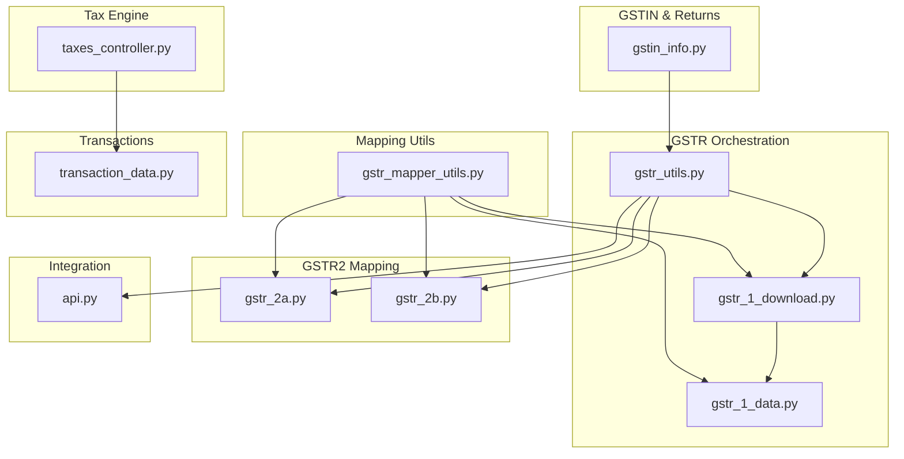
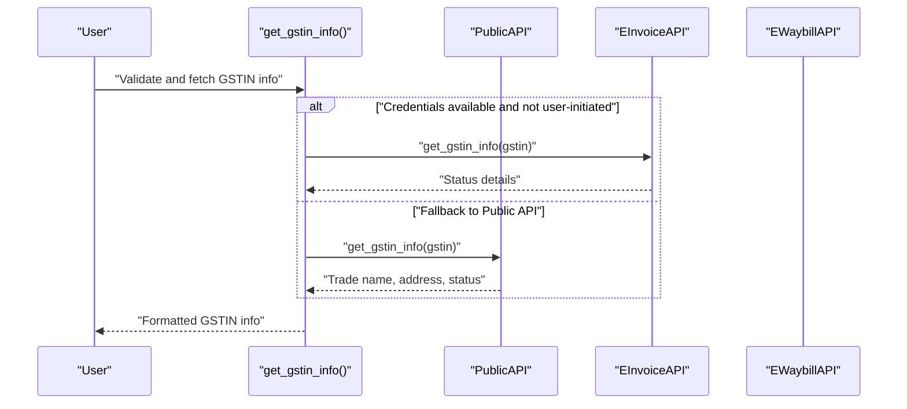
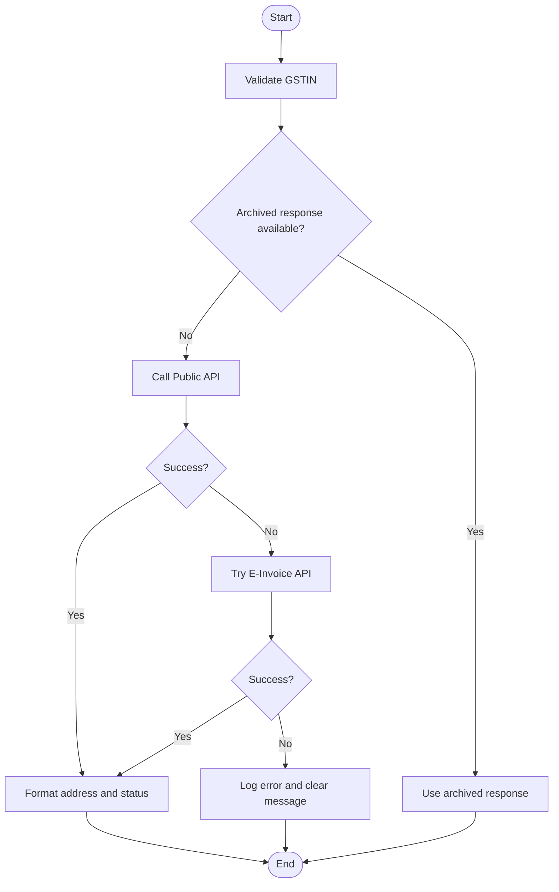
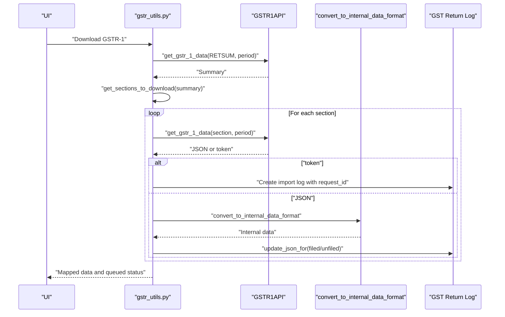
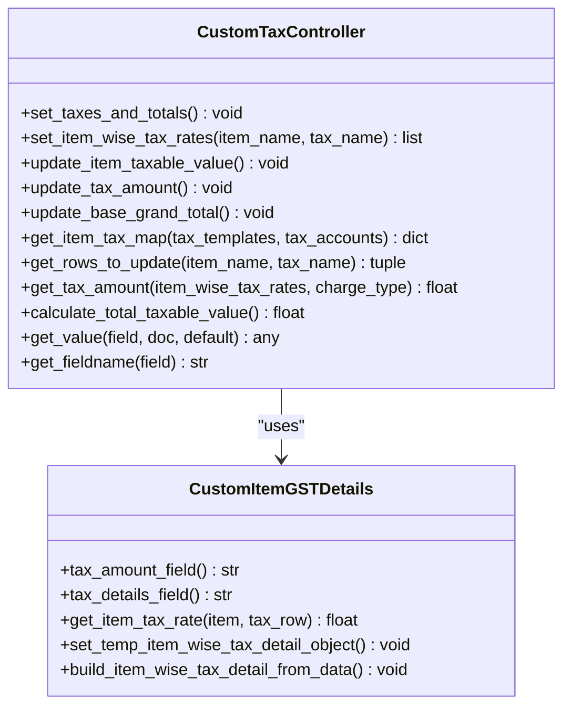
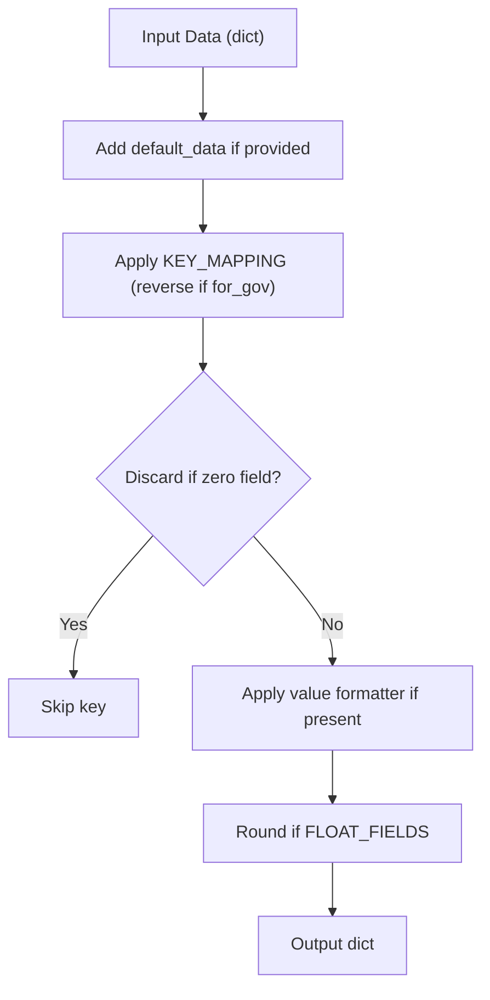
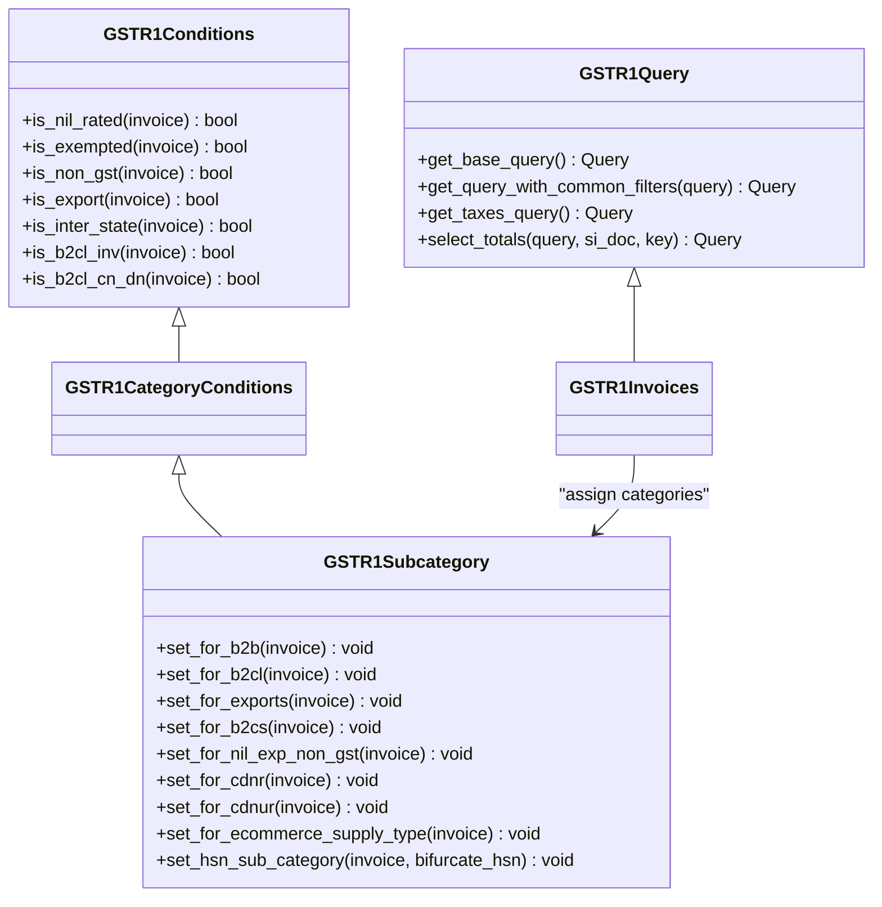
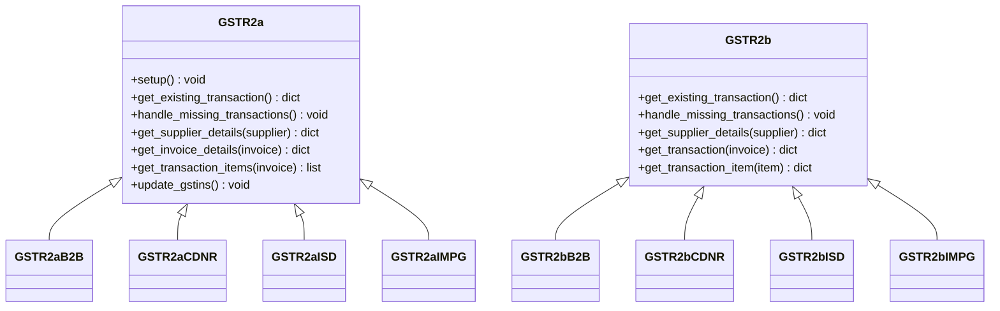
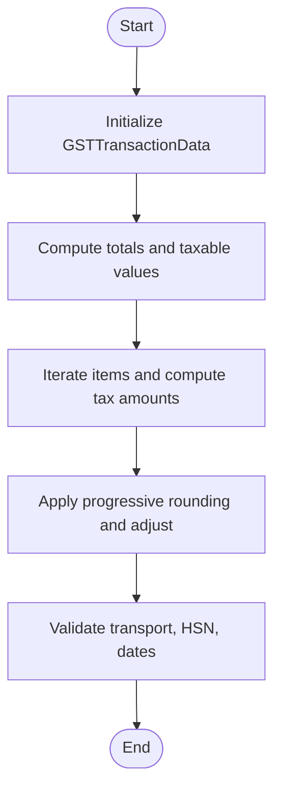
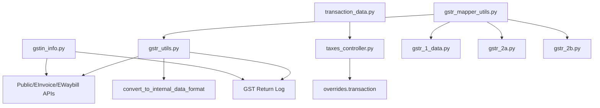

# GST Utilities

<cite>
**Referenced Files in This Document**
- [gstin_info.py](file://india_compliance/gst_india/utils/gstin_info.py)
- [gstr_utils.py](file://india_compliance/gst_india/utils/gstr_utils.py)
- [taxes_controller.py](file://india_compliance/gst_india/utils/taxes_controller.py)
- [gstr_mapper_utils.py](file://india_compliance/gst_india/utils/gstr_mapper_utils.py)
- [gstr_1_data.py](file://india_compliance/gst_india/utils/gstr_1/gstr_1_data.py)
- [gstr_1_download.py](file://india_compliance/gst_india/utils/gstr_1/gstr_1_download.py)
- [gstr_2a.py](file://india_compliance/gst_india/utils/gstr_2/gstr_2a.py)
- [gstr_2b.py](file://india_compliance/gst_india/utils/gstr_2/gstr_2b.py)
- [transaction_data.py](file://india_compliance/gst_india/utils/transaction_data.py)
- [api.py](file://india_compliance/gst_india/utils/api.py)
</cite>

## Table of Contents
1. [Introduction](#introduction)
2. [Project Structure](#project-structure)
3. [Core Components](#core-components)
4. [Architecture Overview](#architecture-overview)
5. [Detailed Component Analysis](#detailed-component-analysis)
6. [Dependency Analysis](#dependency-analysis)
7. [Performance Considerations](#performance-considerations)
8. [Troubleshooting Guide](#troubleshooting-guide)
9. [Conclusion](#conclusion)
10. [Appendices](#appendices)

## Introduction
This document explains the GST-specific utility functions that power taxpayer registration validation, government return data ingestion, tax computation, and data transformation across the India Compliance module. It covers:
- GSTIN information utilities for validation, fetching taxpayer details, and state-wise verification
- GSTR utilities for OTP handling, queued downloads, and mapping government JSON to internal structures
- Tax controller utilities for GST calculation engine, per-item tax rates, and multi-state tax computations
- Mapper utilities for converting between government return formats and internal data structures
- Practical workflows for GSTIN validation, tax calculations, and data transformations
- Error handling patterns, validation rules, and integration with government APIs

## Project Structure
The GST utilities are organized by domain:
- GSTIN info and returns: gstin_info.py
- GSTR orchestration: gstr_utils.py, gstr_1_download.py, gstr_1_data.py
- GSTR2A/GSTR2B mapping: gstr_2a.py, gstr_2b.py
- Tax engine and per-item tax rates: taxes_controller.py
- Data mapping utilities: gstr_mapper_utils.py
- Transaction-level data sanitization and validations: transaction_data.py
- Integration request archiving and linking: api.py

**Diagram sources**
- [gstin_info.py](file://india_compliance/gst_india/utils/gstin_info.py#L44-L102)
- [gstr_utils.py](file://india_compliance/gst_india/utils/gstr_utils.py#L29-L156)
- [gstr_1_download.py](file://india_compliance/gst_india/utils/gstr_1/gstr_1_download.py#L30-L93)
- [gstr_1_data.py](file://india_compliance/gst_india/utils/gstr_1/gstr_1_data.py#L64-L213)
- [gstr_2a.py](file://india_compliance/gst_india/utils/gstr_2/gstr_2a.py#L15-L130)
- [gstr_2b.py](file://india_compliance/gst_india/utils/gstr_2/gstr_2b.py#L7-L87)
- [taxes_controller.py](file://india_compliance/gst_india/utils/taxes_controller.py#L85-L102)
- [gstr_mapper_utils.py](file://india_compliance/gst_india/utils/gstr_mapper_utils.py#L25-L97)
- [transaction_data.py](file://india_compliance/gst_india/utils/transaction_data.py#L34-L142)
- [api.py](file://india_compliance/gst_india/utils/api.py#L11-L46)

**Section sources**
- [gstin_info.py](file://india_compliance/gst_india/utils/gstin_info.py#L44-L102)
- [gstr_utils.py](file://india_compliance/gst_india/utils/gstr_utils.py#L29-L156)
- [gstr_1_download.py](file://india_compliance/gst_india/utils/gstr_1/gstr_1_download.py#L30-L93)
- [gstr_1_data.py](file://india_compliance/gst_india/utils/gstr_1/gstr_1_data.py#L64-L213)
- [gstr_2a.py](file://india_compliance/gst_india/utils/gstr_2/gstr_2a.py#L15-L130)
- [gstr_2b.py](file://india_compliance/gst_india/utils/gstr_2/gstr_2b.py#L7-L87)
- [taxes_controller.py](file://india_compliance/gst_india/utils/taxes_controller.py#L85-L102)
- [gstr_mapper_utils.py](file://india_compliance/gst_india/utils/gstr_mapper_utils.py#L25-L97)
- [transaction_data.py](file://india_compliance/gst_india/utils/transaction_data.py#L34-L142)
- [api.py](file://india_compliance/gst_india/utils/api.py#L11-L46)

## Core Components
- GSTIN Information Utilities: validate and fetch taxpayer details, format addresses, derive status, and manage returns/filing preferences.
- GSTR Utilities: OTP handling, queued downloads, mapping government JSON to internal structures, and publishing notifications.
- Tax Controller Utilities: per-item tax rates, tax amount computation, and validation against GST accounts.
- Mapper Utilities: bidirectional mapping between government JSON and internal structures, rounding, and defaults.
- GSTR1/GSTR2 Data Builders: categorization, subcategories, summaries, and overlap handling.
- Transaction Data: sanitization, validations, and totals computation for e-Invoice/e-Waybill payloads.

**Section sources**
- [gstin_info.py](file://india_compliance/gst_india/utils/gstin_info.py#L44-L102)
- [gstr_utils.py](file://india_compliance/gst_india/utils/gstr_utils.py#L29-L156)
- [taxes_controller.py](file://india_compliance/gst_india/utils/taxes_controller.py#L85-L102)
- [gstr_mapper_utils.py](file://india_compliance/gst_india/utils/gstr_mapper_utils.py#L25-L97)
- [gstr_1_data.py](file://india_compliance/gst_india/utils/gstr_1/gstr_1_data.py#L64-L213)
- [transaction_data.py](file://india_compliance/gst_india/utils/transaction_data.py#L34-L142)

## Architecture Overview
End-to-end flows:
- GSTIN Validation and Status: Public API or E-Invoice/E-Waybill credentials depending on context.
- GSTR Downloads: OTP-based authentication, queued retrieval, and mapping to internal structures.
- Tax Computation: Per-item tax rates, charge type handling, and rounding adjustments.
- Data Mapping: Government JSON to internal structures and vice versa with value formatters and defaults.

**Diagram sources**
- [gstin_info.py](file://india_compliance/gst_india/utils/gstin_info.py#L44-L102)
- [gstin_info.py](file://india_compliance/gst_india/utils/gstin_info.py#L195-L242)

**Section sources**
- [gstin_info.py](file://india_compliance/gst_india/utils/gstin_info.py#L44-L102)
- [gstin_info.py](file://india_compliance/gst_india/utils/gstin_info.py#L195-L242)

## Detailed Component Analysis

### GSTIN Information Utilities
Responsibilities:
- Validate GSTIN and sanitize address fields
- Fetch taxpayer details via Public API or E-Invoice/E-Waybill APIs
- Format response for status and address display
- Manage transporter ID status and returns/filing preference workflows

Key functions:
- get_gstin_info: validates GSTIN, attempts archive lookup, falls back to Public API, and formats address
- fetch_gstin_status: chooses Public vs E-Invoice credentials based on context
- fetch_transporter_id_status: checks transporter validity via E-Waybill API
- update_gstr_returns_info: updates return logs for GSTR1/GSTR3B
- get_and_update_filing_preference: fetches and persists filing preference per return period

**Diagram sources**
- [gstin_info.py](file://india_compliance/gst_india/utils/gstin_info.py#L56-L102)
- [gstin_info.py](file://india_compliance/gst_india/utils/gstin_info.py#L195-L242)

**Section sources**
- [gstin_info.py](file://india_compliance/gst_india/utils/gstin_info.py#L44-L102)
- [gstin_info.py](file://india_compliance/gst_india/utils/gstin_info.py#L195-L242)
- [gstin_info.py](file://india_compliance/gst_india/utils/gstin_info.py#L262-L299)
- [gstin_info.py](file://india_compliance/gst_india/utils/gstin_info.py#L323-L365)
- [gstin_info.py](file://india_compliance/gst_india/utils/gstin_info.py#L396-L472)

### GSTR Utilities
Responsibilities:
- OTP handling for taxpayer returns and EVC generation
- Queue and download GSTR-1, GSTR-2A, GSTR-2B, and IMS data
- Map government JSON to internal structures and persist logs
- Publish notifications for action statuses

Key functions:
- request_otp, authenticate_otp, generate_evc_otp: OTP lifecycle for returns
- download_queued_request/_download_queued_request: orchestrate downloads and error handling
- publish_action_status_notification: notify users of queued/partial/error statuses
- download_gstr1_json_data/save_gstr_1: download and persist GSTR-1 data
- get_sections_to_download: determine sections to fetch based on summary

**Diagram sources**
- [gstr_utils.py](file://india_compliance/gst_india/utils/gstr_utils.py#L55-L128)
- [gstr_1_download.py](file://india_compliance/gst_india/utils/gstr_1/gstr_1_download.py#L30-L93)
- [gstr_1_download.py](file://india_compliance/gst_india/utils/gstr_1/gstr_1_download.py#L127-L157)

**Section sources**
- [gstr_utils.py](file://india_compliance/gst_india/utils/gstr_utils.py#L29-L156)
- [gstr_1_download.py](file://india_compliance/gst_india/utils/gstr_1/gstr_1_download.py#L30-L93)
- [gstr_1_download.py](file://india_compliance/gst_india/utils/gstr_1/gstr_1_download.py#L127-L157)

### Tax Controller Utilities
Responsibilities:
- Set item-wise tax rates from templates and tax accounts
- Compute tax amounts per item and total taxes
- Validate tax accounts belong to GST heads
- Support item-wise tax details for downstream integrations

Key classes and functions:
- CustomItemGSTDetails: item-wise tax rates and temporary structures
- CustomTaxController: set item-wise rates, update taxable values, compute tax amounts, and totals
- update_gst_details: apply GST treatment and item-wise tax rates
- validate_taxes: enforce GST account validation

**Diagram sources**
- [taxes_controller.py](file://india_compliance/gst_india/utils/taxes_controller.py#L17-L83)
- [taxes_controller.py](file://india_compliance/gst_india/utils/taxes_controller.py#L104-L261)

**Section sources**
- [taxes_controller.py](file://india_compliance/gst_india/utils/taxes_controller.py#L85-L102)
- [taxes_controller.py](file://india_compliance/gst_india/utils/taxes_controller.py#L104-L261)
- [taxes_controller.py](file://india_compliance/gst_india/utils/taxes_controller.py#L263-L275)

### Mapper Utilities
Responsibilities:
- Bidirectional mapping between government JSON and internal structures
- Apply value formatters, rounding, and defaults
- Handle state code mapping and zero-value discards

Key class:
- GovDataMapper: format_data, update_totals, reverse_dict, map_place_of_supply

**Diagram sources**
- [gstr_mapper_utils.py](file://india_compliance/gst_india/utils/gstr_mapper_utils.py#L25-L97)

**Section sources**
- [gstr_mapper_utils.py](file://india_compliance/gst_india/utils/gstr_mapper_utils.py#L6-L130)

### GSTR1 Data Builders
Responsibilities:
- Build queries for GSTR-1 data
- Determine invoice categories and subcategories
- Compute summaries and handle overlaps

Key classes:
- GSTR1Query: base query with taxes subquery and totals
- GSTR1Conditions: invoice condition helpers
- GSTR1CategoryConditions: category assignment
- GSTR1Subcategory: subcategory and type assignment
- GSTR1Invoices: process invoices, assign categories, and compute summaries

**Diagram sources**
- [gstr_1_data.py](file://india_compliance/gst_india/utils/gstr_1/gstr_1_data.py#L64-L213)
- [gstr_1_data.py](file://india_compliance/gst_india/utils/gstr_1/gstr_1_data.py#L227-L425)
- [gstr_1_data.py](file://india_compliance/gst_india/utils/gstr_1/gstr_1_data.py#L437-L551)

**Section sources**
- [gstr_1_data.py](file://india_compliance/gst_india/utils/gstr_1/gstr_1_data.py#L64-L213)
- [gstr_1_data.py](file://india_compliance/gst_india/utils/gstr_1/gstr_1_data.py#L227-L425)
- [gstr_1_data.py](file://india_compliance/gst_india/utils/gstr_1/gstr_1_data.py#L437-L551)

### GSTR2A/GSTR2B Mapping
Responsibilities:
- Map supplier and invoice details from GSTR-2A/2B JSON
- Handle special categories (ISD, IMPG, CDNRA)
- Maintain GSTIN lists and status updates

Key classes:
- GSTR2a: base mapping for 2A with supplier and item details
- GSTR2aB2B/GSTR2aCDNR/GSTR2aISD/GSTR2aIMPG: specialized mappings
- GSTR2b: base mapping for 2B with return period and ITC availability
- GSTR2bB2B/GSTR2bCDNR/GSTR2bISD/GSTR2bIMPG: specialized mappings

**Diagram sources**
- [gstr_2a.py](file://india_compliance/gst_india/utils/gstr_2/gstr_2a.py#L15-L130)
- [gstr_2a.py](file://india_compliance/gst_india/utils/gstr_2/gstr_2a.py#L130-L204)
- [gstr_2b.py](file://india_compliance/gst_india/utils/gstr_2/gstr_2b.py#L7-L87)
- [gstr_2b.py](file://india_compliance/gst_india/utils/gstr_2/gstr_2b.py#L89-L176)

**Section sources**
- [gstr_2a.py](file://india_compliance/gst_india/utils/gstr_2/gstr_2a.py#L15-L130)
- [gstr_2a.py](file://india_compliance/gst_india/utils/gstr_2/gstr_2a.py#L130-L204)
- [gstr_2b.py](file://india_compliance/gst_india/utils/gstr_2/gstr_2b.py#L7-L87)
- [gstr_2b.py](file://india_compliance/gst_india/utils/gstr_2/gstr_2b.py#L89-L176)

### Transaction Data Utilities
Responsibilities:
- Sanitize and validate transaction data for e-Invoice/e-Waybill
- Compute totals, rounding adjustments, and progressive tax amounts
- Validate HSN/UOM uniqueness when grouping items

Key class and functions:
- GSTTransactionData: set_transaction_details, get_all_item_details, validate_mode_of_transport, sanitize_value, validate_gst_tax_rate

**Diagram sources**
- [transaction_data.py](file://india_compliance/gst_india/utils/transaction_data.py#L59-L142)
- [transaction_data.py](file://india_compliance/gst_india/utils/transaction_data.py#L192-L231)
- [transaction_data.py](file://india_compliance/gst_india/utils/transaction_data.py#L317-L421)

**Section sources**
- [transaction_data.py](file://india_compliance/gst_india/utils/transaction_data.py#L34-L142)
- [transaction_data.py](file://india_compliance/gst_india/utils/transaction_data.py#L192-L231)
- [transaction_data.py](file://india_compliance/gst_india/utils/transaction_data.py#L317-L421)
- [transaction_data.py](file://india_compliance/gst_india/utils/transaction_data.py#L656-L704)

### Integration Request Utilities
Responsibilities:
- Enqueue and create Integration Request entries for API calls
- Pretty-print JSON and link integration requests to GSTR actions

Key functions:
- enqueue_integration_request, create_integration_request, link_integration_request, pretty_json

**Section sources**
- [api.py](file://india_compliance/gst_india/utils/api.py#L4-L57)

## Dependency Analysis
High-level dependencies:
- gstin_info.py depends on PublicAPI/EInvoiceAPI/EWaybillAPI and GST Return Log
- gstr_utils.py orchestrates GSTR1API/ReturnsAPI/IMSAPI and delegates to mapping modules
- taxes_controller.py depends on ItemGSTDetails and ItemGSTTreatment overrides
- gstr_mapper_utils.py is used by GSTR1/GSTR2 mapping modules
- gstr_1_data.py builds queries and summaries for GSTR-1
- transaction_data.py supports e-Invoice/e-Waybill payload construction

**Diagram sources**
- [gstin_info.py](file://india_compliance/gst_india/utils/gstin_info.py#L17-L21)
- [gstr_utils.py](file://india_compliance/gst_india/utils/gstr_utils.py#L5-L18)
- [gstr_mapper_utils.py](file://india_compliance/gst_india/utils/gstr_mapper_utils.py#L1-L4)
- [gstr_1_data.py](file://india_compliance/gst_india/utils/gstr_1/gstr_1_data.py#L13-L26)
- [gstr_2a.py](file://india_compliance/gst_india/utils/gstr_2/gstr_2a.py#L5-L6)
- [gstr_2b.py](file://india_compliance/gst_india/utils/gstr_2/gstr_2b.py#L3-L4)
- [taxes_controller.py](file://india_compliance/gst_india/utils/taxes_controller.py#L10-L14)
- [transaction_data.py](file://india_compliance/gst_india/utils/transaction_data.py#L19-L25)

**Section sources**
- [gstin_info.py](file://india_compliance/gst_india/utils/gstin_info.py#L17-L21)
- [gstr_utils.py](file://india_compliance/gst_india/utils/gstr_utils.py#L5-L18)
- [gstr_mapper_utils.py](file://india_compliance/gst_india/utils/gstr_mapper_utils.py#L1-L4)
- [gstr_1_data.py](file://india_compliance/gst_india/utils/gstr_1/gstr_1_data.py#L13-L26)
- [gstr_2a.py](file://india_compliance/gst_india/utils/gstr_2/gstr_2a.py#L5-L6)
- [gstr_2b.py](file://india_compliance/gst_india/utils/gstr_2/gstr_2b.py#L3-L4)
- [taxes_controller.py](file://india_compliance/gst_india/utils/taxes_controller.py#L10-L14)
- [transaction_data.py](file://india_compliance/gst_india/utils/transaction_data.py#L19-L25)

## Performance Considerations
- Use cached responses for GSTIN info and avoid repeated API calls when archive data exists.
- Batch and enqueue long-running tasks (e.g., update_gstr_returns_info, download_queued_request).
- Prefer query builders and grouped aggregations for GSTR-1 summaries to minimize memory footprint.
- Apply progressive rounding to reduce cumulative rounding errors during tax computations.
- Limit JSON serialization overhead by pretty printing only when necessary.

## Troubleshooting Guide
Common issues and resolutions:
- GSTIN validation failures:
  - Check server health flag and retry fallback to Public API.
  - Inspect archived Integration Request output for cached responses.
- GSTR downloads stuck in queued:
  - Verify request_id presence and EST timing; re-enqueue if needed.
  - Confirm error_type handling and delete import logs on unrecoverable errors.
- Tax computation discrepancies:
  - Validate item-wise tax rates and charge types.
  - Ensure only GST accounts are used in taxes table.
- Data mapping mismatches:
  - Confirm KEY_MAPPING and value formatters align with government JSON schema.
  - Review state code mapping and zero-value discards.

**Section sources**
- [gstin_info.py](file://india_compliance/gst_india/utils/gstin_info.py#L66-L81)
- [gstr_utils.py](file://india_compliance/gst_india/utils/gstr_utils.py#L100-L127)
- [taxes_controller.py](file://india_compliance/gst_india/utils/taxes_controller.py#L263-L275)
- [gstr_mapper_utils.py](file://india_compliance/gst_india/utils/gstr_mapper_utils.py#L25-L97)

## Conclusion
The GST utilities provide a robust foundation for GST compliance workflows:
- Reliable GSTIN validation and status checks
- Secure OTP-driven access to government returns
- Accurate tax computation with per-item granularity
- Flexible data mapping between government formats and internal structures
- Comprehensive transaction sanitization for e-Invoice/e-Waybill

These components integrate seamlessly with ERPNext documents and government APIs to streamline compliance reporting and ITC reconciliation.

## Appendices

### Practical Workflows

- GSTIN Validation Workflow
  - Validate GSTIN and fetch taxpayer details
  - Format address lines and state
  - Persist status for reconciliation

  **Section sources**
  - [gstin_info.py](file://india_compliance/gst_india/utils/gstin_info.py#L44-L102)
  - [gstin_info.py](file://india_compliance/gst_india/utils/gstin_info.py#L140-L192)

- Tax Calculation Scenario
  - Set item-wise tax rates from templates
  - Compute tax amounts based on charge type
  - Validate against GST accounts

  **Section sources**
  - [taxes_controller.py](file://india_compliance/gst_india/utils/taxes_controller.py#L104-L261)
  - [taxes_controller.py](file://india_compliance/gst_india/utils/taxes_controller.py#L263-L275)

- Data Transformation Process
  - Map government JSON to internal structures
  - Apply value formatters and rounding
  - Update totals and defaults

  **Section sources**
  - [gstr_1_download.py](file://india_compliance/gst_india/utils/gstr_1/gstr_1_download.py#L81-L82)
  - [gstr_mapper_utils.py](file://india_compliance/gst_india/utils/gstr_mapper_utils.py#L25-L97)

- Integration with Government APIs
  - OTP-based authentication and EVC generation
  - Queued retrieval and import logging
  - Notification publishing for action statuses

  **Section sources**
  - [gstr_utils.py](file://india_compliance/gst_india/utils/gstr_utils.py#L29-L53)
  - [gstr_utils.py](file://india_compliance/gst_india/utils/gstr_utils.py#L130-L156)
  - [api.py](file://india_compliance/gst_india/utils/api.py#L11-L46)