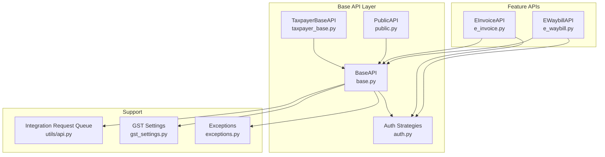
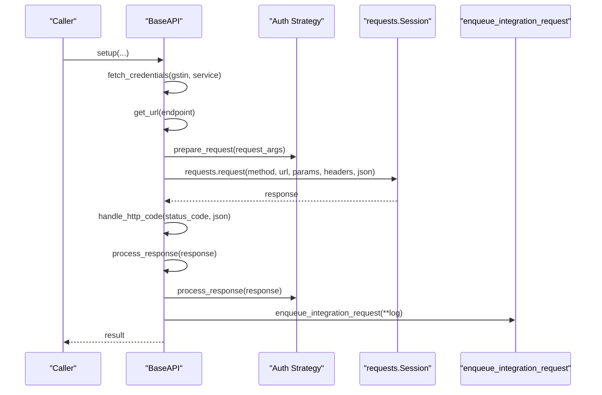
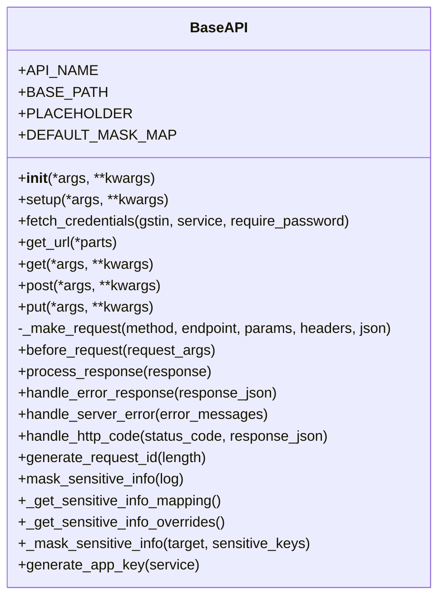
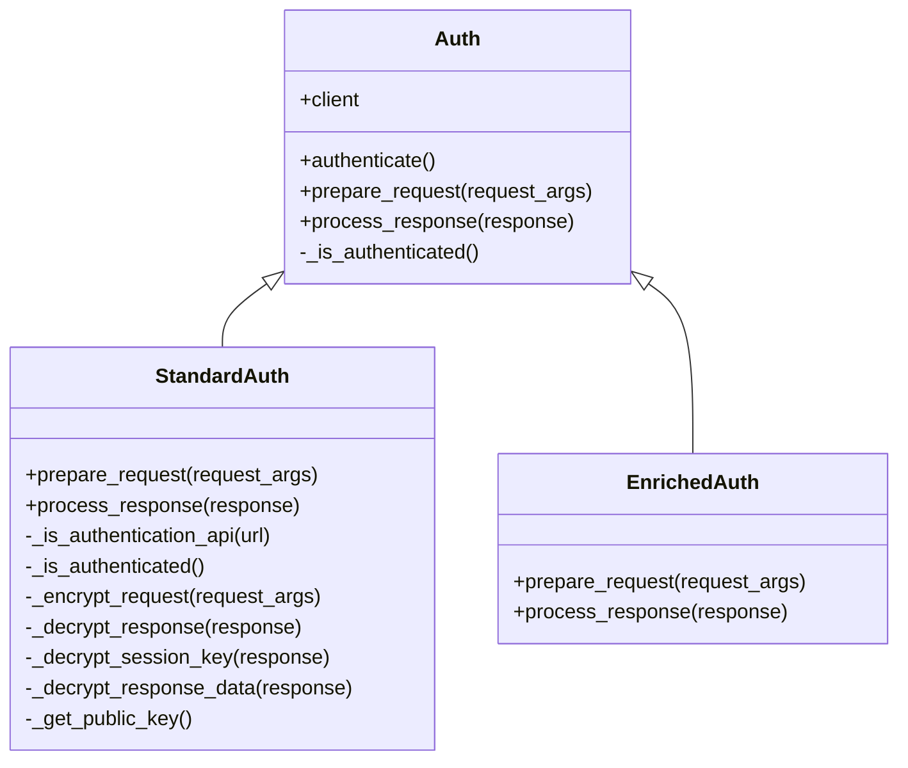
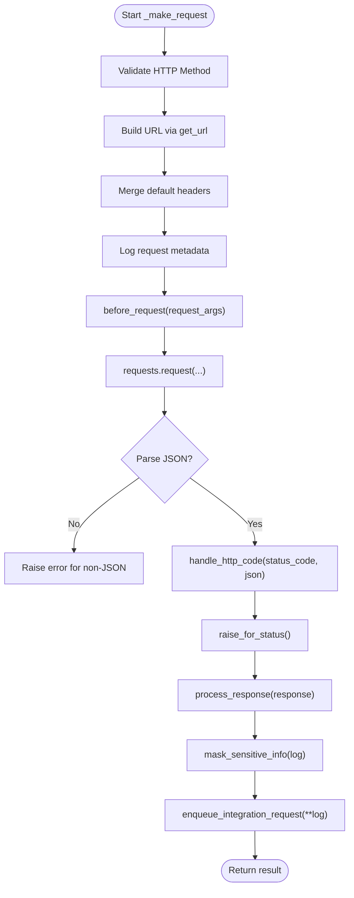
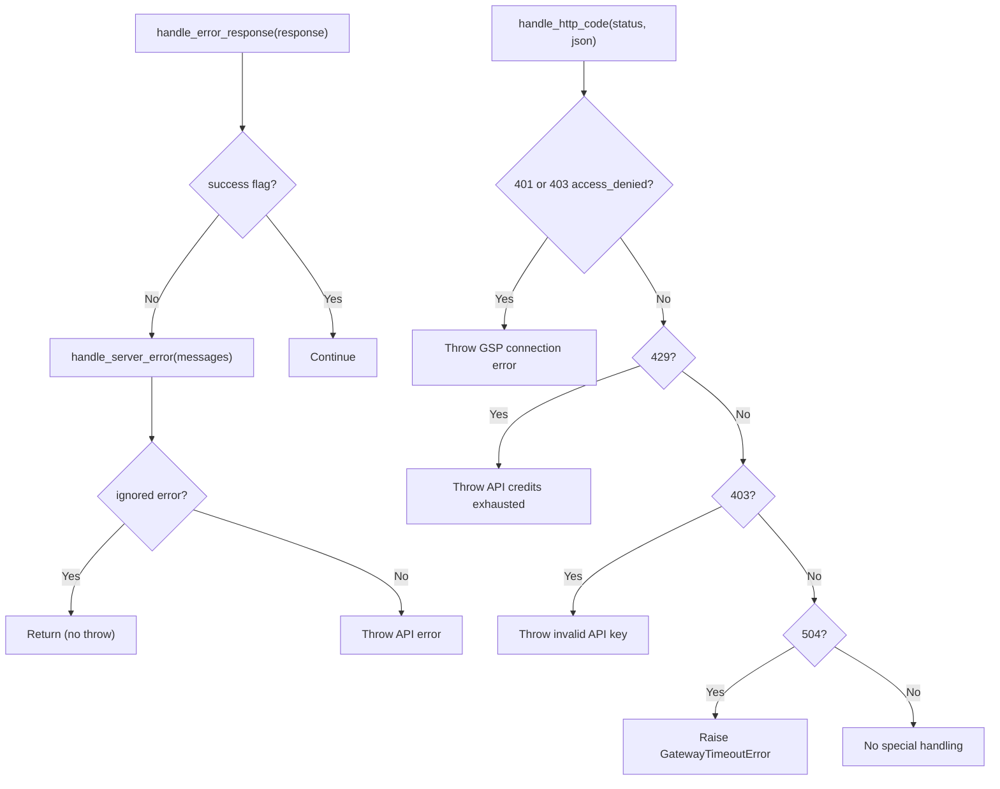
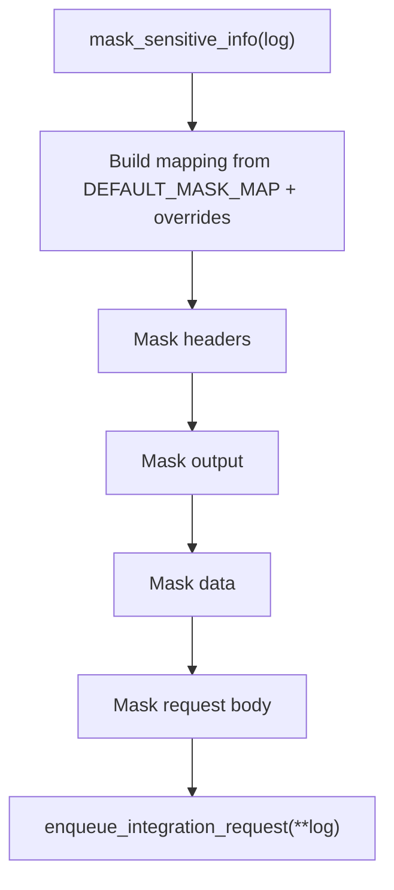
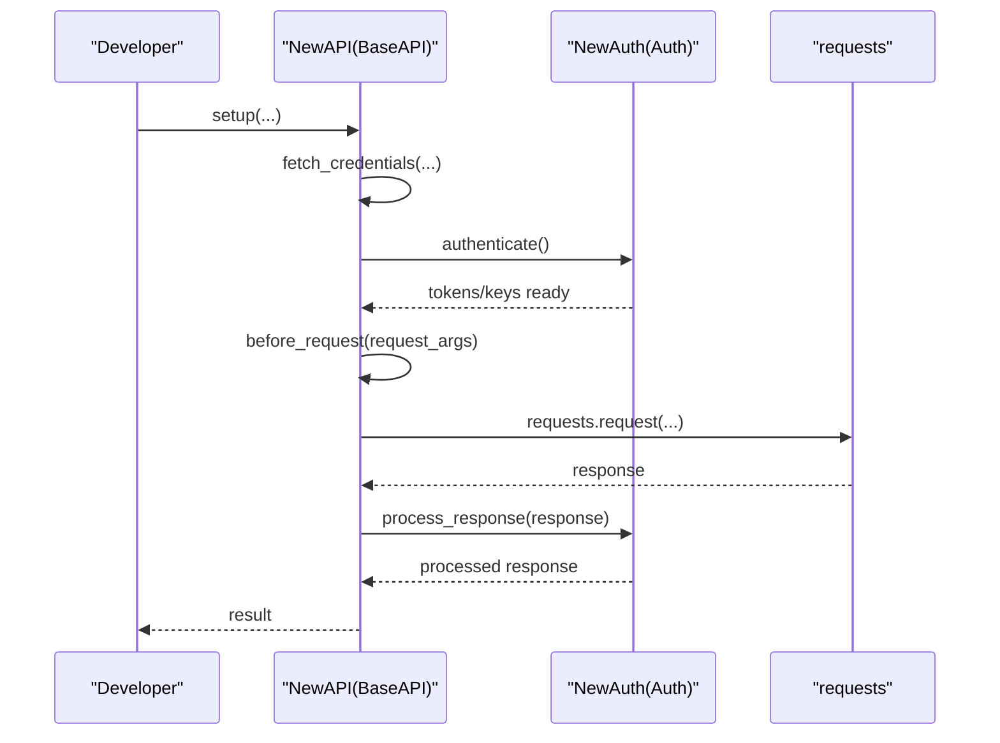
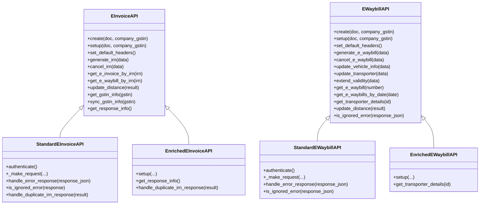
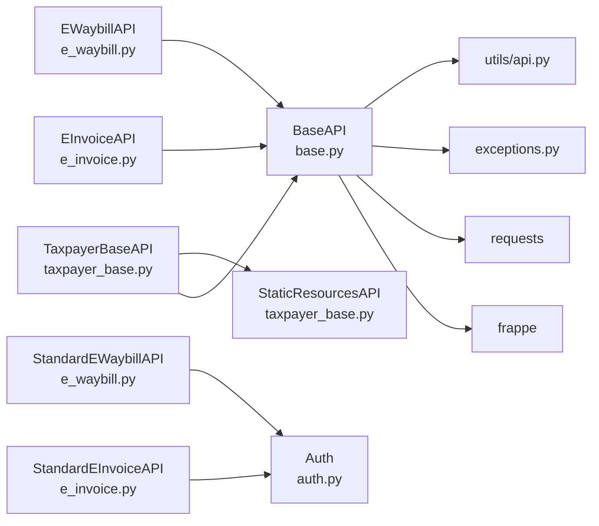

# Base API Architecture

<cite>
**Referenced Files in This Document**
- [base.py](file://india_compliance/gst_india/api_classes/base.py)
- [auth.py](file://india_compliance/gst_india/api_classes/nic/auth.py)
- [taxpayer_base.py](file://india_compliance/gst_india/api_classes/taxpayer_base.py)
- [e_invoice.py](file://india_compliance/gst_india/api_classes/nic/e_invoice.py)
- [e_waybill.py](file://india_compliance/gst_india/api_classes/nic/e_waybill.py)
- [public.py](file://india_compliance/gst_india/api_classes/public.py)
- [api.py](file://india_compliance/gst_india/utils/api.py)
- [exceptions.py](file://india_compliance/exceptions.py)
- [gst_settings.py](file://india_compliance/gst_india/doctype/gst_settings/gst_settings.py)
- [test_auth.py](file://india_compliance/gst_india/api_classes/nic/test_auth.py)
- [test_mask_sensitive_info.py](file://india_compliance/gst_india/api_classes/test_mask_sensitive_info.py)
</cite>

## Table of Contents
1. [Introduction](#introduction)
2. [Project Structure](#project-structure)
3. [Core Components](#core-components)
4. [Architecture Overview](#architecture-overview)
5. [Detailed Component Analysis](#detailed-component-analysis)
6. [Dependency Analysis](#dependency-analysis)
7. [Performance Considerations](#performance-considerations)
8. [Troubleshooting Guide](#troubleshooting-guide)
9. [Conclusion](#conclusion)
10. [Appendices](#appendices)

## Introduction
This document explains the Base API architecture used across the India Compliance application for interacting with GST APIs. It focuses on the BaseAPI class design pattern, authentication mechanisms, request/response lifecycle, error handling, logging and masking of sensitive data, sandbox mode, API key management, and integration request queuing. Practical examples show how to extend BaseAPI and implement custom authentication strategies.

## Project Structure
The Base API architecture is primarily implemented under the gst_india/api_classes package, with supporting utilities and settings in gst_india/utils and gst_india/doctype/gst_settings. The key modules are:
- Base API and shared utilities
- Authentication strategies (NIC e-Invoice/e-Waybill)
- Taxpayer returns API
- Public API
- Integration request queuing
- Exceptions and settings

**Diagram sources**
- [base.py](file://india_compliance/gst_india/api_classes/base.py#L23-L413)
- [auth.py](file://india_compliance/gst_india/api_classes/nic/auth.py#L27-L195)
- [taxpayer_base.py](file://india_compliance/gst_india/api_classes/taxpayer_base.py#L321-L527)
- [public.py](file://india_compliance/gst_india/api_classes/public.py#L7-L65)
- [e_invoice.py](file://india_compliance/gst_india/api_classes/nic/e_invoice.py#L12-L271)
- [e_waybill.py](file://india_compliance/gst_india/api_classes/nic/e_waybill.py#L17-L259)
- [api.py](file://india_compliance/gst_india/utils/api.py#L4-L56)
- [gst_settings.py](file://india_compliance/gst_india/doctype/gst_settings/gst_settings.py#L40-L595)

**Section sources**
- [base.py](file://india_compliance/gst_india/api_classes/base.py#L23-L413)
- [auth.py](file://india_compliance/gst_india/api_classes/nic/auth.py#L27-L195)
- [taxpayer_base.py](file://india_compliance/gst_india/api_classes/taxpayer_base.py#L321-L527)
- [public.py](file://india_compliance/gst_india/api_classes/public.py#L7-L65)
- [e_invoice.py](file://india_compliance/gst_india/api_classes/nic/e_invoice.py#L12-L271)
- [e_waybill.py](file://india_compliance/gst_india/api_classes/nic/e_waybill.py#L17-L259)
- [api.py](file://india_compliance/gst_india/utils/api.py#L4-L56)
- [gst_settings.py](file://india_compliance/gst_india/doctype/gst_settings/gst_settings.py#L40-L595)

## Core Components
- BaseAPI: Central class providing initialization, URL construction, request lifecycle, authentication hook, response processing, error handling, and logging/masking.
- Auth strategies: StandardAuth and EnrichedAuth implement encryption/decryption and token handling for NIC APIs.
- Feature APIs: EInvoiceAPI, EWaybillAPI, PublicAPI extend BaseAPI with service-specific behavior.
- TaxpayerBaseAPI: Specialized for Returns API with OTP handling and session/IP management.
- Integration Request Queue: Asynchronous logging via enqueue_integration_request.
- Exceptions: Custom exceptions for server errors, timeouts, and OTP-related flows.
- GST Settings: Controls sandbox mode, API enablement, and credentials.

**Section sources**
- [base.py](file://india_compliance/gst_india/api_classes/base.py#L23-L413)
- [auth.py](file://india_compliance/gst_india/api_classes/nic/auth.py#L27-L195)
- [e_invoice.py](file://india_compliance/gst_india/api_classes/nic/e_invoice.py#L12-L271)
- [e_waybill.py](file://india_compliance/gst_india/api_classes/nic/e_waybill.py#L17-L259)
- [public.py](file://india_compliance/gst_india/api_classes/public.py#L7-L65)
- [taxpayer_base.py](file://india_compliance/gst_india/api_classes/taxpayer_base.py#L321-L527)
- [api.py](file://india_compliance/gst_india/utils/api.py#L4-L56)
- [exceptions.py](file://india_compliance/exceptions.py#L4-L50)
- [gst_settings.py](file://india_compliance/gst_india/doctype/gst_settings/gst_settings.py#L40-L595)

## Architecture Overview
The Base API follows a layered design:
- Initialization: Validates API enablement, loads settings, sets sandbox mode, and prepares default headers.
- Credential fetching: Retrieves credentials from GST Settings for a given GSTIN and service.
- URL construction: Builds absolute URLs using BASE_URL, optional BASE_PATH, sandbox prefix, and endpoint parts.
- Request lifecycle: before_request hook, HTTP call, response parsing, error mapping, and post-processing.
- Logging and masking: Captures request/response logs, masks sensitive fields, and enqueues integration requests.
- Authentication strategies: Optional strategy-driven encryption/decryption and token management.

**Diagram sources**
- [base.py](file://india_compliance/gst_india/api_classes/base.py#L49-L227)
- [auth.py](file://india_compliance/gst_india/api_classes/nic/auth.py#L43-L66)
- [api.py](file://india_compliance/gst_india/utils/api.py#L4-L56)

**Section sources**
- [base.py](file://india_compliance/gst_india/api_classes/base.py#L49-L227)
- [auth.py](file://india_compliance/gst_india/api_classes/nic/auth.py#L43-L66)
- [api.py](file://india_compliance/gst_india/utils/api.py#L4-L56)

## Detailed Component Analysis

### BaseAPI Class Design Pattern
- Initialization and setup:
  - Loads GST Settings, validates API enablement, sets sandbox mode, and default headers (including x-api-key).
  - Provides a placeholder setup method for subclasses to override.
- Credential fetching:
  - fetch_credentials selects the correct GST Credential row by GSTIN and service, then populates username/company/app_key/password/session_key/session_expiry/auth_token/session_ip.
- URL construction:
  - get_url builds the final URL using BASE_URL and optional BASE_PATH and sandbox prefix.
- Request lifecycle:
  - _make_request handles GET/POST/PUT, merges default headers, logs request metadata, executes before_request hook, performs HTTP call, parses JSON, maps HTTP codes to exceptions, raises HTTPError for others, ensures JSON response, applies process_response, and enqueues integration request.
- Authentication hook:
  - before_request delegates to auth_strategy.prepare_request if configured.
- Response processing:
  - process_response runs handle_error_response and optionally auth_strategy.process_response.
- Error handling:
  - handle_error_response checks success flag and raises API errors.
  - handle_server_error maps specific messages to custom exceptions (GSPServerError, GSPLimitExceededError).
  - handle_http_code maps 401/403/429/504 to specific behaviors.
- Logging and masking:
  - mask_sensitive_info replaces sensitive values in headers, output, data, and body using a configurable mapping.
- Utility helpers:
  - generate_request_id, generate_app_key, change_base_path decorator, scheduler check.

**Diagram sources**
- [base.py](file://india_compliance/gst_india/api_classes/base.py#L23-L413)

**Section sources**
- [base.py](file://india_compliance/gst_india/api_classes/base.py#L49-L370)

### Authentication Mechanisms
- StandardAuth (NIC):
  - Encrypts request data using public key for auth endpoints and session key for regular endpoints.
  - Adds auth-token header for non-auth endpoints.
  - Decrypts responses, extracts auth-token and session key, validates HMAC when present.
- EnrichedAuth (GSP-managed encryption):
  - Leaves request/response unmodified; used for fallback modes.

**Diagram sources**
- [auth.py](file://india_compliance/gst_india/api_classes/nic/auth.py#L27-L195)

**Section sources**
- [auth.py](file://india_compliance/gst_india/api_classes/nic/auth.py#L27-L195)

### Request/Response Lifecycle
- Before request: auth_strategy.prepare_request modifies request_args.
- HTTP call: requests.request with merged headers and optional JSON payload.
- Response handling: parse JSON, map HTTP codes, validate success, decrypt/process via strategy, extract result.
- Logging: capture URL, headers, params/body, output/status, and mask sensitive fields.
- Queueing: enqueue_integration_request asynchronously persists logs.

**Diagram sources**
- [base.py](file://india_compliance/gst_india/api_classes/base.py#L124-L227)
- [api.py](file://india_compliance/gst_india/utils/api.py#L4-L56)

**Section sources**
- [base.py](file://india_compliance/gst_india/api_classes/base.py#L124-L227)
- [api.py](file://india_compliance/gst_india/utils/api.py#L4-L56)

### Error Handling Strategies
- handle_error_response: Raises API errors for unsuccessful responses.
- handle_server_error: Maps error messages to GSPServerError or GSPLimitExceededError.
- handle_http_code: Handles 401/403/429/504 with specific behaviors.
- Custom exceptions: OTPRequestedError, InvalidOTPError, InvalidAuthTokenError, GatewayTimeoutError.

**Diagram sources**
- [base.py](file://india_compliance/gst_india/api_classes/base.py#L241-L312)
- [exceptions.py](file://india_compliance/exceptions.py#L4-L50)

**Section sources**
- [base.py](file://india_compliance/gst_india/api_classes/base.py#L241-L312)
- [exceptions.py](file://india_compliance/exceptions.py#L4-L50)

### Logging and Masking System
- Logs captured: URL, request headers, params/body, output/status, request_id.
- Sensitive fields masked across headers, output, data, and body using DEFAULT_MASK_MAP plus subclass overrides.
- Integration requests persisted asynchronously.

**Diagram sources**
- [base.py](file://india_compliance/gst_india/api_classes/base.py#L316-L355)
- [api.py](file://india_compliance/gst_india/utils/api.py#L11-L41)
- [test_mask_sensitive_info.py](file://india_compliance/gst_india/api_classes/test_mask_sensitive_info.py#L72-L175)

**Section sources**
- [base.py](file://india_compliance/gst_india/api_classes/base.py#L316-L355)
- [api.py](file://india_compliance/gst_india/utils/api.py#L11-L41)
- [test_mask_sensitive_info.py](file://india_compliance/gst_india/api_classes/test_mask_sensitive_info.py#L72-L175)

### Sandbox Mode and API Key Management
- Sandbox mode:
  - Controlled by GST Settings.sandbox_mode.
  - get_url prepends "test" to the path in sandbox mode.
  - Some APIs explicitly disallow sandbox mode (e.g., TaxpayerBaseAPI for Returns).
- API key management:
  - Default headers include x-api-key from GST Settings.api_secret or frappe.conf.ic_api_secret.
  - generate_app_key creates and stores a 32-character app_key for credentials.

**Section sources**
- [base.py](file://india_compliance/gst_india/api_classes/base.py#L61-L66)
- [base.py](file://india_compliance/gst_india/api_classes/base.py#L101-L113)
- [base.py](file://india_compliance/gst_india/api_classes/base.py#L356-L369)
- [gst_settings.py](file://india_compliance/gst_india/doctype/gst_settings/gst_settings.py#L282-L291)

### Integration Request Queuing
- enqueue_integration_request schedules asynchronous creation of Integration Request documents.
- create_integration_request persists request_id, URL, headers, data, output, error, and links to reference documents.
- Pretty-prints JSON for readability.

**Section sources**
- [api.py](file://india_compliance/gst_india/utils/api.py#L4-L56)

### Extending BaseAPI and Custom Authentication Strategies
- Extend BaseAPI to add service-specific endpoints and behaviors.
- Implement a custom Auth subclass to override prepare_request and process_response for custom encryption/decryption or token handling.
- Example patterns are demonstrated in StandardAuth and EnrichedAuth.

**Diagram sources**
- [base.py](file://india_compliance/gst_india/api_classes/base.py#L228-L239)
- [auth.py](file://india_compliance/gst_india/api_classes/nic/auth.py#L33-L47)

**Section sources**
- [base.py](file://india_compliance/gst_india/api_classes/base.py#L228-L239)
- [auth.py](file://india_compliance/gst_india/api_classes/nic/auth.py#L33-L47)

### Feature APIs: E-Invoice and E-Waybill
- EInvoiceAPI and EWaybillAPI:
  - Choose between Standard and Enriched implementations based on sandbox/use_fallback flags.
  - Set default headers (gstin, username, password, requestid).
  - Implement service-specific endpoints (generate, cancel, get details).
  - Handle duplicate IRN/e-waybill scenarios and distance updates.
- StandardEInvoiceAPI/StandardEWaybillAPI:
  - Authenticate via dedicated auth endpoints.
  - Refresh tokens on specific error codes.
- EnrichedEInvoiceAPI/EnrichedEWaybillAPI:
  - Use EnrichedAuth; override setup for sandbox defaults.

**Diagram sources**
- [e_invoice.py](file://india_compliance/gst_india/api_classes/nic/e_invoice.py#L12-L271)
- [e_waybill.py](file://india_compliance/gst_india/api_classes/nic/e_waybill.py#L17-L259)

**Section sources**
- [e_invoice.py](file://india_compliance/gst_india/api_classes/nic/e_invoice.py#L12-L271)
- [e_waybill.py](file://india_compliance/gst_india/api_classes/nic/e_waybill.py#L17-L259)

### Taxpayer Returns API
- TaxpayerAuthenticate:
  - OTP request and authentication with username/app_key.
  - Reset auth token and session IP when needed.
  - Public IP retrieval for session binding.
- TaxpayerBaseAPI:
  - Adds GSTIN/state/username/txn/ip-usr headers.
  - Encrypts/decrypts requests/responses using public certificates and session keys.
  - Handles ignored error codes and HMAC validation.

**Section sources**
- [taxpayer_base.py](file://india_compliance/gst_india/api_classes/taxpayer_base.py#L110-L320)
- [taxpayer_base.py](file://india_compliance/gst_india/api_classes/taxpayer_base.py#L321-L527)

### Public API
- PublicAPI:
  - Common endpoints for autofill and returns info.
  - Disallows sandbox mode for autofill.
  - Adds requestid header.

**Section sources**
- [public.py](file://india_compliance/gst_india/api_classes/public.py#L7-L65)

## Dependency Analysis
- BaseAPI depends on:
  - frappe for settings, exceptions, scheduler checks, and logging.
  - requests for HTTP communication.
  - india_compliance.exceptions for custom exceptions.
  - utils.api for integration request queuing.
- Auth strategies depend on cryptography utilities and GST Settings for public keys.
- Feature APIs depend on BaseAPI and Auth strategies.
- TaxpayerBaseAPI depends on StaticResourcesAPI for public certificates.

**Diagram sources**
- [base.py](file://india_compliance/gst_india/api_classes/base.py#L1-L20)
- [e_invoice.py](file://india_compliance/gst_india/api_classes/nic/e_invoice.py#L7-L8)
- [e_waybill.py](file://india_compliance/gst_india/api_classes/nic/e_waybill.py#L7-L12)
- [taxpayer_base.py](file://india_compliance/gst_india/api_classes/taxpayer_base.py#L17-L26)
- [api.py](file://india_compliance/gst_india/utils/api.py#L1-L8)

**Section sources**
- [base.py](file://india_compliance/gst_india/api_classes/base.py#L1-L20)
- [e_invoice.py](file://india_compliance/gst_india/api_classes/nic/e_invoice.py#L7-L8)
- [e_waybill.py](file://india_compliance/gst_india/api_classes/nic/e_waybill.py#L7-L12)
- [taxpayer_base.py](file://india_compliance/gst_india/api_classes/taxpayer_base.py#L17-L26)
- [api.py](file://india_compliance/gst_india/utils/api.py#L1-L8)

## Performance Considerations
- Asynchronous logging: Integration requests are enqueued to avoid blocking the main thread.
- Encryption overhead: StandardAuth performs AES and RSA operations; caching public keys and session keys reduces repeated decryption costs.
- Retry logic: Some APIs refresh tokens on specific error codes and retry once; consider adding exponential backoff for production use.
- Scheduler dependency: e-Invoice/e-Waybill require the scheduler to be enabled; ensure proper scheduling to avoid runtime failures.

[No sources needed since this section provides general guidance]

## Troubleshooting Guide
Common issues and resolutions:
- API disabled: Ensure API is enabled in GST Settings; BaseAPI throws if disabled.
- Missing credentials: fetch_credentials raises if no matching GST Credential exists.
- Invalid API key or rate limits: handle_http_code maps 403 and 429 to specific errors.
- Gateway timeout: 504 mapped to GatewayTimeoutError.
- OTP required: TaxpayerBaseAPI raises OTPRequestedError; handle via UI or automation.
- HMAC mismatch: Decryption validates HMAC; indicates tampering or wrong keys.
- Sandbox limitations: Some APIs explicitly disallow sandbox mode.

**Section sources**
- [base.py](file://india_compliance/gst_india/api_classes/base.py#L51-L56)
- [base.py](file://india_compliance/gst_india/api_classes/base.py#L75-L87)
- [base.py](file://india_compliance/gst_india/api_classes/base.py#L282-L312)
- [taxpayer_base.py](file://india_compliance/gst_india/api_classes/taxpayer_base.py#L127-L170)
- [auth.py](file://india_compliance/gst_india/api_classes/nic/auth.py#L176-L180)

## Conclusion
The Base API architecture provides a robust, extensible foundation for integrating with GST APIs. It centralizes authentication, encryption, error handling, and logging while offering flexible subclassing for service-specific behavior. By leveraging auth strategies, sandbox mode, and integration request queuing, developers can build reliable integrations with clear observability and maintainable code.

[No sources needed since this section summarizes without analyzing specific files]

## Appendices

### Practical Examples

- Extending BaseAPI:
  - Subclass BaseAPI, override setup and endpoints, and optionally set auth_strategy.
  - Reference: [e_invoice.py](file://india_compliance/gst_india/api_classes/nic/e_invoice.py#L12-L271), [e_waybill.py](file://india_compliance/gst_india/api_classes/nic/e_waybill.py#L17-L259), [public.py](file://india_compliance/gst_india/api_classes/public.py#L7-L65)

- Implementing custom authentication:
  - Subclass Auth, override prepare_request and process_response.
  - Reference: [auth.py](file://india_compliance/gst_india/api_classes/nic/auth.py#L27-L195)

- Sandbox mode and API key:
  - Configure GST Settings.sandbox_mode and x-api-key; URL construction includes "test" prefix.
  - Reference: [base.py](file://india_compliance/gst_india/api_classes/base.py#L61-L66), [base.py](file://india_compliance/gst_india/api_classes/base.py#L101-L113), [gst_settings.py](file://india_compliance/gst_india/doctype/gst_settings/gst_settings.py#L282-L291)

- Integration request queuing:
  - Use enqueue_integration_request to persist logs asynchronously.
  - Reference: [api.py](file://india_compliance/gst_india/utils/api.py#L4-L56)

- Tests validating authentication flows:
  - End-to-end encryption/decryption and OTP handling.
  - Reference: [test_auth.py](file://india_compliance/gst_india/api_classes/nic/test_auth.py#L1-L905)