# Government API Integration

<cite>
**Referenced Files in This Document**
- [base.py](file://india_compliance/gst_india/api_classes/base.py)
- [public.py](file://india_compliance/gst_india/api_classes/public.py)
- [taxpayer_base.py](file://india_compliance/gst_india/api_classes/taxpayer_base.py)
- [auth.py](file://india_compliance/gst_india/api_classes/nic/auth.py)
- [e_invoice.py](file://india_compliance/gst_india/api_classes/nic/e_invoice.py)
- [e_waybill.py](file://india_compliance/gst_india/api_classes/nic/e_waybill.py)
- [taxpayer_e_invoice.py](file://india_compliance/gst_india/api_classes/taxpayer_e_invoice.py)
- [taxpayer_returns.py](file://india_compliance/gst_india/api_classes/taxpayer_returns.py)
- [e_waybill_errors.py](file://india_compliance/gst_india/api_classes/nic/e_waybill_errors.py)
- [api.py](file://india_compliance/gst_india/utils/api.py)
- [exceptions.py](file://india_compliance/exceptions.py)
- [AuthService.js](file://india_compliance/public/js/india_compliance_account/services/AuthService.js)
- [gstr_action.py](file://india_compliance/gst_india/doctype/gstr_action/gstr_action.py)
- [india_compliance_api_usage.py](file://india_compliance/gst_india/report/india_compliance_api_usage/india_compliance_api_usage.py)
</cite>

## Table of Contents
1. [Introduction](#introduction)
2. [Project Structure](#project-structure)
3. [Core Components](#core-components)
4. [Architecture Overview](#architecture-overview)
5. [Detailed Component Analysis](#detailed-component-analysis)
6. [Dependency Analysis](#dependency-analysis)
7. [Performance Considerations](#performance-considerations)
8. [Troubleshooting Guide](#troubleshooting-guide)
9. [Conclusion](#conclusion)
10. [Appendices](#appendices)

## Introduction
This document provides comprehensive API documentation for integrating with government portals via the India Compliance module. It covers the class architecture, authentication and token management, secure communication protocols, and the endpoints for e-invoice generation, e-waybill creation, GST return filing, and taxpayer status queries. It also details error handling, retry mechanisms, timeouts, rate limiting, API versioning, fallback strategies, and integration patterns with ERPNext documents and event-driven triggers.

## Project Structure
The API integration is organized around reusable base classes and specialized API clients:
- Base API abstraction for HTTP requests, logging, masking, and error handling
- Public API for GST Public portal endpoints
- NIC e-Invoice and e-Waybill APIs with two modes: Standard (encrypted) and Enriched (fallback)
- Taxpayer APIs for Returns (GSTR-1, GSTR-2A/B, GSTR-3B, IMS)
- Authentication strategies for NIC and taxpayer portals
- Utilities for integration request logging and error propagation

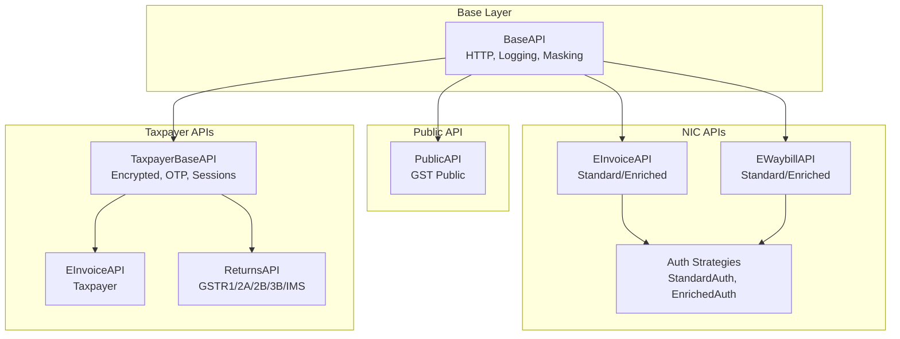

**Diagram sources**
- [base.py](file://india_compliance/gst_india/api_classes/base.py#L23-L413)
- [public.py](file://india_compliance/gst_india/api_classes/public.py#L7-L65)
- [e_invoice.py](file://india_compliance/gst_india/api_classes/nic/e_invoice.py#L12-L271)
- [e_waybill.py](file://india_compliance/gst_india/api_classes/nic/e_waybill.py#L17-L259)
- [auth.py](file://india_compliance/gst_india/api_classes/nic/auth.py#L27-L195)
- [taxpayer_base.py](file://india_compliance/gst_india/api_classes/taxpayer_base.py#L321-L527)
- [taxpayer_e_invoice.py](file://india_compliance/gst_india/api_classes/taxpayer_e_invoice.py#L7-L69)
- [taxpayer_returns.py](file://india_compliance/gst_india/api_classes/taxpayer_returns.py#L10-L395)

**Section sources**
- [base.py](file://india_compliance/gst_india/api_classes/base.py#L23-L413)
- [public.py](file://india_compliance/gst_india/api_classes/public.py#L7-L65)
- [e_invoice.py](file://india_compliance/gst_india/api_classes/nic/e_invoice.py#L12-L271)
- [e_waybill.py](file://india_compliance/gst_india/api_classes/nic/e_waybill.py#L17-L259)
- [taxpayer_base.py](file://india_compliance/gst_india/api_classes/taxpayer_base.py#L321-L527)

## Core Components
- BaseAPI: Centralized HTTP client with request/response lifecycle, error handling, logging, and sensitive data masking.
- PublicAPI: GST Public portal endpoints for GSTIN info and returns tracking.
- EInvoiceAPI and EWaybillAPI: NIC APIs supporting Standard (encrypted) and Enriched (fallback) modes.
- TaxpayerBaseAPI: Encrypted taxpayer portal integration with OTP, session keys, and HMAC validation.
- Auth strategies: StandardAuth (encryption/decryption) and EnrichedAuth (GSP-managed).
- Utilities: Integration Request logging and linking to ERPNext documents.

**Section sources**
- [base.py](file://india_compliance/gst_india/api_classes/base.py#L23-L413)
- [public.py](file://india_compliance/gst_india/api_classes/public.py#L7-L65)
- [e_invoice.py](file://india_compliance/gst_india/api_classes/nic/e_invoice.py#L12-L271)
- [e_waybill.py](file://india_compliance/gst_india/api_classes/nic/e_waybill.py#L17-L259)
- [taxpayer_base.py](file://india_compliance/gst_india/api_classes/taxpayer_base.py#L321-L527)
- [auth.py](file://india_compliance/gst_india/api_classes/nic/auth.py#L27-L195)
- [api.py](file://india_compliance/gst_india/utils/api.py#L4-L57)

## Architecture Overview
The system routes requests through BaseAPI, applies authentication strategies when required, and logs outcomes as Integration Requests linked to ERPNext documents.

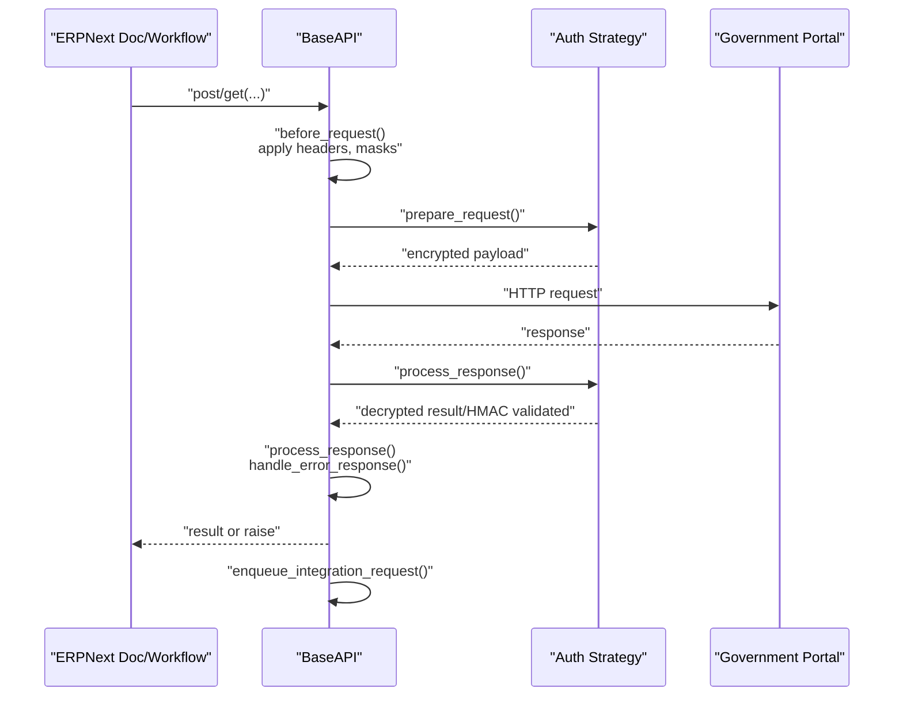

**Diagram sources**
- [base.py](file://india_compliance/gst_india/api_classes/base.py#L124-L239)
- [auth.py](file://india_compliance/gst_india/api_classes/nic/auth.py#L43-L66)
- [api.py](file://india_compliance/gst_india/utils/api.py#L11-L46)

## Detailed Component Analysis

### Base API
- Responsibilities: URL construction, HTTP verbs, request preparation, response processing, error handling, logging, and sensitive info masking.
- Security: Masks headers/body/data keys; supports sandbox mode messaging.
- Logging: Enqueues Integration Request with masked headers, request data, and output/error.

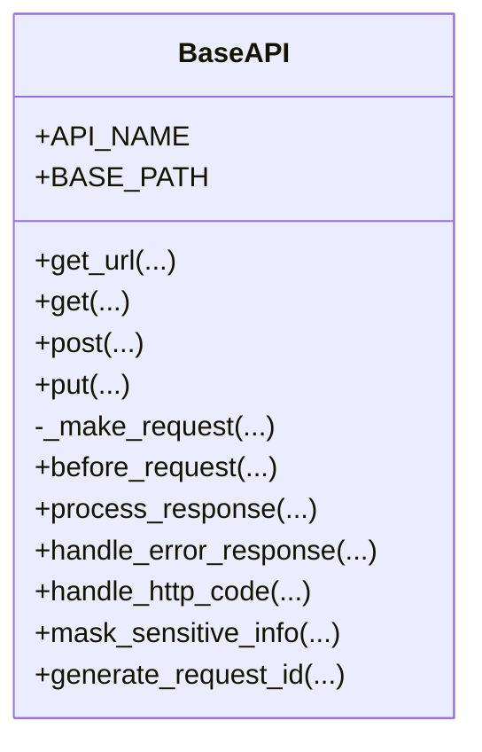

**Diagram sources**
- [base.py](file://india_compliance/gst_india/api_classes/base.py#L23-L413)

**Section sources**
- [base.py](file://india_compliance/gst_india/api_classes/base.py#L23-L413)
- [api.py](file://india_compliance/gst_india/utils/api.py#L4-L57)

### Public API (GST Public)
- Endpoints: Search GSTIN info, Returns tracking.
- Behavior: Generates request ID, validates sandbox restrictions, ignores specific “no docs” errors.

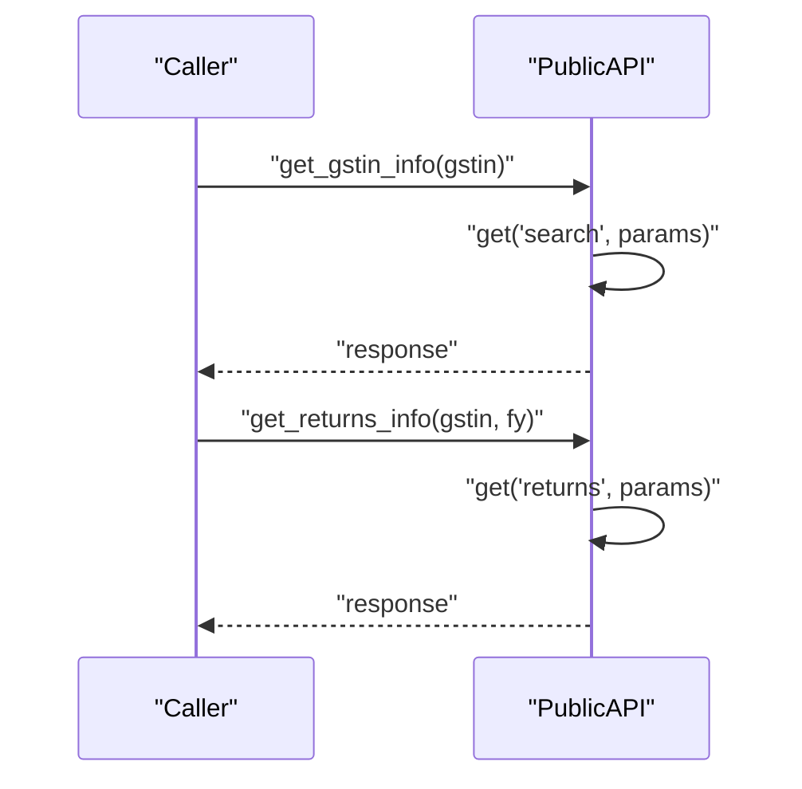

**Diagram sources**
- [public.py](file://india_compliance/gst_india/api_classes/public.py#L31-L64)

**Section sources**
- [public.py](file://india_compliance/gst_india/api_classes/public.py#L7-L65)

### NIC e-Invoice API
- Modes:
  - StandardEInvoiceAPI: Uses StandardAuth, authenticates via dedicated endpoint, handles invalid token by refreshing.
  - EnrichedEInvoiceAPI: Uses EnrichedAuth, simpler payload, sandbox override for testing.
- Endpoints: Generate IRN, cancel IRN, get e-Invoice by IRN, get e-Waybill by IRN, master sync, distance updates.
- Error handling: Ignores specific codes; raises on others; duplicates handled by selecting DUPIRN info.

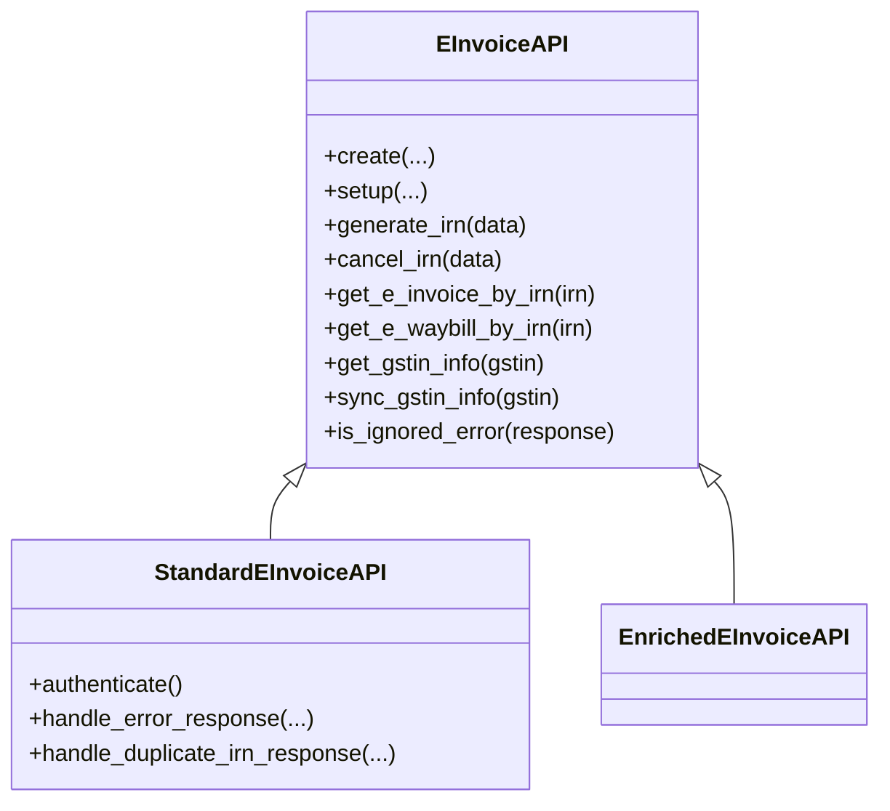

**Diagram sources**
- [e_invoice.py](file://india_compliance/gst_india/api_classes/nic/e_invoice.py#L12-L271)

**Section sources**
- [e_invoice.py](file://india_compliance/gst_india/api_classes/nic/e_invoice.py#L12-L271)
- [auth.py](file://india_compliance/gst_india/api_classes/nic/auth.py#L53-L195)

### NIC e-Waybill API
- Modes:
  - StandardEWaybillAPI: Authenticates via dedicated endpoint; invalid token triggers re-authentication.
  - EnrichedEWaybillAPI: Simplified payload; supports master endpoints.
- Endpoints: Generate, cancel, update vehicle info, update transporter, extend validity, get by number/date.
- Error handling: Extracts and maps error codes to human-readable messages.

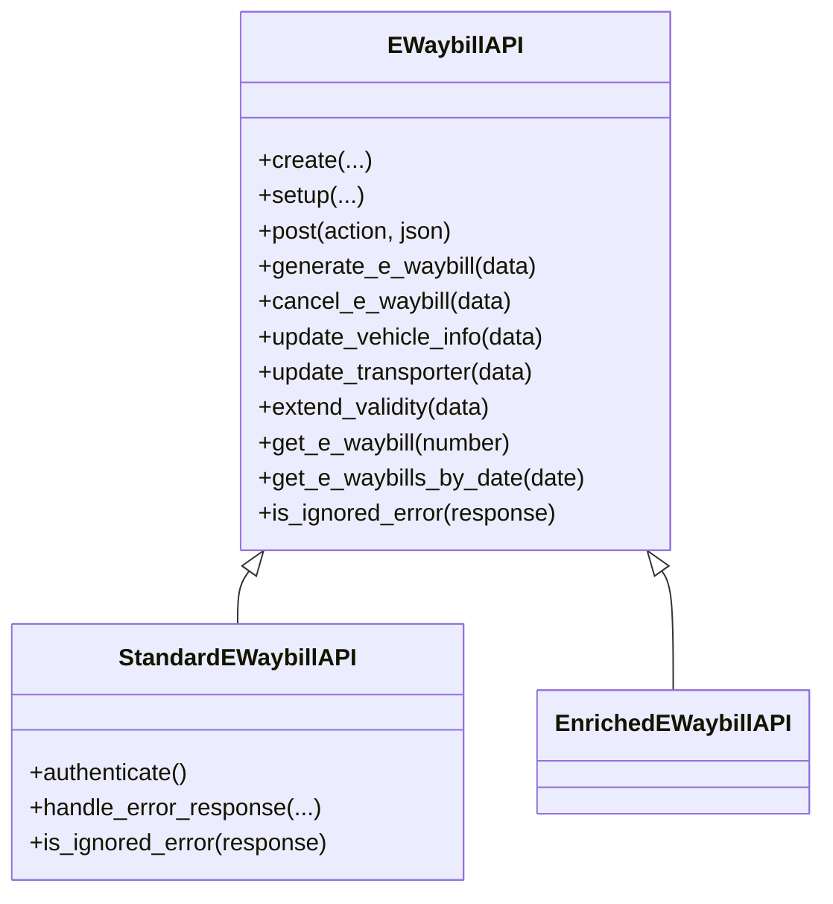

**Diagram sources**
- [e_waybill.py](file://india_compliance/gst_india/api_classes/nic/e_waybill.py#L17-L259)
- [e_waybill_errors.py](file://india_compliance/gst_india/api_classes/nic/e_waybill_errors.py#L1-L337)

**Section sources**
- [e_waybill.py](file://india_compliance/gst_india/api_classes/nic/e_waybill.py#L17-L259)
- [e_waybill_errors.py](file://india_compliance/gst_india/api_classes/nic/e_waybill_errors.py#L1-L337)

### Taxpayer Base API (Returns)
- Encrypted communication with OTP-based sessions, session keys, and HMAC validation.
- Endpoints: IRN lists/details, return status, proceed to file, GSTR-1/2A/2B/3B/IMS data retrieval and submission.
- Error handling: Maps specific error codes to actionable types; supports queued downloads.

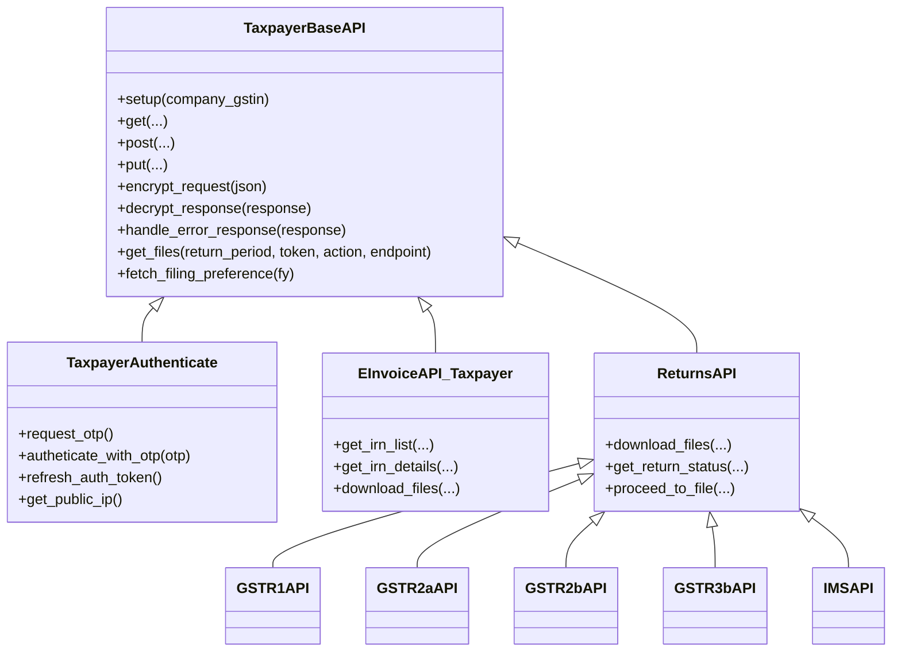

**Diagram sources**
- [taxpayer_base.py](file://india_compliance/gst_india/api_classes/taxpayer_base.py#L321-L527)
- [taxpayer_e_invoice.py](file://india_compliance/gst_india/api_classes/taxpayer_e_invoice.py#L7-L69)
- [taxpayer_returns.py](file://india_compliance/gst_india/api_classes/taxpayer_returns.py#L10-L395)

**Section sources**
- [taxpayer_base.py](file://india_compliance/gst_india/api_classes/taxpayer_base.py#L321-L527)
- [taxpayer_e_invoice.py](file://india_compliance/gst_india/api_classes/taxpayer_e_invoice.py#L7-L69)
- [taxpayer_returns.py](file://india_compliance/gst_india/api_classes/taxpayer_returns.py#L10-L395)

### Authentication Mechanisms and Token Management
- Public API: Adds request ID header; no token required.
- NIC e-Invoice/e-Waybill:
  - StandardAuth: Encrypts request payload using public key or session key; decrypts and validates HMAC for responses; manages auth token and session expiry.
  - EnrichedAuth: Delegates encryption/decryption to GSP.
- Taxpayer Returns: OTP-based authentication; refreshes tokens; validates session IP; stores session key and expiry.

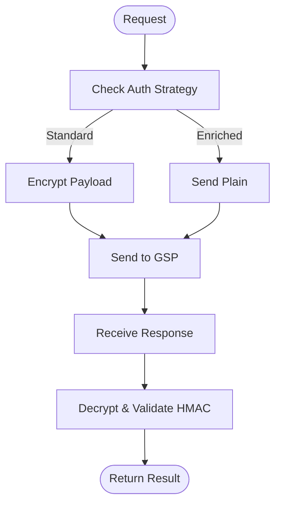

**Diagram sources**
- [auth.py](file://india_compliance/gst_india/api_classes/nic/auth.py#L53-L195)
- [taxpayer_base.py](file://india_compliance/gst_india/api_classes/taxpayer_base.py#L110-L319)

**Section sources**
- [auth.py](file://india_compliance/gst_india/api_classes/nic/auth.py#L27-L195)
- [taxpayer_base.py](file://india_compliance/gst_india/api_classes/taxpayer_base.py#L110-L319)

### Secure Communication Protocols
- HTTPS endpoints via BaseAPI.get_url with sandbox flag.
- Encryption/decryption using AES and RSA; HMAC validation for integrity.
- Sensitive data masking in logs for headers, body, output, and data.

**Section sources**
- [base.py](file://india_compliance/gst_india/api_classes/base.py#L101-L113)
- [auth.py](file://india_compliance/gst_india/api_classes/nic/auth.py#L18-L24)
- [taxpayer_base.py](file://india_compliance/gst_india/api_classes/taxpayer_base.py#L426-L442)

### API Endpoints and Usage Patterns
- e-Invoice
  - Generate IRN: POST invoice
  - Cancel IRN: POST invoice/cancel
  - Get e-Invoice by IRN: GET invoice/irn
  - Get e-Waybill by IRN: GET ewaybill/irn
  - Master sync: GET master/syncgstin
- e-Waybill
  - Generate: POST action=GENEWAYBILL
  - Cancel: POST action=CANEWB
  - Update vehicle/transporter: POST action=VEHEWB/UPDATETRANSPORTER
  - Extend validity: POST action=EXTENDVALIDITY
  - Get by number/date: GET GetEwayBill/GetEwayBillsByDate
- Public
  - GSTIN info: GET commonapi/search?action=TP&gstin={gstin}
  - Returns tracking: GET commonapi/returns?action=RETTRACK&gstin={gstin}&fy={fy}
- Taxpayer Returns
  - IRN list/details: GET einvoice endpoints
  - GSTR-1: GET/PUT/POST returns/gstr1
  - GSTR-2A/2B: GET returns/gstr2a/gstr2b
  - GSTR-3B: GET/PUT/POST returns/gstr3b
  - IMS: GET/PUT/POST returns/ims

**Section sources**
- [e_invoice.py](file://india_compliance/gst_india/api_classes/nic/e_invoice.py#L96-L143)
- [e_waybill.py](file://india_compliance/gst_india/api_classes/nic/e_waybill.py#L81-L120)
- [public.py](file://india_compliance/gst_india/api_classes/public.py#L31-L47)
- [taxpayer_e_invoice.py](file://india_compliance/gst_india/api_classes/taxpayer_e_invoice.py#L34-L68)
- [taxpayer_returns.py](file://india_compliance/gst_india/api_classes/taxpayer_returns.py#L115-L395)

### Error Handling, Retry, and Timeout Configurations
- HTTP code handling: Unauthorized/Forbidden, rate limit (429), invalid API key, gateway timeout (504).
- Server error mapping: GSP down, limit exceeded.
- Ignored errors: Specific codes mapped to safe defaults (e.g., no docs found).
- Retry and fallback:
  - Standard e-Invoice/EWaybill: On invalid token, re-authenticate and retry once.
  - Fallback: When sandbox or fallback setting is enabled, switch to Enriched mode automatically.
- Timeouts: GatewayTimeoutError raised for 504 responses.

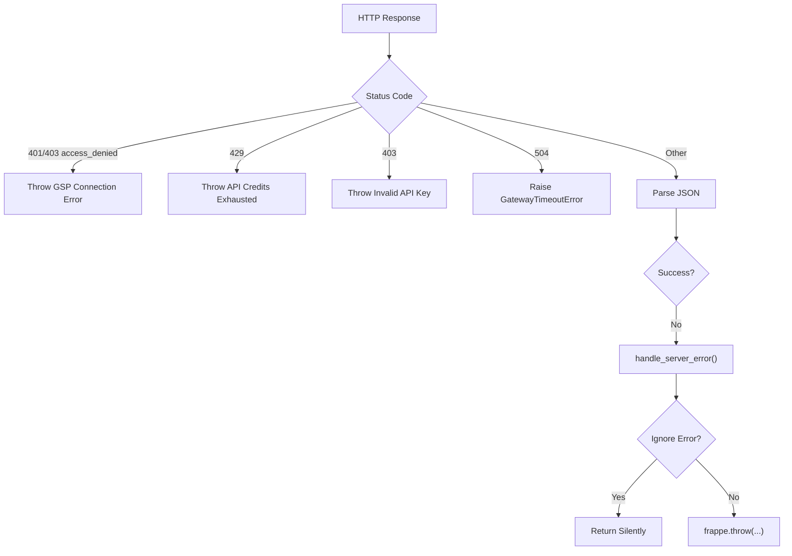

**Diagram sources**
- [base.py](file://india_compliance/gst_india/api_classes/base.py#L282-L312)
- [e_invoice.py](file://india_compliance/gst_india/api_classes/nic/e_invoice.py#L194-L203)
- [e_waybill.py](file://india_compliance/gst_india/api_classes/nic/e_waybill.py#L168-L180)

**Section sources**
- [base.py](file://india_compliance/gst_india/api_classes/base.py#L258-L312)
- [exceptions.py](file://india_compliance/exceptions.py#L4-L25)
- [e_invoice.py](file://india_compliance/gst_india/api_classes/nic/e_invoice.py#L194-L203)
- [e_waybill.py](file://india_compliance/gst_india/api_classes/nic/e_waybill.py#L168-L180)

### Rate Limiting, API Versioning, and Fallback Strategies
- Rate limiting: 429 mapped to GSPLimitExceededError; clients should reduce frequency or upgrade plan.
- Versioning: Base URL constant; sandbox mode toggles test endpoints; fallback mode switches to Enriched API.
- Fallback: EInvoiceAPI.create and EWaybillAPI.create choose Enriched when sandbox or fallback is enabled.

**Section sources**
- [base.py](file://india_compliance/gst_india/api_classes/base.py#L20-L20)
- [e_invoice.py](file://india_compliance/gst_india/api_classes/nic/e_invoice.py#L44-L54)
- [e_waybill.py](file://india_compliance/gst_india/api_classes/nic/e_waybill.py#L40-L50)

### Webhook and Event-Driven Triggers
- Integration Request logging: All API calls are enqueued as Integration Request records with masked data.
- Linking to actions: When returns are queued, GSTR Action tokens are recorded and linked to Integration Requests.
- Reporting: API usage report aggregates requests by reference document.

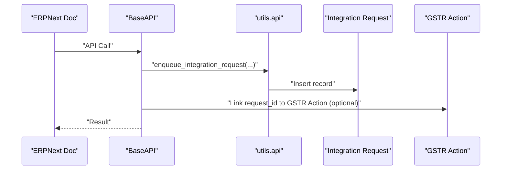

**Diagram sources**
- [api.py](file://india_compliance/gst_india/utils/api.py#L4-L57)
- [gstr_action.py](file://india_compliance/gst_india/doctype/gstr_action/gstr_action.py#L12-L29)

**Section sources**
- [api.py](file://india_compliance/gst_india/utils/api.py#L4-L57)
- [gstr_action.py](file://india_compliance/gst_india/doctype/gstr_action/gstr_action.py#L12-L29)
- [india_compliance_api_usage.py](file://india_compliance/gst_india/report/india_compliance_api_usage/india_compliance_api_usage.py#L138-L156)

### Practical Examples and Usage Patterns
- e-Invoice Generation
  - Initialize EInvoiceAPI.create(company_gstin=...).setup(doc or company_gstin)
  - Call generate_irn(data) and handle ignored duplicate IRN responses.
- e-Waybill Creation
  - Initialize EWaybillAPI.create(company_gstin=...).setup(doc or company_gstin)
  - Call generate_e_waybill(data); on invalid token, re-authenticate and retry.
- GST Return Filing
  - Initialize ReturnsAPI (GSTR1/GSTR2A/GSTR2B/GSTR3B/IMS) with company_gstin
  - Use get_*_data, save, reset, file, and download_files as needed.
- Public API
  - Initialize PublicAPI.setup(doc optional)
  - Call get_gstin_info(gstin) and get_returns_info(gstin, fy)

Note: Request/response schemas are governed by the respective government APIs and are not reproduced here. Use sandbox mode for testing and consult error code mappings for troubleshooting.

**Section sources**
- [e_invoice.py](file://india_compliance/gst_india/api_classes/nic/e_invoice.py#L44-L143)
- [e_waybill.py](file://india_compliance/gst_india/api_classes/nic/e_waybill.py#L40-L120)
- [taxpayer_returns.py](file://india_compliance/gst_india/api_classes/taxpayer_returns.py#L115-L395)
- [public.py](file://india_compliance/gst_india/api_classes/public.py#L31-L47)

## Dependency Analysis
- BaseAPI is the foundation for all API clients.
- NIC APIs depend on StandardAuth/EnrichedAuth for encryption/decryption.
- Taxpayer APIs depend on TaxpayerBaseAPI for OTP/session management and encrypted payloads.
- Integration Request logging depends on ERPNext’s Integration Request doctype.

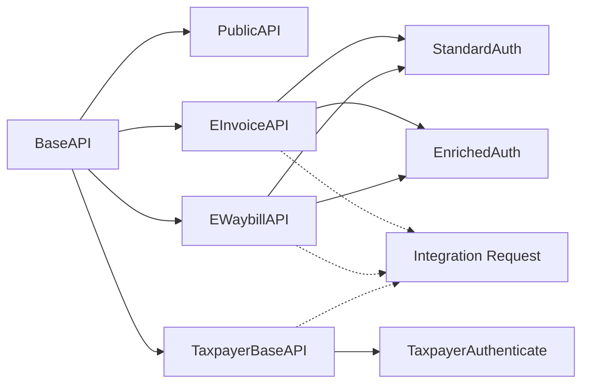

**Diagram sources**
- [base.py](file://india_compliance/gst_india/api_classes/base.py#L23-L413)
- [e_invoice.py](file://india_compliance/gst_india/api_classes/nic/e_invoice.py#L12-L271)
- [e_waybill.py](file://india_compliance/gst_india/api_classes/nic/e_waybill.py#L17-L259)
- [auth.py](file://india_compliance/gst_india/api_classes/nic/auth.py#L27-L195)
- [taxpayer_base.py](file://india_compliance/gst_india/api_classes/taxpayer_base.py#L321-L527)
- [api.py](file://india_compliance/gst_india/utils/api.py#L4-L57)

**Section sources**
- [base.py](file://india_compliance/gst_india/api_classes/base.py#L23-L413)
- [auth.py](file://india_compliance/gst_india/api_classes/nic/auth.py#L27-L195)
- [taxpayer_base.py](file://india_compliance/gst_india/api_classes/taxpayer_base.py#L321-L527)
- [api.py](file://india_compliance/gst_india/utils/api.py#L4-L57)

## Performance Considerations
- Prefer batch operations where supported (e.g., downloading files via queued tokens).
- Use sandbox mode for development to avoid throttling.
- Monitor Integration Request logs to identify slow endpoints and retry patterns.
- Avoid unnecessary retries; rely on built-in invalid token refresh for Standard APIs.

## Troubleshooting Guide
- GSP/GST Server Down: Triggered for specific GSP error patterns; retry after cooldown.
- API Credits Exhausted (429): Upgrade plan or reduce request frequency.
- Invalid API Key (403): Verify x-api-key and configuration.
- Gateway Timeout (504): Increase timeout or retry with exponential backoff.
- OTP Required/Invalid: Use OTP handlers to capture and resolve OTP prompts.
- Ignored Errors: Codes mapped to safe defaults; inspect response metadata for details.

**Section sources**
- [base.py](file://india_compliance/gst_india/api_classes/base.py#L258-L312)
- [exceptions.py](file://india_compliance/exceptions.py#L4-L25)
- [taxpayer_base.py](file://india_compliance/gst_india/api_classes/taxpayer_base.py#L29-L44)

## Conclusion
The India Compliance module provides a robust, secure, and extensible framework for integrating with government portals. It supports multiple authentication strategies, comprehensive error handling, and seamless ERPNext integration via logging and event-driven triggers. By leveraging sandbox mode, fallback strategies, and standardized error handling, organizations can reliably automate e-invoice, e-waybill, and GST return workflows.

## Appendices

### Authentication Frontend Integration
- Public frontend services for India Compliance account authentication and session management.

**Section sources**
- [AuthService.js](file://india_compliance/public/js/india_compliance_account/services/AuthService.js#L1-L60)