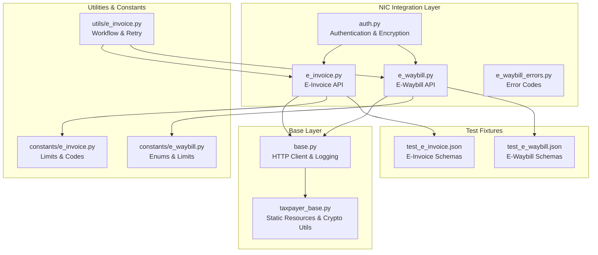
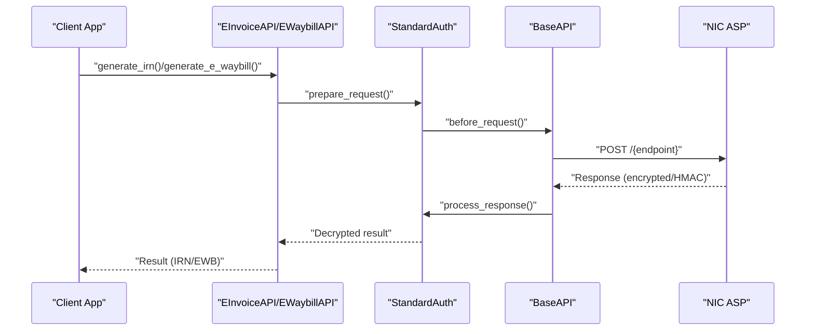
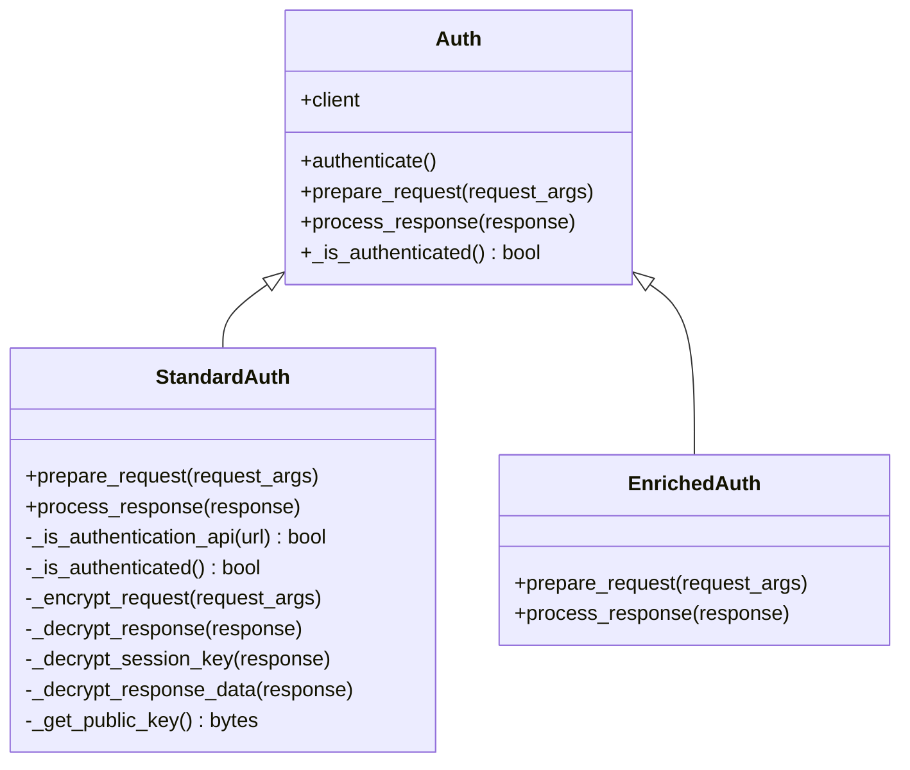
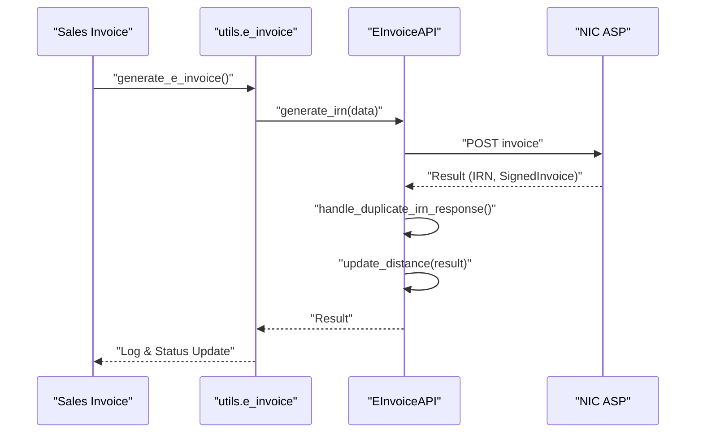
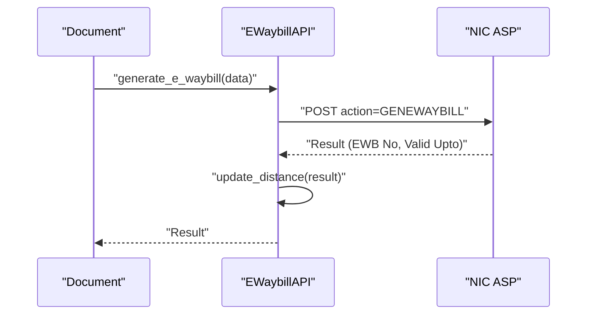
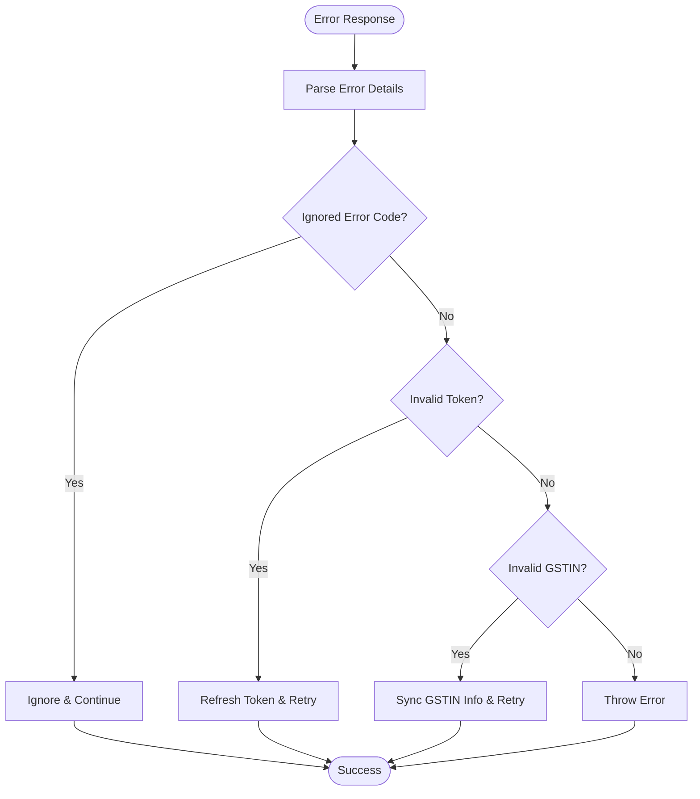
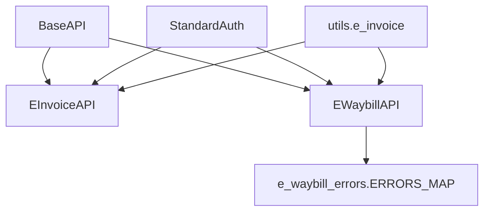

# NIC Portal Integration

<cite>
**Referenced Files in This Document**
- [auth.py](file://india_compliance/gst_india/api_classes/nic/auth.py)
- [e_invoice.py](file://india_compliance/gst_india/api_classes/nic/e_invoice.py)
- [e_waybill.py](file://india_compliance/gst_india/api_classes/nic/e_waybill.py)
- [e_waybill_errors.py](file://india_compliance/gst_india/api_classes/nic/e_waybill_errors.py)
- [base.py](file://india_compliance/gst_india/api_classes/base.py)
- [taxpayer_base.py](file://india_compliance/gst_india/api_classes/taxpayer_base.py)
- [test_e_invoice.json](file://india_compliance/gst_india/data/test_e_invoice.json)
- [test_e_waybill.json](file://india_compliance/gst_india/data/test_e_waybill.json)
- [e_invoice.py](file://india_compliance/gst_india/constants/e_invoice.py)
- [e_waybill.py](file://india_compliance/gst_india/constants/e_waybill.py)
- [e_invoice.py](file://india_compliance/gst_india/utils/e_invoice.py)
</cite>

## Table of Contents
1. [Introduction](#introduction)
2. [Project Structure](#project-structure)
3. [Core Components](#core-components)
4. [Architecture Overview](#architecture-overview)
5. [Detailed Component Analysis](#detailed-component-analysis)
6. [Dependency Analysis](#dependency-analysis)
7. [Performance Considerations](#performance-considerations)
8. [Troubleshooting Guide](#troubleshooting-guide)
9. [Conclusion](#conclusion)
10. [Appendices](#appendices)

## Introduction
This document explains the National Informatics Centre (NIC) portal integration for e-invoice and e-waybill generation within the India Compliance platform. It covers authentication flow, session management, secure communication protocols, API endpoints, data validation, response processing, error handling, rate limiting, API versioning, and fallback mechanisms. Practical examples and request/response schemas are provided via test fixtures included in the repository.

## Project Structure
The NIC integration is implemented as part of the GST India module under the India Compliance app. Key components include:
- Authentication and encryption utilities for NIC
- e-Invoice and e-Waybill API clients
- Error code mapping for e-Waybill
- Base HTTP client with masking and logging
- Constants and utilities for validation and limits
- Test fixtures for request/response schemas

**Diagram sources**
- [auth.py](file://india_compliance/gst_india/api_classes/nic/auth.py#L1-L195)
- [e_invoice.py](file://india_compliance/gst_india/api_classes/nic/e_invoice.py#L1-L271)
- [e_waybill.py](file://india_compliance/gst_india/api_classes/nic/e_waybill.py#L1-L259)
- [e_waybill_errors.py](file://india_compliance/gst_india/api_classes/nic/e_waybill_errors.py#L1-L337)
- [base.py](file://india_compliance/gst_india/api_classes/base.py#L1-L413)
- [taxpayer_base.py](file://india_compliance/gst_india/api_classes/taxpayer_base.py#L1-L527)
- [e_invoice.py](file://india_compliance/gst_india/constants/e_invoice.py#L1-L9)
- [e_waybill.py](file://india_compliance/gst_india/constants/e_waybill.py#L1-L99)
- [e_invoice.py](file://india_compliance/gst_india/utils/e_invoice.py#L1-L1116)
- [test_e_invoice.json](file://india_compliance/gst_india/data/test_e_invoice.json#L1-L1006)
- [test_e_waybill.json](file://india_compliance/gst_india/data/test_e_waybill.json#L1-L1433)

**Section sources**
- [auth.py](file://india_compliance/gst_india/api_classes/nic/auth.py#L1-L195)
- [e_invoice.py](file://india_compliance/gst_india/api_classes/nic/e_invoice.py#L1-L271)
- [e_waybill.py](file://india_compliance/gst_india/api_classes/nic/e_waybill.py#L1-L259)
- [base.py](file://india_compliance/gst_india/api_classes/base.py#L1-L413)
- [taxpayer_base.py](file://india_compliance/gst_india/api_classes/taxpayer_base.py#L1-L527)
- [e_invoice.py](file://india_compliance/gst_india/constants/e_invoice.py#L1-L9)
- [e_waybill.py](file://india_compliance/gst_india/constants/e_waybill.py#L1-L99)
- [e_invoice.py](file://india_compliance/gst_india/utils/e_invoice.py#L1-L1116)
- [test_e_invoice.json](file://india_compliance/gst_india/data/test_e_invoice.json#L1-L1006)
- [test_e_waybill.json](file://india_compliance/gst_india/data/test_e_waybill.json#L1-L1433)

## Core Components
- Authentication and Encryption (StandardAuth): Handles public key encryption for authentication requests, session key-based AES encryption for subsequent requests, and HMAC validation for responses.
- E-Invoice API: Provides endpoints for IRN generation, cancellation, retrieval by IRN, and distance extraction from alerts.
- E-Waybill API: Provides endpoints for generation, cancellation, updates (vehicle info, transporter), validity extension, and distance extraction from alerts.
- Error Mapping: Comprehensive error code mapping for e-Waybill with user-friendly descriptions.
- Base HTTP Client: Centralized request/response handling, masking, logging, and error propagation.
- Utilities and Constants: Validation limits, enums, and workflow helpers for retry and fallback.

**Section sources**
- [auth.py](file://india_compliance/gst_india/api_classes/nic/auth.py#L27-L195)
- [e_invoice.py](file://india_compliance/gst_india/api_classes/nic/e_invoice.py#L12-L271)
- [e_waybill.py](file://india_compliance/gst_india/api_classes/nic/e_waybill.py#L17-L259)
- [e_waybill_errors.py](file://india_compliance/gst_india/api_classes/nic/e_waybill_errors.py#L1-L337)
- [base.py](file://india_compliance/gst_india/api_classes/base.py#L23-L413)
- [e_invoice.py](file://india_compliance/gst_india/constants/e_invoice.py#L1-L9)
- [e_waybill.py](file://india_compliance/gst_india/constants/e_waybill.py#L1-L99)
- [e_invoice.py](file://india_compliance/gst_india/utils/e_invoice.py#L1-L1116)

## Architecture Overview
The integration follows a layered architecture:
- API Clients (EInvoiceAPI, EWaybillAPI) encapsulate endpoint logic and response processing.
- Authentication Strategy (StandardAuth) manages encryption/decryption and token lifecycle.
- Base Client handles HTTP transport, request preparation, response processing, and logging.
- Static Resources API provides public keys and certificates when needed.
- Workflow utilities orchestrate retries, fallbacks, and status updates.

**Diagram sources**
- [e_invoice.py](file://india_compliance/gst_india/api_classes/nic/e_invoice.py#L102-L121)
- [e_waybill.py](file://india_compliance/gst_india/api_classes/nic/e_waybill.py#L104-L119)
- [auth.py](file://india_compliance/gst_india/api_classes/nic/auth.py#L53-L195)
- [base.py](file://india_compliance/gst_india/api_classes/base.py#L124-L239)

## Detailed Component Analysis

### Authentication and Session Management
- Public Key Encryption: Authentication requests are encrypted using NIC’s public key.
- Session Key Encryption: Subsequent requests are encrypted using a session key shared during authentication.
- HMAC Validation: Responses include HMAC; the client validates it against the decrypted payload.
- Token Lifecycle: Authentication tokens are stored and refreshed automatically when expired or invalidated.

**Diagram sources**
- [auth.py](file://india_compliance/gst_india/api_classes/nic/auth.py#L27-L195)

**Section sources**
- [auth.py](file://india_compliance/gst_india/api_classes/nic/auth.py#L53-L195)
- [taxpayer_base.py](file://india_compliance/gst_india/api_classes/taxpayer_base.py#L47-L68)

### E-Invoice Generation API
- Endpoints:
  - Generate IRN: POST invoice
  - Cancel IRN: POST invoice/cancel
  - Get e-Invoice by IRN: GET invoice/irn
  - Get e-Waybill by IRN: GET ewaybill/irn
  - Master data: GET master/gstin, GET master/syncgstin
- Response Processing:
  - Duplicate IRN handling
  - Distance extraction from alerts
  - Ignored error codes mapping

**Diagram sources**
- [e_invoice.py](file://india_compliance/gst_india/api_classes/nic/e_invoice.py#L102-L121)
- [e_invoice.py](file://india_compliance/gst_india/utils/e_invoice.py#L119-L267)

**Section sources**
- [e_invoice.py](file://india_compliance/gst_india/api_classes/nic/e_invoice.py#L96-L121)
- [e_invoice.py](file://india_compliance/gst_india/utils/e_invoice.py#L119-L267)
- [test_e_invoice.json](file://india_compliance/gst_india/data/test_e_invoice.json#L1-L1006)

### E-Waybill Creation and Updates
- Endpoints:
  - Generate: POST GENEWAYBILL
  - Cancel: POST CANEWB
  - Update Vehicle Info: POST VEHEWB
  - Update Transporter: POST UPDATETRANSPORTER
  - Extend Validity: POST EXTENDVALIDITY
  - Get E-Waybill: GET GetEwayBill (prod) or getewaybill (sandbox)
  - Get E-Waybills by Date: GET GetEwayBillsByDate
- Response Processing:
  - Distance extraction from alerts
  - Ignored error codes mapping

**Diagram sources**
- [e_waybill.py](file://india_compliance/gst_india/api_classes/nic/e_waybill.py#L104-L119)
- [e_waybill.py](file://india_compliance/gst_india/api_classes/nic/e_waybill.py#L97-L102)

**Section sources**
- [e_waybill.py](file://india_compliance/gst_india/api_classes/nic/e_waybill.py#L81-L128)
- [test_e_waybill.json](file://india_compliance/gst_india/data/test_e_waybill.json#L1-L1433)

### Error Handling and Resolution Strategies
- Ignored Error Codes:
  - E-Invoice: Duplicate IRN, IRN older than 2 days, Invalid Token, EwayBill already generated, Invalid GSTIN, etc.
  - E-Waybill: Invalid auth token, already cancelled, transporter details not found, etc.
- Error Code Mapping:
  - Comprehensive mapping of NIC error codes to human-readable messages for e-Waybill.
- Resolution Strategies:
  - Automatic token refresh on invalid token
  - Duplicate IRN resolution via IRN lookup and comparison
  - Sync GSTIN info and retry on invalid GSTIN errors
  - Ignore configured non-actionable errors

**Diagram sources**
- [e_invoice.py](file://india_compliance/gst_india/api_classes/nic/e_invoice.py#L15-L32)
- [e_waybill.py](file://india_compliance/gst_india/api_classes/nic/e_waybill.py#L20-L28)
- [e_waybill_errors.py](file://india_compliance/gst_india/api_classes/nic/e_waybill_errors.py#L1-L337)
- [e_invoice.py](file://india_compliance/gst_india/utils/e_invoice.py#L166-L188)

**Section sources**
- [e_invoice.py](file://india_compliance/gst_india/api_classes/nic/e_invoice.py#L85-L94)
- [e_waybill.py](file://india_compliance/gst_india/api_classes/nic/e_waybill.py#L87-L95)
- [e_waybill_errors.py](file://india_compliance/gst_india/api_classes/nic/e_waybill_errors.py#L1-L337)
- [e_invoice.py](file://india_compliance/gst_india/utils/e_invoice.py#L166-L188)

### Secure Communication Protocols
- Public Key Encryption for Authentication Requests
- AES Session Key Encryption for Payloads
- HMAC Validation for Response Integrity
- Masking of Sensitive Headers/Data in Logs
- Static Resource Retrieval for Public Certificates/Keys

**Section sources**
- [auth.py](file://india_compliance/gst_india/api_classes/nic/auth.py#L80-L195)
- [base.py](file://india_compliance/gst_india/api_classes/base.py#L168-L239)
- [taxpayer_base.py](file://india_compliance/gst_india/api_classes/taxpayer_base.py#L47-L68)

### Data Validation and Limits
- Item Limits:
  - E-Invoice: Max 1000 items
  - E-Waybill: Max 250 items
- Validation Rules:
  - Presence of customer address for e-Invoice
  - Applicability checks for e-Invoice
  - Enumerations for document types, supply types, sub-supply types, transport modes, etc.

**Section sources**
- [e_invoice.py](file://india_compliance/gst_india/constants/e_invoice.py#L1-L9)
- [e_waybill.py](file://india_compliance/gst_india/constants/e_waybill.py#L1-L99)
- [e_invoice.py](file://india_compliance/gst_india/utils/e_invoice.py#L727-L733)

### Webhook and Real-time Updates
- Vehicle Movement Tracking:
  - Update vehicle info endpoint supports real-time updates
  - Extend validity endpoint allows distance-based extensions
- Alerts and Distance Extraction:
  - Both e-Invoice and e-Waybill APIs extract distance from alerts for tracking

**Section sources**
- [e_waybill.py](file://india_compliance/gst_india/api_classes/nic/e_waybill.py#L112-L119)
- [e_waybill.py](file://india_compliance/gst_india/api_classes/nic/e_waybill.py#L121-L128)
- [e_invoice.py](file://india_compliance/gst_india/api_classes/nic/e_invoice.py#L126-L138)

### Rate Limiting, API Versioning, and Fallback Mechanisms
- Rate Limiting:
  - HTTP 429 mapped to API credits exhausted error
- API Versioning:
  - Standard vs Enriched API variants based on settings and sandbox mode
- Fallback Mechanisms:
  - Use of fallback flag to switch to Enriched API when configured
  - Retry logic for server errors and pending retries

**Section sources**
- [base.py](file://india_compliance/gst_india/api_classes/base.py#L282-L312)
- [e_invoice.py](file://india_compliance/gst_india/api_classes/nic/e_invoice.py#L44-L54)
- [e_waybill.py](file://india_compliance/gst_india/api_classes/nic/e_waybill.py#L40-L50)
- [e_invoice.py](file://india_compliance/gst_india/utils/e_invoice.py#L648-L664)

## Dependency Analysis
The NIC integration relies on a cohesive set of dependencies:
- BaseAPI provides HTTP transport, logging, masking, and error handling.
- StandardAuth depends on cryptographic utilities and static resources.
- E-Invoice and E-Waybill APIs inherit from BaseAPI and use StandardAuth.
- Error mapping is centralized for e-Waybill.
- Utilities coordinate retries and fallbacks.

**Diagram sources**
- [base.py](file://india_compliance/gst_india/api_classes/base.py#L23-L413)
- [auth.py](file://india_compliance/gst_india/api_classes/nic/auth.py#L27-L195)
- [e_invoice.py](file://india_compliance/gst_india/api_classes/nic/e_invoice.py#L12-L271)
- [e_waybill.py](file://india_compliance/gst_india/api_classes/nic/e_waybill.py#L17-L259)
- [e_waybill_errors.py](file://india_compliance/gst_india/api_classes/nic/e_waybill_errors.py#L1-L337)
- [e_invoice.py](file://india_compliance/gst_india/utils/e_invoice.py#L1-L1116)

**Section sources**
- [base.py](file://india_compliance/gst_india/api_classes/base.py#L23-L413)
- [auth.py](file://india_compliance/gst_india/api_classes/nic/auth.py#L27-L195)
- [e_invoice.py](file://india_compliance/gst_india/api_classes/nic/e_invoice.py#L12-L271)
- [e_waybill.py](file://india_compliance/gst_india/api_classes/nic/e_waybill.py#L17-L259)
- [e_waybill_errors.py](file://india_compliance/gst_india/api_classes/nic/e_waybill_errors.py#L1-L337)
- [e_invoice.py](file://india_compliance/gst_india/utils/e_invoice.py#L1-L1116)

## Performance Considerations
- Asynchronous Logging and Retry Queues: Uses enqueue for logging and bulk operations to minimize latency.
- Request/Response Masking: Prevents sensitive data exposure in logs.
- Item Limits: Enforced to keep payloads manageable and reduce processing overhead.
- Token Reuse: Session tokens are reused until expiry to avoid frequent authentication.

[No sources needed since this section provides general guidance]

## Troubleshooting Guide
Common issues and resolutions:
- Invalid Token: Automatically refreshed and request retried.
- Duplicate IRN: Resolved by fetching existing IRN details and comparing buyer GSTIN and invoice amount.
- Invalid GSTIN: Sync GSTIN info and retry.
- Ignored Errors: Configured error codes are ignored and logged without failing the process.
- Connectivity Issues: Mapped to specific HTTP statuses and user-friendly messages.

**Section sources**
- [e_invoice.py](file://india_compliance/gst_india/api_classes/nic/e_invoice.py#L194-L203)
- [e_waybill.py](file://india_compliance/gst_india/api_classes/nic/e_waybill.py#L168-L180)
- [e_invoice.py](file://india_compliance/gst_india/utils/e_invoice.py#L166-L188)
- [base.py](file://india_compliance/gst_india/api_classes/base.py#L282-L312)

## Conclusion
The NIC portal integration provides a robust, secure, and resilient framework for e-invoice and e-waybill generation. It enforces strict authentication and encryption, offers comprehensive error handling and resolution strategies, and includes practical safeguards like rate limiting awareness, fallback mechanisms, and real-time updates. The extensive test fixtures serve as reliable references for request/response schemas and expected behaviors.

## Appendices

### Practical Examples and Schemas
- E-Invoice Request/Response Schemas: See [test_e_invoice.json](file://india_compliance/gst_india/data/test_e_invoice.json#L1-L1006)
- E-Waybill Request/Response Schemas: See [test_e_waybill.json](file://india_compliance/gst_india/data/test_e_waybill.json#L1-L1433)

### API Endpoints Summary
- E-Invoice
  - POST /invoice
  - POST /invoice/cancel
  - GET /invoice/irn
  - GET /ewaybill/irn
  - GET /master/gstin
  - GET /master/syncgstin
- E-Waybill
  - POST action=GENEWAYBILL
  - POST action=CANEWB
  - POST action=VEHEWB
  - POST action=UPDATETRANSPORTER
  - POST action=EXTENDVALIDITY
  - GET GetEwayBill (production), getewaybill (sandbox)
  - GET GetEwayBillsByDate

**Section sources**
- [e_invoice.py](file://india_compliance/gst_india/api_classes/nic/e_invoice.py#L96-L124)
- [e_waybill.py](file://india_compliance/gst_india/api_classes/nic/e_waybill.py#L97-L119)