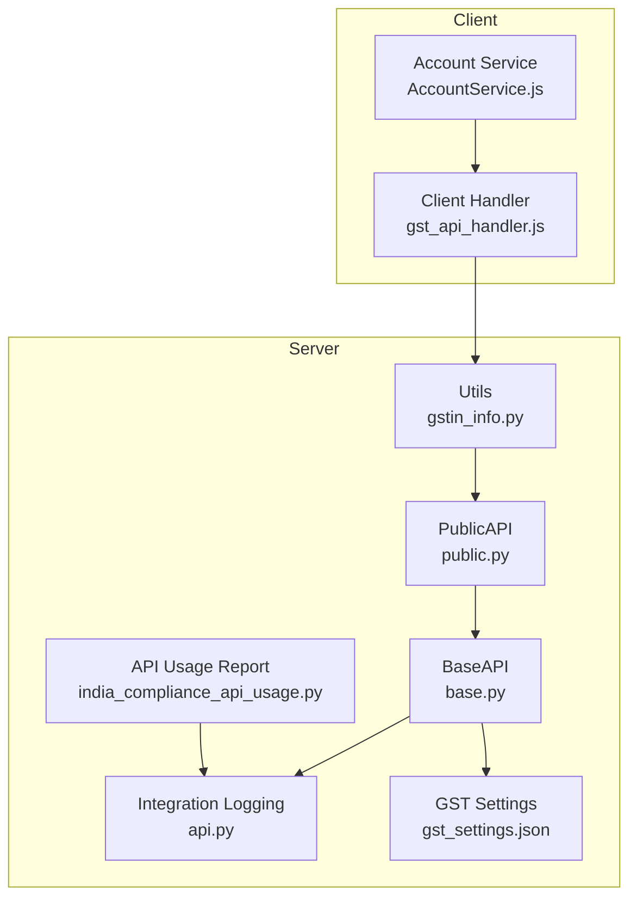
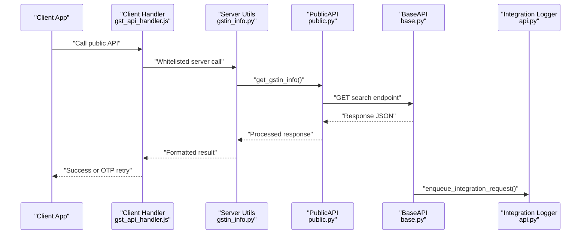
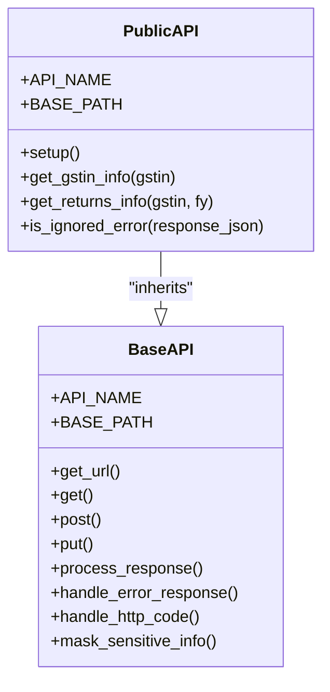
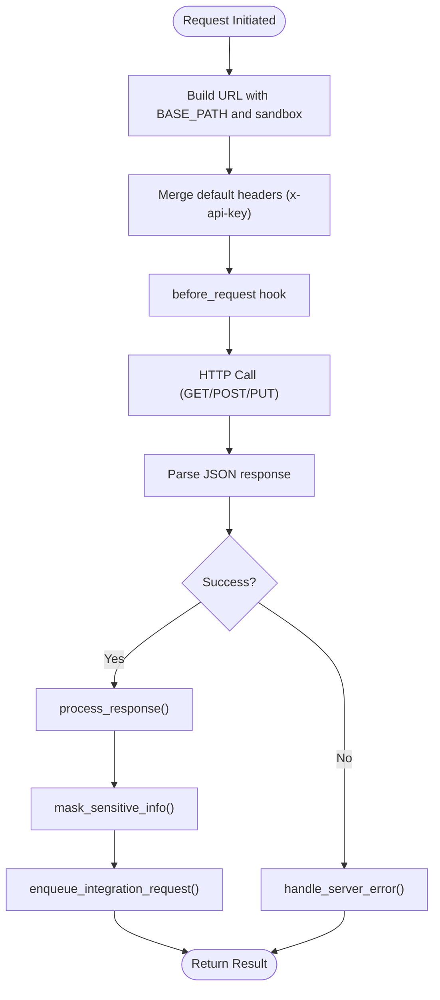
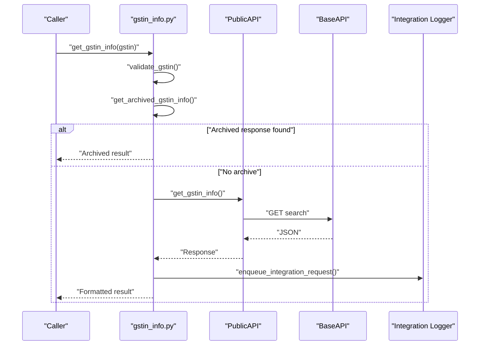
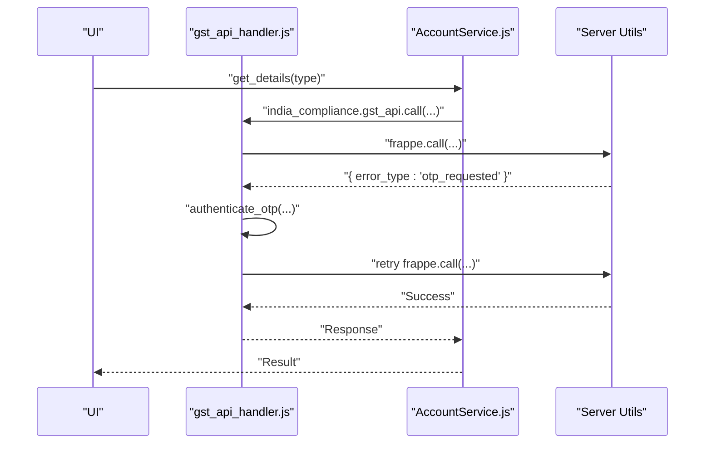
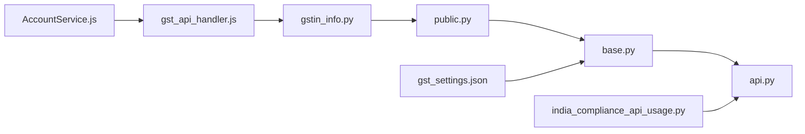

# Public API Access

<cite>
**Referenced Files in This Document**
- [public.py](file://india_compliance/gst_india/api_classes/public.py)
- [base.py](file://india_compliance/gst_india/api_classes/base.py)
- [gstin_info.py](file://india_compliance/gst_india/utils/gstin_info.py)
- [api.py](file://india_compliance/gst_india/utils/api.py)
- [gst_settings.json](file://india_compliance/gst_india/doctype/gst_settings/gst_settings.json)
- [india_compliance_api_usage.py](file://india_compliance/gst_india/report/india_compliance_api_usage/india_compliance_api_usage.py)
- [gst_api_handler.js](file://india_compliance/public/js/gst_api_handler.js)
- [AccountService.js](file://india_compliance/public/js/india_compliance_account/services/AccountService.js)
- [auth.py](file://india_compliance/gst_india/api_classes/nic/auth.py)
</cite>

## Table of Contents
1. [Introduction](#introduction)
2. [Project Structure](#project-structure)
3. [Core Components](#core-components)
4. [Architecture Overview](#architecture-overview)
5. [Detailed Component Analysis](#detailed-component-analysis)
6. [Dependency Analysis](#dependency-analysis)
7. [Performance Considerations](#performance-considerations)
8. [Troubleshooting Guide](#troubleshooting-guide)
9. [Conclusion](#conclusion)
10. [Appendices](#appendices)

## Introduction
This document explains how to access public APIs exposed by the India Compliance module. It focuses on:
- Public endpoints for GSTIN validation and taxpayer status queries
- How these endpoints are invoked from server-side and client-side code
- Rate limits, usage restrictions, and access patterns
- Data formats and response schemas
- Caching strategies and client-side integration patterns
- Security considerations and best practices

## Project Structure
The public API surface leverages a shared Base API class and a Public API specialization. Server utilities orchestrate requests and responses, while client-side handlers wrap Frappe’s AJAX layer to integrate with the backend.

**Diagram sources**
- [base.py](file://india_compliance/gst_india/api_classes/base.py#L23-L114)
- [public.py](file://india_compliance/gst_india/api_classes/public.py#L7-L47)
- [gstin_info.py](file://india_compliance/gst_india/utils/gstin_info.py#L44-L102)
- [api.py](file://india_compliance/gst_india/utils/api.py#L4-L57)
- [gst_settings.json](file://india_compliance/gst_india/doctype/gst_settings/gst_settings.json#L196-L201)
- [india_compliance_api_usage.py](file://india_compliance/gst_india/report/india_compliance_api_usage/india_compliance_api_usage.py#L19-L157)
- [gst_api_handler.js](file://india_compliance/public/js/gst_api_handler.js#L4-L12)
- [AccountService.js](file://india_compliance/public/js/india_compliance_account/services/AccountService.js#L1-L46)

**Section sources**
- [base.py](file://india_compliance/gst_india/api_classes/base.py#L23-L114)
- [public.py](file://india_compliance/gst_india/api_classes/public.py#L7-L47)
- [gstin_info.py](file://india_compliance/gst_india/utils/gstin_info.py#L44-L102)
- [api.py](file://india_compliance/gst_india/utils/api.py#L4-L57)
- [gst_settings.json](file://india_compliance/gst_india/doctype/gst_settings/gst_settings.json#L196-L201)
- [india_compliance_api_usage.py](file://india_compliance/gst_india/report/india_compliance_api_usage/india_compliance_api_usage.py#L19-L157)
- [gst_api_handler.js](file://india_compliance/public/js/gst_api_handler.js#L4-L12)
- [AccountService.js](file://india_compliance/public/js/india_compliance_account/services/AccountService.js#L1-L46)

## Core Components
- PublicAPI: Specialization of BaseAPI for public endpoints. Provides:
  - GSTIN search via search endpoint
  - Returns tracking via returns endpoint
  - Error handling for ignored error codes
- BaseAPI: Shared HTTP client with:
  - URL construction, request signing, and response processing
  - Integration logging and masking of sensitive data
  - Error handling for HTTP status codes and GSP errors
- Utils: Orchestration functions for:
  - Whitelisted server-side endpoints for GSTIN info retrieval
  - Archival and caching of responses
  - Formatting of status responses
- Client handler: Wraps Frappe AJAX to retry OTP-related failures transparently
- Account services: Client-side wrappers for account-related API calls

**Section sources**
- [public.py](file://india_compliance/gst_india/api_classes/public.py#L7-L65)
- [base.py](file://india_compliance/gst_india/api_classes/base.py#L23-L220)
- [gstin_info.py](file://india_compliance/gst_india/utils/gstin_info.py#L44-L102)
- [gst_api_handler.js](file://india_compliance/public/js/gst_api_handler.js#L4-L12)
- [AccountService.js](file://india_compliance/public/js/india_compliance_account/services/AccountService.js#L1-L46)

## Architecture Overview
The public API flow integrates server-side orchestration with client-side AJAX calls. The server enforces API enablement and sandbox mode, constructs URLs, and logs integration requests. Responses are processed and cached where applicable.

**Diagram sources**
- [gstin_info.py](file://india_compliance/gst_india/utils/gstin_info.py#L44-L102)
- [public.py](file://india_compliance/gst_india/api_classes/public.py#L31-L42)
- [base.py](file://india_compliance/gst_india/api_classes/base.py#L115-L220)
- [api.py](file://india_compliance/gst_india/utils/api.py#L4-L57)
- [gst_api_handler.js](file://india_compliance/public/js/gst_api_handler.js#L4-L12)

## Detailed Component Analysis

### PublicAPI: Public Endpoints
PublicAPI exposes:
- GSTIN search: action TP with GSTIN parameter
- Returns tracking: action RETTRACK with GSTIN and FY (financial year)
- Sandbox behavior: augments response with mock data in sandbox mode
- Ignored error handling: treats specific error codes as non-fatal

**Diagram sources**
- [base.py](file://india_compliance/gst_india/api_classes/base.py#L23-L114)
- [public.py](file://india_compliance/gst_india/api_classes/public.py#L7-L65)

**Section sources**
- [public.py](file://india_compliance/gst_india/api_classes/public.py#L31-L47)
- [public.py](file://india_compliance/gst_india/api_classes/public.py#L49-L65)

### BaseAPI: Request Construction and Logging
Key behaviors:
- URL composition with BASE_PATH and optional sandbox prefix
- Default headers including x-api-key from settings or conf
- Request lifecycle: before_request, HTTP call, response processing, error handling
- Integration logging via enqueue_integration_request
- Sensitive data masking in logs

**Diagram sources**
- [base.py](file://india_compliance/gst_india/api_classes/base.py#L101-L220)
- [api.py](file://india_compliance/gst_india/utils/api.py#L4-L57)

**Section sources**
- [base.py](file://india_compliance/gst_india/api_classes/base.py#L101-L220)
- [api.py](file://india_compliance/gst_india/utils/api.py#L4-L57)

### Server Utilities: Whitelisted Endpoints and Caching
- get_gstin_info: validates GSTIN, attempts archival lookup, otherwise calls PublicAPI, enqueues status updates, and caches server errors
- get_archived_gstin_info: reuses archived Integration Request responses for the same endpoint and GSTIN within retention window
- fetch_gstin_status: chooses PublicAPI vs Taxpayer API depending on credentials availability and invocation context
- update_gstr_returns_info: calls PublicAPI.get_returns_info and enqueues processing of GSTR returns

**Diagram sources**
- [gstin_info.py](file://india_compliance/gst_india/utils/gstin_info.py#L44-L102)
- [gstin_info.py](file://india_compliance/gst_india/utils/gstin_info.py#L105-L138)
- [public.py](file://india_compliance/gst_india/api_classes/public.py#L31-L42)
- [base.py](file://india_compliance/gst_india/api_classes/base.py#L115-L220)
- [api.py](file://india_compliance/gst_india/utils/api.py#L4-L57)

**Section sources**
- [gstin_info.py](file://india_compliance/gst_india/utils/gstin_info.py#L44-L102)
- [gstin_info.py](file://india_compliance/gst_india/utils/gstin_info.py#L105-L138)
- [gstin_info.py](file://india_compliance/gst_india/utils/gstin_info.py#L339-L366)

### Client-Side Integration and OTP Handling
- Client handler wraps Frappe.ajax to retry calls when OTP-related error types are returned
- Account services expose typed wrappers for account operations with API secret injection

**Diagram sources**
- [gst_api_handler.js](file://india_compliance/public/js/gst_api_handler.js#L4-L12)
- [AccountService.js](file://india_compliance/public/js/india_compliance_account/services/AccountService.js#L1-L46)

**Section sources**
- [gst_api_handler.js](file://india_compliance/public/js/gst_api_handler.js#L4-L12)
- [AccountService.js](file://india_compliance/public/js/india_compliance_account/services/AccountService.js#L1-L46)

## Dependency Analysis
- PublicAPI depends on BaseAPI for HTTP transport and logging
- Utils depend on PublicAPI for public data retrieval and on settings for configuration
- Client handler depends on server whitelisted endpoints and OTP handling utilities
- Integration logging depends on the Integration Request doctype and enqueue mechanism

**Diagram sources**
- [gstin_info.py](file://india_compliance/gst_india/utils/gstin_info.py#L44-L102)
- [public.py](file://india_compliance/gst_india/api_classes/public.py#L7-L47)
- [base.py](file://india_compliance/gst_india/api_classes/base.py#L23-L114)
- [api.py](file://india_compliance/gst_india/utils/api.py#L4-L57)
- [gst_settings.json](file://india_compliance/gst_india/doctype/gst_settings/gst_settings.json#L196-L201)
- [gst_api_handler.js](file://india_compliance/public/js/gst_api_handler.js#L4-L12)
- [AccountService.js](file://india_compliance/public/js/india_compliance_account/services/AccountService.js#L1-L46)
- [india_compliance_api_usage.py](file://india_compliance/gst_india/report/india_compliance_api_usage/india_compliance_api_usage.py#L19-L157)

**Section sources**
- [gstin_info.py](file://india_compliance/gst_india/utils/gstin_info.py#L44-L102)
- [public.py](file://india_compliance/gst_india/api_classes/public.py#L7-L47)
- [base.py](file://india_compliance/gst_india/api_classes/base.py#L23-L114)
- [api.py](file://india_compliance/gst_india/utils/api.py#L4-L57)
- [gst_settings.json](file://india_compliance/gst_india/doctype/gst_settings/gst_settings.json#L196-L201)
- [gst_api_handler.js](file://india_compliance/public/js/gst_api_handler.js#L4-L12)
- [AccountService.js](file://india_compliance/public/js/india_compliance_account/services/AccountService.js#L1-L46)
- [india_compliance_api_usage.py](file://india_compliance/gst_india/report/india_compliance_api_usage/india_compliance_api_usage.py#L19-L157)

## Performance Considerations
- Caching: Responses are cached in Integration Requests for reuse within a configurable retention window. This reduces repeated network calls for the same GSTIN.
- Archival: get_archived_gstin_info reuses recent responses to avoid hitting external APIs unnecessarily.
- Server error backoff: On GSP server errors, a temporary cache flag prevents repeated retries to avoid cascading failures.
- Queueing: Long-running tasks (e.g., updating GSTIN status) are enqueued to prevent blocking the request thread.

[No sources needed since this section provides general guidance]

## Troubleshooting Guide
Common issues and resolutions:
- API key invalid: 403 responses trigger an “Invalid API Key” error. Verify the API secret in settings or environment configuration.
- Credits exhausted: 429 responses indicate API credits are depleted. Purchase more credits or wait until replenishment.
- Sandbox mode: Some features are disabled in sandbox mode. Confirm sandbox toggle in settings.
- OTP handling: Client handler automatically retries OTP-related failures. Ensure OTP authentication completes successfully.
- Server errors: GSP server errors are detected and surfaced as specific exceptions. Retry after checking service status.

**Section sources**
- [base.py](file://india_compliance/gst_india/api_classes/base.py#L282-L312)
- [gst_api_handler.js](file://india_compliance/public/js/gst_api_handler.js#L4-L12)
- [gstin_info.py](file://india_compliance/gst_india/utils/gstin_info.py#L72-L81)

## Conclusion
The public API surface is designed for safe, audited, and cache-aware access to GSTIN and returns data. Server utilities enforce configuration and caching, while client handlers streamline authentication and retries. Adhering to the documented access patterns ensures reliable integration and compliance with usage constraints.

[No sources needed since this section summarizes without analyzing specific files]

## Appendices

### Public Endpoints and Parameters
- GSTIN Search
  - Endpoint: search
  - Method: GET
  - Parameters:
    - action: TP
    - gstin: GSTIN number
- Returns Tracking
  - Endpoint: returns
  - Method: GET
  - Parameters:
    - action: RETTRACK
    - gstin: GSTIN number
    - fy: Financial Year (YYYY-YY)

**Section sources**
- [public.py](file://india_compliance/gst_india/api_classes/public.py#L31-L47)

### Data Formats and Response Schemas
- Response format: JSON with a result object or top-level fields depending on endpoint
- Sandbox augmentation: In sandbox mode, specific fields are populated with mock values
- Error handling: Certain error codes are treated as ignorable and mapped to safe defaults

**Section sources**
- [public.py](file://india_compliance/gst_india/api_classes/public.py#L31-L42)
- [public.py](file://india_compliance/gst_india/api_classes/public.py#L49-L65)

### Rate Limits, Usage Restrictions, and Access Patterns
- API enablement: Controlled by GST Settings; API features are enabled only when configured
- Sandbox mode: When enabled, certain capabilities are restricted; requests still count toward quotas
- Usage reporting: Use the “India Compliance API Usage” report to analyze endpoint-wise and date-wise request counts
- Access patterns:
  - Use whitelisted server endpoints for public data retrieval
  - Client handler manages OTP retries transparently
  - Respect 429 responses and implement backoff

**Section sources**
- [gst_settings.json](file://india_compliance/gst_india/doctype/gst_settings/gst_settings.json#L196-L201)
- [india_compliance_api_usage.py](file://india_compliance/gst_india/report/india_compliance_api_usage/india_compliance_api_usage.py#L96-L157)
- [base.py](file://india_compliance/gst_india/api_classes/base.py#L297-L312)

### Caching Strategies
- Archival lookup: get_archived_gstin_info reuses Integration Request outputs for the same endpoint and GSTIN within retention window
- Retention window: Configurable via GST Settings (archive_party_info_days)
- Server error cache: Temporary cache flag prevents repeated retries during GSP outages

**Section sources**
- [gstin_info.py](file://india_compliance/gst_india/utils/gstin_info.py#L105-L138)
- [gstin_info.py](file://india_compliance/gst_india/utils/gstin_info.py#L62-L81)
- [gst_settings.json](file://india_compliance/gst_india/doctype/gst_settings/gst_settings.json#L355-L362)

### Practical Integration Examples
- Server-side retrieval:
  - Use the whitelisted function to fetch GSTIN info and format it for display
  - For returns info, call the utility that invokes PublicAPI and enqueues processing
- Client-side integration:
  - Wrap API calls using the client handler to benefit from automatic OTP retry
  - Use account services for account-related operations requiring API secret

**Section sources**
- [gstin_info.py](file://india_compliance/gst_india/utils/gstin_info.py#L44-L102)
- [gstin_info.py](file://india_compliance/gst_india/utils/gstin_info.py#L339-L366)
- [gst_api_handler.js](file://india_compliance/public/js/gst_api_handler.js#L4-L12)
- [AccountService.js](file://india_compliance/public/js/india_compliance_account/services/AccountService.js#L1-L46)

### Security Considerations and Best Practices
- API key management: Ensure x-api-key is supplied via settings or environment configuration
- Sensitive data masking: BaseAPI masks sensitive headers and response fields in logs
- Authentication for taxpayer APIs: Separate authentication strategy is used for NIC APIs; public endpoints rely on API secret
- CORS and client access: Client calls are routed through Frappe’s AJAX layer; ensure proper permissions and OTP handling

**Section sources**
- [base.py](file://india_compliance/gst_india/api_classes/base.py#L61-L66)
- [base.py](file://india_compliance/gst_india/api_classes/base.py#L316-L355)
- [auth.py](file://india_compliance/gst_india/api_classes/nic/auth.py#L53-L195)