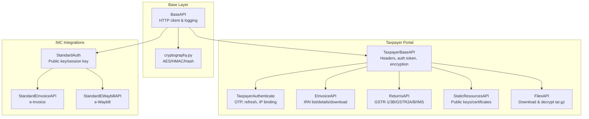
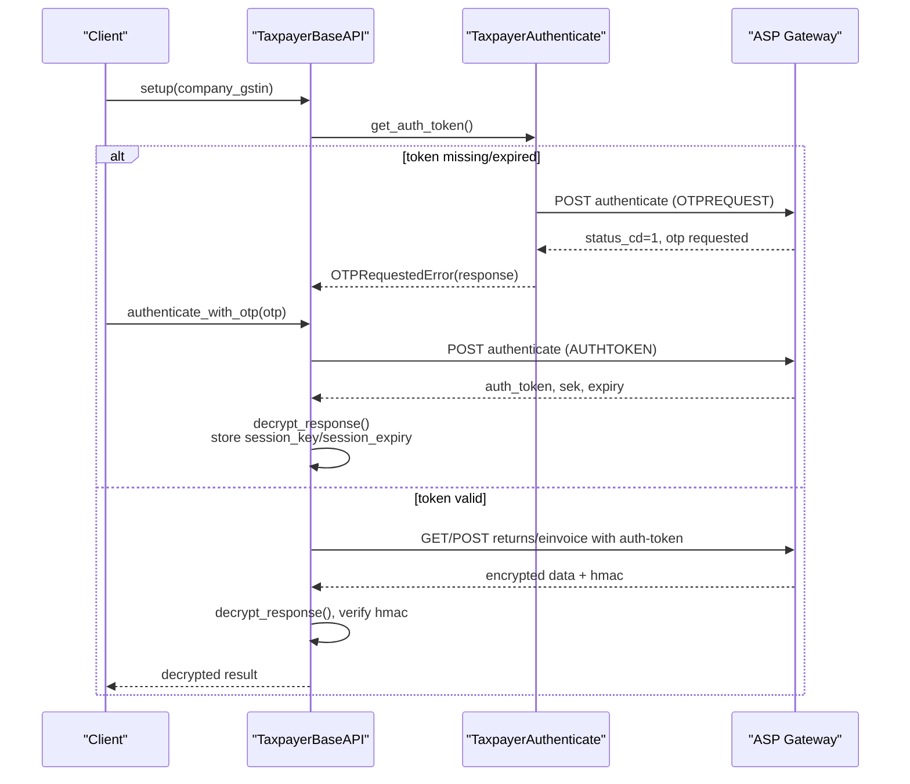
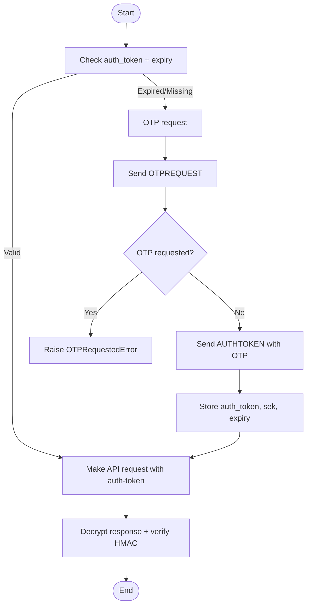
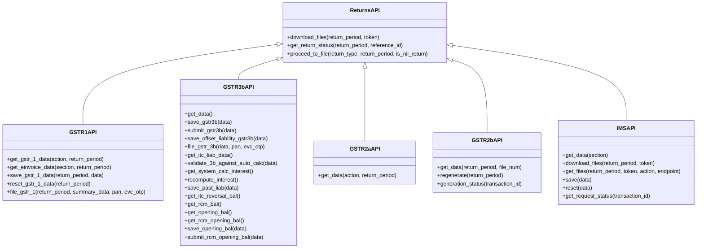
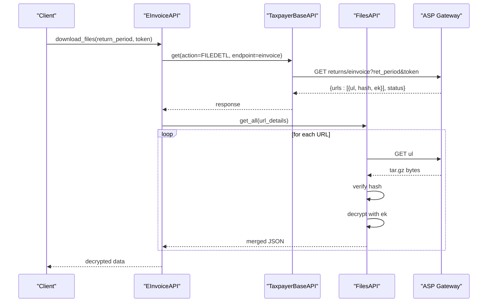
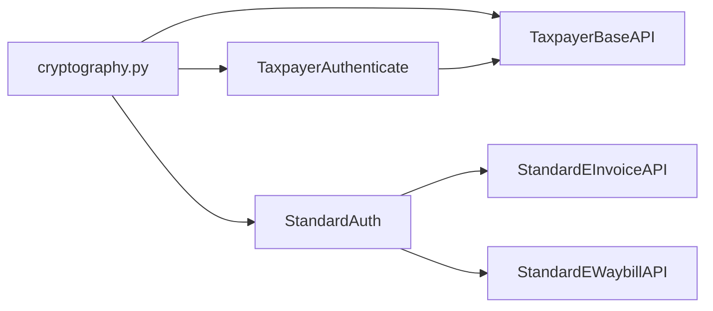

# Taxpayer Portal Integration

<cite>
**Referenced Files in This Document**
- [taxpayer_base.py](file://india_compliance/gst_india/api_classes/taxpayer_base.py)
- [taxpayer_e_invoice.py](file://india_compliance/gst_india/api_classes/taxpayer_e_invoice.py)
- [taxpayer_returns.py](file://india_compliance/gst_india/api_classes/taxpayer_returns.py)
- [base.py](file://india_compliance/gst_india/api_classes/base.py)
- [public.py](file://india_compliance/gst_india/api_classes/public.py)
- [auth.py](file://india_compliance/gst_india/api_classes/nic/auth.py)
- [e_invoice.py](file://india_compliance/gst_india/api_classes/nic/e_invoice.py)
- [e_waybill.py](file://india_compliance/gst_india/api_classes/nic/e_waybill.py)
- [cryptography.py](file://india_compliance/gst_india/utils/cryptography.py)
- [api.py](file://india_compliance/gst_india/utils/api.py)
- [gst_settings.py](file://india_compliance/gst_india/doctype/gst_settings/gst_settings.py)
- [gst_return_log.py](file://india_compliance/gst_india/doctype/gst_return_log/gst_return_log.py)
- [gstr_utils.py](file://india_compliance/gst_india/utils/gstr_utils.py)
</cite>

## Table of Contents
1. [Introduction](#introduction)
2. [Project Structure](#project-structure)
3. [Core Components](#core-components)
4. [Architecture Overview](#architecture-overview)
5. [Detailed Component Analysis](#detailed-component-analysis)
6. [Dependency Analysis](#dependency-analysis)
7. [Performance Considerations](#performance-considerations)
8. [Troubleshooting Guide](#troubleshooting-guide)
9. [Conclusion](#conclusion)
10. [Appendices](#appendices)

## Introduction
This document explains the taxpayer portal integration for the India Compliance module, focusing on:
- Taxpayer-specific authentication mechanisms and session/IP binding
- API endpoints for GST return filing (GSTR-1, GSTR-3B, GSTR-2A/B, IMS)
- Status query systems and queued downloads
- e-invoice and e-waybill management via taxpayer portal
- Static resources API for templates and forms
- Practical usage patterns, authentication tokens, and session management
- Differences between taxpayer portal and NIC portal integrations

## Project Structure
The taxpayer portal integration is implemented primarily in Python classes under the GST India API layer. Key modules:
- Base HTTP client and request lifecycle
- Taxpayer portal authentication and request signing
- Returns APIs for GSTR-1, GSTR-3B, GSTR-2A/B, and IMS
- e-Invoice and e-Waybill APIs (NIC-standard and enriched variants)
- Utilities for logging, cryptography, and integration request persistence

**Diagram sources**
- [base.py](file://india_compliance/gst_india/api_classes/base.py#L23-L120)
- [taxpayer_base.py](file://india_compliance/gst_india/api_classes/taxpayer_base.py#L110-L320)
- [taxpayer_e_invoice.py](file://india_compliance/gst_india/api_classes/taxpayer_e_invoice.py#L7-L69)
- [taxpayer_returns.py](file://india_compliance/gst_india/api_classes/taxpayer_returns.py#L10-L395)
- [auth.py](file://india_compliance/gst_india/api_classes/nic/auth.py#L27-L195)
- [e_invoice.py](file://india_compliance/gst_india/api_classes/nic/e_invoice.py#L12-L271)
- [e_waybill.py](file://india_compliance/gst_india/api_classes/nic/e_waybill.py#L17-L259)
- [cryptography.py](file://india_compliance/gst_india/utils/cryptography.py#L19-L76)

**Section sources**
- [base.py](file://india_compliance/gst_india/api_classes/base.py#L23-L120)
- [taxpayer_base.py](file://india_compliance/gst_india/api_classes/taxpayer_base.py#L110-L320)
- [taxpayer_returns.py](file://india_compliance/gst_india/api_classes/taxpayer_returns.py#L10-L395)
- [taxpayer_e_invoice.py](file://india_compliance/gst_india/api_classes/taxpayer_e_invoice.py#L7-L69)
- [auth.py](file://india_compliance/gst_india/api_classes/nic/auth.py#L27-L195)
- [e_invoice.py](file://india_compliance/gst_india/api_classes/nic/e_invoice.py#L12-L271)
- [e_waybill.py](file://india_compliance/gst_india/api_classes/nic/e_waybill.py#L17-L259)
- [cryptography.py](file://india_compliance/gst_india/utils/cryptography.py#L19-L76)

## Core Components
- BaseAPI: Central HTTP client with request/response lifecycle, error handling, masking, and integration request logging.
- TaxpayerBaseAPI: Extends BaseAPI with taxpayer portal headers, auth token, encryption/signing, and OTP handling.
- TaxpayerAuthenticate: Manages OTP requests, authentication token refresh, and IP-bound sessions.
- ReturnsAPI family: GSTR-1, GSTR-3B, GSTR-2A/B, and IMS endpoints for retrieval, saving, resetting, and filing.
- EInvoiceAPI: IRN listing, details, and file downloads for taxpayer portal.
- StaticResourcesAPI and FilesAPI: Retrieve public keys/certificates and download/verify/decrypt return files.
- NIC StandardAuth/EInvoiceAPI/EWaybillAPI: Alternative integration pattern for e-Invoice/e-Waybill via NIC.

**Section sources**
- [base.py](file://india_compliance/gst_india/api_classes/base.py#L23-L240)
- [taxpayer_base.py](file://india_compliance/gst_india/api_classes/taxpayer_base.py#L110-L320)
- [taxpayer_returns.py](file://india_compliance/gst_india/api_classes/taxpayer_returns.py#L10-L395)
- [taxpayer_e_invoice.py](file://india_compliance/gst_india/api_classes/taxpayer_e_invoice.py#L7-L69)
- [auth.py](file://india_compliance/gst_india/api_classes/nic/auth.py#L27-L195)
- [e_invoice.py](file://india_compliance/gst_india/api_classes/nic/e_invoice.py#L12-L271)
- [e_waybill.py](file://india_compliance/gst_india/api_classes/nic/e_waybill.py#L17-L259)

## Architecture Overview
The taxpayer portal flow integrates with the ASP gateway using encrypted requests and HMAC verification. Authentication is OTP-based and session-bound to the taxpayer’s public IP.

**Diagram sources**
- [taxpayer_base.py](file://india_compliance/gst_india/api_classes/taxpayer_base.py#L110-L320)
- [base.py](file://india_compliance/gst_india/api_classes/base.py#L124-L220)

## Detailed Component Analysis

### Taxpayer Authentication and Session Management
- OTP request and authentication:
  - OTP request initiates via authenticate endpoint with app_key and username.
  - On success, an OTP is requested; subsequent AUTHTOKEN call exchanges OTP for auth_token, sek, and expiry.
- Session IP binding:
  - Public IP fetched from ASP and stored; all requests include ip-usr header.
- Token refresh and validation:
  - REFRESHTOKEN endpoint rotates tokens.
  - validate_auth_token performs a dummy request to pre-validate tokens.
- Error handling:
  - Specific error codes mapped to user-friendly error types (e.g., otp_requested, invalid_otp, authorization_failed).
  - Public key rotation triggered when invalid public key error occurs.

**Diagram sources**
- [taxpayer_base.py](file://india_compliance/gst_india/api_classes/taxpayer_base.py#L110-L320)
- [base.py](file://india_compliance/gst_india/api_classes/base.py#L124-L220)

**Section sources**
- [taxpayer_base.py](file://india_compliance/gst_india/api_classes/taxpayer_base.py#L110-L320)
- [base.py](file://india_compliance/gst_india/api_classes/base.py#L124-L220)

### Returns APIs: GSTR-1, GSTR-3B, GSTR-2A/B, IMS
- GSTR-1:
  - Retrieve summary and sections, save draft data, reset, and file with EVC (PAN + EVC OTP).
  - Download e-invoice data for GSTR-1.
- GSTR-3B:
  - Retrieve summary, save, submit, offset liabilities, auto-calc interest, recompute interest, manage balances.
- GSTR-2A/2B:
  - Retrieve data by return period, regenerate 2B, check generation status.
- IMS:
  - Retrieve invoice data, save/reset, get request status, download files.

**Diagram sources**
- [taxpayer_returns.py](file://india_compliance/gst_india/api_classes/taxpayer_returns.py#L10-L395)

**Section sources**
- [taxpayer_returns.py](file://india_compliance/gst_india/api_classes/taxpayer_returns.py#L10-L395)

### e-Invoice and e-Waybill via Taxpayer Portal
- EInvoiceAPI:
  - List IRNs, get IRN details, and download files for a return period.
- FilesAPI:
  - Download encrypted tar.gz archives, verify SHA-256 hash, decrypt with session key, and parse JSON.

**Diagram sources**
- [taxpayer_e_invoice.py](file://india_compliance/gst_india/api_classes/taxpayer_e_invoice.py#L65-L69)
- [taxpayer_base.py](file://india_compliance/gst_india/api_classes/taxpayer_base.py#L47-L108)
- [base.py](file://india_compliance/gst_india/api_classes/base.py#L124-L220)

**Section sources**
- [taxpayer_e_invoice.py](file://india_compliance/gst_india/api_classes/taxpayer_e_invoice.py#L7-L69)
- [taxpayer_base.py](file://india_compliance/gst_india/api_classes/taxpayer_base.py#L47-L108)

### Static Resources and Templates
- StaticResourcesAPI:
  - Retrieve GSTN public certificate and NIC public key from ASP.
- PublicAPI:
  - Provides common endpoints for GSTIN info and returns tracking; useful for template discovery and status queries.

**Section sources**
- [taxpayer_base.py](file://india_compliance/gst_india/api_classes/taxpayer_base.py#L47-L68)
- [public.py](file://india_compliance/gst_india/api_classes/public.py#L7-L65)

### Integration Request Logging and Scheduling
- Integration requests are persisted asynchronously with masked sensitive data.
- Scheduler requirement enforced for e-Invoice/e-Waybill features.

**Section sources**
- [api.py](file://india_compliance/gst_india/utils/api.py#L4-L57)
- [base.py](file://india_compliance/gst_india/api_classes/base.py#L372-L394)

## Dependency Analysis
- Cryptography:
  - AES ECB for symmetric encryption/decryption of payloads and session keys.
  - HMAC-SHA256 for integrity verification.
  - Hash-256 for file integrity checks.
- Authentication:
  - Taxpayer portal uses OTP-based tokens with session IP binding.
  - NIC integration uses asymmetric encryption with public/private keys and session-based HMAC verification.

**Diagram sources**
- [cryptography.py](file://india_compliance/gst_india/utils/cryptography.py#L19-L76)
- [taxpayer_base.py](file://india_compliance/gst_india/api_classes/taxpayer_base.py#L247-L442)
- [auth.py](file://india_compliance/gst_india/api_classes/nic/auth.py#L80-L184)
- [e_invoice.py](file://india_compliance/gst_india/api_classes/nic/e_invoice.py#L178-L271)
- [e_waybill.py](file://india_compliance/gst_india/api_classes/nic/e_waybill.py#L152-L259)

**Section sources**
- [cryptography.py](file://india_compliance/gst_india/utils/cryptography.py#L19-L76)
- [taxpayer_base.py](file://india_compliance/gst_india/api_classes/taxpayer_base.py#L247-L442)
- [auth.py](file://india_compliance/gst_india/api_classes/nic/auth.py#L80-L184)

## Performance Considerations
- Asynchronous file downloads:
  - Queued downloads are processed in background jobs to avoid blocking UI.
- Request masking:
  - Sensitive headers and bodies are masked before logging to reduce risk exposure.
- Scheduler enforcement:
  - Ensures reliable background tasks for e-Invoice/e-Waybill generation and retries.

**Section sources**
- [gstr_utils.py](file://india_compliance/gst_india/utils/gstr_utils.py#L55-L128)
- [api.py](file://india_compliance/gst_india/utils/api.py#L4-L57)
- [base.py](file://india_compliance/gst_india/api_classes/base.py#L372-L394)

## Troubleshooting Guide
- OTP-related errors:
  - OTPRequestedError and InvalidOTPError are raised and handled gracefully; retry with a fresh OTP.
- Authorization failures:
  - Refresh token or re-authenticate; verify session IP binding.
- Public key invalid:
  - StaticResourcesAPI refreshes the GSTN public certificate automatically.
- Queued downloads:
  - Use download_queued_request to process pending return file downloads.
- Return filing status:
  - Use get_return_status and GST Return Log to track filing status and acknowledgments.

**Section sources**
- [taxpayer_base.py](file://india_compliance/gst_india/api_classes/taxpayer_base.py#L113-L125)
- [gstr_utils.py](file://india_compliance/gst_india/utils/gstr_utils.py#L55-L128)
- [gst_return_log.py](file://india_compliance/gst_india/doctype/gst_return_log/gst_return_log.py#L141-L153)

## Conclusion
The taxpayer portal integration provides a secure, encrypted, and session-aware pathway to GST returns and e-invoice/e-waybill operations. It supports robust OTP-based authentication, HMAC verification, and asynchronous file downloads. Compared to NIC integrations, taxpayer portal APIs emphasize encrypted payloads and HMAC verification, while NIC APIs rely on asymmetric encryption and standardized authentication flows. Choose the integration pattern based on your use case: taxpayer portal for return filing and document downloads, NIC APIs for e-Invoice/e-Waybill generation.

## Appendices

### Practical Usage Patterns
- Authentication:
  - Request OTP and authenticate to obtain an auth token with session key and expiry.
  - Use validate_auth_token to pre-validate tokens.
- Return filing:
  - For GSTR-1: retrieve summary, save data, reset if needed, and file with EVC (PAN + EVC OTP).
  - For GSTR-3B: retrieve summary, save/submit, compute interest, and manage balances.
- Downloads:
  - Use download_files to fetch queued return files and decrypt them locally.
- Templates and Forms:
  - Use PublicAPI endpoints for GSTIN info and returns tracking; StaticResourcesAPI for certificates/keys.

**Section sources**
- [gstr_utils.py](file://india_compliance/gst_india/utils/gstr_utils.py#L29-L53)
- [taxpayer_returns.py](file://india_compliance/gst_india/api_classes/taxpayer_returns.py#L115-L183)
- [taxpayer_returns.py](file://india_compliance/gst_india/api_classes/taxpayer_returns.py#L185-L240)
- [taxpayer_e_invoice.py](file://india_compliance/gst_india/api_classes/taxpayer_e_invoice.py#L65-L69)
- [public.py](file://india_compliance/gst_india/api_classes/public.py#L31-L47)
- [taxpayer_base.py](file://india_compliance/gst_india/api_classes/taxpayer_base.py#L47-L68)

### Differences: Taxpayer Portal vs NIC Portal
- Authentication:
  - Taxpayer portal: OTP-based, session-bound IP, encrypted requests with HMAC.
  - NIC portal: Username/password/app_key, optional asymmetric encryption, separate auth endpoints.
- Encryption:
  - Taxpayer portal: Uses session key for payload encryption and HMAC verification.
  - NIC portal: Uses public key for initial encryption and session key for subsequent requests.
- Use Cases:
  - Taxpayer portal: Return filing, e-invoice/e-waybill via taxpayer channel, file downloads.
  - NIC portal: Direct e-Invoice/e-Waybill generation and management.

**Section sources**
- [taxpayer_base.py](file://india_compliance/gst_india/api_classes/taxpayer_base.py#L247-L442)
- [auth.py](file://india_compliance/gst_india/api_classes/nic/auth.py#L80-L184)
- [e_invoice.py](file://india_compliance/gst_india/api_classes/nic/e_invoice.py#L178-L271)
- [e_waybill.py](file://india_compliance/gst_india/api_classes/nic/e_waybill.py#L152-L259)