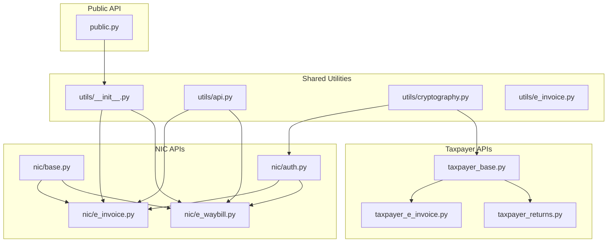
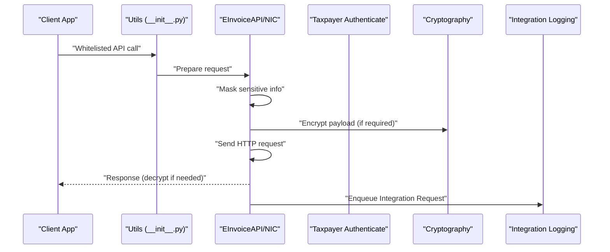
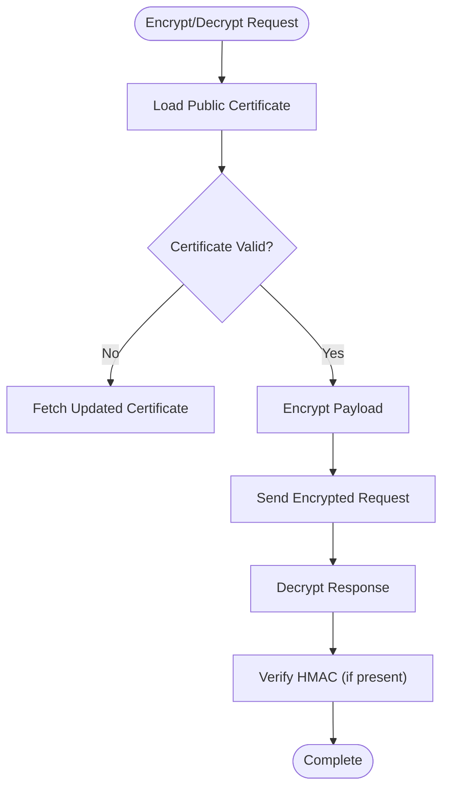
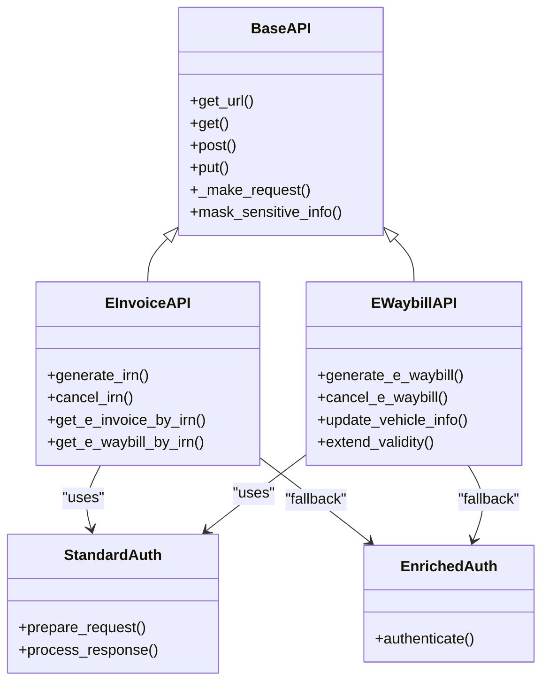
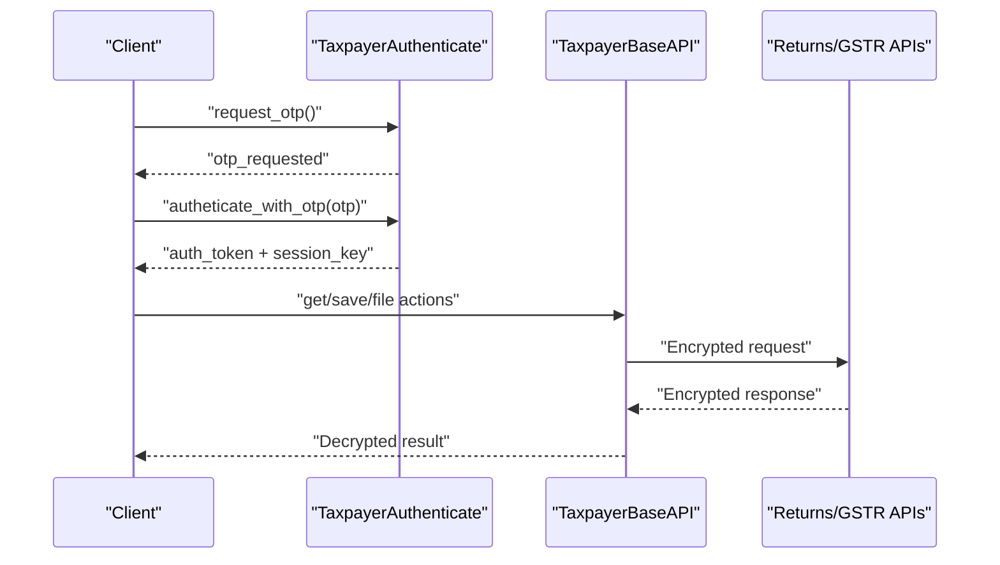
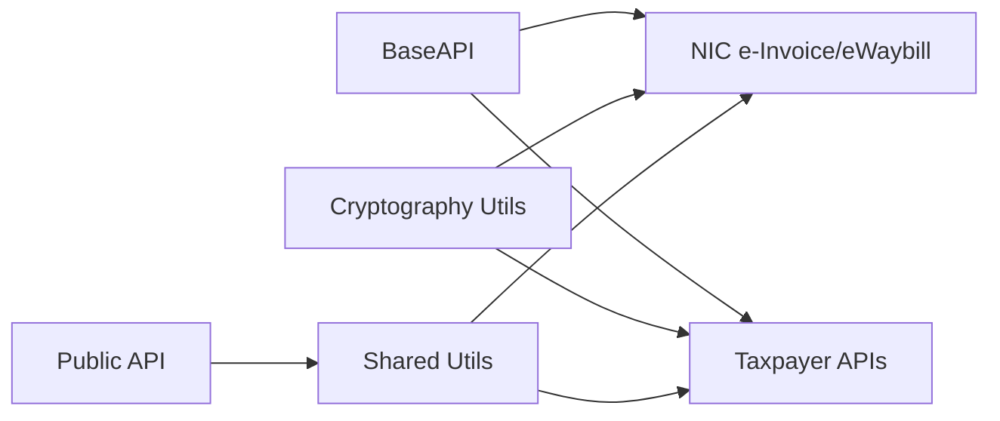

# Utilities & API Reference

<cite>
**Referenced Files in This Document**
- [__init__.py](file://india_compliance/gst_india/utils/__init__.py)
- [api.py](file://india_compliance/gst_india/utils/api.py)
- [cryptography.py](file://india_compliance/gst_india/utils/cryptography.py)
- [e_invoice.py](file://india_compliance/gst_india/utils/e_invoice.py)
- [base.py](file://india_compliance/gst_india/api_classes/base.py)
- [public.py](file://india_compliance/gst_india/api_classes/public.py)
- [taxpayer_base.py](file://india_compliance/gst_india/api_classes/taxpayer_base.py)
- [auth.py](file://india_compliance/gst_india/api_classes/nic/auth.py)
- [e_invoice.py](file://india_compliance/gst_india/api_classes/nic/e_invoice.py)
- [e_waybill.py](file://india_compliance/gst_india/api_classes/nic/e_waybill.py)
- [taxpayer_e_invoice.py](file://india_compliance/gst_india/api_classes/taxpayer_e_invoice.py)
- [taxpayer_returns.py](file://india_compliance/gst_india/api_classes/taxpayer_returns.py)
</cite>

## Table of Contents
1. [Introduction](#introduction)
2. [Project Structure](#project-structure)
3. [Core Components](#core-components)
4. [Architecture Overview](#architecture-overview)
5. [Detailed Component Analysis](#detailed-component-analysis)
6. [Dependency Analysis](#dependency-analysis)
7. [Performance Considerations](#performance-considerations)
8. [Troubleshooting Guide](#troubleshooting-guide)
9. [Conclusion](#conclusion)
10. [Appendices](#appendices)

## Introduction
This document provides comprehensive API documentation for India Compliance utilities and external interfaces. It covers:
- Whitelisted methods available for external API access and usage patterns
- Utility functions for GST calculations, encryption, QR code generation, and government API communication
- API classes for NIC portal integration, taxpayer portal communication, and authentication management
- Webhook endpoints for government portal callbacks and status updates
- Error handling strategies, retry mechanisms, and logging patterns
- Cryptography utilities for secure communication and token management
- Rate limiting, authentication methods, and security considerations

## Project Structure
The API utilities and integrations are organized into:
- Shared utilities for GST operations, cryptography, and integration logging
- API classes for NIC e-Invoice/e-Waybill and taxpayer portal returns
- Public API wrappers for GST Public services
- Taxpayer API clients for GSTR-1, GSTR-2A/B, GSTR-3B, and IMS

**Diagram sources**
- [__init__.py](file://india_compliance/gst_india/utils/__init__.py#L1-L1279)
- [api.py](file://india_compliance/gst_india/utils/api.py#L1-L57)
- [cryptography.py](file://india_compliance/gst_india/utils/cryptography.py#L1-L76)
- [e_invoice.py](file://india_compliance/gst_india/utils/e_invoice.py#L1-L1116)
- [base.py](file://india_compliance/gst_india/api_classes/base.py#L1-L413)
- [auth.py](file://india_compliance/gst_india/api_classes/nic/auth.py#L1-L195)
- [e_invoice.py](file://india_compliance/gst_india/api_classes/nic/e_invoice.py#L1-L271)
- [e_waybill.py](file://india_compliance/gst_india/api_classes/nic/e_waybill.py#L1-L259)
- [taxpayer_base.py](file://india_compliance/gst_india/api_classes/taxpayer_base.py#L1-L527)
- [taxpayer_e_invoice.py](file://india_compliance/gst_india/api_classes/taxpayer_e_invoice.py#L1-L69)
- [taxpayer_returns.py](file://india_compliance/gst_india/api_classes/taxpayer_returns.py#L1-L395)
- [public.py](file://india_compliance/gst_india/api_classes/public.py#L1-L65)

**Section sources**
- [__init__.py](file://india_compliance/gst_india/utils/__init__.py#L1-L1279)
- [api.py](file://india_compliance/gst_india/utils/api.py#L1-L57)
- [base.py](file://india_compliance/gst_india/api_classes/base.py#L1-L413)

## Core Components
- Whitelisted utilities for GST operations:
  - Party and GSTIN lookup, validation helpers, place-of-supply computation, and account mapping
  - API enablement checks and sandbox mode gating
- Encryption and cryptography utilities:
  - AES ECB encrypt/decrypt, HMAC-SHA256, SHA256 hashing, RSA public-key encryption
- Integration logging:
  - Structured logging of requests/responses, masking of sensitive data, and linking to Integration Request logs
- e-Invoice and e-Waybill orchestration:
  - Bulk generation, cancellation, duplicate IRN handling, and retry mechanisms
- NIC and taxpayer API clients:
  - Authentication strategies, request/response encryption/decryption, OTP handling, and error normalization

**Section sources**
- [__init__.py](file://india_compliance/gst_india/utils/__init__.py#L96-L123)
- [__init__.py](file://india_compliance/gst_india/utils/__init__.py#L163-L398)
- [cryptography.py](file://india_compliance/gst_india/utils/cryptography.py#L19-L76)
- [api.py](file://india_compliance/gst_india/utils/api.py#L4-L57)
- [e_invoice.py](file://india_compliance/gst_india/utils/e_invoice.py#L65-L267)

## Architecture Overview
High-level architecture for API communication and data flow:

**Diagram sources**
- [__init__.py](file://india_compliance/gst_india/utils/__init__.py#L96-L123)
- [base.py](file://india_compliance/gst_india/api_classes/base.py#L124-L220)
- [auth.py](file://india_compliance/gst_india/api_classes/nic/auth.py#L53-L195)
- [api.py](file://india_compliance/gst_india/utils/api.py#L4-L57)

## Detailed Component Analysis

### Whitelisted Methods for External API Access
- Purpose: Provide controlled, permission-checked access to GST-related utilities from client-side scripts and integrations.
- Examples:
  - Retrieve GSTIN list for a party
  - Resolve party from GSTIN
  - Fetch party contact details
- Usage patterns:
  - Use @frappe.whitelist decorators to expose functions
  - Apply permission checks and run onload hooks before sending documents
- Security:
  - Permissions enforced per doctype
  - Request-scoped caching via @frappe.request_cache for repeated lookups

**Section sources**
- [__init__.py](file://india_compliance/gst_india/utils/__init__.py#L96-L123)
- [__init__.py](file://india_compliance/gst_india/utils/__init__.py#L126-L161)

### GST Utilities and Calculations
- GSTIN validation and category inference
- Place-of-supply determination for domestic and overseas transactions
- HSN code validation and UOM mapping
- Account retrieval by type and tax type
- Date/time conversions and IST/system timezone handling
- API enablement and sandbox mode checks

**Section sources**
- [__init__.py](file://india_compliance/gst_india/utils/__init__.py#L163-L398)

### Encryption and Cryptography Utilities
- AES ECB encryption/decryption for session data
- HMAC-SHA256 and SHA256 hashing
- RSA public-key encryption using certificates
- Certificate validity checks and rotation

**Diagram sources**
- [cryptography.py](file://india_compliance/gst_india/utils/cryptography.py#L19-L76)
- [taxpayer_base.py](file://india_compliance/gst_india/api_classes/taxpayer_base.py#L263-L276)
- [auth.py](file://india_compliance/gst_india/api_classes/nic/auth.py#L18-L25)

**Section sources**
- [cryptography.py](file://india_compliance/gst_india/utils/cryptography.py#L19-L76)

### Integration Logging and Masking
- Structured logging of URL, headers, data, and output
- Sensitive data masking for headers, output, request body, and request params
- Enqueue Integration Request records for audit and retries

**Section sources**
- [api.py](file://india_compliance/gst_india/utils/api.py#L4-L57)
- [base.py](file://india_compliance/gst_india/api_classes/base.py#L316-L356)

### NIC e-Invoice and e-Waybill APIs
- Factory-based selection between enriched and standard modes
- Authentication strategies:
  - StandardAuth: RSA encryption for auth, AES for data, HMAC verification
  - EnrichedAuth: GSP-managed encryption/decryption
- OTP handling for taxpayer and returns APIs
- Error normalization and ignored error codes
- Distance extraction from alerts and response info

**Diagram sources**
- [base.py](file://india_compliance/gst_india/api_classes/base.py#L23-L413)
- [e_invoice.py](file://india_compliance/gst_india/api_classes/nic/e_invoice.py#L12-L271)
- [e_waybill.py](file://india_compliance/gst_india/api_classes/nic/e_waybill.py#L17-L259)
- [auth.py](file://india_compliance/gst_india/api_classes/nic/auth.py#L27-L195)

**Section sources**
- [e_invoice.py](file://india_compliance/gst_india/api_classes/nic/e_invoice.py#L44-L147)
- [e_waybill.py](file://india_compliance/gst_india/api_classes/nic/e_waybill.py#L40-L129)
- [auth.py](file://india_compliance/gst_india/api_classes/nic/auth.py#L53-L195)

### Taxpayer Portal APIs
- TaxpayerBaseAPI:
  - Session-based authentication with OTP handling
  - Request/response encryption/decryption and HMAC verification
  - Public IP and certificate management
- Taxpayer e-Invoice API:
  - IRN list and details retrieval
  - File downloads via returns endpoint
- Taxpayer Returns APIs:
  - GSTR-1, GSTR-2A/B, GSTR-3B, and IMS operations
  - File downloads and status queries
  - EVC filing and OTP flows

**Diagram sources**
- [taxpayer_base.py](file://india_compliance/gst_india/api_classes/taxpayer_base.py#L110-L320)
- [taxpayer_returns.py](file://india_compliance/gst_india/api_classes/taxpayer_returns.py#L10-L395)
- [taxpayer_e_invoice.py](file://india_compliance/gst_india/api_classes/taxpayer_e_invoice.py#L7-L69)

**Section sources**
- [taxpayer_base.py](file://india_compliance/gst_india/api_classes/taxpayer_base.py#L110-L320)
- [taxpayer_returns.py](file://india_compliance/gst_india/api_classes/taxpayer_returns.py#L10-L395)
- [taxpayer_e_invoice.py](file://india_compliance/gst_india/api_classes/taxpayer_e_invoice.py#L7-L69)

### Public API Wrapper
- GST Public API client for:
  - GSTIN info lookup
  - Returns tracking
  - Ignored error handling for “no docs found” scenarios

**Section sources**
- [public.py](file://india_compliance/gst_india/api_classes/public.py#L31-L65)

### e-Invoice Orchestration Utilities
- Bulk generation enqueuing and per-document generation
- Duplicate IRN handling and GSTIN sync
- Cancellation workflow and retry logic
- Logging and status updates for e-Invoice and e-Waybill

**Section sources**
- [e_invoice.py](file://india_compliance/gst_india/utils/e_invoice.py#L65-L267)

## Dependency Analysis
- BaseAPI orchestrates HTTP requests, error handling, and logging
- NIC APIs depend on cryptography utilities for encryption/decryption
- Taxpayer APIs depend on BaseAPI and cryptography for secure sessions
- Public API depends on shared utilities for enablement checks

**Diagram sources**
- [base.py](file://india_compliance/gst_india/api_classes/base.py#L23-L413)
- [auth.py](file://india_compliance/gst_india/api_classes/nic/auth.py#L18-L25)
- [taxpayer_base.py](file://india_compliance/gst_india/api_classes/taxpayer_base.py#L20-L26)
- [public.py](file://india_compliance/gst_india/api_classes/public.py#L7-L21)
- [__init__.py](file://india_compliance/gst_india/utils/__init__.py#L96-L123)

**Section sources**
- [base.py](file://india_compliance/gst_india/api_classes/base.py#L23-L413)
- [auth.py](file://india_compliance/gst_india/api_classes/nic/auth.py#L18-L25)
- [taxpayer_base.py](file://india_compliance/gst_india/api_classes/taxpayer_base.py#L20-L26)
- [public.py](file://india_compliance/gst_india/api_classes/public.py#L7-L21)
- [__init__.py](file://india_compliance/gst_india/utils/__init__.py#L96-L123)

## Performance Considerations
- Use @frappe.request_cache for repeated lookups (e.g., GSTIN list)
- Batch operations for e-invoice generation with appropriate queue sizing
- Avoid unnecessary commits inside loops; leverage existing commit patterns in bulk utilities
- Prefer sandbox mode for development to reduce production load

[No sources needed since this section provides general guidance]

## Troubleshooting Guide
Common issues and resolutions:
- API key invalid or credits exhausted:
  - Validate API secret and credits; handle HTTP 403/429 appropriately
- GSP connectivity errors:
  - Inspect special error messages and raise dedicated exceptions
- OTP-related failures:
  - Re-request OTP and handle invalid OTP scenarios
- Duplicate IRN:
  - Fetch IRN details and compare buyer GSTIN and invoice amount
- Certificate expiration:
  - Refresh public certificates and retry authentication
- Scheduler disabled:
  - Enable scheduler for e-Invoice/e-Waybill features

**Section sources**
- [base.py](file://india_compliance/gst_india/api_classes/base.py#L282-L312)
- [taxpayer_base.py](file://india_compliance/gst_india/api_classes/taxpayer_base.py#L127-L170)
- [e_invoice.py](file://india_compliance/gst_india/utils/e_invoice.py#L154-L189)
- [auth.py](file://india_compliance/gst_india/api_classes/nic/auth.py#L185-L191)

## Conclusion
India Compliance provides a robust, secure, and extensible set of APIs and utilities for GST operations in India. The architecture emphasizes:
- Strong encryption and token management
- Comprehensive error handling and retry strategies
- Structured logging and audit trails
- Flexible authentication modes for both NIC and taxpayer portals

Adhering to the documented patterns ensures reliable integration with government APIs while maintaining security and compliance.

[No sources needed since this section summarizes without analyzing specific files]

## Appendices

### API Classes and Methods Summary
- BaseAPI: HTTP request lifecycle, error handling, masking, logging
- EInvoiceAPI/EWaybillAPI: IRN/e-waybill operations, OTP handling, distance extraction
- TaxpayerBaseAPI: Secure session management, encryption/decryption, HMAC verification
- PublicAPI: GSTIN info and returns tracking
- Shared Utilities: Whitelisted functions, GST validations, cryptography helpers

**Section sources**
- [base.py](file://india_compliance/gst_india/api_classes/base.py#L23-L413)
- [e_invoice.py](file://india_compliance/gst_india/api_classes/nic/e_invoice.py#L12-L271)
- [e_waybill.py](file://india_compliance/gst_india/api_classes/nic/e_waybill.py#L17-L259)
- [taxpayer_base.py](file://india_compliance/gst_india/api_classes/taxpayer_base.py#L110-L527)
- [public.py](file://india_compliance/gst_india/api_classes/public.py#L7-L65)
- [__init__.py](file://india_compliance/gst_india/utils/__init__.py#L96-L123)
- [cryptography.py](file://india_compliance/gst_india/utils/cryptography.py#L19-L76)