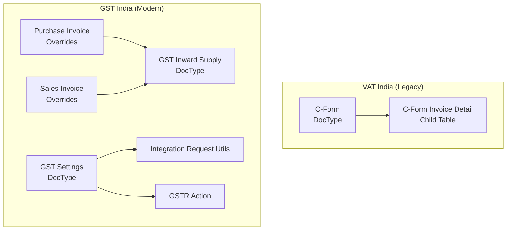
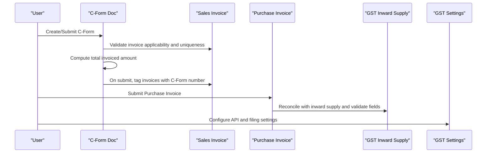
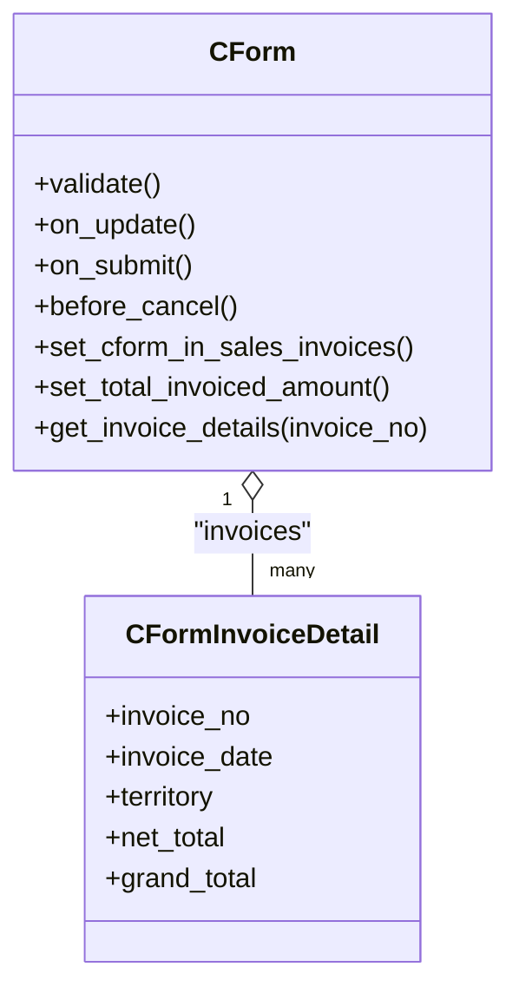
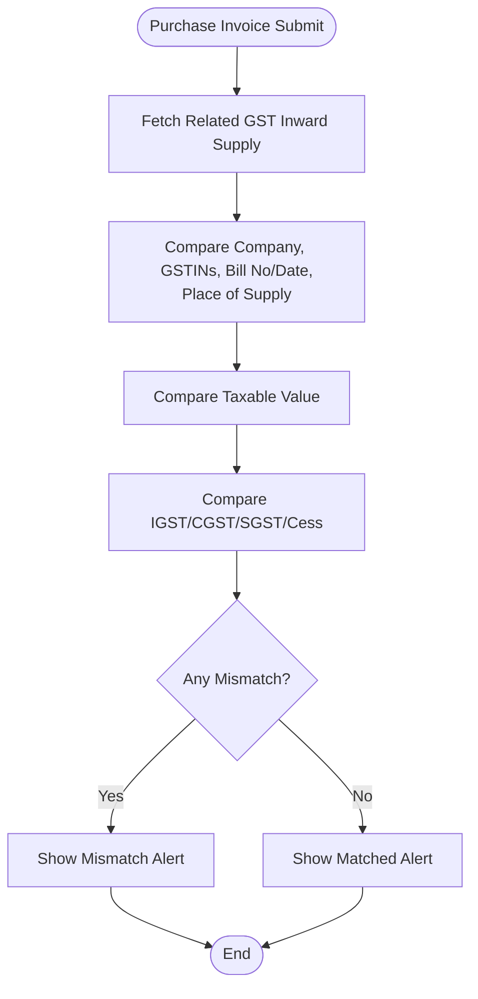
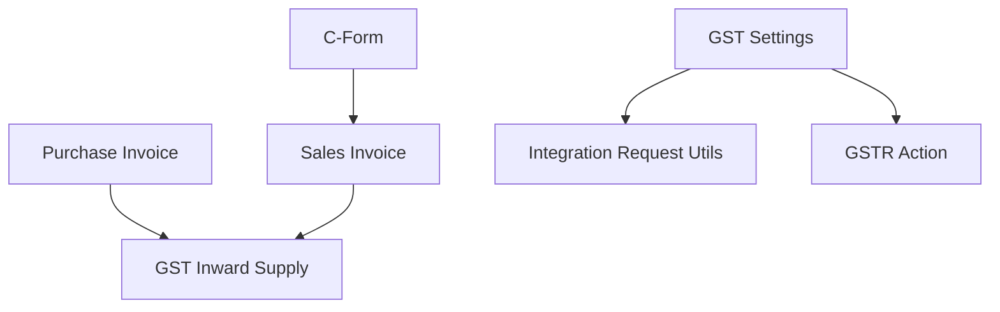

# VAT Operations

<cite>
**Referenced Files in This Document**
- [c_form.py](file://india_compliance/vat_india/doctype/c_form/c_form.py)
- [c_form.json](file://india_compliance/vat_india/doctype/c_form/c_form.json)
- [c_form_invoice_detail.py](file://india_compliance/vat_india/doctype/c_form_invoice_detail/c_form_invoice_detail.py)
- [c_form_invoice_detail.json](file://india_compliance/vat_india/doctype/c_form_invoice_detail/c_form_invoice_detail.json)
- [README.md](file://india_compliance/vat_india/doctype/c_form/README.md)
- [test_c_form.py](file://india_compliance/vat_india/doctype/c_form/test_c_form.py)
- [purchase_invoice.py](file://india_compliance/gst_india/overrides/purchase_invoice.py)
- [sales_invoice.py](file://india_compliance/gst_india/overrides/sales_invoice.py)
- [gst_inward_supply.py](file://india_compliance/gst_india/doctype/gst_inward_supply/gst_inward_supply.py)
- [gst_inward_supply.json](file://india_compliance/gst_india/doctype/gst_inward_supply/gst_inward_supply.json)
- [gst_settings.py](file://india_compliance/gst_india/doctype/gst_settings/gst_settings.py)
- [api.py](file://india_compliance/gst_india/utils/api.py)
- [gstr_action.py](file://india_compliance/gst_india/doctype/gstr_action/gstr_action.py)
</cite>

## Table of Contents
1. [Introduction](#introduction)
2. [Project Structure](#project-structure)
3. [Core Components](#core-components)
4. [Architecture Overview](#architecture-overview)
5. [Detailed Component Analysis](#detailed-component-analysis)
6. [Dependency Analysis](#dependency-analysis)
7. [Performance Considerations](#performance-considerations)
8. [Troubleshooting Guide](#troubleshooting-guide)
9. [Conclusion](#conclusion)
10. [Appendices](#appendices)

## Introduction
This document explains the VAT operations module with a focus on C-form management and related VAT compliance processes in the India Compliance application. It covers the historical role of C-forms in VAT operations, their current deprecation status, and how modern GST compliance supersedes legacy processes. The guide documents the C-form doctype structure, invoice matching, validation rules, and integration points with purchase and sales invoices. It also outlines workflows for generation, validation, and submission, along with configuration requirements, error handling, and reporting/export capabilities.

## Project Structure
The VAT operations module resides under the vat_india app and integrates with the broader GST India framework. The key elements are:
- C-form doctype and child table for invoice details
- Overrides for purchase and sales invoices to enforce GST validations and reconcile with inward supplies
- GST Inward Supply doctype for reconciling purchases with GSTR 2A/2B data
- GST Settings controlling API usage, e-invoice/e-waybill, and filing restrictions
- Utilities for integration requests and GSTR actions

**Diagram sources**
- [c_form.py](file://india_compliance/vat_india/doctype/c_form/c_form.py#L10-L103)
- [c_form_invoice_detail.py](file://india_compliance/vat_india/doctype/c_form_invoice_detail/c_form_invoice_detail.py#L8-L10)
- [purchase_invoice.py](file://india_compliance/gst_india/overrides/purchase_invoice.py#L155-L215)
- [sales_invoice.py](file://india_compliance/gst_india/overrides/sales_invoice.py#L291-L322)
- [gst_inward_supply.py](file://india_compliance/gst_india/doctype/gst_inward_supply/gst_inward_supply.py#L12-L28)
- [gst_settings.py](file://india_compliance/gst_india/doctype/gst_settings/gst_settings.py#L40-L61)
- [api.py](file://india_compliance/gst_india/utils/api.py#L4-L46)
- [gstr_action.py](file://india_compliance/gst_india/doctype/gstr_action/gstr_action.py#L8-L29)

**Section sources**
- [c_form.py](file://india_compliance/vat_india/doctype/c_form/c_form.py#L10-L103)
- [c_form.json](file://india_compliance/vat_india/doctype/c_form/c_form.json#L1-L159)
- [c_form_invoice_detail.py](file://india_compliance/vat_india/doctype/c_form_invoice_detail/c_form_invoice_detail.py#L8-L10)
- [c_form_invoice_detail.json](file://india_compliance/vat_india/doctype/c_form_invoice_detail/c_form_invoice_detail.json#L1-L76)
- [purchase_invoice.py](file://india_compliance/gst_india/overrides/purchase_invoice.py#L155-L215)
- [sales_invoice.py](file://india_compliance/gst_india/overrides/sales_invoice.py#L291-L322)
- [gst_inward_supply.py](file://india_compliance/gst_india/doctype/gst_inward_supply/gst_inward_supply.py#L12-L28)
- [gst_inward_supply.json](file://india_compliance/gst_india/doctype/gst_inward_supply/gst_inward_supply.json#L1-L530)
- [gst_settings.py](file://india_compliance/gst_india/doctype/gst_settings/gst_settings.py#L40-L61)
- [api.py](file://india_compliance/gst_india/utils/api.py#L4-L46)
- [gstr_action.py](file://india_compliance/gst_india/doctype/gstr_action/gstr_action.py#L8-L29)

## Core Components
- C-Form (legacy): Tracks VAT C-form issuance against eligible sales invoices, validates invoice applicability and uniqueness, and updates invoice references upon submit/cancel.
- C-Form Invoice Detail (child table): Captures invoice-level details pulled from Sales Invoice for reference.
- Purchase Invoice Overrides: Enforce GST validations, reconcile with GST Inward Supply, and manage ITC classification and eligibility.
- Sales Invoice Overrides: Manage e-invoice/e-waybill triggers, dashboard links, and validation rules.
- GST Inward Supply: Centralized reconciliation entity for purchases, linking to GSTR 2A/2B data and supporting match statuses and actions.
- GST Settings: Controls API usage, filing restrictions, reconciliation schedules, and e-invoice/e-waybill policies.
- Integration Utilities: Create and link integration requests for GST APIs and track GSTR actions.

**Section sources**
- [c_form.py](file://india_compliance/vat_india/doctype/c_form/c_form.py#L10-L103)
- [c_form_invoice_detail.py](file://india_compliance/vat_india/doctype/c_form_invoice_detail/c_form_invoice_detail.py#L8-L10)
- [purchase_invoice.py](file://india_compliance/gst_india/overrides/purchase_invoice.py#L155-L215)
- [sales_invoice.py](file://india_compliance/gst_india/overrides/sales_invoice.py#L291-L322)
- [gst_inward_supply.py](file://india_compliance/gst_india/doctype/gst_inward_supply/gst_inward_supply.py#L12-L28)
- [gst_settings.py](file://india_compliance/gst_india/doctype/gst_settings/gst_settings.py#L40-L61)
- [api.py](file://india_compliance/gst_india/utils/api.py#L4-L46)
- [gstr_action.py](file://india_compliance/gst_india/doctype/gstr_action/gstr_action.py#L8-L29)

## Architecture Overview
The VAT operations module bridges legacy C-form processes with modern GST compliance. Legacy C-form validation and invoice tagging coexist alongside GST reconciliation and API integrations.

**Diagram sources**
- [c_form.py](file://india_compliance/vat_india/doctype/c_form/c_form.py#L11-L81)
- [purchase_invoice.py](file://india_compliance/gst_india/overrides/purchase_invoice.py#L155-L215)
- [gst_inward_supply.py](file://india_compliance/gst_india/doctype/gst_inward_supply/gst_inward_supply.py#L12-L28)
- [gst_settings.py](file://india_compliance/gst_india/doctype/gst_settings/gst_settings.py#L40-L61)

## Detailed Component Analysis

### C-Form (Legacy VAT Compliance)
- Purpose: Issue C-forms against eligible sales invoices and maintain invoice-level details for VAT reporting.
- Validation rules:
  - Ensures the invoice is marked as C-form applicable.
  - Prevents duplicate C-form tagging for the same invoice.
  - Validates invoice existence and status.
- Lifecycle:
  - On update: computes total invoiced amount.
  - On submit: updates Sales Invoice records with C-form number and clears stale references.
  - Before cancel: removes C-form reference from invoices.
- Child table: pulls invoice details (posting date, territory, net total, grand total) via a whitelisted method.

**Diagram sources**
- [c_form.py](file://india_compliance/vat_india/doctype/c_form/c_form.py#L10-L103)
- [c_form_invoice_detail.py](file://india_compliance/vat_india/doctype/c_form_invoice_detail/c_form_invoice_detail.py#L8-L10)

**Section sources**
- [c_form.py](file://india_compliance/vat_india/doctype/c_form/c_form.py#L11-L81)
- [c_form_invoice_detail.py](file://india_compliance/vat_india/doctype/c_form_invoice_detail/c_form_invoice_detail.py#L8-L10)
- [README.md](file://india_compliance/vat_india/doctype/c_form/README.md#L1-L2)

### C-Form Doctype Structure
- Fields include naming series, C-form number, received date, customer, company, quarter, total amount, state, and a table of invoices with details.
- Supports submission lifecycle and amendment tracking.

**Section sources**
- [c_form.json](file://india_compliance/vat_india/doctype/c_form/c_form.json#L1-L159)
- [c_form_invoice_detail.json](file://india_compliance/vat_india/doctype/c_form_invoice_detail/c_form_invoice_detail.json#L1-L76)

### Invoice Matching and Reconciliation (Modern GST)
- Purchase Invoice validation compares submitted invoice data with GST Inward Supply fields (company, GSTINs, bill details, place of supply, taxable values, and taxes).
- Mismatches trigger alerts; exact matches indicate successful reconciliation.
- GST Inward Supply supports match statuses, actions, and links to supplier filings and GSTR-1/GSTR-3B statuses.

**Diagram sources**
- [purchase_invoice.py](file://india_compliance/gst_india/overrides/purchase_invoice.py#L155-L215)
- [gst_inward_supply.py](file://india_compliance/gst_india/doctype/gst_inward_supply/gst_inward_supply.py#L12-L28)

**Section sources**
- [purchase_invoice.py](file://india_compliance/gst_india/overrides/purchase_invoice.py#L155-L215)
- [gst_inward_supply.py](file://india_compliance/gst_india/doctype/gst_inward_supply/gst_inward_supply.py#L12-L28)
- [gst_inward_supply.json](file://india_compliance/gst_india/doctype/gst_inward_supply/gst_inward_supply.json#L1-L530)

### Integration with Sales and Purchase Invoices
- Sales Invoice overrides:
  - Dashboard integration with GST logs and reconciliation.
  - e-invoice/e-waybill triggers and status management.
- Purchase Invoice overrides:
  - Reconciliation status and pending BOE quantity management.
  - ITC classification and eligibility reasons.
  - Validation against GST Inward Supply.

**Section sources**
- [sales_invoice.py](file://india_compliance/gst_india/overrides/sales_invoice.py#L291-L322)
- [purchase_invoice.py](file://india_compliance/gst_india/overrides/purchase_invoice.py#L73-L113)

### GST Settings and Compliance Controls
- Controls API enablement, e-invoice/e-waybill thresholds, filing restrictions, and reconciliation schedules.
- Manages credentials and service-specific GSTIN mappings.

**Section sources**
- [gst_settings.py](file://india_compliance/gst_india/doctype/gst_settings/gst_settings.py#L40-L61)
- [gst_settings.py](file://india_compliance/gst_india/doctype/gst_settings/gst_settings.py#L124-L143)

### Integration Requests and GSTR Actions
- Utility functions create integration requests for GST APIs and link them to GSTR actions for auditability.

**Section sources**
- [api.py](file://india_compliance/gst_india/utils/api.py#L4-L46)
- [gstr_action.py](file://india_compliance/gst_india/doctype/gstr_action/gstr_action.py#L8-L29)

## Dependency Analysis
- C-Form depends on Sales Invoice for validation and tagging.
- Purchase and Sales Invoices depend on GST Inward Supply for reconciliation and on GST Settings for policy enforcement.
- Integration utilities support API-driven workflows and audit trails.

**Diagram sources**
- [c_form.py](file://india_compliance/vat_india/doctype/c_form/c_form.py#L11-L81)
- [purchase_invoice.py](file://india_compliance/gst_india/overrides/purchase_invoice.py#L155-L215)
- [sales_invoice.py](file://india_compliance/gst_india/overrides/sales_invoice.py#L291-L322)
- [gst_inward_supply.py](file://india_compliance/gst_india/doctype/gst_inward_supply/gst_inward_supply.py#L12-L28)
- [gst_settings.py](file://india_compliance/gst_india/doctype/gst_settings/gst_settings.py#L40-L61)
- [api.py](file://india_compliance/gst_india/utils/api.py#L4-L46)
- [gstr_action.py](file://india_compliance/gst_india/doctype/gstr_action/gstr_action.py#L8-L29)

**Section sources**
- [c_form.py](file://india_compliance/vat_india/doctype/c_form/c_form.py#L11-L81)
- [purchase_invoice.py](file://india_compliance/gst_india/overrides/purchase_invoice.py#L155-L215)
- [sales_invoice.py](file://india_compliance/gst_india/overrides/sales_invoice.py#L291-L322)
- [gst_inward_supply.py](file://india_compliance/gst_india/doctype/gst_inward_supply/gst_inward_supply.py#L12-L28)
- [gst_settings.py](file://india_compliance/gst_india/doctype/gst_settings/gst_settings.py#L40-L61)
- [api.py](file://india_compliance/gst_india/utils/api.py#L4-L46)
- [gstr_action.py](file://india_compliance/gst_india/doctype/gstr_action/gstr_action.py#L8-L29)

## Performance Considerations
- C-form validation queries Sales Invoice for each row; batch processing and indexing on invoice name and status can improve performance.
- Reconciliation comparisons in Purchase Invoice rely on precision-aware field comparisons; ensure consistent precision settings for accurate matching.
- Integration request creation and GSTR action updates are lightweight but should be monitored for high-volume submissions.

[No sources needed since this section provides general guidance]

## Troubleshooting Guide
- C-form validation errors:
  - Invoice not marked as C-form applicable.
  - Invoice already tagged under another C-form.
  - Invalid or cancelled invoice.
- Purchase Invoice mismatch with GST Inward Supply:
  - Review differences in company, GSTINs, bill details, place of supply, taxable value, and taxes.
- C-form submission/cancel behavior:
  - Verify invoice tagging and clearing logic on submit/cancel.
- API and filing restrictions:
  - Confirm GST Settings enablement and credentials; review filing date restrictions.

**Section sources**
- [c_form.py](file://india_compliance/vat_india/doctype/c_form/c_form.py#L23-L49)
- [purchase_invoice.py](file://india_compliance/gst_india/overrides/purchase_invoice.py#L198-L214)
- [gst_settings.py](file://india_compliance/gst_india/doctype/gst_settings/gst_settings.py#L558-L595)

## Conclusion
C-forms represent a legacy mechanism for VAT compliance in India and are marked for deprecation. Modern GST compliance is primarily handled through GST Inward Supply reconciliation, e-invoice/e-waybill automation, and GST Settings controls. While C-forms remain functional for historical records, organizations should prioritize migration to GST workflows for streamlined reporting and reduced manual effort.

[No sources needed since this section summarizes without analyzing specific files]

## Appendices

### Configuration Requirements
- Enable and configure GST Settings for API usage, e-invoice/e-waybill thresholds, and filing restrictions.
- Ensure credentials are set for required services (Returns, e-Waybill/e-Invoice).
- Set reconciliation schedules and filing periods for GSTR-1/GSTR-3B.

**Section sources**
- [gst_settings.py](file://india_compliance/gst_india/doctype/gst_settings/gst_settings.py#L124-L143)
- [gst_settings.py](file://india_compliance/gst_india/doctype/gst_settings/gst_settings.py#L219-L262)

### Validation Rules Summary
- C-form:
  - Invoice applicability check.
  - Unique C-form assignment per invoice.
  - Existence and status validation.
- Purchase Invoice:
  - Field and tax comparisons against GST Inward Supply.
  - ITC classification and eligibility checks.
- Sales Invoice:
  - e-invoice/e-waybill applicability and status management.

**Section sources**
- [c_form.py](file://india_compliance/vat_india/doctype/c_form/c_form.py#L23-L49)
- [purchase_invoice.py](file://india_compliance/gst_india/overrides/purchase_invoice.py#L155-L215)
- [sales_invoice.py](file://india_compliance/gst_india/overrides/sales_invoice.py#L95-L130)

### Reporting and Export Capabilities
- GST Inward Supply supports export permissions and search fields for reconciliations.
- Integration utilities create integration requests for auditability.
- GSTR actions track request IDs and tokens for downstream reporting.

**Section sources**
- [gst_inward_supply.json](file://india_compliance/gst_india/doctype/gst_inward_supply/gst_inward_supply.json#L493-L521)
- [api.py](file://india_compliance/gst_india/utils/api.py#L4-L46)
- [gstr_action.py](file://india_compliance/gst_india/doctype/gstr_action/gstr_action.py#L12-L29)